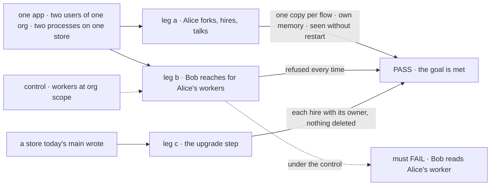
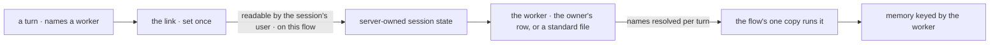

# FIX-1788 · A worker is a private resource its owner holds, run by the shared flow it names

**Spec** · [Decisions](DECISIONS.md) · [Rules](BUSINESS-RULES.md) · [Plan](PLAN.md) · [Docs](DOCS.md) · [Evolution](EVOLUTION.md)

## Six people, before and after

| Someone who… | Today | After |
|---|---|---|
| **shares an org with other users** | A worker hired for the org alone is reachable by every member, and any of them can open a session on it | Every worker belongs to one user. Nobody else can open its sessions, read it, run it or link a session to it |
| **hires or fires a worker while the app runs** | The hire registers a new copy of a flow in this process. Other processes see the hire, or keep answering for a fired worker, until they restart | A hire, fork or fire is a write to the owner's data. Every process sees it on the next turn |
| **wants their own version of a standard worker** | Edits its `WORKER.md` and restarts, or hires an org-wide copy | Forks it: a worker of their own that starts from its configuration. Nobody changes a standard worker at run time |
| **builds an app that talks to a worker** | Sends to the worker's own copy, at an address that carries its org and owner (`acme.~alice.researcher`) | Sends to the flow the worker names (`agent`) and names the worker. The server links the session to it once |
| **runs several workers on one flow** | Each copy keeps its own private memory | Each worker still keeps its own, on the one shared copy |
| **upgrades a deployment that has hired workers** | n/a | One operator step carries each hire, its memory and its conversations to its owner. Nothing is deleted ([D1](DECISIONS.md#d1), [D2](DECISIONS.md#d2)) |

This is the epic's spine ([FIX-1786](../../epics/FIX-1786/SPEC.md), ER-1): privacy by
construction, so the coordinator, the library and projects build on workers that are already
private.

## The goal, and how we'll know it's met

**In one org, each user's workers are theirs alone: another user can't open, read, run or link
a session to them. Every worker runs on one shared copy of the flow it names, with its own
memory. A user hires or forks a worker without a restart and can't change a standard one. Every
hire made before the upgrade comes across to its owner.**

| Is it the right goal? | |
|---|---|
| **The real need** | The [PRD](https://linear.app/fixpoint-labs/issue/FIX-1788): a worker is a configuration plus an owner, run by one copy of the flow it names; the server sets a session's link; standard workers come from files and are forked, not changed. The epic's [security model](../../epics/FIX-1786/concept/CONCEPT.md#the-security-model), rules 2 to 4 |
| **Smaller, and rejected** | "Bob can't reach Alice's worker." Met by narrowing today's pins, while each hire still registers a copy per process and a fire waits for a restart. Or "workers are rows": met while a caller seeds its session's link, which the [epic POC](../../epics/FIX-1786/poc/singleton-worker-link/README.md) (O1) showed it can |
| **Bigger, and not this issue's** | Which flows can run workers ([FIX-1789](https://linear.app/fixpoint-labs/issue/FIX-1789)) · user data per org ([FIX-1790](https://linear.app/fixpoint-labs/issue/FIX-1790)) · coordinators ([FIX-1791](https://linear.app/fixpoint-labs/issue/FIX-1791)) · the library ([FIX-1795](https://linear.app/fixpoint-labs/issue/FIX-1795)) · removing instances and pins ([FIX-1798](https://linear.app/fixpoint-labs/issue/FIX-1798)) |
| **Not done if** | The check ran with one user · only on `agent` · a session's link can be seeded, changed, or set to a worker on another flow · two of Alice's workers share a memory cell · a second process needed a restart to see a hire · the upgrade ran on a store this branch wrote, not one today's `main` wrote · Workforce still registers a copy per worker or sets a pin |



The check reads what each caller gets back over HTTP and what the registry holds, never the
link's value. Under the dashed control, Bob must read Alice's worker.

| How we verify | |
|---|---|
| **Goal check** | `goals/workers-as-resources/keeps-each-users-workers-their-own/` · model n/a, a scripted model (access is under test, not answers) · real HTTP router, SQLite, two hosts on one store · run by the implementer at completion · verdict in the last implementation PR |
| **Signal** | a: Alice's fork, her own hire and a standard worker each answer as their own configuration on `agent`'s one copy; the registry gains no entry; her second worker reads none of the first's notes; the second host sees the hire with no restart. b: Bob opening her session, reading her worker, naming it on a turn, and seeding a link through the session create are each refused; Alice linking a session to her worker on another flow, or relinking one, is refused. c: on a store today's `main` wrote, her owned hire, its note and its conversation continue; an org-wide hire she used is hers and Bob, who never used it, has none |
| **Input** | Two `WORKER.md` standard workers on two flows, two users. A different worker id or flow must pass too |
| **Anti-game** | No assertion on a link's stored value or a key string. No fixture writes a worker the users didn't make through the app. Leg c's store is written by today's code, not this branch's |
| **Control that must fail** | `GOAL_CONTROL=org-scoped-workers`: leg b FAILS on *Bob reads Alice's worker*. `GOAL_CONTROL=caller-link`: leg b FAILS on *a seeded link runs her other worker*. Today's `main`: legs a and b FAIL |

## What changes


On the left, a worker is a registered copy. On the right, it is data, and the copy is shared.

**What an app writes to talk to a worker:**

```diff
- clients.actions("acme.~alice.researcher").sendAction("run", { message }, { sessionId })
+ clients.actions("agent").sendAction("run", { message, worker: "researcher" }, { sessionId })
+ // the first turn links the session to the caller's researcher; the server checks and sets it once
```

**What a person writes in `WORKER.md`:** nothing changes. A file is a standard worker.

## How a turn finds its worker



The link is the one place a session meets a worker, and every path that opens a session passes
it: a person's turn, a task, a mailbox post.

## What stays as it is

- A worker's `flow:` and its default to `agent`. `WORKER.md` files are unchanged.
- Sessions stay private to one user; engine session ownership is unchanged.
- Flow instances and owner pins stay in the engine, deprecated; [FIX-1798](https://linear.app/fixpoint-labs/issue/FIX-1798) removes them.
- `seat*` names and `hireWorkforce`. FIX-1796 renames them with the docs.
- Mailboxes keep working until FIX-1792 replaces them.

## Sign off

**[The goal](#the-goal-and-how-well-know-its-met), at that size:** private workers, one copy per
flow, hires without a restart, and every old hire carried to its owner. If wrong: we close the
privacy hole and leave a deployment's existing workers behind.

1. **[D1](DECISIONS.md#d1) · Old hires, their memory and their conversations move in one operator
   step.** If wrong: users wait on an operator after an upgrade.
2. **[D2](DECISIONS.md#d2) · A hire made for the whole org goes to each member who used it.** If
   wrong: copies a team didn't expect, or a worker someone relied on gone.

**Open, the one to weigh** (full ask in [DECISIONS.md](DECISIONS.md#q1)):

- **[Q1](DECISIONS.md#q1) · Does a fork copy a standard worker's shared instructions, or keep
  following them?** I recommend a copy. If wrong: forks drift from the standard as it improves.

Feature · `engine`, `workforce`, `orchestration`, `shift-manager` · large · 4 PRs · epic [FIX-1786](../../epics/FIX-1786/SPEC.md)
