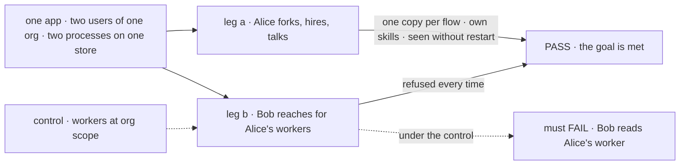
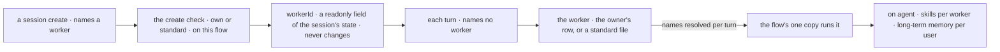

# FIX-1788 · A worker is a private resource its owner holds, run by the shared flow it names

**Spec** · [Decisions](DECISIONS.md) · [Rules](BUSINESS-RULES.md) · [Plan](PLAN.md) · [Docs](DOCS.md) · [Evolution](EVOLUTION.md)

## Six users, before and after

| Someone who… | Today | After |
|---|---|---|
| **shares an org with other users** | A worker hired for the org alone is reachable by every member, and any of them can open a session on it | Every worker belongs to one user. Nobody else can open its sessions, read it, run it or create a session with it |
| **hires or fires a worker while the app runs** | The hire registers a new copy of a flow in this process. Other processes see the hire, or keep answering for a fired worker, until they restart | A hire, fork or fire is a write to the owner's data. Every process sees it on the next turn |
| **wants their own version of a standard worker** | Edits its `WORKER.md` and restarts, or hires an org-wide copy | Forks it: a worker of their own with a copy of its configuration. Nobody changes a standard worker at run time |
| **builds an app that talks to a worker** | Sends to the worker's own copy, at an address that carries its org and owner (`acme.~alice.researcher`) | Finds or starts a session with the worker, named once in the session's starting state. The server checks it when the session is created, and nothing changes it after. Messages go to the flow the worker names (`agent`) and never name a worker |
| **runs several workers on one flow** | Each copy keeps its own skills. Long-term memory is already the user's, shared across their copies, unless the app keys user state per flow (`isolateUserState`) | On a built-in worker flow such as `agent`, each worker still keeps its own skills, and its own working memory in each conversation, on the one shared copy. Long-term memory is the user's: their workers share it, and no other user reaches it ([D8](DECISIONS.md#d8)). On a custom worker flow, the flow's author decides ([D6](DECISIONS.md#d6)) |
| **hired workers before this release** | Each hire is its own registered copy, with its memory and conversations | Dropped: nothing reads an old hire, its memory or its conversations ([epic D9](../../epics/FIX-1786/DECISIONS.md#d9)) |

This is the epic's spine ([FIX-1786](../../epics/FIX-1786/SPEC.md), ER-1): privacy by
construction, so the coordinator, the library and projects build on workers that are already
private.

## The goal, and how we'll know it's met

**In one org, each user's workers are theirs alone: another user can't open, read, run or create
a session with them. Every worker runs on one shared copy of the flow it names, with its own
skills and working memory on the built-in worker flows. A user hires or forks a worker without a
restart and can't change a standard one.**

| Is it the right goal? | |
|---|---|
| **The real need** | The [PRD](https://linear.app/fixpoint-labs/issue/FIX-1788): a worker is a configuration plus an owner, run by one copy of the flow it names; the server checks which worker a session runs; standard workers come from files and are forked, not changed. The epic's [security model](../../epics/FIX-1786/concept/CONCEPT.md#the-security-model), rules 2 to 4 |
| **Smaller, and rejected** | "Bob can't reach Alice's worker." Met by narrowing today's pins, while each hire still registers a copy per process and a fire waits for a restart. Or "workers are rows": met while a caller seeds its session's worker with nothing checking it, which the [epic POC](../../epics/FIX-1786/poc/singleton-worker-link/README.md) (O1) showed it can |
| **Bigger, and not this issue's** | Which flows can run workers ([FIX-1789](https://linear.app/fixpoint-labs/issue/FIX-1789)) · user data per org ([FIX-1790](https://linear.app/fixpoint-labs/issue/FIX-1790)) · coordinators ([FIX-1791](https://linear.app/fixpoint-labs/issue/FIX-1791)) · the library ([FIX-1795](https://linear.app/fixpoint-labs/issue/FIX-1795)) · removing instances and pins ([FIX-1798](https://linear.app/fixpoint-labs/issue/FIX-1798)) |
| **Not done if** | The check ran with one user · only on `agent` · a session can exist without a worker · a session's worker can be changed after create, or set to another user's worker or to one on another flow · two racing `ensureWorkerSession` calls make two sessions · two of Alice's workers on `agent` share skills or a conversation's working memory · a second process needed a restart to see a hire · Workforce still registers a copy per worker or sets a pin |



The check reads what each caller gets back over HTTP and what the registry holds, never the
session's stored `workerId`. Under the dashed control, Bob must read Alice's worker.

| How we verify | |
|---|---|
| **Goal check** | `goals/workers-as-resources/keeps-each-users-workers-their-own/` · model n/a, a scripted model (access is under test, not answers) · real HTTP router, SQLite, two hosts on one store · run by the implementer at completion · verdict in the last implementation PR |
| **Signal** | a: Alice reaches her fork, her own hire and a standard worker through `ensureWorkerSession`, and each answers as its own configuration on `agent`'s one copy; the registry gains no entry; her second worker on `agent` reads none of the first's skills; the second host sees the hire with no restart. b: Bob finds none of her sessions; Bob opening her session, reading her worker, and creating a session that names it are each refused; a session created with no worker, a message naming a worker, and a turn that changes a session's worker are refused; Alice creating a session for her worker on another flow is refused |
| **Input** | Two `WORKER.md` standard workers on two flows, two users. A different worker id or flow must pass too |
| **Anti-game** | No assertion on a session's stored `workerId` or a key string. No fixture writes a worker the users didn't make through the app |
| **Control that must fail** | `GOAL_CONTROL=org-scoped-workers`: leg b FAILS on *Bob reads Alice's worker*. `GOAL_CONTROL=no-create-check` removes the worker flow's create check: leg b FAILS on *Bob's create naming Alice's worker writes a session*. Today's `main`: legs a and b FAIL |

## What changes


On the left, a worker is a registered copy. On the right, it is data, and the copy is shared.

**What an app writes to talk to a worker:**

```diff
  import { createClient } from "@flow-state-dev/client"
+ import { createWorkforceClient } from "@flow-state-dev/workforce"

- const researcher = createClient({ flowKind: "acme.~alice.researcher", userId })
- await researcher.sendAction("run", { message }, { sessionId })
+ const workforce = createWorkforceClient({ userId, baseUrl })                  // same options as createSessionClient
+ const session = await workforce.ensureWorkerSession({ worker: "researcher" })  // finds hers, or creates one for it
+ const agent = createClient({ flowKind: session.flowKind, userId, baseUrl })   // the flow the worker names
+ await agent.sendAction("run", { message }, { sessionId: session.id })         // no worker in the message
```

Underneath, the helper is today's session client:
`createSessionClient().listSessions({ flowKind, userId, state: { workerId } })` and
`createSessionClient().createSession({ flowKind, userId, state: { workerId } })`. The worker is
a readonly field of the session's state ([D5](DECISIONS.md#d5)): the server checks it when the
session is created and refuses any later change. The roster gives each worker's `flow`.
`findWorkerSession` checks without creating.

**What an installation writes in `WORKER.md`:** nothing changes. A file is a standard worker.

## How a session finds its worker



The create is the one place a session meets a worker. Every path that opens a session names its
worker there: a user's app, a task, a mailbox post. A session with no worker is refused.

## What stays as it is

- A worker's `flow:` and its default to `agent`. `WORKER.md` files are unchanged.
- Sessions stay private to one user; engine session ownership is unchanged.
- Flow instances and owner pins stay in the engine untouched, with no deprecation markers, until [FIX-1798](https://linear.app/fixpoint-labs/issue/FIX-1798) removes them ([epic D9](../../epics/FIX-1786/DECISIONS.md#d9)).
- `hireWorkforce` and the other `seat*` names. FIX-1796 renames them with the docs; this issue
  renames only the hire blocks it changes, and FIX-1789 renames `kinds` to `workerFlows`.
- Mailboxes keep working until FIX-1792 replaces them.

## Sign off

**[The goal](#the-goal-and-how-well-know-its-met), at that size:** private workers, one copy per
flow, and hires without a restart. If wrong: we close the privacy hole and keep a registered
copy per worker, so a hire still waits for a restart elsewhere.

**Still binding from the amendment merged in #2812** (its D1 and D2 are withdrawn, below):

1. **[D4](DECISIONS.md#d4) · A session's worker is named once, when the session is created.** An
   app finds or starts the session with `ensureWorkerSession`; messages never name a worker. If
   wrong: every way of opening a session must know its worker up front, and an app that wanted to
   pick one after opening can't.

**Approved by the product owner on 2026-10-07, recorded after merge** ([EVOLUTION.md](EVOLUTION.md#amendment-binding)):

2. **[D5](DECISIONS.md#d5) · The worker is a readonly field of the session's starting state;
   there is no separate link.** The create check confirms it, and nothing changes it after. If
   wrong: a binding the flow's own blocks must not see has nowhere to live.
3. **[D6](DECISIONS.md#d6) · On a custom worker flow, keeping one user's workers apart is the
   flow's author's job.** If wrong: two of one user's workers on a custom flow read each other's
   data until its author keys it by worker. Nothing crosses users.
4. **Engine scope.** The binding ships as three engine changes beyond the epic's D3 item (3) as
   written: a readonly guard on session state, a state filter on listing inside the store, and a
   create-time schema refusal on flows that bind their sessions.

**Chosen by the product owner on 2026-10-07 at S8's guardrail, recorded after merge** ([EVOLUTION.md](EVOLUTION.md#amendment-visibility)):

5. **[D7](DECISIONS.md#d7) · A worker's grants hold through every model-facing tool on one shared
   copy, by a per-turn visibility rule in core.** The epic's seventh Layer 1 mechanism change. If
   wrong: an app tool built on core's document tools sees documents its worker wasn't granted.

**Chosen by the product owner on 2026-10-08, recorded after merge** ([EVOLUTION.md](EVOLUTION.md#amendment-memory)):

6. **[D8](DECISIONS.md#d8) · On a built-in worker flow, long-term memory is the user's, shared by
   their workers.** Each worker keeps its own skills and working memory. If wrong: one user's
   workers recall what the others learned until [FIX-1810](https://linear.app/fixpoint-labs/issue/FIX-1810)
   keeps it per worker. Nothing crosses users.

**Signed on 2026-10-06, withdrawn on 2026-10-07 by [epic D9](../../epics/FIX-1786/DECISIONS.md#d9):** [D1](DECISIONS.md#d1) and
[D2](DECISIONS.md#d2), the operator step for old hires. **Decided:**
[D3](DECISIONS.md#d3), formerly Q1: a fork copies the standard worker's shared instructions.
Nothing is open.

Feature · `core`, `engine`, `client`, `react`, `workforce`, `orchestration`, `shift-manager` · large · 3 PRs · epic [FIX-1786](../../epics/FIX-1786/SPEC.md)
