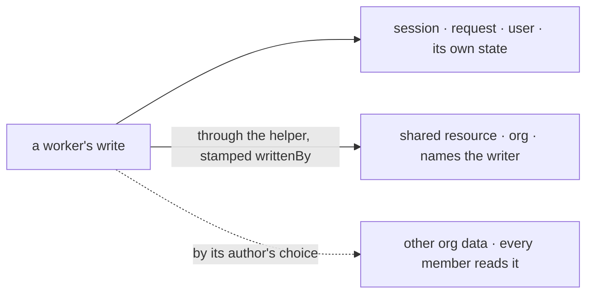

# FIX-1789 · Business rules

[Spec](SPEC.md) · [Decisions](DECISIONS.md) · **Rules** · [Plan](PLAN.md) · [Docs](DOCS.md) · [Evolution](EVOLUTION.md)

The cases, written as rules. Each says what an author, an installation, a user or the system does,
and what happens. The *proved by* column is the check the plan runs. Written for the decided shape,
the list the installation keeps ([Q1](DECISIONS.md#q1)), and for org scope as shared by design
([Q2](DECISIONS.md#q2)).

## Registering worker flows

| # | When | Then | Proved by |
|---|---|---|---|
| BR-1 | An installation registers a flow that takes the configuration a real hire supplies, has one door, and declares any `writtenBy` as the contract's whole field | It is a worker flow. Workers can name it | CI · goal leg a |
| BR-2 | A registered flow doesn't accept one of the standard configuration's keys, refuses the value a real hire supplies for one (`seatId` as a number), or declares no configuration | Refused at boot, naming the flow and the keys. Read off the flow's own refusal of the bag a real hire supplies, never a second check | CI · goal leg a |
| BR-3 | A registered flow has no door | Refused at boot, naming the flow. Today it hires and takes no message | CI · goal leg a |
| BR-4 | A registered flow has two doors | Refused at boot, naming both. Today it hires with a warning | CI |
| BR-5 | A registered flow declares `writtenBy` on a resource in any other shape than the contract's: optional, without a required user, or as `z.any()` | Refused at boot, naming the accessor and its key pattern | CI · goal leg a |
| BR-6 | A registered flow keeps state at org scope, declared or not | Registered. Org scope is shared with the org by design, and the flow's author chose it | CI |
| BR-7 | Several flows fail, in several ways | One refusal names every problem. Nothing is registered and nothing is hired | CI |
| BR-8 | A flow is registered under a name that isn't its kind | Refused, as today | Existing suite |
| BR-9 | The built-in `agent` is registered, with or without mailbox boards | Registered, with no warning. A board's ledger stays where the board keeps it; FIX-1792 removes the boards | CI |
| BR-10 | The installation registers no flows of its own | The built-in `agent` alone is registered, and passes | CI |

## Naming a flow

| # | When | Then | Proved by |
|---|---|---|---|
| BR-11 | A worker names a registered worker flow | It runs on that flow | CI · goal leg c |
| BR-12 | A worker names a flow that isn't registered | Refused, naming it and listing the registered ones, in today's wording | Existing suite |
| BR-13 | A worker names no flow | It is an `agent` worker. Standard-only is checked after this default | CI |
| BR-14 | A user's own worker names a standard-only flow, directly or through the default | Refused, naming the flow and saying it is kept for standard workers. A standard worker on it runs | CI · goal leg c |
| BR-15 | A stored worker of a user's own names a flow that has since become standard-only | Not run at boot, reported as refused with that sentence, and left as it is on disk (BP-030) | CI |
| BR-16 | The installation replaces `agent` with its own flow | The replacement passes the same checks. The installation's standard-only flag on `agent` stays as the installation wrote it | CI |

## A worker's own state

| # | When | Then | Proved by |
|---|---|---|---|
| BR-17 | Alice's worker runs on the built-in `agent` | Its own state, the skills drawer, is written in alice's scopes. The org's cells hold none of it. FIX-1788 keys it by worker | CI · goal leg b |
| BR-18 | Bob's worker runs on the built-in `agent` after alice's | It reads none of alice's worker's own state | Goal leg b |
| BR-19 | A worker flow writes org scope, declared or not | Written, and every member's runs can read it. Nothing refuses it; the docs say so ([Q2](DECISIONS.md#q2)) | CI |

## Shared writes

| # | When | Then | Proved by |
|---|---|---|---|
| BR-20 | A worker writes a shared resource through the helper | The entry names the session's user and the worker. Until FIX-1788's singleton cutover the worker is the per-hire id, `seatId`. After it, the worker is FIX-1788's server-owned session link, which FIX-1788 wires into the helper | CI · goal leg b |
| BR-21 | A block writes a shared entry without `writtenBy` | Refused by the resource's own schema | CI |
| BR-22 | A caller's input carries a `writtenBy` | Ignored by the helper: the stamp comes from the session, never the input (BP-031). Flow code that writes the resource directly can set its own, so attribution is as trustworthy as the registered flow's code. No framework or Workforce code reads `writtenBy` to decide who may write; that is scope and FIX-1793's owner rule | CI |
| BR-23 | A person writes through the app with no worker involved | The entry names the user and no worker | CI |
| BR-24 | Another user reads a shared entry | They see it, with who wrote it. Whether they may write it is FIX-1793's "owner writes, org reads" | CI |

A worker's own state stays in its user's scopes. The org is reached through a shared resource that
names the writer, or, when a flow's author built it to, as plain org data every member reads. The
dashed path is open on purpose.

## Failure taxonomy

Everything at registration is fatal and collected: one boot names every problem and starts no
worker. A refused stored worker is skipped and reported, never deleted. At run time the only
refusal is the shared resource's own schema refusing an unsigned write. Nothing retries.

## Acceptance criteria this issue owns

[The goal](SPEC.md#the-goal-and-how-well-know-its-met): on the real path, three broken flows are
refused at boot by name, alice's `agent` worker keeps its own state out of the org's cells while
her shared note names her, and bob's own worker on a standard-only flow is refused. The same run
fails each leg on today's `main`. The epic's [ER-2, ER-11 and ER-14](../../epics/FIX-1786/BUSINESS-RULES.md)
hold for every flow registered in the repo's installations, with ER-2's "keeps a worker's state
private" read as [Q2](DECISIONS.md#q2) decided it.
