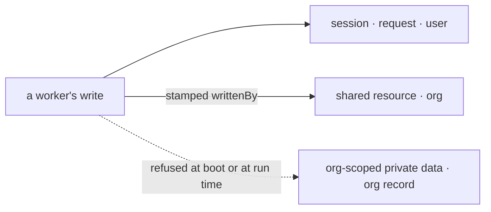

# FIX-1789 · Business rules

[Spec](SPEC.md) · [Decisions](DECISIONS.md) · **Rules** · [Plan](PLAN.md) · [Docs](DOCS.md) · [Evolution](EVOLUTION.md)

The cases, written as rules. Each says what an author, an installation, a user or the system does,
and what happens. The *proved by* column is the check the plan runs. Rules marked **Q2** hold only
if Q2 takes the engine rule. Written in the recommended shape ([Q1](DECISIONS.md#q1)); under the
wrapper, BR-1 to BR-6 fire where the flow is defined, and BR-14 reads the flag off the flow.

## Registering worker flows

| # | When | Then | Proved by |
|---|---|---|---|
| BR-1 | An installation registers a flow that takes the standard configuration, has one door and keeps no private state at org scope | It is a worker flow. Workers can name it | CI · goal leg a |
| BR-2 | A registered flow doesn't accept one of the standard configuration's keys, or declares no configuration | Refused at boot, naming the flow and the missing keys. Read off the flow's own refusal, never a second check | CI · goal leg a |
| BR-3 | A registered flow has no door | Refused at boot, naming the flow. Today it hires and takes no message | CI · goal leg a |
| BR-4 | A registered flow has two doors | Refused at boot, naming both. Today it hires with a warning | CI |
| BR-5 | A registered flow keeps a resource at org scope whose entries don't carry `writtenBy` | Refused at boot, naming the accessor and its key pattern | CI · goal leg a |
| BR-6 | A registered flow declares org scope state | Refused at boot: that record is one blob every member writes | CI |
| BR-7 | Several flows fail, in several ways | One refusal names every problem. Nothing is registered and nothing is hired | CI |
| BR-8 | A flow is registered under a name that isn't its kind | Refused, as today | Existing suite |
| BR-9 | The built-in `agent` takes tasks from a mailbox board | Registered, with one boot warning naming the ledger and FIX-1792. Its own skills drawer passes BR-5 | CI |
| BR-10 | The installation registers no flows of its own | The built-in `agent` alone is registered, and passes | CI |

## Naming a flow

| # | When | Then | Proved by |
|---|---|---|---|
| BR-11 | A worker names a registered worker flow | It runs on that flow | CI · goal leg c |
| BR-12 | A worker names a flow that isn't registered | Refused, naming it and listing the registered ones, in today's wording | Existing suite |
| BR-13 | A worker names no flow | It is an `agent` worker. Standard-only is checked after this default | CI |
| BR-14 | A user's own worker names a standard-only flow, directly or through the default | Refused, naming the flow and saying it is kept for standard workers. A standard worker on it runs | CI · goal leg c |
| BR-15 | A stored worker of a user's own names a flow that has since become standard-only | Not run at boot, reported as refused with that sentence, and left as it is on disk (BP-030) | CI |
| BR-16 | The installation replaces `agent` with its own flow | The replacement passes the same checks. The installation's standard-only flag on `agent` stays as the installation wrote it | CI |

## Private state when a worker runs · Q2

| # | When | Then | Proved by |
|---|---|---|---|
| BR-17 | A block in a worker flow writes the org's shared state record | Refused when it runs, naming the flow. Nothing is written | CI · goal leg b |
| BR-18 | Another user's worker reads the org's shared state record | Sees nothing a worker flow wrote | Goal leg b, under `GOAL_CONTROL=declarations-only` too |
| BR-19 | An app flow that is not a worker flow writes the org's shared record | Unaffected | CI |

## Shared writes

| # | When | Then | Proved by |
|---|---|---|---|
| BR-20 | A worker writes a shared resource through the contract | The entry names the session's user and the worker. Until FIX-1788 the worker is the seat's own id | CI · goal leg b |
| BR-21 | A block writes a shared entry without `writtenBy` | Refused by the resource's own schema | CI |
| BR-22 | A caller's input carries a `writtenBy` | Ignored: the stamp comes from the session, never the input (BP-031) | CI |
| BR-23 | A person writes through the app with no worker involved | The entry names the user and no worker | CI |
| BR-24 | Another user reads a shared entry | They see it, with who wrote it. Whether they may write it is FIX-1793's "owner writes, org reads" | CI |

Two paths reach storage. Private data stays in one user's scopes; the org is reached only through a
shared resource that names the writer. The dashed path is what the contract refuses.

## Failure taxonomy

Everything at registration is fatal and collected: one boot names every problem and starts no
worker. A refused stored worker is skipped and reported, never deleted. A refused org-record
write fails that run with the flow named and writes nothing. Nothing retries.

## Acceptance criteria this issue owns

[The goal](SPEC.md#the-goal-and-how-well-know-its-met): on the real path, three broken flows are
refused at boot by name, bob's run reads none of alice's writes and the shared note names her, and
bob's own worker on a standard-only flow is refused. The same run fails leg b under
`GOAL_CONTROL=declarations-only`. The epic's [ER-2, ER-11 and ER-14](../../epics/FIX-1786/BUSINESS-RULES.md)
hold for every flow registered in the repo's installations.
