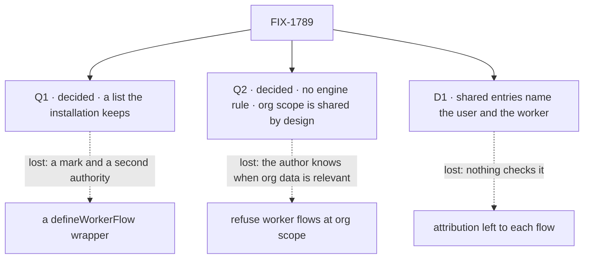

# FIX-1789 · Decisions

[Spec](SPEC.md) · **Decisions** · [Rules](BUSINESS-RULES.md) · [Plan](PLAN.md) · [Docs](DOCS.md) · [Evolution](EVOLUTION.md)

Three calls, all decided. Jake answered Q1 and Q2 on 2026-10-06, at this spec's gate. The epic asked
this spec to settle the first on a POC of both shapes ([FIX-1786 Q1](../../epics/FIX-1786/DECISIONS.md#q1));
the POC raised the second. Q1 binds the set once the epic's amendment records it
([ER-24](../../epics/FIX-1786/BUSINESS-RULES.md#how-the-set-is-run)); Q2 changes nothing the epic decided.

## The tree

Solid edges are what was signed. Dashed edges are the other side of each call.

## Open

None. Q1 and Q2 were answered at the gate.

## Decided

### Q1 · decided · A list the installation keeps, not a `defineWorkerFlow()` wrapper

**Jake, 2026-10-06:** the list. The installation keeps the map of its worker flows, checks each one
at registration, exports the checks, and marks standard-only per entry. Recorded for the set in
[the epic's Q1](../../epics/FIX-1786/DECISIONS.md#q1) by a separate epic amendment.

**The fork.** Keep today's map of flows the installation passes to the hire, check each flow on it
when the installation starts, and let each entry carry a standard-only flag. Or give authors a
wrapper that builds a worker flow, checks it as it is written, marks it, and carries standard-only
inside the flow.

**In plain terms.** Both refuse the same flows before any worker runs: the POC ran seven flows
through each and got the same verdicts ([S1–S4](poc/two-shapes/README.md#what-was-observed)). The
wrapper says "broken" when the author's file loads; the list says it when the installation starts,
and a library can call its check in its own tests. The wrapper also refuses a flow that meets every
requirement but was written without it. And under the wrapper, "keep this flow for standard
workers" is the flow author's choice, not the installation's.

**The trade-off.** The wrapper buys earlier failure inside a library that never runs an
installation, and one obvious way to write a worker flow. It costs a second authority, which
`worker-config.ts` rejects on purpose today; it moves `agent` and every app flow onto a new export;
and an installation that swaps in a library's agent loses its own standard-only policy
([F3](poc/two-shapes/README.md#what-was-observed)). The list costs a check library authors must
remember to call.

**Why the list.** Every requirement the wrapper holds, before any worker runs, with one authority.
Standard-only stays with whoever runs the installation, where the
[concept](../../epics/FIX-1786/concept/CONCEPT.md#the-worker-contract) puts it. And it reverses
cheaply: a wrapper can come later as sugar over the list, with no mark; removing a mark from every
worker flow later is breaking.

**What lost.** The wrapper, which Jake leaned to at the epic gate for contract integrity. It would
have won if standard-only were a property of the flow, the same in every installation, or if
library authors shipped worker flows nobody checks until a customer boots them.

**If wrong.** Add the wrapper later, as sugar over the list.

It came down to who sets standard-only: under the wrapper, an installation can't keep its own policy.

### Q2 · decided · No engine rule: org scope is shared by design, and the built-in flows keep a worker's own state out of it

**Jake, 2026-10-06:** "workers can write to org data if that's how they are built to operate.
Nothing stops them; we don't know when org data is relevant. However our built-in flows for
workers are optimized to keep their own 'mind' out of the org space."

**What it means.** The contract refuses nothing at org scope: not a declared org-scoped collection,
not a declared org record, not a write nothing declares. Org scope is shared with every member of
the org by design, and a flow that writes there does so by its author's choice. A worker's own
state is private: in its user's scopes, keyed by worker once FIX-1788 lands
([ER-1](../../epics/FIX-1786/BUSINESS-RULES.md#what-a-team-gets-and-what-it-doesnt)). The built-in
`agent` moves its skills drawer off org scope ([G1](poc/two-shapes/README.md#what-was-observed));
the coordinator flow FIX-1791 builds keeps its own state off it the same way.

**What lost.** An opt-in engine rule refusing a worker flow's write to the org record, with
registration refusing org-scoped collections that carry no attribution and any declared org record.
Its case was the write nothing declares ([R3–R4](poc/two-shapes/README.md#what-was-observed)). After
this call that write is what org scope is, documented, not a hole in a promise.

**What it moves.** No fourth Layer 1 change: the epic's [D3](../../epics/FIX-1786/DECISIONS.md#d3)
stays three. The engine surfaces, the org refusals and the mailbox-ledger allowance leave the plan;
the ledgers need no allowance once nothing at org scope is refused
([K4](poc/two-shapes/README.md#after-the-gate-2026-10-06)). The issue stays one package.

**What would change it.** A worker flow writing one user's data to org scope by accident, despite
the docs; or a customer needing an installation-wide "workers never write org data" policy.

**If wrong.** One user's worker data, written to org scope by a flow's author, reaches every member.
The docs name it; nothing refuses it.

It came down to who knows when org data is relevant: the flow's author, not the contract.

### D1 · Every entry in a shared resource names the user, and the worker when one wrote it, stamped from the session's identity

| | |
|---|---|
| **Instead of** | Leaving attribution to each flow, or waiting for an engine-stamped writer |
| **Because** | [ER-11](../../epics/FIX-1786/BUSINESS-RULES.md#what-a-team-gets-and-what-it-doesnt) is this issue's, and no engine rule exists to stand on (the 2026-09-23 lock deferred "owner writes, org reads"). A required field in the shared resource's own schema refuses an unsigned write at run time ([R1–R2](poc/two-shapes/README.md#what-was-observed)), and registration checks the field is the contract's whole shape, not just its name ([K2](poc/two-shapes/README.md#after-the-gate-2026-10-06)). The helper takes the user from the session, never an input (BP-031). The worker is today's per-hire id, `seatId`, until FIX-1788's singleton cutover; after it a singleton holds no per-worker id, and the worker is FIX-1788's server-owned session link. FIX-1788 wires the helper to that link as one of its consumers; this issue adds no surface for it |
| **Locks in** | Every shared resource FIX-1793 and FIX-1795 build carries `writtenBy: { userId, workerId? }` on each entry, persisted. Renaming it later needs a migration. Attribution is as trustworthy as the registered worker flow's own code: the helper can't be fed a writer, but flow code that writes the resource directly can set its own ([K3](poc/two-shapes/README.md#after-the-gate-2026-10-06)). `writtenBy` is for display and audit only: no framework or Workforce code ever uses it as an authorization input, and who may write a shared row is decided by scope and by FIX-1793's owner rule, which owns authorization on shared rows |

It comes down to the schema refusing an unsigned write: a convention can't, and the engine has no stamp.

## Decided, not asked

- **The checks run once per flow, at registration**, reading the definition, so they hold when
  FIX-1788 makes each flow one shared copy.
- **Configuration is checked by value as well as by name.** A flow gets the bag a real hire
  supplies, with non-empty lists; any refusal naming a contract key is a problem, so `seatId` as a
  number is refused at boot ([K1](poc/two-shapes/README.md#after-the-gate-2026-10-06)).
- **Attribution is checked by behaviour.** A declared `writtenBy` must take a user, with or without
  a worker, and refuse an entry with no user, on any resource that declares it
  ([K2](poc/two-shapes/README.md#after-the-gate-2026-10-06)).
- **The default comes first, then the flag.** A worker naming no flow is an `agent` worker; if
  `agent` is standard-only, a user's own worker is refused, naming `agent`.
- **Replacing `agent` keeps the installation's flag**: under the list it is the entry's.
- **The door is required**, as the epic's ER-2 says. None, or two, is refused at registration;
  today the first hires doorless and the second with a warning. This amends
  [FIX-1690 D1](../FIX-1690/DECISIONS.md) for worker flows ([Evolution](EVOLUTION.md)).
- **The built-in `agent` moves its skills drawer off org scope**, to its user's. It re-seeds from
  configuration, so nothing is lost ([G1](poc/two-shapes/README.md#what-was-observed)). This is the
  built-in flow keeping its own state private (Q2), not a refusal any other flow faces.
- **Mailbox-board ledgers stay as they are.** They are shared task lists, and nothing at org scope is
  refused. FIX-1792 removes the boards.
- **The check is exported** for a library's own tests.
- **User scope counts as private**; FIX-1790 makes it per org.
- **One name per thing, and a seat is a worker** (Jake, 2026-10-06). This issue renames what it
  changes: `kinds` becomes `workerFlows`. `KindRefusedHireError` and `seatDoorOf` are only called,
  and stay for FIX-1796. Every new surface, refusal and test says worker.
- **The epic's collapse trigger doesn't fire.** The contract is more than a registration list:
  three checks, attribution with its stamp, the drawer move, and standard-only through every path
  that runs a worker.

## Considered and dropped

| Alternative | Why not |
|---|---|
| Both: the wrapper as sugar over the list, now | Two ways to declare one thing on day one. It stays additive later |
| Reading block code for `ctx.org` writes | It can't see through tools, capabilities or helpers, and after Q2 nothing asks it to |
| A run-time gate inside Workforce | Workforce can't intercept the org record a block writes; only the engine sees the write. Q2 declined the engine rule too |
| Isolating the org record per flow | It keys the record by flow, which every user of a singleton still shares |
| Engine-stamped attribution, or an engine seam every shared write passes | A Layer 1 change Q2 doesn't take. The promise is narrowed instead: the helper stamps from the session, and flow code is trusted as registered ([K3](poc/two-shapes/README.md#after-the-gate-2026-10-06)) |

## Settled

Settled by [the POC](poc/two-shapes/README.md); resolved, don't reopen:

- **Both shapes give the same verdicts on what a flow declares** — **CONFIRMED**, S1–S4, on `fbecfe6f2`.
- **Today's built-in `agent` passes the contract unchanged under the list** — **REFUTED** as gated:
  its skills drawer is at org scope, G1. After Q2 it passes, K4; the drawer moves because the
  built-in flow keeps its own state private, not because the contract refuses it.
- **The private-state rule can be checked from declarations alone** — **REFUTED**: the org record
  is written with nothing declared, even under a strict empty schema, R3–R4. Q2 made it moot.
- **A shared resource's schema can enforce attribution** — **CONFIRMED**, R1–R2.
- **Checks reading names hold the configuration and attribution requirements** — **REFUTED**, K1–K2
  on `f71b9b55b`: a wrong-typed `seatId` and four loose `writtenBy` fields passed. Fixed in the POC.
- **The helper's stamp can't be forged by flow code** — **REFUTED**, K3: a block writing directly
  stored another user's name. The promise is narrowed (D1).

## How it got here

- **Draft** — framed as the epic's worker contract; built both of Q1's shapes in a POC, which
  recommends the list; three checks run once per flow at registration; attribution as a stamped,
  required field; one PR.
- **POC** — Q2 was added and the drawer move and mailbox-ledger allowance were decided, because the
  run showed the org record leaks with nothing declared and the built-in `agent` fails as declared.
- **Gate, 2026-10-06** — Jake merged [#2811](https://github.com/fixpoint-labs/flow-state-dev/pull/2811)
  before its review round was folded.
- **Amendment 1** — Q1 decided as the list. Q2 decided as no engine rule: the engine surfaces, the
  org refusals and the ledger allowance left; the drawer move stayed. Codex's three findings on
  #2811 folded: configuration checked by value, attribution by behaviour, the stamp's promise
  narrowed. `writtenBy.workerId`'s source after FIX-1788 named. "Seat" retired in prose; `kinds`
  renamed `workerFlows`.
