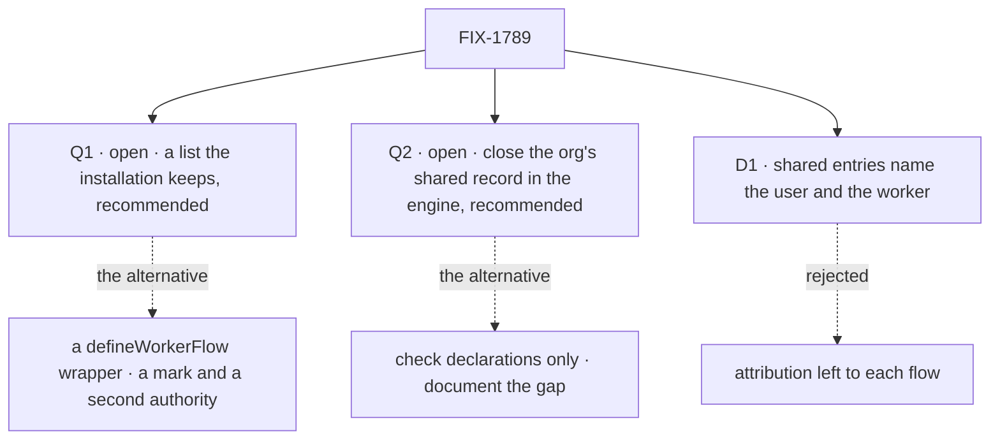

# FIX-1789 · Decisions

[Spec](SPEC.md) · **Decisions** · [Rules](BUSINESS-RULES.md) · [Plan](PLAN.md) · [Docs](DOCS.md) · [Evolution](EVOLUTION.md)

Two calls are open for Jake, both with a recommendation, and one is decided. The epic asked this
spec to settle the first on a POC of both shapes ([FIX-1786 Q1](../../epics/FIX-1786/DECISIONS.md#q1));
the POC raised the second. Each answer binds the set only once a follow-up epic PR records it
([ER-24](../../epics/FIX-1786/BUSINESS-RULES.md#how-the-set-is-run)).

## The tree

Solid edges are what you're signing. Dashed edges are the other side of each call.

## Open

### Q1 · Where does an author say "this flow runs workers": a list the installation keeps, or a `defineWorkerFlow()` wrapper?

**The fork.** Keep today's map of flows the installation passes to the hire, check each flow on it
when the installation starts, and let each entry carry a standard-only flag. Or give authors a
wrapper that builds a worker flow, checks it as it is written, marks it, and carries standard-only
inside the flow.

**In plain terms.** Both refuse the same flows before any worker runs: the POC ran seven flows
through each and got the same verdicts ([S1–S4](poc/two-shapes/README.md#what-was-observed)). The
wrapper says "broken" when the author's file loads; the list says it when the installation starts,
and a library can call its check in its own tests. The wrapper also refuses a flow that meets every
requirement but was written without it. And under the wrapper, "keep this flow for standard
workers" is the flow author's choice, not the installation's.

**The trade-off.** The wrapper buys earlier failure inside a library that never runs an
installation, and one obvious way to write a worker flow. It costs a second authority, which
`worker-config.ts` rejects on purpose today; it moves `agent` and every app flow onto a new export;
and an installation that swaps in a library's agent loses its own standard-only policy
([F3](poc/two-shapes/README.md#what-was-observed)). The list costs a check library authors must
remember to call.

**My recommendation: the list.** Every requirement the wrapper holds, before any worker runs, with
one authority. Standard-only stays with whoever runs the installation, where the
[concept](../../epics/FIX-1786/concept/CONCEPT.md#the-worker-contract) puts it. And it reverses
cheaply: a wrapper can come later as sugar over the list, with no mark; removing a mark from every
worker flow later is breaking.

**What would change my mind.** Standard-only being a property of the flow, the same in every
installation; or library authors shipping worker flows nobody checks until a customer boots them.

**If wrong.** The list, wrongly: add the wrapper later. The wrapper, wrongly: a public export and
a mark on every worker flow to unwind before 1.0.

It comes down to who sets standard-only: under the wrapper, an installation can't keep its own policy.

### Q2 · Close the org's shared record in the engine, or check declarations only and document the gap?

**The fork.** The POC found one path no declaration shows: any block can write the org's shared
state record, and every member's run reads it ([R3–R4](poc/two-shapes/README.md#what-was-observed)).
Close it with a small engine rule, a fourth Layer 1 change beyond the epic's
[D3](../../epics/FIX-1786/DECISIONS.md#d3), or check declarations and tell authors not to use it.

**In plain terms.** Alice's worker writes "launch is Friday" to the org record; Bob's worker reads
it; nothing in the flow said it would. With the rule, the write is refused when it happens, naming
the flow. Without it, the contract says "private" and the docs say "except this".

**The trade-off.** The rule is opt-in: a flow declares it keeps no org record, and Workforce
registers only worker flows that do; other app flows are untouched. It grows this issue from small
to medium, and it is the epic's call because it widens D3. Declarations only ships sooner, and
leaves a hole a careless author, or a capability configured for org scope, walks into.

**My recommendation: the engine rule.** The epic promises only shared resources are shared, and
this is the one path that breaks it with nothing to see in the flow.

**What would change my mind.** Evidence that no worker flow will ever write the org record, and
that the skills activation store's org option can't be pointed there.

**If wrong.** Unneeded: one engine flag nobody else uses. Missing when needed: one user's worker
data reaches every member, the hole this epic exists to close.

It comes down to the path with nothing to see: declarations can't show it, so only a run-time rule closes it.

## D1 · Every entry in a shared resource names the user, and the worker when one wrote it, stamped from the session's identity

| | |
|---|---|
| **Instead of** | Leaving attribution to each flow, or waiting for an engine-stamped writer |
| **Because** | [ER-11](../../epics/FIX-1786/BUSINESS-RULES.md#what-a-team-gets-and-what-it-doesnt) is this issue's, and no engine rule exists to stand on (the 2026-09-23 lock deferred "owner writes, org reads"). A required field in the shared resource's own schema is checked at registration and refuses an unsigned write at run time ([R1–R2](poc/two-shapes/README.md#what-was-observed)). The value comes from the session's user, never an input (BP-031); the worker comes from FIX-1788's server-owned link |
| **Locks in** | Every shared resource FIX-1793 and FIX-1795 build carries `writtenBy: { userId, workerId? }` on each entry, persisted. Renaming it later needs a migration. Attribution is as trustworthy as the worker flow's own code, which the installation registered; a caller can't forge it |

It comes down to the schema refusing an unsigned write: a convention can't, and the engine has no stamp.

## Decided, not asked

- **The checks run once per flow, at registration**, reading the definition, so they hold when
  FIX-1788 makes each flow one shared copy.
- **The default comes first, then the flag.** A worker naming no flow is an `agent` worker; if
  `agent` is standard-only, a user's own worker is refused, naming `agent`.
- **Replacing `agent` keeps the installation's flag**: under the list it is the entry's.
- **The door is required**, as the epic's ER-2 says. None, or two, is refused at registration;
  today the first hires doorless and the second with a warning. This amends
  [FIX-1690 D1](../FIX-1690/DECISIONS.md) for worker flows ([Evolution](EVOLUTION.md)).
- **The built-in `agent` moves its skills drawer off org scope.** It re-seeds from configuration,
  so nothing is lost ([G1](poc/two-shapes/README.md#what-was-observed)).
- **Mailbox-board ledgers are allowed by name until FIX-1792 removes them**, with a boot warning
  ([G4](poc/two-shapes/README.md#what-was-observed)). Refusing them now breaks every
  mailbox-draining roster before its replacement exists.
- **The check is exported** for a library's own tests.
- **User scope counts as private**; FIX-1790 makes it per org.
- **No renames**: `kinds`, `KindRefusedHireError` and `seatDoorOf` stay for FIX-1796.
- **The epic's collapse trigger doesn't fire.** The contract is more than a registration list:
  three checks, attribution, the drawer move, and Q2's rule if taken.

## Considered and dropped

| Alternative | Why not |
|---|---|
| Both: the wrapper as sugar over the list, now | Two ways to declare one thing on day one. It stays additive later |
| Reading block code for `ctx.org` writes | It can't see through tools, capabilities or helpers, and would claim a guarantee it can't keep |
| A run-time gate inside Workforce | Workforce can't intercept the org record a block writes; only the engine sees the write |
| Isolating the org record per flow | It keys the record by flow, which every user of a singleton still shares |
| Engine-stamped attribution | A Layer 1 change for a value the registered flow can stamp from the session |

## Settled

Settled by [the POC](poc/two-shapes/README.md), run on `fbecfe6f2`; resolved, don't reopen:

- **Both shapes give the same verdicts on what a flow declares** — **CONFIRMED**, S1–S4.
- **Today's built-in `agent` passes the contract unchanged under the list** — **REFUTED**: its skills
  drawer is at org scope, G1.
- **The private-state rule can be checked from declarations alone** — **REFUTED**: the org record
  is written with nothing declared, even under a strict empty schema, R3–R4.
- **A shared resource's schema can enforce attribution** — **CONFIRMED**, R1–R2.

## How it got here

- **Draft** — framed as the epic's worker contract; built both of Q1's shapes in a POC, which
  recommends the list; three checks run once per flow at registration; attribution as a stamped,
  required field; one PR.
- **POC** — Q2 was added and the drawer move and mailbox-ledger allowance were decided, because the
  run showed the org record leaks with nothing declared and the built-in `agent` fails as declared.
