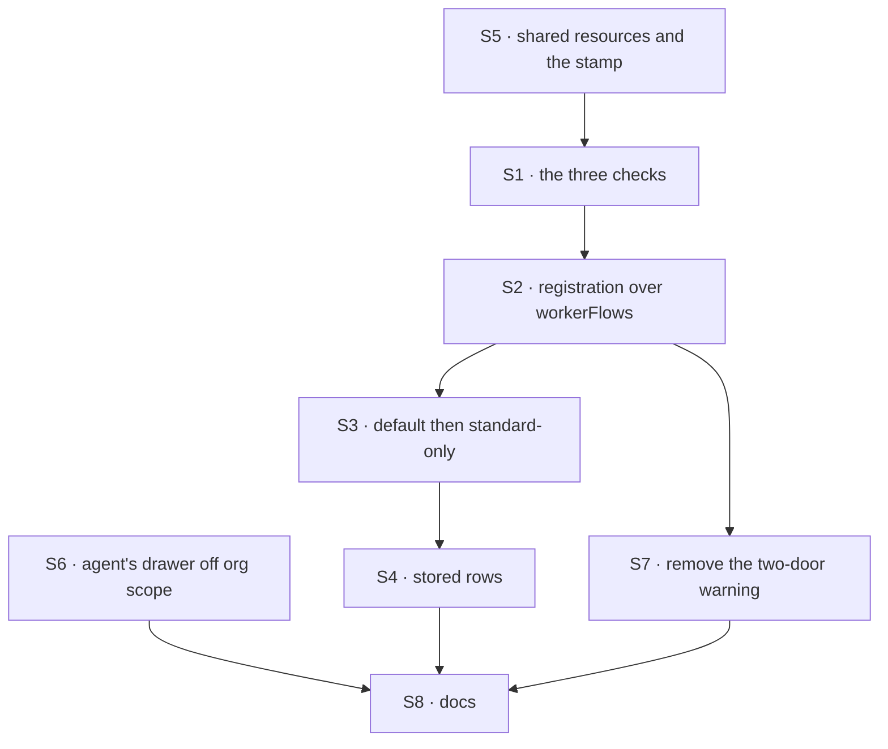

# FIX-1789 · Plan

[Spec](SPEC.md) · [Decisions](DECISIONS.md) · [Rules](BUSINESS-RULES.md) · **Plan** · [Docs](DOCS.md) · [Evolution](EVOLUTION.md)

Written for the implementing agent. IDs cross-reference [BUSINESS-RULES.md](BUSINESS-RULES.md)
(BR-n) and [DECISIONS.md](DECISIONS.md). `tdd`. One PR. Written for the decided answers: Q1, the
list; Q2, no engine rule. **Build only once the epic has recorded Q1** (see *At implement time*).

## Surfaces

| ID | Package · role | Change | Rules |
|---|---|---|---|
| S1 | `workforce` · a contract module beside `worker-config.ts` | Three checks over a flow definition. Configuration: the flow's own refusal of the bag a real hire supplies, with non-empty lists, where any refusal naming a contract key counts, undeclared or by value (share that reading with `admissionHint`; don't copy it). Door: exactly one. Attribution: every declared `writtenBy` is the contract's whole field, judged by what it accepts and refuses. Exported as one function returning every problem. Its names and refusals say worker | BR-1–BR-5 |
| S2 | `workforce` · the hire's worker-flow map | `HireOptions.kinds` and `SeatHireCapabilityOptions.kinds` (the same map, `seat-hire-blocks.ts`) become `workerFlows`: this issue changes them, so it renames both, and every caller in the repo moves in this PR (BP-034). The mailbox `kinds` (`MailboxKind`, `mailbox-binder.ts`, `mailboxInstances`) is a different map and stays. Each entry may be a flow or `{ flow, standardOnly }`. S1 runs once per flow over the resolved map, `agent` included, before any mint; every problem collected, nothing registered on a refusal | BR-6–BR-8 BR-10 BR-16 |
| S3 | `workforce` · flow resolution | Default to `agent`, then apply standard-only. "Standard" is a worker from the installation's files; a runtime hire or a stored roster row is the user's own | BR-11–BR-14 |
| S4 | `workforce` · the roster's per-row check | A stored row refused by S3 reports `refused` with S3's sentence; the row is untouched | BR-15 |
| S5 | `workforce` · shared resources | A helper declaring an org-scoped collection whose entries carry a required `writtenBy`, and a write helper stamping it from the session's user and the worker. The worker is today's per-hire id; FIX-1788 switches it to its session link ([D1](DECISIONS.md#d1)) | BR-20–BR-24 |
| S6 | `workforce` · the built-in `agent` | Move its skills drawer off org scope, to user scope with the flow's isolation. FIX-1788 re-keys it by worker. Mailbox ledgers are untouched | BR-9 BR-17 BR-18 |
| S7 | `workforce` · the two-door warning | **Remove** the warn-and-hire-with-no-door path for worker flows: BR-3 and BR-4 refuse instead | BR-3 BR-4 |
| S8 | Docs | [DOCS.md](DOCS.md)'s operations; README entries for the export, the entry form, the rename and the helpers; a `minor` changeset for `workforce` naming the `kinds` rename | — |

## Sequence



S6 has no ordering constraint now: nothing at org scope is refused, so today's `agent` registers
either way. Land it before VG, which reads the drawer's cells.

## Checks

| ID | Runs after | Passes when |
|---|---|---|
| V0 | — | Before S2: run S1 over every worker-flow map in the repo (find them by `hireWorkforce(`, `createSeatHireCapability(`, `workerFlows:` and `kinds:`, skipping the mailbox `kinds` in `mailbox/` and `mailboxInstances`; kitchen-sink, Shift Manager's DevForce lab and the `goals/workforce-*` hosts at least). Record each failing flow in the PR; each is fixed here or named in a follow-up |
| V1 | S1 | BR-2 to BR-5, each with the flow named. A flow hand-declaring the six keys passes, as today; one naming them with a type no hire supplies is refused (K1); each loose `writtenBy` of K2 and K6 is refused |
| V2 | S2 | BR-7: two bad flows give one error naming both, and nothing is minted. BR-6: a flow keeping org data of its own registers. BR-10 |
| V3 | S3 | BR-13 and BR-14, through the default and directly; BR-16, flag kept across a replacement |
| V4 | S4 | BR-15: the row is reported `refused` and the stored value is byte-identical after boot |
| V5 | S5 | BR-20 to BR-23 on the real engine; BR-22 with a forged input to the helper. The docs claim nothing K3 refutes |
| V6 | S6 | BR-9, BR-17, BR-18: the built-in `agent`, with and without task lists, registers with no warning; after a run, the org's cells hold none of its drawer |
| V7 | S7 | No worker flow hires with zero or two doors |
| VG | S6 | [The goal](SPEC.md#the-goal-and-how-well-know-its-met): `goals/worker-contract/runs-workers-only-on-registered-flows/run.mts` PASSES, after the same run FAILED on today's `main`, each leg on its named signal |

One check per decision: Q1 by V2 and V3, Q2 by V2 (BR-6) and V6, D1 by V5. The second path
(BP-035): stored rows (V4), a replaced `agent` (V3), the built-in `agent` with boards (V6).

## Pinned names · the only three

| Where | Name | Why pinned |
|---|---|---|
| The hire's option | `workerFlows` | Public; an installation types it. Replaces `HireOptions.kinds` and `SeatHireCapabilityOptions.kinds` |
| A worker-flow entry | `standardOnly` | Public; an installation types it |
| Each shared entry | `writtenBy: { userId, workerId? }` | Persisted, and FIX-1793 and FIX-1795 read it ([D1](DECISIONS.md#d1)) |

Everything else is yours to name, in worker terms: worker flow, never kind or seat.

## Guardrails

| Rule | Because |
|---|---|
| The checks read the flow definition, once per flow | A per-mint check disappears when FIX-1788 makes flows singletons |
| Configuration admission stays the schema's own refusal; S1 only reads it, a wrong value as well as a missing key | Two authorities over one rule drift (the `worker-config.ts` header). A names-only reading admits a flow every hire refuses (K1) |
| Every path that runs a worker resolves through S3: the file roster, the runtime hire, the boot reload and `brokenSeats` | A standard-only check at one entry point is a hole at the others (tenet 5) |
| The resource schema enforces that `writtenBy` is there; S1 checks that schema is the contract's | A helper can be bypassed; a required field can't be skipped, unless it was declared loose (K2) |
| The helper's stamp reads the session, never input (BP-031) | Attribution a caller supplies is forgery. Flow code can still write its own (K3): say so, and promise nothing more |
| Nothing at org scope is refused | Q2: the flow's author knows when org data is relevant |
| Refused stored rows are reported, never rewritten or deleted (BP-030) | A flag flip must not lose a user's worker |
| Rename only what this issue changes: `kinds` becomes `workerFlows`; `KindRefusedHireError` and `seatDoorOf` are called as they are | One name per thing (Jake, 2026-10-06). FIX-1796 sweeps the rest with the docs |

## Docs

Reconcile and publish [DOCS.md](DOCS.md) after V1 to V6 pass, against the shipped refusal wording.

## Sketch · pseudocode, illustrative, react to the shape

```
at registration, once:
    for each (name, entry) in { agent: built-in, ...installation's workerFlows }:
        flow, standardOnly ← entry
        problems += configuration (a real hire's bag), door, attribution   ← the whole contract
    if problems: refuse all of them, register nothing

when a worker runs or is hired:
    name ← worker's flow, or agent                           ← default first
    refuse unless registered; refuse if standardOnly and the worker is the user's own

a shared write through the helper:   entry + writtenBy ← session user, the worker
any other org write:                 allowed (Q2)
```

**POC:** [`poc/two-shapes/`](poc/two-shapes/README.md), `bash specs/issues/FIX-1789/poc/two-shapes/run.sh`,
19 legs on `fbecfe6f2` and 7 more after the gate on `f71b9b55b`, 26 passing. It built both shapes on
one set of checks. It showed they refuse the same flows; the wrapper refuses a hand-built flow and
can't hold an installation's standard-only policy; today's `agent` fails as gated; and the org
record leaks with nothing declared, which raised Q2. After the gate, the K legs showed checks reading
names admit a wrong-typed `seatId` and a loose `writtenBy`, fixed them, and showed flow code can
write its own `writtenBy`.

## At implement time

- **Read the epic's Q1 on `main` first.** Q1 and Q2 bind once the epic amendment
  [#2813](https://github.com/fixpoint-labs/flow-state-dev/pull/2813) merges
  ([ER-24](../../epics/FIX-1786/BUSINESS-RULES.md#how-the-set-is-run)). If it isn't recorded, stop:
  that is the coordinator's. The epic's D3 is unchanged.
- FIX-1790 may have landed: user scope is then per org, and nothing here changes.
- FIX-1788 may have started on the singleton `agent`. S6 is the drawer move it also needs; land
  whichever is first and rebase the other. If its singleton cutover has landed, the flow's config
  no longer names a worker: the helper reads FIX-1788's session link. If it hasn't, the helper reads
  `seatId`, and FIX-1788 switches it.
- DevForce's scripted EM has no door ([FIX-1690's open question](../FIX-1690/DECISIONS.md)). V0
  will refuse it. Give it a real door, or stop registering it as a worker flow; don't stub one.
- The skills activation store accepts an explicit org scope. Check the built-in `agent` doesn't use
  it, since its own state stays off org scope (BR-17).
- Old-term exports this issue only calls, left for FIX-1796: `resolvableKinds`,
  `missingKindRefusal`, `KindRefusedHireError`, `seatDoorOf`, `SeatDoor`, and the `seat*` keys of
  `workerConfigSchema()`. If the work changes one, rename it in this PR. `HireOptions.kinds` and
  `SeatHireCapabilityOptions.kinds` are renamed here: tell FIX-1796 they are done.

## Notes from review

- "`Proved by` and V0–VG largely duplicate; optional DRY via PLAN anchors." — cursor ([review](https://github.com/fixpoint-labs/flow-state-dev/pull/2811#pullrequestreview-5433536752))
- "`configProblem()` parses thrown error strings instead of sharing `admissionHint`'s read — fine for evidence, but **implementers must not lift this verbatim** (PLAN S1 already says share the reading). Worth a one-line POC README caveat if you want zero ambiguity." — cursor ([review](https://github.com/fixpoint-labs/flow-state-dev/pull/2811#pullrequestreview-5433536752))
- "Hand-lists six config keys; `workerConfigSchema().extend({ desk: … })` would match the realistic hand-built path and match `asA.triage`. Minor." (the H1 fixture) — cursor ([review](https://github.com/fixpoint-labs/flow-state-dev/pull/2811#pullrequestreview-5433536752))

These are inputs, not instructions. Adopt, adapt, or discard; you owe no justification for
discarding one. A note that turns out to reveal a design problem is a spec blind spot — surface it
and fold it back, per the challenger discipline in `issue-implement`.

## Follow-ups

- The POC's legs map onto V1 (its S legs, K1, K2 and K6), V2 (K5), V6 (G), V3 (F), and V5 (R1, R2, K3). Rewrite
  them under `tdd`; don't copy the experiment.
- A `defineWorkerFlow()` authoring helper over the list, with no mark, stays available as a later
  additive change.
