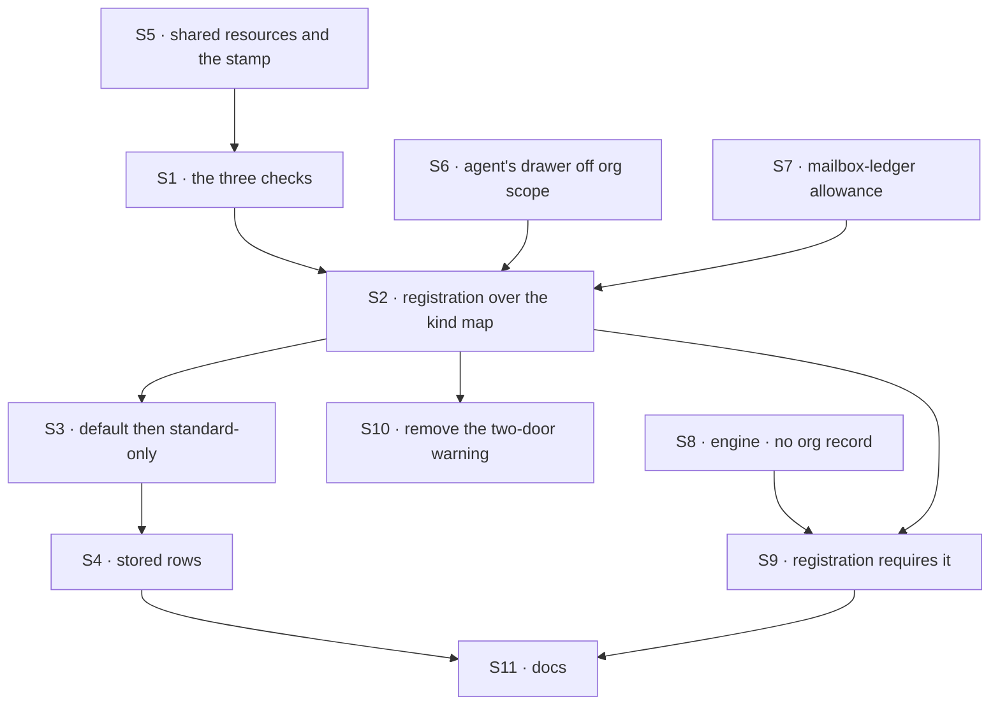

# FIX-1789 · Plan

[Spec](SPEC.md) · [Decisions](DECISIONS.md) · [Rules](BUSINESS-RULES.md) · **Plan** · [Docs](DOCS.md) · [Evolution](EVOLUTION.md)

Written for the implementing agent. IDs cross-reference [BUSINESS-RULES.md](BUSINESS-RULES.md)
(BR-n) and [DECISIONS.md](DECISIONS.md). `tdd`. One PR. Written for the recommended answers to Q1
(the list) and Q2 (the engine rule); **build only what the epic recorded** (see *At implement time*).

## Surfaces

| ID | Package · role | Change | Rules |
|---|---|---|---|
| S1 | `workforce` · a contract module beside `worker-config.ts` | Three checks over a flow definition: configuration (read the flow's own refusal of a full bag, as `admissionHint` reads it; share that reading, don't copy it), door (`seatDoorOf`, now required), private state (org-scoped resources need `writtenBy`; a declared org record is refused). Exported as one function returning every problem | BR-1–BR-6 |
| S2 | `workforce` · the hire's kind map | Each entry may be a flow or `{ flow, standardOnly }`. S1 runs once per flow over the resolved map, `agent` included, before any mint; every problem collected, nothing registered on a refusal | BR-7 BR-8 BR-10 BR-16 |
| S3 | `workforce` · flow resolution | Default to `agent`, then apply standard-only. "Standard" is a worker from the installation's files; a runtime hire or a stored roster row is the user's own | BR-11–BR-14 |
| S4 | `workforce` · the roster's per-row check | A stored row refused by S3 reports `refused` with S3's sentence; the row is untouched | BR-15 |
| S5 | `workforce` · shared resources | A helper declaring an org-scoped collection whose entries carry a required `writtenBy`, and a write helper stamping it from the session's user and the worker | BR-20–BR-24 |
| S6 | `workforce` · the built-in `agent` | Move its skills drawer off org scope, to user scope with the flow's isolation. FIX-1788 re-keys it by worker | BR-9 |
| S7 | `workforce` · mailbox-board ledgers | A named allowance for the mailbox ledger's org-scoped collection, with one boot warning naming FIX-1792. FIX-1792 deletes the allowance with the boards | BR-9 |
| S8 | `engine` · the org scope record (Q2) | A flow can declare that it keeps no org record; a write to it from that flow's run is refused, naming the flow. Opt-in; unset means today | BR-17–BR-19 |
| S9 | `workforce` · registration (Q2) | S1 requires every worker flow to declare S8. The built-in `agent` and the coordinator-to-be do | BR-17 |
| S10 | `workforce` · the two-door warning | **Remove** the warn-and-hire-with-no-door path for worker flows: BR-3 and BR-4 refuse instead | BR-3 BR-4 |
| S11 | Docs | [DOCS.md](DOCS.md)'s operations; README entries for the export, the entry form and the helpers; a `minor` changeset for `workforce` and, with S8, `engine` | — |

## Sequence



S6 and S7 land before S2, or registration refuses today's `agent`.

## Checks

| ID | Runs after | Passes when |
|---|---|---|
| V0 | — | Before S2: run S1 over every kind map in the repo (find them by `hireWorkforce(` and `kinds:`; kitchen-sink, Shift Manager's DevForce lab and the `goals/workforce-*` hosts at least). Record each failing flow in the PR; each is fixed here or named in a follow-up |
| V1 | S1 | BR-2 to BR-6, each with the flow named. A flow hand-declaring the six keys passes, as today |
| V2 | S2 | BR-7: two bad flows give one error naming both, and nothing is minted. BR-10 |
| V3 | S3 | BR-13 and BR-14, through the default and directly; BR-16, flag kept across a replacement |
| V4 | S4 | BR-15: the row is reported `refused` and the stored value is byte-identical after boot |
| V5 | S5 | BR-20 to BR-23 on the real engine; BR-22 with a forged input |
| V6 | S6 S7 | BR-9: the built-in `agent`, with and without task lists, registers; one warning per ledger |
| V7 | S8 S9 | BR-17 and BR-19 on the real engine; an unset flow writes as today |
| V8 | S10 | No worker flow hires with zero or two doors |
| VG | S9 | [The goal](SPEC.md#the-goal-and-how-well-know-its-met): `goals/worker-contract/keeps-worker-state-private/run.mts` PASSES, after the same run FAILED leg b under `GOAL_CONTROL=declarations-only` and legs a and c on `main` |

One check per decision: Q1 by V2 and V3, Q2 by V7 and VG's control, D1 by V5. The second path
(BP-035): stored rows (V4), a replaced `agent` (V3), the off state of S8 (V7).

## Pinned names · the only two

| Where | Name | Why pinned |
|---|---|---|
| A kind-map entry | `standardOnly` | Public; an installation types it |
| Each shared entry | `writtenBy: { userId, workerId? }` | Persisted, and FIX-1793 and FIX-1795 read it ([D1](DECISIONS.md#d1)) |

Everything else is yours to name, in the new terms (worker flow, not kind or seat) for new surfaces.

## Guardrails

| Rule | Because |
|---|---|
| The checks read the flow definition, once per flow | A per-mint check disappears when FIX-1788 makes flows singletons |
| Configuration admission stays the schema's own refusal; S1 only reads it | Two authorities over one rule drift (the `worker-config.ts` header) |
| Every path that runs a worker resolves through S3: the file roster, the runtime hire, the boot reload and `brokenSeats` | A standard-only check at one entry point is a hole at the others (tenet 5) |
| The resource schema is the one place `writtenBy` is enforced | A helper can be bypassed; a required field can't |
| The stamp reads the session, never input (BP-031) | Attribution a caller supplies is forgery |
| Refused stored rows are reported, never rewritten or deleted (BP-030) | A flag flip must not lose a user's worker |
| No renames of `kinds`, `KindRefusedHireError`, `seatDoorOf` | FIX-1796 sweeps them with the docs |

## Docs

Reconcile and publish [DOCS.md](DOCS.md) after V1 to V7 pass, against the shipped refusal wording.
Drop the BR-17 paragraph if the epic records Q2 the other way, and publish the documented limit
in its place.

## Sketch · pseudocode, illustrative, react to the shape

```
at registration, once:
    for each (name, entry) in { agent: built-in, ...installation's map }:
        flow, standardOnly ← entry
        problems += the three checks on flow                  ← the whole contract
    if problems: refuse all of them, register nothing

when a worker runs or is hired:
    name ← worker's flow, or agent                           ← default first
    refuse unless registered; refuse if standardOnly and the worker is the user's own

a shared write:   entry + writtenBy ← session user, the worker
an org-record write from a worker flow:   refused by the engine (Q2)
```

**POC:** [`poc/two-shapes/`](poc/two-shapes/README.md), `bash specs/issues/FIX-1789/poc/two-shapes/run.sh`,
19 legs on `fbecfe6f2`. It built both shapes on one set of checks. It showed they refuse the same
flows; the wrapper refuses a hand-built flow and can't hold an installation's standard-only
policy; today's `agent` fails as declared; and the org record leaks with nothing declared. That
last result added Q2.

## At implement time

- **Read the epic's Q1 and D3 on `main` first.** Build the shape the epic recorded, and S8 and S9
  only if D3 gained the org-record rule. If neither is recorded, stop: that is the coordinator's.
- FIX-1790 may have landed: user scope is then per org, and nothing here changes.
- FIX-1788 may have started on the singleton `agent`. S6 is the drawer move it also needs; land
  whichever is first and rebase the other.
- DevForce's scripted EM has no door ([FIX-1690's open question](../FIX-1690/DECISIONS.md)). V0
  will refuse it. Give it a real door, or stop registering it as a worker flow; don't stub one.
- The skills activation store accepts an explicit org scope. Check no worker flow is configured
  that way, or S8 refuses it at run time.
- Old-term exports this issue leaves for FIX-1796: `HireOptions.kinds`, `resolvableKinds`,
  `missingKindRefusal`, `KindRefusedHireError`, `seatDoorOf`, `SeatDoor`, and the `seat*` keys of
  `workerConfigSchema()`.

## Follow-ups

- The POC's legs map onto V1 (its S legs), V6 (G), V3 (F), V5 and V7 (R). Rewrite them under
  `tdd`; don't copy the experiment.
- If Q1 goes to the list, a `defineWorkerFlow()` authoring helper over it, with no mark, stays
  available as a later additive change.
