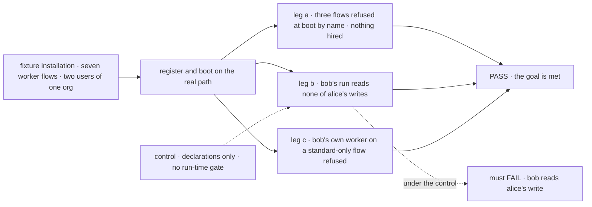
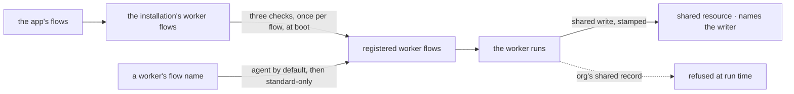

# FIX-1789 · Only flows that keep a worker's state private can run workers (the worker contract)

**Spec** · [Decisions](DECISIONS.md) · [Rules](BUSINESS-RULES.md) · [Plan](PLAN.md) · [Docs](DOCS.md) · [Evolution](EVOLUTION.md)

## Five people, before and after

| Someone who… | Today | After |
|---|---|---|
| **writes a flow for workers** | Learns of a problem only when a worker's hire refuses it. A flow with no door hires and takes no message | Learns at boot, by name, every requirement the flow misses: the standard configuration, one door, private state off the org scope |
| **runs an installation** | Every flow passed to the hire is open to every worker | Registers its worker flows, and can keep any for standard workers. A user's own worker on one is refused |
| **shares an org with other users** | A worker's flow can keep one user's data at org scope, where every member's workers read it | Such a flow is refused at boot. A block writing the org's shared record anyway is refused when it runs ([Q2](DECISIONS.md#q2)) |
| **reads what another user's worker shared** | Nothing says who wrote it | Each entry names the user, and the worker when one wrote it |
| **hires a worker that names no flow** | Gets the built-in `agent` | Still gets `agent`. If `agent` is kept for standard workers, a user's own worker is refused, naming `agent` |

## The goal, and how we'll know it's met

**An installation runs a worker only on a flow it registered as a worker flow. Before any worker
runs, each registered flow is proved to take the standard configuration and a message, and to keep
one user's worker state out of every other user's reach. A flow kept for standard workers refuses a
user's own.**

| Is it the right goal? | |
|---|---|
| **The real need** | The [PRD](https://linear.app/fixpoint-labs/issue/FIX-1789): registered worker flows only; each keeps a worker's state private and shares only through a shared resource, with attribution; a flow can be standard-only. Under it, the epic's [security model](../../epics/FIX-1786/concept/CONCEPT.md#the-security-model), rules 2, 5 and 7 |
| **Smaller, and rejected** | "Registered flows, checked for configuration and a door." The [POC](poc/two-shapes/README.md) shows a block that declares nothing still writes the org's shared record, which every member reads. We'd call the flow private while one user's data reaches everyone |
| **Bigger, and not this issue's** | Private from the same user's other workers ([FIX-1788](https://linear.app/fixpoint-labs/issue/FIX-1788)) · user data per org ([FIX-1790](https://linear.app/fixpoint-labs/issue/FIX-1790)) · "owner writes, org reads" ([FIX-1793](https://linear.app/fixpoint-labs/issue/FIX-1793)) |
| **Not done if** | The real built-in `agent` was never registered under the checks · the org's shared record still leaks · standard-only is checked before the `agent` default · a refusal fires per worker, so it disappears when flows become singletons · a flow with no door still hires |



The check reads what boot refuses and what bob's run reads from the store, not what the check
function returns. The dashed path turns the run-time gate off, and leg b must then fail.

| How we verify | |
|---|---|
| **Goal check** | `goals/worker-contract/keeps-worker-state-private/` · model n/a, model-free · run by the implementer at completion · verdict in the implementation PR |
| **Signal** | Leg a: one boot error names the doorless flow, the flow keeping private notes at org scope and the flow lacking the standard configuration; nothing is hired. Leg b: bob's run sees none of alice's org-record write, and the shared note names `alice` and her worker. Leg c: the refusal names the kept flow; a standard worker on it runs |
| **Input** | The built-in `agent`, an app flow, a coordinator with delegates in session state, a flow writing a shared resource, and three ordinary flows breaking one rule each. Any flow composing the contract must pass too |
| **Anti-game** | No assertion on the check function's return. Each leaky fixture is a flow an author could write. Bob's read goes through the engine as bob |
| **Control that must fail** | `GOAL_CONTROL=declarations-only`: leg b FAILs on *bob reads alice's write*. Today's `main`: legs a and c FAIL |

## What changes


The left panel checks one thing, per worker, when it is hired. The right checks three, once per
flow, before any worker runs, and closes the one path a declaration can't show.

**What an installation writes**, shown in the recommended shape ([Q1](DECISIONS.md#q1)); the
wrapper's version is in the [POC](poc/two-shapes/README.md):

```diff
  hireWorkforce(workers, {
    kinds: {
      triage: triageFlow,
-     coordinator: coordinatorFlow,
+     coordinator: { flow: coordinatorFlow, standardOnly: true },
    },
  })
```

**What a flow author writes to share something**, in either shape:

```diff
- resources: { notes: defineResourceCollection({ pattern: "team-notes/*", scope: "org", stateSchema }) },
+ resources: { notes: sharedResource("team-notes/*", { text: z.string() }) },
  …
- await ctx.resources.notes.create(key, { text })
+ await writeShared(ctx, "notes", key, { text }) // the entry names alice and her worker
```

## How a worker reaches a flow



The checks read the flow definition, not a worker's copy, so they hold when FIX-1788 makes each
flow one shared copy.

## What stays as it is

- `workerConfigSchema()` stays the one authority on configuration, with its six keys.
- How a door is found, and the default to `agent` for a worker that names no flow.
- The names `kinds`, `KindRefusedHireError` and `seatDoorOf`. FIX-1796 renames them.
- Session, request and user scopes: they are one user's already. User scope is per org once FIX-1790 lands.
- App flows that are not worker flows: nothing here applies to them.

## Sign off

**[The goal](#the-goal-and-how-well-know-its-met), at that size:** registered flows only, all three
requirements proved before any worker runs, the org's shared record closed. It assumes Q2's
recommendation; if Q2 goes the other way, the smaller goal ships. If wrong: we call worker flows
private while one path still reaches every member.

**Open, hardest first** (full asks in [DECISIONS.md](DECISIONS.md#open)):

- **[Q1](DECISIONS.md#q1) · A list the installation keeps, or a `defineWorkerFlow()` wrapper?**
  I recommend the list. If wrong: a second authority, and installations that can't set their own
  standard-only policy.
- **[Q2](DECISIONS.md#q2) · Close the org's shared record in the engine, or check declarations
  only?** I recommend the engine rule, a fourth Layer 1 change. If wrong: a privacy promise with a
  known hole.

**Decided:**

1. **[D1](DECISIONS.md#d1) · Every shared entry names the user, and the worker when one wrote it,
   stamped from the session.** If wrong: a persisted field to rename with a migration.

Q1 and Q2 bind the set once a follow-up epic PR records them ([ER-24](../../epics/FIX-1786/BUSINESS-RULES.md#how-the-set-is-run)).

Feature · `workforce`, and `engine` if Q2 holds · medium · 1 PR · epic [FIX-1786](../../epics/FIX-1786/SPEC.md)
