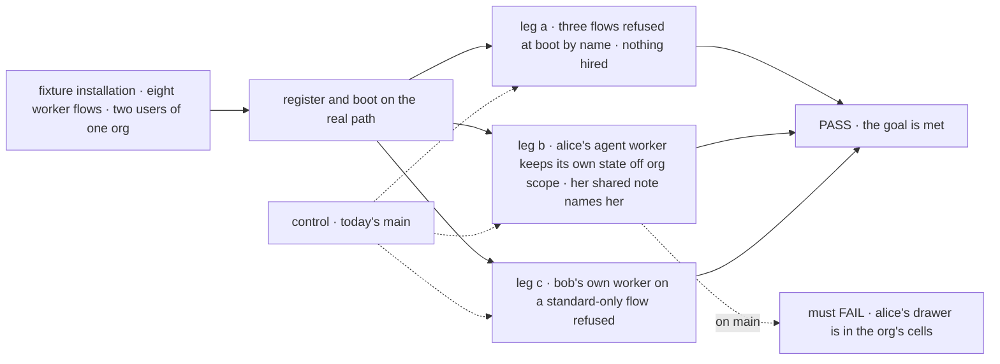
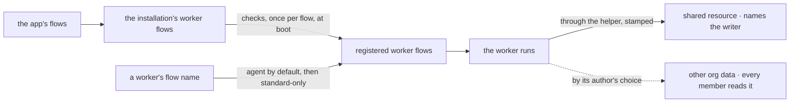

# FIX-1789 · Workers run only on registered worker flows (the worker contract)

**Spec** · [Decisions](DECISIONS.md) · [Rules](BUSINESS-RULES.md) · [Plan](PLAN.md) · [Docs](DOCS.md) · [Evolution](EVOLUTION.md)

## Five people, before and after

| Someone who… | Today | After |
|---|---|---|
| **writes a flow for workers** | Learns of a problem only when a worker's hire refuses it. A flow with no door hires and takes no message | Learns at boot, by name, every requirement the flow misses: the configuration a real hire supplies, one door, and any `writtenBy` it declares |
| **runs an installation** | Every flow passed to the hire is open to every worker | Registers its worker flows, and can keep any for standard workers. A user's own worker on one is refused |
| **shares an org with other users** | The built-in `agent` keeps each worker's skills drawer at org scope | The built-in `agent` keeps its own state in its user's scopes. Org scope stays shared with the whole org by design: a flow writes there because its author built it to ([Q2](DECISIONS.md#q2)) |
| **reads what another user's worker shared** | Nothing says who wrote it | Each entry written through the shared-write helper names the user, and the worker when one wrote it |
| **hires a worker that names no flow** | Gets the built-in `agent` | Still gets `agent`. If `agent` is kept for standard workers, a user's own worker is refused, naming `agent` |

## The goal, and how we'll know it's met

**An installation runs a worker only on a flow it registered as a worker flow. Before any worker
runs, each registered flow is proved to take the configuration a real hire supplies, to have one
door, and to declare any `writtenBy` as the contract's whole field. A flow kept for standard workers
refuses a user's own. The built-in `agent` keeps its own state off org scope, and an entry written
through the shared-write helper names who wrote it.**

| Is it the right goal? | |
|---|---|
| **The real need** | The [PRD](https://linear.app/fixpoint-labs/issue/FIX-1789): registered worker flows only; each shares only through a shared resource, with attribution; a flow can be standard-only. Under it, the epic's [security model](../../epics/FIX-1786/concept/CONCEPT.md#the-security-model), rules 2, 5 and 7, read with [Q2](DECISIONS.md#q2): org data is the flow author's call, and the built-in flows keep a worker's own state out of it |
| **Smaller, and rejected** | "Registered flows, checked by the names they declare." The [POC's K legs](poc/two-shapes/README.md#after-the-gate-2026-10-06) show a names-only check admits a flow every real hire then refuses, and a shared resource that stores unsigned entries |
| **Bigger, and not this issue's** | A rule keeping every worker flow out of org scope: declined ([Q2](DECISIONS.md#q2)) · private from the same user's other workers, keyed by worker ([FIX-1788](https://linear.app/fixpoint-labs/issue/FIX-1788)) · user data per org ([FIX-1790](https://linear.app/fixpoint-labs/issue/FIX-1790)) · "owner writes, org reads" ([FIX-1793](https://linear.app/fixpoint-labs/issue/FIX-1793)) |
| **Not done if** | The real built-in `agent` was never registered under the checks · its own state still lands in the org's cells · a check reads names, not what a real hire or a shared write supplies · standard-only is checked before the `agent` default · a refusal fires per worker, so it disappears when flows become singletons · a flow with no door still hires |



The check reads what boot refuses and what the store holds after each run, not what the check
function returns. On today's `main` all three legs fail, each on its own signal.

| How we verify | |
|---|---|
| **Goal check** | `goals/worker-contract/runs-workers-only-on-registered-flows/` · model n/a, model-free · run by the implementer at completion · verdict in the implementation PR |
| **Signal** | Leg a: one boot error names the doorless flow, the flow whose `seatId` takes a number, and the flow declaring an optional `writtenBy`; nothing is hired. Leg b: after alice's run on the built-in `agent`, the org's cells hold no row of its skills drawer and bob's run reads none of it; the shared note names `alice` and her worker. Leg c: the refusal names the kept flow; a standard worker on it runs |
| **Input** | The built-in `agent`, an app flow, a coordinator with delegates in session state, a flow writing a shared resource, a flow writing org data of its own on purpose (it registers, [Q2](DECISIONS.md#q2)), and three ordinary flows breaking one rule each. Any flow composing the contract must pass too |
| **Anti-game** | No assertion on the check function's return. Each broken fixture is a flow an author could write; the configuration one names every key. Leg b reads the store after a real run of the real `agent`, not its declaration |
| **Control that must fail** | Today's `main`: leg a FAILs on *the doorless flow hires*; leg b on *alice's drawer rows are in the org's cells*; leg c on *bob's own worker runs on the kept flow* |

## What changes

![Today and after, in five cases. Today each worker's mint checks configuration only: a doorless flow hires, a flow whose settings take the wrong type is refused only when a worker is hired on it, the built-in agent keeps each worker's skills drawer at org scope, a shared entry names nobody, and no flow can be kept for standard workers. After, the installation registers its worker flows and the checks run once per flow at boot: the doorless and wrong-typed flows are refused at boot by name, the agent's drawer is in its user's scope, a shared entry names the user and the worker, and a user's own worker on a kept flow is refused](figures/what-changes.svg)

The left panel checks one thing, per worker, when it is hired. The right checks a flow once, before
any worker runs.

**What an installation writes** ([Q1](DECISIONS.md#q1), the list). `kinds` changes here, so it is
renamed here:

```diff
  hireWorkforce(workers, {
-   kinds: {
+   workerFlows: {
      triage: triageFlow,
-     coordinator: coordinatorFlow,
+     coordinator: { flow: coordinatorFlow, standardOnly: true },
    },
  })
```

**What a flow author writes to share something:**

```diff
- resources: { notes: defineResourceCollection({ pattern: "team-notes/*", scope: "org", stateSchema }) },
+ resources: { notes: sharedResource("team-notes/*", { text: z.string() }) },
  …
- await ctx.resources.notes.create(key, { text })
+ await writeShared(ctx, "notes", key, { text }) // stamped from the session: alice and her worker
```

## How a worker reaches a flow



The checks read the flow definition, not a worker's copy, so they hold when FIX-1788 makes each
flow one shared copy. The dashed path is open on purpose ([Q2](DECISIONS.md#q2)).

## What stays as it is

- `workerConfigSchema()` stays the one authority on configuration, with its six keys.
- How a door is found, and the default to `agent` for a worker that names no flow.
- `KindRefusedHireError` and `seatDoorOf`: this issue calls them and changes neither. FIX-1796
  renames them.
- Session, request and user scopes: they are one user's already. User scope is per org once FIX-1790 lands.
- Org scope: open to any flow, worker flows included ([Q2](DECISIONS.md#q2)).
- App flows that are not worker flows: nothing here applies to them.

## Sign off

This is the first amendment after [#2811](https://github.com/fixpoint-labs/flow-state-dev/pull/2811)
merged. It records Jake's answers to Q1 and Q2 and folds that PR's review.

**[The goal](#the-goal-and-how-well-know-its-met), at that size:** registered flows only;
configuration, door and attribution proved before any worker runs; the built-in `agent`'s own
state off org scope. If wrong: we'd call a flow checked while a names-only check admits flows that
fail every hire, or call attribution unforgeable when flow code can write its own.

**Open: none.**

**Decided:**

1. **[Q1](DECISIONS.md#q1) · A list the installation keeps** (Jake, 2026-10-06). If wrong: add a
   wrapper later, as sugar over the list.
2. **[Q2](DECISIONS.md#q2) · No engine rule: org scope is shared by design, and the built-in flows
   keep a worker's own state out of it** (Jake, 2026-10-06). If wrong: one user's data, written to
   org scope by a flow's author, reaches every member, with only the docs to warn.
3. **[D1](DECISIONS.md#d1) · Every entry written through the helper names the user, and the worker
   when one wrote it, stamped from the session.** If wrong: a persisted field to rename with a
   migration.

Q2 narrows the epic's [ER-2 and ER-11](../../epics/FIX-1786/BUSINESS-RULES.md#what-a-team-gets-and-what-it-doesnt):
privacy covers a worker's own state and user-scoped data, not org scope, and attribution is as
trustworthy as the registered flow's code. The epic amendment
[#2813](https://github.com/fixpoint-labs/flow-state-dev/pull/2813) records Q1 and Q2 together
([ER-24](../../epics/FIX-1786/BUSINESS-RULES.md#how-the-set-is-run)); D3 stays at three Layer 1
changes. Implementation waits for #2813 and this amendment to merge.

Feature · `workforce` · medium · 1 PR · epic [FIX-1786](../../epics/FIX-1786/SPEC.md)
