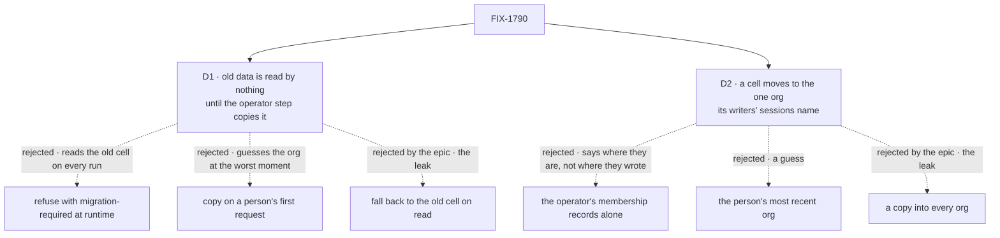

# FIX-1790 · Decisions

[Spec](SPEC.md) · **Decisions** · [Rules](BUSINESS-RULES.md) · [Plan](PLAN.md) · [Docs](DOCS.md) · [Evolution](EVOLUTION.md)

Two decisions are the sign-off surface. The calls above them are the epic's: user data is kept
per (user, org) for every flow, and a record stored before reads in one org at most, moved by an
operator step and never by a fallback read
([ER-3](../../epics/FIX-1786/BUSINESS-RULES.md#what-a-team-gets-and-what-it-doesnt),
[D3](../../epics/FIX-1786/DECISIONS.md#d3)). The epic left this spec one question: how a saved
record is attributed to an org. These two cards answer it and say what that costs a customer.

## The tree

Solid edges are what you're signing. Dashed edges lost, and the label says why.

## D1 · Data saved before the upgrade is read by nothing until an operator copies it; until then each person starts empty in each org

| | |
|---|---|
| **Instead of** | Refusing a person's requests with `migration-required` while they have uncopied data · copying it automatically on their first request in an org |
| **Because** | A refusal has to look in the old cell to know there is something to refuse: a read across orgs on every run, the read ER-3 closes, and a store call per request. It would also lock a person who worked in two orgs out of every flow until someone resolves them by hand. An automatic copy picks the org from the first request after the upgrade, and the framework can't tell a one-org person from one whose other org hasn't signed in yet ([FIX-1538 D2](../FIX-1538/DECISIONS.md#d2)). Starting empty is what hired workers have done since FIX-1538 |
| **Locks in** | Every deployment with saved user data has an operator step at upgrade, with writers stopped. An operator who skips it gets no error: every person's preferences, saved collections and flow-private data look empty. Nothing is lost and the step can run later, but whatever a person writes in between makes the step stop for them. The framework never moves or deletes a record |

It comes down to a person who worked in two orgs: a refusal locks them out of every flow.

**What would change my mind:** a deployment that can't stop its writers for the step. Then a
shipped copy command earns its place, still offline per person, still never a runtime read.

## D2 · The step copies a saved cell to an org only when every session that could have written it names that org, and the operator vouches none was deleted

| | |
|---|---|
| **Instead of** | The operator's membership records alone · the person's most recent org · a copy into every org the person belongs to |
| **Because** | A session is the one record in the store that says which org a run happened in, and it says so per flow. The person's shared cell and user record could have been written by any of their sessions; a flow-isolated cell only by their sessions on that flow, so a hired worker's private data keeps its one org when its person works in two. Membership says where a person is now, not where they wrote: Alice, in Acme until June and in Globex since, would have Acme's data copied into Globex. The most recent org is a guess, and every org is the leak ER-3 closes. A deleted session leaves no trace in the store, so the sessions that remain are evidence only when none of that person's is missing: if Alice's Globex sessions were deleted, the rest name Acme alone and the step would copy Globex data into Acme |
| **Locks in** | A person whose sessions name two orgs gets their shared data back in neither: it stays put, named in the upgrade record, until someone decides by hand. The step also needs the operator to vouch that none of the person's sessions was deleted, or that their own records never placed the person in another org; membership can veto a copy, never choose its org. Without that, and for a person with no sessions left, it stops the same way. A deployment that only ever ran in one org, which includes every development app on the default org, gets everything back |

It comes down to a person who changed orgs: membership copies the old org's data into the new one.

**What would change my mind:** an app that records, per write, which org the write happened
in. That record attributes a cell more finely than sessions do, and the step should prefer it.

## Decided, not asked

- **One cell per (person, org) for every flow, the one hired workers already use**,
  `<person>:~org:<org>`, plus the flow when flow-isolated ([pinned names](PLAN.md#pinned-names)).
  A hired worker's shared data doesn't move, and it now shares a person's cell with the app's other flows
  in that org, as any two flows do; the registry still refuses incompatible schemas. FIX-1538 kept
  them apart only because the app's cell crossed orgs ([EVOLUTION.md](EVOLUTION.md)).
- **The org comes from the admitted run or the stored session**, never a header or body (BP-031).
  A pinned worker's equals its pin's; admission checked that.
- **A missing or blank org throws.** No path builds the cross-org key (ER-13).
- **Flow-isolated keys gain the org too.**
- **A schedule's dispatch names the org**, and the row must name the same one: the id selects a
  cell and grants nothing. It has to be in the id, not only on the index row: every producer,
  the Vercel tick and BullMQ included, reaches the resolver through the one dispatch id, and
  Alice can hold a schedule `daily` in Acme and in Globex. A two-part id names neither, and
  finding it from the index would be a read across orgs.
- **The harness seeds through the engine's derivation**, with the run's org.
- **The step is a documented procedure per adapter**, not a command, and **the original cells
  stay**; removing them after read-back is the operator's call.
- **No startup warning about uncopied cells**: the stores can't list scope ids. A follow-up.
- **Old-term exports left in place** for FIX-1796 and FIX-1798: `IsolationFlow.ownerPin`
  (accepted, ignored, deprecated), `ScheduleResolutionContext.ownerPin`, `InstanceOwnerPin`.

## Considered and dropped

| Alternative | Why not |
|---|---|
| A new cell shape for unpinned flows, hired workers kept apart | Keys on the pin the epic is deprecating, and two cells per person per org isolate nothing |
| A deployment-wide "old data belongs to org X" setting | A permanent second read path, wrong for any deployment that ever had two orgs |
| A shipped migration command now | The stores' normal calls mint versions and drop deletion markers; the per-adapter procedures already have raw access. Revisit on D1's *change my mind* |
| Move cells instead of copying | Deletes the only record a wrong attribution could be recovered from |

## Settled

- **No new key equals an old one, and no two (person, org, flow) tuples share one** —
  **CONFIRMED** by `poc/key-shape/`: about four million keys from ids over `a : \ ~ o` and `~org`,
  all distinct; the shared key equals FIX-1538's pinned cell every time; without the `~org`
  marker, 24,964 collisions. An old cell is unreachable by construction, so D1 needs no guard.
- **Every production user key comes from the one derivation; only the schedule resolver lacks an
  org** — **CONFIRMED** at `fbecfe6f2` by `poc/key-sites/`: nine files, planted control failed.

## How it got here

- **Draft** — framed as ER-3's attribution question; one (person, org) cell for every flow,
  reusing the hired worker's shape, with the org from the run or the stored session; old cells inert by
  construction and copied by a documented operator step that attributes per writing flow; one PR.
- **Review round 1** — D2 now needs the operator to vouch that no session is missing, because a
  deleted session leaves no trace and the ones left could name one org while the deleted ones
  named another (Codex). The step's SQL is walked on Postgres as well as SQLite before it is
  published (second look).

**Open: none.**
