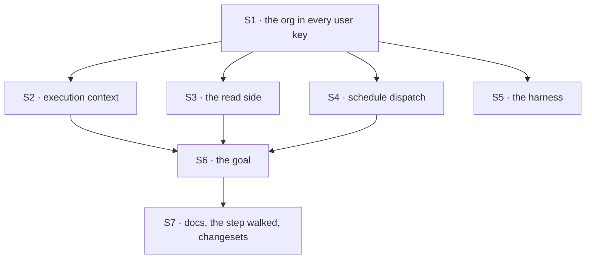

# FIX-1790 · Plan

[Spec](SPEC.md) · [Decisions](DECISIONS.md) · [Rules](BUSINESS-RULES.md) · **Plan** · [Docs](DOCS.md) · [Evolution](EVOLUTION.md)

Written for the implementing agent. IDs cross-reference [BUSINESS-RULES.md](BUSINESS-RULES.md)
(BR-n), [DECISIONS.md](DECISIONS.md) (D-n) and the epic's rules (ER-n). `tdd`. One PR, because
S1's required org argument breaks every caller in S2 to S5 at compile time, so they can't merge
green apart, the goal lands with what makes it pass, and docs move with the code (ER-25). It merges
before FIX-1788 and FIX-1793 ship anything user-scoped (epic PLAN → coordination seams), and its
build waits on FIX-1787's merge-first rows (ER-23).

## Surfaces

| ID | Package · role | Change | Rules |
|---|---|---|---|
| S1 | `engine` · the key derivation (`stores/scope-keys.ts`) | Every user key takes the org ([pinned names](#pinned-names)), each part through the existing escaping; the pin no longer chooses it. The exported helpers take the org as a required argument and throw on one `isValidOrgId` rejects. Org and session keys untouched. The header comment becomes one account, FIX-1538's paragraph folded in | BR-1–BR-7, BR-9 |
| S2 | `engine` · execution context | Hand the admitted org to S1 for the scope record, both resource paths and the collection cell. No new read | BR-1–BR-5, BR-8, BR-11 |
| S3 | `engine` · the read side | `getPersistedData`'s user branch and the state route's scope-record read take the session's stored org. A session with no org reads no user data. `toIsolationFlow` stops forwarding the pin for keys | BR-9, BR-10 |
| S4 | `scheduled` + `vercel` + `bullmq` · every schedule dispatch | The dispatch names the org: the default schedule id parser, the dispatch route's id validator, the Vercel tick's URL and the BullMQ job's data and URL change together. The validator admits every id `isValidOrgId` admits, the default org's `__fsd_default_org__` included, and the length the org adds; today's lowercase 128-character pattern rejects both. The resolver reads the named org's cell and returns `null` unless the stored row names the same org (and the pin's, on a pinned seat). An id with no org returns `null` | BR-12, BR-19 |
| S5 | `testing` · the harness seeders | `createTestContext` and `testFlow` seed user state and resources through the engine's derivation with `orgId ?? DEFAULT_ORG_ID`, the org the run uses | BR-13 |
| S6 | `goals/user-scope/` · the goal | One model-free goal, three legs and two controls ([Checks](#checks) VG) | Goal |
| S7 | Docs | Publish [DOCS.md](DOCS.md). Internal: `docs/architecture/state-and-scopes.md` (cross-flow section; "The owner-pinned cell" becomes the per-org user cell for every flow), BP-027's second bullet, `packages/engine/README.md`'s scope-key section, `packages/scheduled/README.md`'s hand-written resolver. `minor` changesets for `engine`, `scheduled`, `vercel`, `bullmq`, `testing`, each carrying the upgrade note | ER-25 |

**Removed:** the pin branch in the key derivation; the persistence page's hired-seats upgrade
section, which the new step subsumes; the docs passages saying seats and app flows never share a
person's data. [EVOLUTION.md](EVOLUTION.md) has what is amended.

## Sequence



## Checks

| ID | Runs after | Passes when |
|---|---|---|
| V1 | S1 | Key table: shared and flow-isolated keys have the pinned shapes; a pinned seat's shared key equals today's string exactly; every org and session key equals today's. A missing, blank or lone-surrogate org throws from every exported helper. A collision table carried over from `poc/key-shape/` (ids with `:`, `\`, `~org`) is all distinct and disjoint from the one- and two-part legacy forms |
| V2 | S2 | BR-1–BR-5, BR-8, BR-11 through real runs: two orgs, two people, user state, a shared and a flow-isolated resource, a two-flow pair sharing one resource, a pinned seat, a cross-flow child |
| V3 | S3 | BR-10: the state route, a user resource read and the debug snapshot each return what the run wrote, and not a value planted in another org's cell or the old cell. BR-9: a stored session with no org reads no user data |
| V4 | S2 | BR-15: values planted in a person's old one-part and two-part cells before a run are read by no org, and are still there, unchanged, after it |
| V5 | S4 | BR-12 for each dispatch producer (default parser, Vercel tick, BullMQ worker): a schedule a run saved fires for its org, including the default org and an org id with uppercase, `.` or `/`; the same row under another org's dispatch, a dispatch with no org, and a row in the old cell all resolve as missing; a user-owned seat's other-person check still holds. BR-19 |
| V6 | S5 | BR-13: a value seeded through each helper, with and without `orgId`, is what the run reads |
| V7 | S7 | The published step walked once on a SQLite file and once on Postgres (PGlite, as the adapter's own suite runs it), recorded in the PR. No SQL is published for a store it wasn't walked on; the filesystem and custom stores get the mapping in prose. Copied: a one-org person; a two-org person's flow-isolated cell whose flow ran in one org; a deletion marker with its collection; a user record, id rewritten. Stopped: that person's shared cell; a person with no sessions; a person whose remaining sessions name one org after their other org's session was deleted, with no records to vouch; a collection flow's isolated cell before owner attribution; a written destination, keys named. A schedule fires once after the index rebuild |
| VG | S6 | **Goal**: `pnpm tsx goals/user-scope/keeps-a-users-data-in-the-org-it-was-saved-in/run.mts` PASSES, model-free, real router, SQLite, per [SPEC.md](SPEC.md#the-goal-and-how-well-know-its-met) |
| VC | VG | `GOAL_CONTROL=cross-org-key` (S1 drops the org for an unpinned flow) FAILS leg b on Globex reading Alice's shared marker. `GOAL_CONTROL=fallback-read` (an empty cell reads the old one) FAILS leg c on the old marker reading in Globex. Both FAILs recorded in the goal's verdict log before the PASS |

D1 is proved by V4 and leg c; D2 by V7 and leg c.

## Pinned names

| Where | Name | Why pinned |
|---|---|---|
| Shared user key | `<person>:~org:<org>` | Persisted, byte-identical to FIX-1538's seat cell, and named by the operator step |
| Flow-isolated user key | `<person>:~org:<org>:<flow>` | Persisted and named by the step. The `~org` marker keeps it apart from every other form (`poc/key-shape/`) |
| Public helper | `resolveUserStorageKey(userId, orgId, flow)` | Public; the scheduled docs show it. Taking the org positionally makes an old call fail to compile and throw at runtime |
| Default dynamic schedule id | `<orgId>/<userId>/<key>` | Public: the guides, cloud scheduler jobs and the operator step name it |
| The goal | `goals/user-scope/keeps-a-users-data-in-the-org-it-was-saved-in/` | Cited by path |

How each part is escaped in the URL is yours, provided the default parser and both producers
change together and an org or user id containing `/` round-trips.

## Guardrails

| Rule | Because |
|---|---|
| The org comes from the admitted run or the stored session, never a header or body (BP-031). A schedule dispatch's org only selects a cell; the stored row must name the same one | A caller who could choose the org could choose whose org's data a person reads |
| Nothing reads a one-part or two-part user cell, not even to see whether it exists (D1) | An existence check is a read across orgs, and a store call on every run |
| Every user-key site passes the org into S1. Re-run `poc/key-sites/check.mjs` and update its table in the same PR (tenet 5) | Nine files touch user keys; one that keeps the old call reopens the leak silently |
| A missing org throws; it never defaults (ER-13) | A default would be the cross-org cell under a new name |
| Org and session keys stay byte-identical (BP-030) | They are not this issue's, and every deployment's org data would otherwise move |
| Test the second paths (BP-035): a pinned seat, a flow-isolated resource, a cross-flow child, an id with `:`, a session with no org, harness seeding, each schedule producer | Each is where the obvious change passes the happy path and still crosses orgs |

## Docs

Reconcile [DOCS.md](DOCS.md) against shipped behaviour after VG and V7 pass, then publish
through `docs-writer` and `docs-editor`. The step's SQL is the one V7 walked, on each of the two
stores. S7's internal
docs need no draft.

## Sketch · pseudocode, illustrative

```
user key for (person, org, flow, resource):
    require org                                          (throws if missing)
    if resource is isolated:   person : ~org : org : flow address    (new)
    else:                      person : ~org : org                    (today's seat cell, now everyone's)
```

**POC:** `poc/key-shape/` showed the two forms never equal a legacy key or each other, and that
dropping the marker collides (24,964 collisions). `poc/key-sites/` counted nine files touching
user keys and one with no org in hand, the schedule resolver, which S4 fixes. Both premises held;
nothing in the design moved.

## At implement time

- Re-run both POCs first. A changed count means a site moved since `fbecfe6f2`.
- 35 files read or write a raw user cell by literal scope. Besides the six source files above,
  they are tests and six goals' scripts (`flow-instances`, `task-board`, `harness-manager`,
  `devforce-lab` twice, `index-time-facets`). Each moves through the derivation; re-run each goal
  touched and append its verdict. None is a design question.
- FIX-1788 may be specced against this key in parallel. Nothing user-scoped of its ships before
  this merges.
- FIX-1538's note that the registry's schema check is stricter than needed for seats is moot:
  seats and app flows share a cell again, and the check is exactly right. It adds no boot
  failure at upgrade: the check already compares a pinned flow's shared user declarations with
  every other flow's today, pin-blind, so a deployment that boots now passes it after.
- Compare [EVOLUTION.md](EVOLUTION.md)'s predecessor rows with current code before building.

## Notes from review

Recorded verbatim for the implementer to weigh against real code; not folded into the design.

- **Slash-bearing schedule keys** (Codex, [thread](https://github.com/fixpoint-labs/flow-state-dev/pull/2810#discussion_r4199567317)):
  "When a schedule collection permits nested keys such as `daily/report`, this destructuring
  keeps only `daily`, so the resolver reads the wrong resource and the schedule 404s. It also
  cannot distinguish structural separators from `/` inside an org or user ID after the wildcard
  router decodes and rejoins segments (`packages/engine/src/routes/router.ts:343-365`) [...] Use
  a reversible component encoding and parse only the two structural separators while preserving
  the entire key remainder." The `scheduled.md` example in DOCS.md is to match what ships.
- **No detection for the silent-empty upgrade** (second look, item 3): "Either file it now as a
  sibling of this issue and gate FIX-1788 on it, or put a copy-paste smoke query in the step's
  doc, so an operator can see uncopied cells before they open the app. The changeset note alone
  is easy to miss." The step's first query already lists uncopied cells and can run at any time
  after the upgrade; whether the upgrade note leads with it is the implementer's call.
- **A host that builds its own dispatch** (second look, item 4): "A host that builds its own
  dispatch from the old two-part id still compiles, and the resolver returns `null`, so that
  schedule stops firing without an error. The upgrade note needs to list this."
- **Lift the site scan into CI** (Cursor, [thread](https://github.com/fixpoint-labs/flow-state-dev/pull/2810#discussion_r4199542427)):
  "Post-S1, consider lifting the scanner + allowed-set assertion into `packages/engine/test` (or a
  single shared manifest) so CI enforces totality without two frozen copies (`cell-sites` +
  `key-sites`) diverging over time."
- **Derivation sites vs raw literals** (Cursor, [thread](https://github.com/fixpoint-labs/flow-state-dev/pull/2810#discussion_r4199542349)):
  "align this 'nine files' inventory with PLAN's '35 literal scope_id' note — one sentence on
  derivation sites vs raw scope literals would save implementers maintaining two mental lists."
- **A dry-run step command** (Cursor, [thread](https://github.com/fixpoint-labs/flow-state-dev/pull/2810#discussion_r4199542402)):
  "even a dry-run CLI that only runs steps 1–2 (list + attribute) would shrink operator error
  without full copy logic in the framework."
- **The pin's removal owner** (second look): "give it a removal owner in the code comment, not
  only in the spec. Otherwise it becomes a permanent no-op field."
- **Workforce's copy of the org-key escaping** (second look): "If the implementer exports the
  escaping helper from the engine while in `scope-keys.ts`, that copy can be deleted. Otherwise,
  leave it alone." (`packages/workforce/src/clear-shadowed-references.ts`)
- **Spec shape** (Cursor, review summary items 3–5): DOCS.md as "a page checklist + acceptance
  bullets"; "BR tables state behavior only; link to PLAN § Checks"; V7 narrowed to "one
  attributed shared cell, one two-org `migration-required`, one schedule re-index". V7 keeps its
  matrix: it is the only proof of BR-16 to BR-20 before an operator runs the step on production
  data.

## Follow-ups

- A startup warning when a store still holds one- or two-part user cells. Needs a scope-id
  listing the store contracts don't have.
- A framework-shipped copy command, if D1's *what would change my mind* happens.
