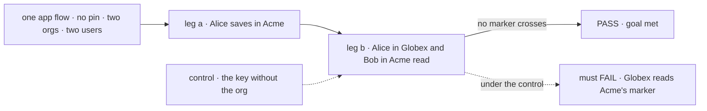
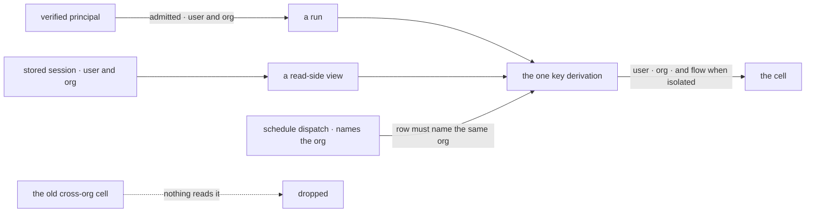

# FIX-1790 · A user's data is kept per org, for every flow

**Spec** · [Decisions](DECISIONS.md) · [Rules](BUSINESS-RULES.md) · [Plan](PLAN.md) · [Docs](DOCS.md) · [Evolution](EVOLUTION.md)

## Five people, before and after

| Someone who… | Today | After |
|---|---|---|
| **works in Acme and Globex** | Globex shows her the preferences, notes and private flow data she saved in Acme | Each org shows only what she saved there. Globex starts empty |
| **is about to get a private roster of workers** (FIX-1788) | Her workers would be user data, so one roster would show in both orgs | Her Acme roster is not her Globex roster |
| **uses a hired worker and the app's chat flow in one org** | The worker keeps its own per-org copy, the chat flow a cross-org one, and neither sees the other | Both use her one cell in that org, as any two flows sharing user data do |
| **saved user data before this release** | One cell, read in every org | Starts empty in every org: nothing reads the old cell, and nothing copies it ([epic D9](../../epics/FIX-1786/DECISIONS.md#d9)) |
| **sends a request with no org** | Refused since FIX-1442 | Still refused, never the cross-org cell |

Hired workers already keep a user's data per org ([FIX-1538](../FIX-1538/SPEC.md)). This does it
for every flow, so the epic can make workers and private projects user data without leaking them
between orgs ([epic ER-3](../../epics/FIX-1786/BUSINESS-RULES.md#what-a-team-gets-and-what-it-doesnt)).

## The goal, and how we'll know it's met

**A user who works in two orgs sees, in each, only what they saved there, in every flow.**

| Is it the right goal? | |
|---|---|
| **The real need** | The PRD: "what a user keeps in one org never appears in another", for every flow. The epic drops data stored before: nothing reads it in any org ([ER-3](../../epics/FIX-1786/BUSINESS-RULES.md#what-a-team-gets-and-what-it-doesnt), [epic D9](../../epics/FIX-1786/DECISIONS.md#d9)) |
| **Smaller, and rejected** | "The key carries the org." A one-line change that leaves a view, the schedule resolver or the test harness on the old cell |
| **Bigger, and not this issue's** | Workers and private projects as user data (FIX-1788, FIX-1793). Removing owner pins (FIX-1798) |
| **Not done if** | The check ran with one user or one org · only on a hired worker, whose cell already had the org · without user state or a flow-isolated resource |



The check reads what each caller gets back, not the keys. The dashed path leaves the org out of
the key, and it must fail.

| How we verify | |
|---|---|
| **Goal check** | `goals/user-scope/keeps-a-users-data-in-the-org-it-was-saved-in/` · model `n/a` · real HTTP router, SQLite · run by the implementer · verdict in the implementation PR |
| **Signal** | a: Alice's next Acme run reads back her user state, a shared and a flow-isolated resource. b: Alice in Globex and Bob in Acme read none of the three, by a run, the state route or the resource route |
| **Input** | An app flow with no pin, three markers, two orgs, two users. Other values, and ids with `:`, must pass too |
| **Anti-game** | No assertion on a key string, on a hired worker, or on a fixture that writes the new cell |
| **Control that must fail** | `GOAL_CONTROL=cross-org-key`: leg b FAILS on *Globex reads Alice's shared marker*. Today's `main` fails leg b |

## What changes


Red lines on the left are the leak. On the right every flow lands inside its org's box, and the
old cell is read by nothing.

**What a developer writes doesn't change**, except two public helpers that now take the org:

```diff
- resolveUserStorageKey(userId, { id: flow.id, isolateUserState: false, ownerPin })
+ resolveUserStorageKey(userId, orgId, { id: flow.id, isolateUserState: false })
  // a missing or blank orgId throws; it never returns the cross-org key

- POST /api/flows/notes/schedules/alice/daily/dispatch
+ POST /api/flows/notes/schedules/acme/alice/daily/dispatch   // a dynamic schedule's id names its org
```

## How a run finds its cell



The org comes from the run or the stored session, never a header or body.

## What stays as it is

- **Session and org keys**, byte for byte, and tenant handling.
- **A hired worker's shared cell**, already `<user>:~org:<org>`.
- **Org is never optional** (FIX-1442), and the registry's cross-flow schema check.
- **Owner pins** stay in the engine for admission, untouched and with no deprecation markers, until
  FIX-1798 removes them ([epic D9](../../epics/FIX-1786/DECISIONS.md#d9)).

## Sign off

**[The goal](#the-goal-and-how-well-know-its-met), at that size:** every flow, every view, user
state and both kinds of resource. If wrong: FIX-1788 builds private rosters on a key that still
crosses orgs somewhere.

**Withdrawn on 2026-10-07 by [epic D9](../../epics/FIX-1786/DECISIONS.md#d9):** [D1](DECISIONS.md#d1) and [D2](DECISIONS.md#d2), the
operator copy step and its attribution rule. Data saved before this release is dropped: each
user starts empty in each org, and nothing reads or copies the old cell.

**Open: none.** Reasoning and what lost: [DECISIONS.md](DECISIONS.md).
The cases: [BUSINESS-RULES.md](BUSINESS-RULES.md).

Feature · `engine` + `scheduled` + `vercel` + `bullmq` + `testing` + docs + one goal · medium · 1 PR · epic [FIX-1786](../../epics/FIX-1786/SPEC.md)
