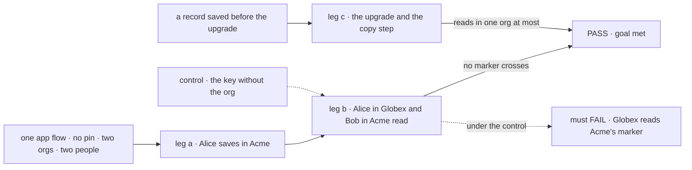
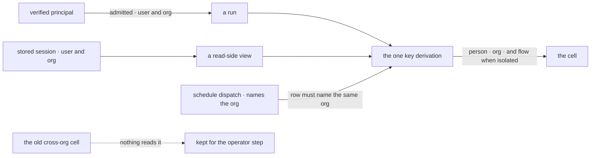

# FIX-1790 · A user's data is kept per org, for every flow

**Spec** · [Decisions](DECISIONS.md) · [Rules](BUSINESS-RULES.md) · [Plan](PLAN.md) · [Docs](DOCS.md) · [Evolution](EVOLUTION.md)

## Five people, before and after

| Someone who… | Today | After |
|---|---|---|
| **works in Acme and Globex** | Globex shows her the preferences, notes and private flow data she saved in Acme | Each org shows only what she saved there. Globex starts empty |
| **is about to get a private roster of workers** (FIX-1788) | Her workers would be user data, so one roster would show in both orgs | Her Acme roster is not her Globex roster |
| **uses a hired seat and the app's chat flow in one org** | The seat keeps its own per-org copy, the chat flow a cross-org one, and neither sees the other | Both use her one cell in that org, as any two flows sharing user data do |
| **upgrades a deployment with saved user data** | n/a | Each person starts empty until the operator runs a documented copy step, which copies a saved cell only into the one org its sessions name. Nothing is read across orgs or deleted |
| **sends a request with no org** | Refused since FIX-1442 | Still refused, never the cross-org cell |

Hired seats already keep a person's data per org ([FIX-1538](../FIX-1538/SPEC.md)). This does it
for every flow, so the epic can make workers and private projects user data without leaking them
between orgs ([epic ER-3](../../epics/FIX-1786/BUSINESS-RULES.md#what-a-team-gets-and-what-it-doesnt)).

## The goal, and how we'll know it's met

**A person who works in two orgs sees, in each, only what they saved there, in every flow; and
what they saved before the upgrade comes back in one org at most.**

| Is it the right goal? | |
|---|---|
| **The real need** | The PRD: "what a user keeps in one org never appears in another", for every flow, nothing deleted. The epic set "data stored before still reads" to "in one org at most, after an operator step" ([ER-3](../../epics/FIX-1786/BUSINESS-RULES.md#what-a-team-gets-and-what-it-doesnt)) |
| **Smaller, and rejected** | "The key carries the org." A one-line change that leaves a view, the schedule resolver or the test harness on the old cell |
| **Bigger, and not this issue's** | Workers and private projects as user data (FIX-1788, FIX-1793). Removing owner pins (FIX-1798) |
| **Not done if** | The check ran with one person or one org · only on a hired seat, whose cell already had the org · without a record from before the upgrade · without user state or a flow-isolated resource · the copy step's SQL was published for a store it was never walked on (SQLite and Postgres both) |



The check reads what each caller gets back, not the keys. The dashed path leaves the org out of
the key, and it must fail.

| How we verify | |
|---|---|
| **Goal check** | `goals/user-scope/keeps-a-users-data-in-the-org-it-was-saved-in/` · model `n/a` · real HTTP router, SQLite · run by the implementer · verdict in the implementation PR |
| **Signal** | a: Alice's next Acme run reads back her user state, a shared and a flow-isolated resource. b: Alice in Globex and Bob in Acme read none of the three, by a run, the state route or the resource route. c: an old marker reads in neither org after the upgrade; after the published step, a one-org person's reads in that org only and a two-org person's nowhere |
| **Input** | An app flow with no pin, three markers, two orgs, three people. Other values, and ids with `:`, must pass too |
| **Anti-game** | No assertion on a key string, on a hired seat, or on a fixture that writes the new cell. The step's statements are the published page's |
| **Control that must fail** | `GOAL_CONTROL=cross-org-key`: leg b FAILS on *Globex reads Alice's shared marker*. `GOAL_CONTROL=fallback-read`: leg c FAILS on *the old marker reads in Globex*. Today's `main` fails leg b |

## What changes


Red lines on the left are the leak. On the right every flow lands inside its org's box, and the
old cell is kept but read by nothing.

**What a developer writes doesn't change**, except two public helpers that now take the org:

```diff
- resolveUserStorageKey(userId, { id: flow.id, isolateUserState: false, ownerPin })
+ resolveUserStorageKey(userId, orgId, { id: flow.id, isolateUserState: false })
  // a missing or blank orgId throws; it never returns the cross-org key

- POST /api/flows/notes/schedules/alice/daily/dispatch
+ POST /api/flows/notes/schedules/acme/alice/daily/dispatch   // a dynamic schedule's id names its org
```

## How a run finds its cell



The org comes from the run or the stored session, never a header or body.

## What stays as it is

- **Session and org keys**, byte for byte, and tenant handling.
- **A hired seat's shared cell**, already `<person>:~org:<org>`.
- **Org is never optional** (FIX-1442), and the registry's cross-flow schema check.
- **Owner pins** stay in the engine for admission, deprecated; FIX-1798 removes them.

## Sign off

**[The goal](#the-goal-and-how-well-know-its-met), at that size:** every flow, every view, user
state and both kinds of resource, and old records in one org at most. If wrong: FIX-1788 builds
private rosters on a key that still crosses orgs somewhere.

1. **[D1](DECISIONS.md#d1) · Data saved before the upgrade is read by nothing until an operator
   copies it; until then each person starts empty in each org.** If wrong: a deployment that
   skips the step shows everyone empty preferences and collections, with no error.
2. **[D2](DECISIONS.md#d2) · The step copies a saved cell into an org only when every session that
   could have written it names that org, and the operator vouches none was deleted.** If wrong: a
   person who worked in two orgs, or whose sessions were deleted, gets their shared data back in
   neither, until someone decides by hand.

**Open: none.** D1 is the one to weigh. Reasoning and what lost: [DECISIONS.md](DECISIONS.md).
The cases: [BUSINESS-RULES.md](BUSINESS-RULES.md).

Feature · `engine` + `scheduled` + `vercel` + `bullmq` + `testing` + docs + one goal · medium · 1 PR · epic [FIX-1786](../../epics/FIX-1786/SPEC.md)
