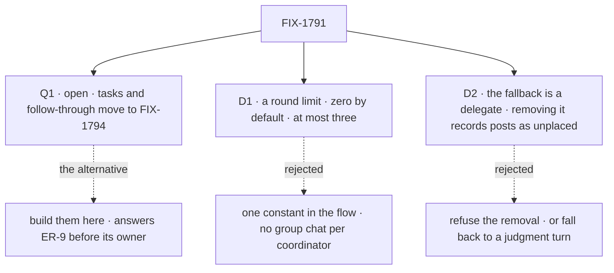

# FIX-1791 · Decisions

[Spec](SPEC.md) · **Decisions** · [Rules](BUSINESS-RULES.md) · [Plan](PLAN.md) · [Docs](DOCS.md) · [Evolution](EVOLUTION.md)

What was considered, what was chosen, why, and what each choice locks in. One open question and
two decisions are the sign-off surface. The model itself (delegates in session state, one roster
check for both paths, four policies, the chief of staff as a standard coordinator) is the PRD's
and the epic's, and is not reopened here.

## The tree

Solid edges are what you're signing. Dashed edges lost, and the label says why.

## Q1 · open · Do filing tasks for delegates, and hearing how they ended, move to FIX-1794?

**The fork.** Jake closed FIX-1774 into this issue and carried FIX-1780's follow-through here.
Should this issue build the task half too, or hand it to FIX-1794?

**In plain terms.** Two kinds of hand-off exist. A *post* goes to a delegate, who answers it in
its own conversation; that is this issue. A *task* goes on a board for a delegate to work, and the
coordinator is told when it finishes, fails or stops on a question; that is FIX-1774's legs d and
e and FIX-1780's notices and reassign. A task needs a board, and FIX-1794 decides how a board
whose rows go to a worker on another flow stays its own
([ER-9](../../epics/FIX-1786/BUSINESS-RULES.md#what-a-team-gets-and-what-it-doesnt)). Building
tasks here means answering that first, or building on the mailbox boards the epic removes.

**The trade-off.** Moving them: this issue ships posts, delegates and hiring, and a coordinator
can't file or follow a task until FIX-1794 lands. Keeping them: this issue grows by a board
design that is FIX-1794's to make, and FIX-1794 starts from a decision made without it.

**My recommendation: move them.** FIX-1794's PRD already reads "a task is assigned to a worker
picked from the coordinator's delegates", and follow-through rides the same board writes. Nothing
the chief of staff does today is lost: it files no tasks now. FIX-1774's leg d, starting a project
with its workstreams, goes to FIX-1793 for the same reason. Legs a to c, restated on posts and
delegates, stay here.

**What would change my mind.** The DevTeam dogfood needing the chief of staff to file and follow
coding tasks before FIX-1794 can land. Then this issue builds tasks for delegates on the
coordinator's own flow only, and leaves the cross-flow board to FIX-1794.

**If wrong.** Between this merging and FIX-1794 merging, a person can't ask the chief of staff to
file coding work and be told how it went. Reversible by a follow-up that moves the legs back.

It comes down to who owns the board question: building here decides ER-9 before its owner does.

## D1 · Answers go back out only within a round limit: zero unless a coordinator's configuration sets it, at most three

| | |
|---|---|
| **Instead of** | One constant in the coordinator flow, the same for every coordinator · or no setting at all, keeping "an answer wakes nobody" |
| **Because** | Zero keeps today's guarantee for every coordinator and every converted file, so nothing loops by surprise. A group chat is a choice made in the coordinator's own file, where its owner sees it. Each round hands each delegate the others' answers once, so a post costs at most delegates × (rounds + 1) turns, and three rounds caps that at four times a plain post |
| **Locks in** | `rounds:` is a public setting on a coordinator with a ceiling of three. Raising the ceiling later is cheap; lowering it breaks files that use it. A round is counted by the coordinator, never by anything an answer carries |

**What would change my mind:** a use case that needs more than three rounds, such as a debate
that has to converge. Then the ceiling rises, and cost per post is stated in the docs.

It comes down to who turns a group chat on: a constant turns it on for every coordinator or none.

## D2 · Best fit's fallback is one of the conversation's delegates; removing it leaves the posts it can't place recorded and told, never refused

| | |
|---|---|
| **Instead of** | (a) Refusing to remove the fallback delegate until another is set · (b) falling back to the coordinator's own judgment turn |
| **Because** | A person removing a delegate shouldn't be refused over a setting they may not know about. (b) puts a model turn with tools behind every best-fit coordinator, including one whose file says nothing about judging, and fails the same way when the model is down. Recording the post `unplaced` and telling the poster keeps the miss visible |
| **Locks in** | A best-fit conversation can have no fallback. Then a failed or unusable evaluator call leaves the post unanswered, recorded, and said in the conversation. The fallback starts from the configuration's and can be changed per conversation |

**What would change my mind:** posts going unplaced often in practice. Then a removal that clears
the fallback asks the person to pick a new one in the app, and the tool does the same.

It comes down to the removal: refusing it surprises a person over a setting they never chose.

## Decided, not asked

- **One flow, four policies.** The epic's [D2](../../epics/FIX-1786/DECISIONS.md#d2) asked this
  spec to check how far judgment diverges. The door, the delegates, the roster check, delivery,
  the answer record, the routing record and the rounds are shared. Only the pick differs:
  judgment is the same worker turn the built-in agent runs, plus the delegate tools; a fixed
  policy has no turn of its own. That is well under half the flow, so one flow holds.
- **Best fit keeps holding a follow-up** ([FIX-1610 D1](../FIX-1610/DECISIONS.md#d1)), with no
  model call. A holder that was removed or is off the roster holds nothing.
- **Delegates live in server-owned session state** (FIX-1788 S1), copied from the
  configuration's defaults on a conversation's first turn and never written back. The public
  create can't seed them ([ER-4](../../epics/FIX-1786/BUSINESS-RULES.md#what-a-team-gets-and-what-it-doesnt)).
- **One check, two questions kept apart.** The app's action and the coordinator's tool call one
  check: the worker is on this user's roster, its own or a standard one, and its flow can take a
  delegated post. FIX-1778's lookup still answers "is this a valid name"; it never authorizes.
  Another user's worker gets the same answer as a missing one.
- **Resolved live, once per post.** Each post reads the roster once (kept per request) and
  resolves each delegate then, never from a list built at start. A fired delegate is skipped and
  recorded; its entry stays until someone removes it.
- **A list holds at most 25 delegates**, and the delegate read returns the whole list. One place
  answers who is on a coordinator: that read, not `discover` (carried from FIX-1785).
- **Delivery** goes to the delegate's own conversation, one per coordinator conversation per
  delegate, linked by FIX-1788's check. It carries a token the answer hands back, and the round
  comes from the delivery record: the trust rule `seatAuthored` follows today.
- **Under judgment, an answer wakes the coordinator's own turn only while rounds remain.** At
  zero it lands in the conversation and the coordinator reads it on its next turn. D1's limit is
  the one setting.
- **The record** is a new pinned component, `coordinator-route`, with an evaluator of the same
  name. The mailbox's `mailbox-route` stays for FIX-1792 and FIX-1796.
- **A standard coordinator's defaults name standard workers only**, refused at load
  ([ER-6](../../epics/FIX-1786/BUSINESS-RULES.md#what-a-team-gets-and-what-it-doesnt)'s rule,
  which this flow is the first to carry). A delegate whose flow can't take a delegated post is
  refused when added, instead of never waking.
- **The chief of staff** runs on the coordinator flow with `routing: judgment`, its tools
  unchanged, first on each user's roster in Shift Manager.

## Considered and dropped

| Alternative | Why not |
|---|---|
| Two flows, a judging coordinator and a relay | The parts are shared; two copies put the roster check in two places (epic D2) |
| Extend the mailbox flow | The smaller goal; the epic removes the mailbox |
| Delegates in ordinary session state, checked at the door | The epic POC (O1) showed the public create seeds that state |
| Delegates in one resource per coordinator | A change would reach every conversation; the PRD keeps each conversation's own |
| In a round, every answer to every other delegate | Turns grow as delegates to the power of rounds; one delivery per delegate per round grows in a line |
| A transcript resource | Out of scope (the PRD); the conversation's own items are the transcript |

## How it got here

- **Draft** — framed as the epic's coordinator: one flow, delegates in server-owned session
  state, four policies, a round limit, one answer per delegate per round, a record per decision.
  Asks whether FIX-1774's task legs and FIX-1780's follow-through move to FIX-1794.

**Open: Q1.** No claim is settled or in flight.
