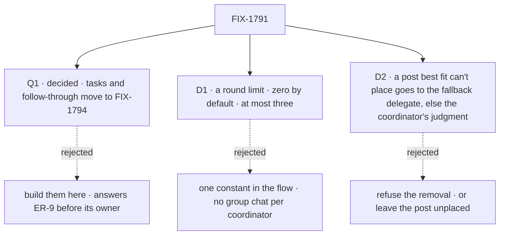

# FIX-1791 · Decisions

[Spec](SPEC.md) · **Decisions** · [Rules](BUSINESS-RULES.md) · [Plan](PLAN.md) · [Docs](DOCS.md) · [Evolution](EVOLUTION.md)

What was considered, what was chosen, why, and what each choice locks in. Three calls are the
sign-off surface, all decided: Jake answered Q1 on 2026-10-06. The model itself (delegates in
session state, one roster
check for both paths, four policies, the chief of staff as a standard coordinator) is the PRD's
and the epic's, and is not reopened here.

## The tree

Solid edges are what you're signing. Dashed edges lost, and the label says why.

## Q1 · decided · Filing tasks for delegates, and hearing how they ended, move to FIX-1794

**Jake, 2026-10-06:** "yes to all recommendations": they move to FIX-1794. This issue builds
posts, delegates and hiring only.

**The fork.** Jake closed FIX-1774 into this issue and carried FIX-1780's follow-through here.
Should this issue build the task half too, or hand it to FIX-1794?

**In plain terms.** Two kinds of hand-off exist. A *post* goes to a delegate, who answers it in
its own conversation; that is this issue. A *task* goes on a board for a delegate to work, and the
coordinator is told when it finishes, fails or stops on a question; that is FIX-1774's leg e and
FIX-1780's notices and reassign. A task needs a board, and FIX-1794 decides how a board
whose rows go to a worker on another flow stays its own
([ER-9](../../epics/FIX-1786/BUSINESS-RULES.md#what-a-team-gets-and-what-it-doesnt)). Building
tasks here means answering that first, or building on the mailbox boards the epic removes.

**The trade-off.** Moving them: this issue ships posts, delegates and hiring, and a coordinator
can't file or follow a task until FIX-1794 lands. Keeping them: this issue grows by a board
design that is FIX-1794's to make, and FIX-1794 starts from a decision made without it.

**My recommendation, taken: move them.** FIX-1794's PRD already reads "a task is assigned to a worker
picked from the coordinator's delegates", and follow-through rides the same board writes. Nothing
the chief of staff does today is lost: it files no tasks now. FIX-1774's leg d, starting a project
with its workstreams, goes to FIX-1793 for the same reason. Legs a to c, restated on posts and
delegates, stay here.

**What would change my mind.** The DevTeam dogfood needing the chief of staff to file and follow
coding tasks before FIX-1794 can land. Then this issue builds tasks for delegates on the
coordinator's own flow only, and leaves the cross-flow board to FIX-1794.

**If wrong.** Between this merging and FIX-1794 merging, a user can't ask the chief of staff to
file coding work and be told how it went. Reversible by a follow-up that moves the legs back.

It comes down to who owns the board question: building here decides ER-9 before its owner does.

## D1 · Answers go back out only within a round limit: zero unless a coordinator's configuration sets it, at most three

| | |
|---|---|
| **Instead of** | One constant in the coordinator flow, the same for every coordinator · or no setting at all, keeping "an answer wakes nobody" |
| **Because** | Zero keeps today's guarantee for every coordinator and every converted file, so nothing loops by surprise. A group chat is a choice made in the coordinator's own file, where its owner sees it. A delegate gets at most one delivery per post per round, under every policy, so a post costs at most delegates × (rounds + 1) delegate turns: four times a plain post at three rounds, and 100 at the caps of 25 delegates and three rounds. Under judgment the coordinator adds at most rounds + 1 turns of its own, and under best fit each round adds at most one evaluator call |
| **Locks in** | `rounds:` is a public setting on a coordinator with a ceiling of three. Raising the ceiling later is cheap; lowering it breaks files that use it. A round is counted by the coordinator, never by anything an answer or a hand-off carries. A round closes when each of its deliveries is answered or failed, or at a deadline, so one silent delegate can't hold the rest |

**What would change my mind:** a use case that needs more than three rounds, such as a debate
that has to converge. Then the ceiling rises, and cost per post is stated in the docs.

It comes down to who turns a group chat on: a constant turns it on for every coordinator or none.

## D2 · A post best fit can't place goes to the fallback delegate if one is set, otherwise to the coordinator's own judgment turn; removing the fallback is never refused

| | |
|---|---|
| **Instead of** | (a) Refusing to remove the fallback delegate until another is set · (b) with no fallback delegate, leaving the post unanswered, recorded `unplaced` and told (this card's answer as merged) |
| **Because** | A user removing a delegate shouldn't be refused over a setting they may not know about. A coordinator is the flow built for routing: an evaluator classifies first, and the flow acts as an agent only when no obvious path exists (the product owner, 2026-10-06, epic [D8](../../epics/FIX-1786/DECISIONS.md#d8)). So best fit's miss goes to the same judgment turn the `judgment` policy runs (BR-12), not to nobody. A configured fallback delegate still wins, so a file that names one routes as before |
| **Locks in** | A best-fit conversation can have no fallback delegate. Then a failed or unusable evaluator call wakes the coordinator's own turn, recorded `by: judgment`; only when that turn fails too is the post `unplaced`, recorded and said in the conversation. The price is a model turn with tools behind each such miss. The fallback starts from the configuration's and is set or cleared per conversation with `setFallback`, in the app or through the tool |

**What would change my mind:** judgment turns on misses costing more than the answers they give.
Then a miss with no fallback delegate goes `unplaced` again, as merged.

It comes down to the post: with judgment behind the evaluator, a miss still gets an answer.

## Decided, not asked

- **One flow, four policies.** The epic's [D2](../../epics/FIX-1786/DECISIONS.md#d2) asked this
  spec to check how far judgment diverges. The door, the delegates, the roster check, delivery,
  the answer record, the routing record and the rounds are shared. Only the pick differs:
  judgment is the same worker turn the built-in agent runs, plus the delegate tools; a fixed
  policy has no turn of its own. That is well under half the flow, so one flow holds.
- **Best fit keeps holding a follow-up** ([FIX-1610 D1](../FIX-1610/DECISIONS.md#d1)), with no
  model call. A holder that was removed or is off the roster holds nothing. The hold is about a
  user's posts: an answer routed again between rounds makes its one evaluator call.
- **Best fit's ladder is extracted, not copied.** Hold, one call, fallback, and now `unplaced`
  become one shared helper that the mailbox's route and this policy both call, so a fix reaches
  both. FIX-1796's sweep removes the mailbox caller. Where the helper finds no taker, the
  coordinator runs its judgment turn before `unplaced` ([D2](#d2)); the mailbox's route keeps its end.
- **Delegates live in server-written session state** (FIX-1788 S1 and BR-18a; epic
  [D3](../../epics/FIX-1786/DECISIONS.md#d3) *Locks in* (3)), copied from the configuration's
  defaults the first time a conversation's delegates are read or changed, and never written back.
  The public create can't seed them
  ([ER-4](../../epics/FIX-1786/BUSINESS-RULES.md#what-a-team-gets-and-what-it-doesnt), FIX-1788
  BR-15).
- **Four named actions, on any coordinator conversation.** `addDelegate`, `removeDelegate`,
  `setFallback` and `listDelegates`, sent with the public client on the session
  `ensureWorkerSession` returns, and the same four as the coordinator's tools. Every session on a
  worker flow is linked to its worker at create, server-only (epic D3; FIX-1788 BR-10), so they
  work on any coordinator conversation. No action names or sets a worker. BR-1a stays as a guard.
- **One check, two questions kept apart.** Every add and every delivery, from the app or the
  tool, passes one check: the worker is on this user's roster, its own or a standard one, and its
  flow can take a delegated post. Removing a delegate or naming the fallback checks only that
  the worker is on this conversation's list, so a fired delegate can still be removed. FIX-1778's
  lookup still answers "is this a valid name"; it never authorizes. Another user's worker gets
  the same answer as a missing one.
- **Resolved live, once per post.** Each post reads the roster once (kept per request) and
  resolves each delegate then, never from a list built at start. A fired delegate is skipped and
  recorded; its entry stays until someone removes it.
- **A list holds at most 25 delegates**, and the delegate read returns the whole list. One place
  answers who is on a coordinator: that read, not `discover` (carried from FIX-1785).
- **Delivery** goes to the delegate's own conversation, one per coordinator conversation per
  delegate. The first delivery opens it through FIX-1788's
  `ensureWorkerSession({ worker, filingSessionId })`, with the delegate named, so the server
  checks and links it at create; it never posts to a fresh id. `filingSessionId` is the
  criteria key FIX-1788 reserved for this spec to name: it enters the derived id and the lookup,
  so two conversations never share a delegate's session. It carries a token the answer hands back, and the round
  comes from the delivery record: the trust rule `seatAuthored` follows today.
- **One delivery ledger, defined once in Workforce.** A record per post, round and delegate
  record (a worker plus an optional target the caller resolves), `pending` then `delivered` or `failed`, with a token and an answer claimed once. The
  coordinator keeps its records in server-written session state; FIX-1793's project coordinators
  reuse the same module. The `room-deliveries` and mailbox ledgers aren't ported: they go with
  their owners, FIX-1793 and FIX-1792.
- **A round closes** when each of its deliveries is answered or failed, or when its deadline
  passes. An answer that arrives after that still lands once and routes nowhere.
- **Under judgment, a round's answers wake the coordinator's own turn once, when the round
  closes, and only while rounds remain.** Its hand-offs in that wake are the next round's, at
  most one per delegate; a hand-off carries no round of its own. At zero, answers land in the
  conversation and the coordinator reads them on its next turn. D1's limit is the one setting.
- **Round robin stays in scope**: the PRD names four policies. If the schedule slips, it is the
  first cut, and leg e loses its round-robin step.
- **The record** is a new pinned component, `coordinator-route`, with an evaluator of the same
  name. The mailbox's `mailbox-route` stays for FIX-1792 and FIX-1796.
- **A standard coordinator's defaults name standard workers only**, refused at load
  ([ER-6](../../epics/FIX-1786/BUSINESS-RULES.md#what-a-team-gets-and-what-it-doesnt)'s rule,
  which this flow is the first to carry). A delegate whose flow can't take a delegated post is
  refused when added, instead of never waking.
- **The chief of staff** runs on the coordinator flow with `routing: judgment`, its tools
  unchanged, first on each user's roster in Shift Manager.

## Considered and dropped

| Alternative | Why not |
|---|---|
| Two flows, a judging coordinator and a relay | The parts are shared; two copies put the roster check in two places (epic D2) |
| Extend the mailbox flow | The smaller goal; the epic removes the mailbox |
| Delegates in ordinary session state, checked at the door | The epic POC (O1) showed the public create seeds that state |
| Delegates in one resource per coordinator | A change would reach every conversation; the PRD keeps each conversation's own |
| In a round, every answer to every other delegate | Turns grow as delegates to the power of rounds; one delivery per delegate per round grows in a line |
| A transcript resource | Out of scope (the PRD); the conversation's own items are the transcript |
| A delivery ledger local to the coordinator | A third copy after `room-deliveries` and the mailbox's, and FIX-1793 needs the same one |
| Port `routeByPurpose`'s ladder as a copy | A fix in one copy misses the other until FIX-1796 |
| One `delegates` action with a mode | Four named actions read as the typed client's methods, and the fallback gets its own |
| Under judgment, each answer wakes the coordinator | Each wake can hand off to every delegate, so turns grow as delegates to the power of rounds |

## How it got here

- **Draft** — framed as the epic's coordinator: one flow, delegates in server-written session
  state, four policies, a round limit, one answer per delegate per round, a record per decision.
  Asks whether FIX-1774's task legs and FIX-1780's follow-through move to FIX-1794.
- **Review round 1** — rounds made bounded under every policy: judgment wakes once per round
  and its hand-offs take the next round, and a round closes at a deadline when a delegate goes
  silent, because as drafted a judgment hand-off had no round and one failed delegate held an
  everyone round open. The delivery ledger and best fit's ladder became shared rather than
  copied, the one `delegates` action became four with `setFallback`, removal stopped requiring
  the roster, and judgment moved into the first PR ahead of round robin, everyone and rounds.
- **Merged** in #2815 at its round-1 head; this amendment carries round two.
- **Review round 2, amendment 1** — aligned to FIX-1788's amendment (#2818): the worker link is
  set at create, so the four actions work on any coordinator conversation, and the example opens
  the conversation with `ensureWorkerSession` and sends on `session.flowKind`. A delegate's
  session opens through `ensureWorkerSession` with the delegate named and the pinned
  `filingSessionId` key (BR-20a). Shift Manager's private lab wrapper is gone from every
  example.
- **Amendment 2, the gate's answers** — Jake took Q1's recommendation on 2026-10-06: filing tasks
  for delegates and following them through move to FIX-1794. SPEC, PLAN and EVOLUTION state it as
  decided.
- **Amendment 3, carried on the epic's #2837** — the product owner's direction (2026-10-06, epic
  [D8](../../epics/FIX-1786/DECISIONS.md#d8)): a coordinator is evaluator first, its own judgment
  as the fallback. D2 now sends a best-fit miss with no fallback delegate to the judgment turn
  (BR-16, BR-16a); a configured fallback delegate still wins.

**Open: none.** No claim is settled or in flight.
