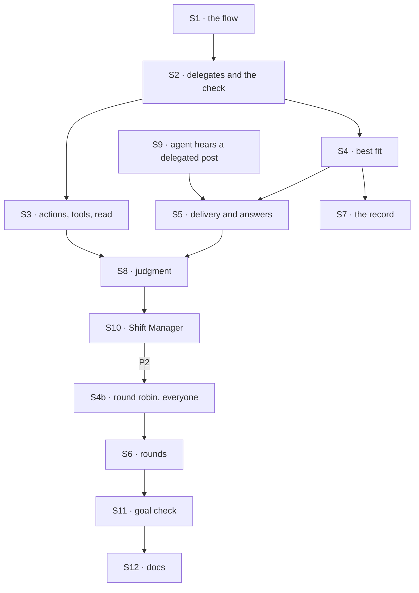

# FIX-1791 · Plan

[Spec](SPEC.md) · [Decisions](DECISIONS.md) · [Rules](BUSINESS-RULES.md) · **Plan** · [Docs](DOCS.md) · [Evolution](EVOLUTION.md)

Written for the implementing agent. IDs cross-reference [BUSINESS-RULES.md](BUSINESS-RULES.md)
(BR-n) and [DECISIONS.md](DECISIONS.md). `tdd`. Three PRs, a GitHub stack (epic ER-26). Builds
start only after FIX-1788 merges (server-written session state, the worker collection, the link at create, `ensureWorkerSession`;
epic D4, ER-23). A failure in FIX-1797's early leg-c run on that commit blocks these PRs from
merging (ER-30).

## Surfaces

| ID | Package · role | Change | Rules |
|---|---|---|---|
| S1 | `workforce` · the coordinator flow | One singleton worker flow, id `coordinator`, on the installation's list of worker flows like `agent` ([epic Q1](../../epics/FIX-1786/DECISIONS.md#q1)), with no declaration shape or wrapper of its own. Its configuration composes `workerConfigSchema()` with `delegates`, `routing`, `fallback`, `rounds`; checked when saved and at load | BR-11 BR-26 |
| S2 | `workforce` · delegates and the check | The server-written session state (FIX-1788 S1, BR-18a): the list of delegate records (a worker, an optional note, an optional target the caller resolves), the fallback, the round-robin cursor, the best-fit hold. The create refuses it from a caller (FIX-1788 BR-15). Defaults, which may be empty, copied the first time a conversation's delegates are read or changed. Uniqueness and the cap go by the record, not the bare worker. Changes as one versioned write that recomputes on retry. The one check, for adds and deliveries, on the record's worker: on the session user's roster (FIX-1788's worker collection or the standard projection, read by id, not listed), its flow can take a delegated post, under the cap. Remove and set-fallback check membership in the list only | BR-1–BR-9 BR-1a BR-6a BR-31 |
| S3 | `workforce` · the two paths and the read | Four public actions, `addDelegate`, `removeDelegate`, `setFallback`, `listDelegates`, on any coordinator conversation (each is linked to its worker at create, FIX-1788 S1; BR-1a guards the rest), and a capability giving the coordinator's turn the same four as tools. Both call S2; neither touches state itself | BR-1a BR-2 BR-3 BR-5 BR-6 BR-6a BR-10 BR-32 |
| S4 | `workforce` · best fit | The ladder (hold, one call, fallback, with `unplaced` added) extracted from `routeByPurpose` into one shared helper outside the mailbox folder; the mailbox's route and this policy both call it. One roster read per post, kept per request | BR-13–BR-16 BR-19 |
| S4b | `workforce` · round robin and everyone | The other two fixed policies, behind the same pick step as best fit | BR-17 BR-18 |
| S5 | `workforce` · delivery and answers | The ledger delivers into a session its caller resolves from the delegate record; that is its one session rule. The coordinator's records have no target, and it resolves each pick's conversation through FIX-1788's `ensureWorkerSession({ worker: <delegate>, coordinatorSessionId: <this conversation's id> })` on the session's user, the worker from this code, so the server checks and links it at create and each coordinator conversation gets one session per delegate. FIX-1793's project coordinator passes the workstream's existing session, resolved from the record's target, also linked at create. Never post to a fresh id (FIX-1788 BR-14, BR-18a). Dispatch to the resolved session's `flowKind`. One delivery ledger, defined once in Workforce for FIX-1793 to reuse: a record per (post, round, delegate record), `pending` then `delivered` or `failed`, with a token, and an answer claimed once. The coordinator keeps its records in server-written session state. An internal answer action that claims once per delivery | BR-20–BR-22 BR-20a BR-27 |
| S6 | `workforce` · rounds | A round closes when its deliveries are answered or failed, or at its deadline. Below the limit, best fit and round robin route each answer again, never to its author; everyone sends each delegate the others' answers at close, in one delivery; judgment wakes the coordinator once per closed round, its hand-offs taking the next round | BR-23–BR-25 BR-24a BR-24b |
| S7 | `workforce` · the record | One `coordinator-route` item per decision, the evaluator named the same | BR-28 BR-29 |
| S8 | `workforce` · judgment | The pick step runs the built-in agent's worker turn, shared rather than copied, with S3's tools and a hand-off tool. At `rounds: 0`, an answer wakes nothing | BR-12 BR-23 |
| S9 | `workforce` · the built-in agent hears a delegated post | An internal entry that answers into the delivering coordinator with the token. An app flow declares the same entry to be a delegate | BR-4 BR-20 |
| S10 | `shift-manager` · the chief of staff and the view | Its `WORKER.md` moves to `flow: coordinator`, `routing: judgment`, default delegates from the install's standard workers; first on the roster; a delegates panel (list, add from roster, remove); records rendered apart from lines. Its `agent` wiring is **removed** | BR-33 BR-34 |
| S11 | `goals/coordinators/hands-each-post-to-its-delegates/` | The goal check and its three controls, per [SPEC.md](SPEC.md#the-goal-and-how-well-know-its-met) | goal |
| S12 | Docs | [DOCS.md](DOCS.md); the `workforce` README; a `minor` changeset for `workforce` | — |

## Sequence · the PR plan

The product's path first: P1 proves legs a to d and f at `rounds: 0`; P2 adds what only leg e
needs.

| PR | Delivers | Depends on |
|---|---|---|
| P1 · delegates, best fit, judgment and the chief of staff | S1–S5, S7–S10 at `rounds: 0`; proved on a goal-local tree with a scripted model and evaluator | FIX-1788 merged |
| P2 · round robin, everyone and rounds | S4b, S6. Round robin is the first cut if the schedule slips | P1 |
| P3 · the goal and the docs | S11, S12, VG | P2 |



## Checks

| ID | Runs after | Passes when |
|---|---|---|
| V1 | S1 | BR-11, BR-26; a configuration with no `routing` means judgment, with no `rounds` means zero |
| V2 | S2 S3 | BR-1–BR-10, BR-1a, BR-6a through the actions and the tools alike; BR-6 on a delegate fired after it was added; BR-5 with one worker on two records with different targets (both land) and the same record twice (refused); BR-7 with two changes in flight; BR-8 on the real create route; BR-3 with two users, one answer for Bob's worker and a missing one |
| V3 | S4 S4b | BR-13–BR-16 and BR-19 on a scripted evaluator, BR-14 after the holder is removed (P1); BR-17, BR-18 (P2) |
| V4 | S5 | BR-20–BR-22; BR-20a with two conversations delivering to one delegate (two sessions, each linked at create) and a second delivery in one (the same session); BR-21 by replaying a fan-out and resending an answer; BR-31 by firing a delegate between pick and delivery |
| V5 | S6 | BR-23–BR-25 under all three fixed policies and judgment; BR-24a with a scripted model handing off twice to one delegate in one wake, and none at round *n*; BR-24b with one of two delegates failing its turn: the round closes at its deadline and the other's answer goes on; BR-27 with a forged round on a post, an answer and a hand-off |
| V6 | S7 | BR-28 for every `by`; BR-29 in Shift Manager's renderer |
| V7 | S8 | BR-12 on a scripted model: a hand-off, an answer of its own, no wake at zero |
| V8 | S10 | BR-33, BR-34; the chief of staff's old tools still run |
| VG | P3 | [The goal](SPEC.md#the-goal-and-how-well-know-its-met): `goals/coordinators/hands-each-post-to-its-delegates/run.mts` PASSES, after the same run FAILED leg f under `no-roster-check`, leg e under `no-round-limit`, leg d under `no-delegate-read`, and every leg on today's `main` |

One check per decision: D1 by V5, D2 by V3 and V2's BR-6a, Q1 by VG's legs. The second path
(BP-035): a replayed fan-out and a resent answer (V4), a fired delegate (V4, BR-9) and removing
one (V2), a silent delegate (V5), a forged field (V5), two users (V2, VG), the off state of
rounds (V5).

## Pinned names

| Where | Name | Why pinned |
|---|---|---|
| The flow | `coordinator` | Public; `flow:` names it |
| Configuration keys | `delegates`, `routing` (`judgment`, `best-fit`, `round-robin`, `everyone`), `fallback`, `rounds` | Public; FIX-1792 converts files to them |
| The record and its evaluator | `coordinator-route` | A client tells a record from a line by it; a scripted model resolves the evaluator by it |
| The actions | `addDelegate`, `removeDelegate`, `setFallback`, `listDelegates` | Public; an app sends them with `createClient({ flowKind: session.flowKind, userId }).sendAction(...)`. Signatures are yours |
| The criteria key | `coordinatorSessionId`, on FIX-1788's `ensureWorkerSession` and `findWorkerSession` criteria | FIX-1788 S5a reserved it for this spec to name. It enters the derived id and the lookup, so each coordinator conversation gets one session per delegate |
| The delivery ledger | `delivery-ledger`, a Workforce module | FIX-1793 reuses it by name; not a public export |

Everything else is yours to name, in the new terms (delegate, roster, flow; not member, seat or mailbox).

## Guardrails

| Rule | Because |
|---|---|
| Every add and every delivery goes through S2's one check (tenet 5); remove and set-fallback check the list | A check on the action alone is open through the tool; a roster check on removal strands a fired delegate (BR-6) |
| A delegate is resolved when a post arrives, never from a list built at start | A hire or fire must reach the next post with no restart (FIX-1779 lesson 1) |
| The round, the author and the token come from the delivery record, and a judgment hand-off's round from its wake (BP-031, ER-17) | An answer or hand-off that names its own round can loop forever |
| Best fit's ladder and the delivery ledger are shared modules, not copies | A fix in one copy misses the other |
| No task filing or follow-through in this issue until [Q1](DECISIONS.md#q1) is answered | The plan assumes FIX-1794 takes them |
| The delegate list grants nothing; delivery re-reads the roster and FIX-1788 links | Access is the user's resource, never session state |
| No Layer 1 change; server-written state is FIX-1788's (ER-22) | If S2 or S5 needs one, stop and take it to the epic |
| Nothing new builds on the mailbox flow | FIX-1792's conversion must not grow |

## Docs

Reconcile and publish [DOCS.md](DOCS.md) in P3, after V1 to V8 pass, against the shipped refusal
wording and the tool names.

## Sketch · pseudocode, illustrative, react to the shape

```
on a post at the coordinator's door:
    picks ← the session's policy over its delegates, each checked live   ← one roster read
    record the decision
    for each pick:
        s ← ensureWorkerSession({ worker: pick.worker, coordinatorSessionId })   ← the caller resolves; linked at create
        deliver (post, round 0, pick) to s with a token                          ← keyed by the record
on an answer with a token:
    claim the delivery once, or drop it
    land it as the delegate's line
    best fit, round robin: if its round < rounds, route it again, round + 1, never to its author
when a round closes (each delivery answered or failed, or its deadline):
    everyone: if round < rounds, each delegate gets the others' answers, round + 1
    judgment: if round < rounds, wake the coordinator once; its hand-offs are round + 1
```

**POC:** none. The link and server-written state are FIX-1788's, proved by the epic's
[POC](../../epics/FIX-1786/poc/singleton-worker-link/README.md); the policies port code on `main`.
No counted fact carries the design, so no checker.

## At implement time

- The round deadline's value is yours; DOCS states it.
- **Read this spec's Q1 answer.** If tasks stay here, add them on the coordinator's own flow only,
  and leave the cross-flow board to FIX-1794.
- Take FIX-1788's shipped names for S1 and the link. If FIX-1789's door can carry a delegated
  post and its answer, use it in S9 instead of a second entry.
- No org-scoped mailbox or room path landed from FIX-1779 (canceled); rooms are FIX-1793's.
- Old-term exports left for FIX-1796: `defineMailboxFlow`, `mailboxFlow`, `MAILBOX_KIND`,
  `routeByPurpose`, `wakeMemberSeats`, `MAILBOX_ROUTE_COMPONENT`, `MAILBOX_ROUTE_EVALUATOR`,
  `mailboxPostCapability`, `MailboxNotifyInput`.

## Notes from review

Recorded verbatim for the implementer to weigh against real code; not folded into the design.

- **Split S2's module** (Cursor, [thread](https://github.com/fixpoint-labs/flow-state-dev/pull/2815#discussion_r4199956806)):
  "This row packs five server-owned subsystems into 'one module.' Consider splitting in the plan
  table (mirroring `mailbox-route.ts` vs `mailbox-flow.ts`): `coordinator-delegates`
  (list/cap/versioned writes), `coordinator-check` (single authorize for action + tool),
  `coordinator-route` (ledger + record emit, fork from `mailbox-route`), `coordinator-deliveries`
  (token claim, fork from `talk.ts`). Same behavior, less risk of a second 2k-line file." The
  epic's engineering owner asked for those four submodules, as shared modules, not copies.
- **One eligibility snapshot per post** (Cursor, [thread](https://github.com/fixpoint-labs/flow-state-dev/pull/2815#discussion_r4199956817)):
  "implement S4's 'one roster read per post' as a **single eligibility snapshot** reused for
  pick, deliver, and BR-28 rows — avoids N+1 per delegate on `everyone` fan-out."
- **Name the pick interface** (second look, [comment](https://github.com/fixpoint-labs/flow-state-dev/pull/2815#issuecomment-6024502335)):
  "Naming it in PLAN ('pick: (post, delegates, state) → picks + `by`') would stop S4 and S8 from
  growing different shapes. BR-28's `by` enum already implies it."
- **The optional note** (Cursor, [review](https://github.com/fixpoint-labs/flow-state-dev/pull/2815#pullrequestreview-5434018627)):
  "Adds nullable surface for best-fit beyond worker `description`. **Possible v1 cut:**
  descriptions only; per-conversation notes when dogfood demands runtime retargeting without
  re-hire. Uncertain — only if you want a thinner first ship."
- **BR-7 and S2's retry** (second look, [comment](https://github.com/fixpoint-labs/flow-state-dev/pull/2815#issuecomment-6024502335)): "BR-7 (both
  changes land or one is refused as stale) and S2 (recompute on retry) read slightly
  differently. 'Both land' is the stronger promise; make sure the check asserts that one."
- **Who sees `unplaced`** (second look, [comment](https://github.com/fixpoint-labs/flow-state-dev/pull/2815#issuecomment-6024502335)): "D2 and
  BR-16: a post that goes `unplaced` is 'said in the conversation'. It would help to say who can
  see that line when the post came in through the app and not a client that renders records."

## Follow-ups

- FIX-1792 converts every `MAILBOX.md` to the keys pinned here and removes the mailbox flow.
- If Q1 holds: FIX-1794 takes FIX-1774's leg e and FIX-1780's notices and reassign; FIX-1793
  takes FIX-1774's leg d.
- FIX-1793 reuses the delivery ledger for project coordinators, and removes `room-deliveries`.
