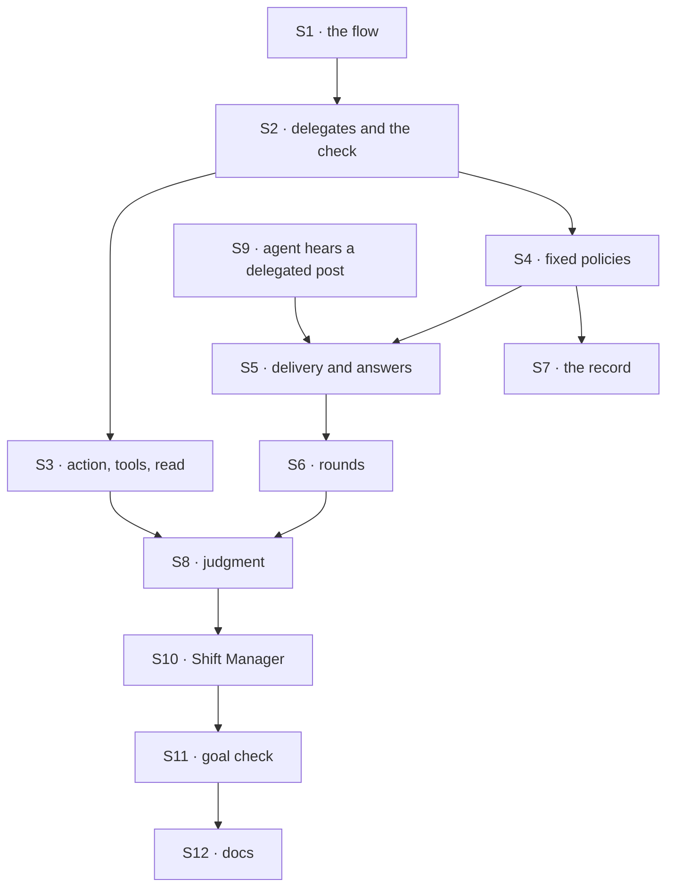

# FIX-1791 · Plan

[Spec](SPEC.md) · [Decisions](DECISIONS.md) · [Rules](BUSINESS-RULES.md) · **Plan** · [Docs](DOCS.md) · [Evolution](EVOLUTION.md)

Written for the implementing agent. IDs cross-reference [BUSINESS-RULES.md](BUSINESS-RULES.md)
(BR-n) and [DECISIONS.md](DECISIONS.md). `tdd`. Three PRs, a GitHub stack (epic ER-26). Builds
start only after FIX-1788 merges (server-owned session state, the worker collection, the link;
epic D4, ER-23). A failure in FIX-1797's early leg-c run on that commit blocks these PRs from
merging (ER-30).

## Surfaces

| ID | Package · role | Change | Rules |
|---|---|---|---|
| S1 | `workforce` · the coordinator flow | One singleton worker flow, id `coordinator`, declared in the shape the epic records ([epic Q1](../../epics/FIX-1786/DECISIONS.md#q1)). Its configuration composes `workerConfigSchema()` with `delegates`, `routing`, `fallback`, `rounds`; checked when saved and at load | BR-11 BR-26 |
| S2 | `workforce` · delegates, one module | The server-owned fields (FIX-1788 S1): the list with notes, the fallback, the round-robin cursor, the best-fit ledger, deliveries. Defaults copied on a conversation's first turn. Add and remove as one versioned write that recomputes on retry. The one check: on the session user's roster (FIX-1788's worker collection or the standard projection, read by id, not listed), its flow can take a delegated post, under the cap | BR-1–BR-9 BR-31 |
| S3 | `workforce` · the two paths and the read | A public `delegates` action (add, remove, list) and a capability giving the coordinator's turn the same three as tools. Both call S2; neither touches state itself | BR-2 BR-3 BR-5 BR-6 BR-10 BR-32 |
| S4 | `workforce` · fixed policies | Best fit, ported from `routeByPurpose`'s ladder (hold, one call, fallback) with `unplaced` added; round robin; everyone. One roster read per post, kept per request | BR-13–BR-19 |
| S5 | `workforce` · delivery and answers | Dispatch each pick to the delegate's flow, in its conversation for this coordinator conversation, linked through FIX-1788's link check with the worker from this code. A delivery record per (post, round, delegate), `pending` then `delivered`, with a token, as `room-deliveries` does but in server-owned session state. An internal answer action that claims once per delivery | BR-20–BR-22 BR-27 |
| S6 | `workforce` · rounds | An answer below the limit routes again by the policy, never to its author; everyone batches a round's answers into one delivery per delegate | BR-23–BR-25 |
| S7 | `workforce` · the record | One `coordinator-route` item per decision, the evaluator named the same | BR-28 BR-29 |
| S8 | `workforce` · judgment | The pick step runs the built-in agent's worker turn, shared rather than copied, with S3's tools and a hand-off tool. An answer wakes it only while rounds remain | BR-12 BR-23 BR-24 |
| S9 | `workforce` · the built-in agent hears a delegated post | An internal entry that answers into the delivering coordinator with the token. An app flow declares the same entry to be a delegate | BR-4 BR-20 |
| S10 | `shift-manager` · the chief of staff and the view | Its `WORKER.md` moves to `flow: coordinator`, `routing: judgment`, default delegates from the install's standard workers; first on the roster; a delegates panel (list, add from roster, remove); records rendered apart from lines. Its `agent` wiring is **removed** | BR-33 BR-34 |
| S11 | `goals/coordinators/hands-each-post-to-its-delegates/` | The goal check and its three controls, per [SPEC.md](SPEC.md#the-goal-and-how-well-know-its-met) | goal |
| S12 | Docs | [DOCS.md](DOCS.md); the `workforce` README; a `minor` changeset for `workforce` | — |

## Sequence · the PR plan

| PR | Delivers | Depends on |
|---|---|---|
| P1 · the flow and fixed policies | S1–S7, S9; proved model-free on a goal-local tree | FIX-1788 merged |
| P2 · judgment and the chief of staff | S8, S10 | P1 |
| P3 · the goal and the docs | S11, S12, VG | P2 |



## Checks

| ID | Runs after | Passes when |
|---|---|---|
| V1 | S1 | BR-11, BR-26; a configuration with no `routing` means judgment, with no `rounds` means zero |
| V2 | S2 S3 | BR-1–BR-10 through the action and the tool alike; BR-7 with two changes in flight; BR-8 on the real create route; BR-3 with two users, one answer for Bob's worker and a missing one |
| V3 | S4 | BR-13–BR-19 on a scripted evaluator; BR-14 after the holder is removed |
| V4 | S5 | BR-20–BR-22; BR-21 by replaying a fan-out and resending an answer; BR-31 by firing a delegate between pick and delivery |
| V5 | S6 | BR-23–BR-25 under all three fixed policies and judgment; BR-27 with a forged round on the input |
| V6 | S7 | BR-28 for every `by`; BR-29 in Shift Manager's renderer |
| V7 | S8 | BR-12 on a scripted model: a hand-off, an answer of its own, a wake within rounds and none at zero |
| V8 | S10 | BR-33, BR-34; the chief of staff's old tools still run |
| VG | P3 | [The goal](SPEC.md#the-goal-and-how-well-know-its-met): `goals/coordinators/hands-each-post-to-its-delegates/run.mts` PASSES, after the same run FAILED leg f under `no-roster-check`, leg e under `no-round-limit`, leg d under `no-delegate-read`, and every leg on today's `main` |

One check per decision: D1 by V5, D2 by V3, Q1 by VG's legs. The second path (BP-035): a replayed
fan-out and a resent answer (V4), a fired delegate (V4, BR-9), a forged field (V5), two users
(V2, VG), the off state of rounds (V5).

## Pinned names

| Where | Name | Why pinned |
|---|---|---|
| The flow | `coordinator` | Public; `flow:` names it |
| Configuration keys | `delegates`, `routing` (`judgment`, `best-fit`, `round-robin`, `everyone`), `fallback`, `rounds` | Public; FIX-1792 converts files to them |
| The record and its evaluator | `coordinator-route` | A client tells a record from a line by it; a scripted model resolves the evaluator by it |
| The action | `delegates` | Public; an app sends it |

Everything else is yours to name, in the new terms (delegate, roster, flow; not member, seat or mailbox).

## Guardrails

| Rule | Because |
|---|---|
| Every add, remove and delivery goes through S2's one check (tenet 5) | A check on the action alone is open through the tool |
| A delegate is resolved when a post arrives, never from a list built at start | A hire or fire must reach the next post with no restart (FIX-1779 lesson 1) |
| The round, the author and the token come from the delivery record (BP-031, ER-17) | An answer that names its own round can loop forever |
| The delegate list grants nothing; delivery re-reads the roster and FIX-1788 links | Access is the user's resource, never session state |
| No Layer 1 change; server-owned state is FIX-1788's (ER-22) | If S2 or S5 needs one, stop and take it to the epic |
| Nothing new builds on the mailbox flow | FIX-1792's conversion must not grow |

## Docs

Reconcile and publish [DOCS.md](DOCS.md) in P3, after V1 to V8 pass, against the shipped refusal
wording and the tool names.

## Sketch · pseudocode, illustrative, react to the shape

```
on a post at the coordinator's door:
    picks ← the session's policy over its delegates, each checked live   ← one roster read
    record the decision
    for each pick: deliver (post, round 0) to the delegate's conversation with a token
on an answer with a token:
    claim the delivery once, or drop it
    land it as the delegate's line
    if its round < rounds: route it again, round + 1, never to its author
```

**POC:** none. The link and server-owned state are FIX-1788's, proved by the epic's
[POC](../../epics/FIX-1786/poc/singleton-worker-link/README.md); the policies port code on `main`.
No counted fact carries the design, so no checker.

## At implement time

- **Read the epic's Q1 on `main`.** Declare the flow in the recorded shape, or build to ER-2 and
  name neither.
- **Read this spec's Q1 answer.** If tasks stay here, add them on the coordinator's own flow only,
  and leave the cross-flow board to FIX-1794.
- Take FIX-1788's shipped names for S1 and the link. If FIX-1789's door can carry a delegated
  post and its answer, use it in S9 instead of a second entry.
- No org-scoped mailbox or room path landed from FIX-1779 (canceled); rooms are FIX-1793's.
- Old-term exports left for FIX-1796: `defineMailboxFlow`, `mailboxFlow`, `MAILBOX_KIND`,
  `routeByPurpose`, `wakeMemberSeats`, `MAILBOX_ROUTE_COMPONENT`, `MAILBOX_ROUTE_EVALUATOR`,
  `mailboxPostCapability`, `MailboxNotifyInput`.

## Follow-ups

- FIX-1792 converts every `MAILBOX.md` to the keys pinned here and removes the mailbox flow.
- If Q1 holds: FIX-1794 takes FIX-1774's leg e and FIX-1780's notices and reassign; FIX-1793
  takes FIX-1774's leg d.
