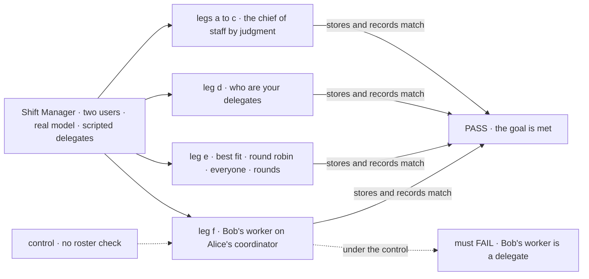
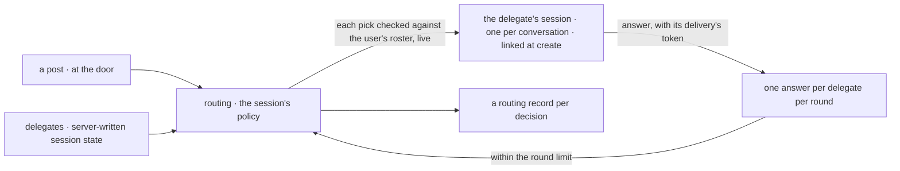

# FIX-1791 · A coordinator hands each post to delegates it manages, by a routing policy

**Spec** · [Decisions](DECISIONS.md) · [Rules](BUSINESS-RULES.md) · [Plan](PLAN.md) · [Docs](DOCS.md) · [Evolution](EVOLUTION.md)

## Five users, before and after

| Someone who… | Today | After |
|---|---|---|
| **sends work to one inbox and lets it find the right worker** | Writes a mailbox whose members are fixed when it opens. It can pick by best fit or wake everyone | Talks to a coordinator, one of their own workers. It picks by its own judgment, best fit, round robin or everyone |
| **changes who handles the work mid-conversation** | Can't. A mailbox has no join or leave | Adds or removes a delegate in the app, or the coordinator does it with its own tool. Each conversation keeps its own list, starting from the coordinator's defaults |
| **wants two workers to talk it over** | Can't. A worker's answer wakes nobody | Sets a round limit on the coordinator. Each answer goes back to the others once per round, until the limit |
| **names another user's worker as a delegate** | A member is matched by name, and an owner pin decides who it reaches | Refused, in the app and through the tool, with the same answer as a worker that doesn't exist |
| **asks the chief of staff who handles what** | It reads a short listing and can invent who is on a mailbox | It is a standard coordinator, first on their roster, and answers from its delegate list |

The epic's coordinator ([FIX-1786](../../epics/FIX-1786/SPEC.md), ER-4 and ER-5), built on
workers that are already private ([FIX-1788](https://linear.app/fixpoint-labs/issue/FIX-1788)).

## The goal, and how we'll know it's met

**A user's coordinator hands each post to delegates from that user's own roster, by its own
judgment, best fit, round robin or everyone. The user, or the coordinator itself, changes the
delegates mid-conversation. Each delegate answers each post once per round, answers go back out
only within a set number of rounds, every routing decision is recorded, and no other user's
worker is ever a delegate.**

| Is it the right goal? | |
|---|---|
| **The real need** | The [PRD](https://linear.app/fixpoint-labs/issue/FIX-1791): delegates in session state, changed by the app or the coordinator's tool, both passing one roster check; four policies; the three mailbox guarantees kept; the chief of staff a standard coordinator. FIX-1774's job, carried here: route to the worker that fits, hire when none does, never hire a twin. FIX-1785's rule, carried here: delegates are read as data, never guessed |
| **Smaller, and rejected** | "The mailbox flow gains round robin and join and leave." It keeps a mailbox as a session no worker owns, matched by org names, and puts the roster check on a part the epic removes |
| **Bigger, and not this issue's** | Tasks assigned from delegates, and hearing how they ended ([FIX-1794](https://linear.app/fixpoint-labs/issue/FIX-1794), if [Q1](DECISIONS.md#q1) holds) · project coordinators ([FIX-1793](https://linear.app/fixpoint-labs/issue/FIX-1793)) · converting `MAILBOX.md` ([FIX-1792](https://linear.app/fixpoint-labs/issue/FIX-1792)) · transcript resources and channels (the epic's fence) |
| **Not done if** | The check ran with one user · a caller can set an answer's round · a post delivered twice gets two answers from one delegate · a delegate is resolved from a list built at start · a change in one conversation shows in another · two conversations share one delegate session · a session create seeds delegates · the coordinator names its delegates from a listing or its prompt · another user's worker becomes a delegate by any path · the chief of staff still runs as an `agent` worker |



The check reads the delegate list, the routing records and the answers through the app's routes,
never the reply's prose. Under the dashed control, Bob's worker must land on Alice's list.

| How we verify | |
|---|---|
| **Goal check** | `goals/coordinators/hands-each-post-to-its-delegates/` · `openai/gpt-5.4-mini` for legs a to d, scripted delegates and evaluator for leg e · Shift Manager over HTTP with two users · run by the implementer at completion · verdict in the last implementation PR |
| **Signal** | **a**: Alice asks the chief of staff for work her `eng.em` delegate does, with a held-out word: zero hires, one delivery to `eng.em` carrying the word, one `by: judgment` record, its session opens within 120 s. **b**: the same ask again: still zero hires, and a second delivery, to `eng.em` again. **c** ("audit our dependencies' licenses"): one hire on Alice's roster, added to this conversation's delegates, one delivery to it; asked again, no second hire and a delivery to the same worker. **d**: Alice adds one delegate and removes one in the app; asked who its delegates are, the coordinator calls its delegate read, the output equals the session's list, and the reply names exactly those. **e**: best fit holds a follow-up and falls back on a failed call; after its fallback is removed, a failed call is recorded `unplaced`; round robin alternates over three posts; everyone with a limit of one gives four answers, then none; a redelivered post adds none. **f**: Bob's worker, named in the app and through the tool, is refused like a missing worker; a session create carrying delegates is refused |
| **Input** | The DevTeam standard install, its chief of staff converted; two users through sign-in; a goal-local coordinator with two scripted workers for leg e. Asks and words held out at run time |
| **Anti-game** | No delegate seeded by a fixture; every change goes through the app or the tool. Leg d grades tool output against state, not prose. Answer counts are read again after a grace period |
| **Control that must fail** | `GOAL_CONTROL=no-roster-check`: leg f FAILS on *Bob's worker is a delegate*. `GOAL_CONTROL=no-round-limit`: leg e FAILS on *four answers, then none*. `GOAL_CONTROL=no-delegate-read`: leg d FAILS on *the reply equals the list*. Today's `main`: every leg FAILS |

## What changes

![Two panels, today and after. Today a mailbox is its own flow: its members are fixed at open, matched by name against org hires, a worker's answer wakes nobody, and best fit or everyone are the only policies. After, a coordinator is a worker on the user's roster: its delegates live in each conversation's server-written state, start from its defaults, and change through the app or its own tool, both passing one roster check; it picks by judgment, best fit, round robin or everyone; answers go back out within a round limit; each delegate answers each post once per round; every decision is recorded](figures/what-changes.svg)

On the left, the mailbox decides who hears a post from a list written once. On the right, the
user's own worker decides, from a list each conversation owns and both paths check the same way.

**What an installation writes**, shown on kitchen-sink's help desk (FIX-1792 converts the files):

```diff
- # teams/support/mailboxes/help/MAILBOX.md
- members: [support.devices, support.accounts, support.fsd, support.general]
- routing:
-   fallback: support.general
+ # teams/support/workers/help/WORKER.md
+ flow: coordinator
+ delegates: [support.devices, support.accounts, support.fsd, support.general]
+ routing: best-fit
+ fallback: support.general
+ rounds: 0
  description: Ask the support team anything.
```

**And what an app writes to change one conversation's delegates**, opening the conversation
the way [FIX-1788](../FIX-1788/SPEC.md#what-changes) opens any worker session:

```ts
import { createClient } from "@flow-state-dev/client"
import { createWorkforceClient } from "@flow-state-dev/workforce"

const workforce = createWorkforceClient({ userId, baseUrl })
const session = await workforce.ensureWorkerSession({ worker: "chief-of-staff" })  // linked at create
const coordinator = createClient({ flowKind: session.flowKind, userId })            // the flow the worker names
await coordinator.sendAction("addDelegate", { worker: "researcher" }, { sessionId: session.id })
// refused, like a missing worker, unless researcher is on this user's roster
await coordinator.sendAction("setFallback", { worker: "researcher" }, { sessionId: session.id })
await coordinator.sendAction("removeDelegate", { worker: "researcher" }, { sessionId: session.id })
await coordinator.sendAction("listDelegates", {}, { sessionId: session.id })   // the whole list, with notes
```

Every session on a worker flow is linked to its worker when it is created, in a field only the
server writes, and no action names a worker ([epic D3](../../epics/FIX-1786/DECISIONS.md#d3),
FIX-1788 BR-10 and BR-13). So the four actions work on any coordinator conversation. The public
create can't seed delegates (FIX-1788 BR-15 and BR-18a): these actions and the coordinator's own
tool are the only writers of a conversation's list. The coordinator flow goes on the list of
worker flows the installation keeps ([epic Q1](../../epics/FIX-1786/DECISIONS.md#q1)), like
`agent`, with no declaration shape of its own.

## How a post reaches a delegate



The roster check runs on every add and again on every delivery, so a fired worker drops out
without anyone editing the list. A delivery opens the delegate's session through FIX-1788's
`ensureWorkerSession({ worker, coordinatorSessionId })`: the delegate is named, so the server
links the session at create, and the key gives each coordinator conversation its own session per
delegate. It never posts to a fresh id.

## What stays as it is

- The mailbox flow, `routeByPurpose` and `wakeMemberSeats`, until FIX-1792 converts every file
  and removes them. Nothing new builds on them.
- Sessions stay private to one user; nothing here reads another user's session.
- The chief of staff's wire id, `chief-of-staff`, and its display name, "Shift Coordinator".
- FIX-1778's worker lookup, which still answers "is this a valid name"; the delegate check is a
  separate "is it yours" question.

## Sign off

**[The goal](#the-goal-and-how-well-know-its-met), at that size:** four policies on one flow,
delegates each conversation manages, the three mailbox guarantees kept, and no other user's worker
ever a delegate. If wrong: we rebuild the mailbox under a new name and still can't change who
answers.

**Open, the one to weigh** (full ask in [DECISIONS.md](DECISIONS.md#q1)):

- **[Q1](DECISIONS.md#q1) · Do filing tasks for delegates and following them through move to
  FIX-1794?** I recommend yes. If wrong: the coordinator ships unable to file or follow a task
  until FIX-1794 lands.

**Decided:**

1. **[D1](DECISIONS.md#d1) · Answers go back out only within a round limit: zero unless a
   coordinator's configuration sets it, at most three.** A post then costs at most
   delegates × (rounds + 1) delegate turns, 100 at the caps. If wrong: group chats nobody can
   turn on per coordinator, or a cost per post nobody bounded.
2. **[D2](DECISIONS.md#d2) · Best fit's fallback is one of the conversation's delegates;
   removing it leaves posts it can't place recorded and told, never refused.** If wrong: a
   user's post sits unanswered after a removal they thought was harmless.

Q1 moves scope between two of the epic's children, so its answer binds once a follow-up epic PR
records it ([ER-24](../../epics/FIX-1786/BUSINESS-RULES.md#how-the-set-is-run)).

Feature · `workforce`, `shift-manager` · large · 3 PRs · epic [FIX-1786](../../epics/FIX-1786/SPEC.md)
