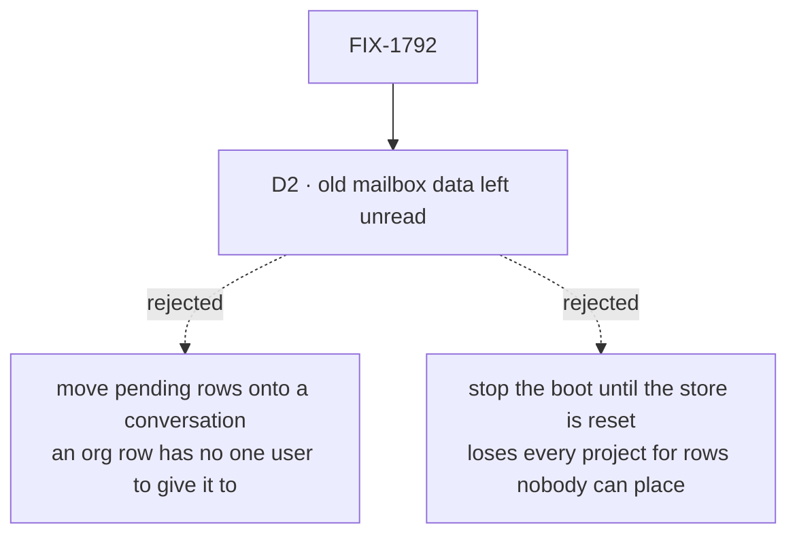

# FIX-1792 · Decisions

[Spec](SPEC.md) · **Decisions** · [Rules](BUSINESS-RULES.md) · [Plan](PLAN.md) · [Docs](DOCS.md) · [Evolution](EVOLUTION.md)

What was chosen, what lost, and what each choice locks in. One decision is the sign-off surface,
D2. D1 is decided, not asked. The counts here are the checker's ([poc/inventory](poc/inventory/README.md)),
not a hand count.

## The tree

Solid edges are what you're signing. Dashed edges lost, and the label says why.

## D1 · Where each board goes: now decided, not asked

[Decided, not asked](#decided-not-asked) records it. The table stays here, because the plan and
the checker cite it.

### The table

| Tree · coordinator | Board | What it is used for | Becomes |
|---|---|---|---|
| kitchen-sink · `support.help` | `escalations` | A specialist files a case that needs a person; nobody works it; the team panel lists it | **Removed** with the escalation feature (product owner, 2026-10-06). `support.help` is a best-fit coordinator with no board, so no grant |
| `mailbox-boards` hire goal · `ops.desk` | `work` | A coordinator hires a worker and files it a task by name | Conversation board, granted |
| `mailbox-boards` row goal · `eng.feature` | `triage`, `parked` | One worker files a row and another's board runs it; nobody drains `parked` | The filer's own session board; the filer is granted. `parked` goes |
| `manager-queue-lab` · `eng.queue` (lab and two refusal trees) | `work` | The manager files a row per desk; each desk's worker takes its own | The manager's own session board; the manager is granted, and a row names its delegate |
| Shift Manager chief-of-staff goal · `desk.front` (two labs) | `work` | The landing summary counts what waits and what runs | Conversation board, granted |
| Shift Manager look goal · `desk.front` | `work` | Every screen draws the board's rows | Conversation board, granted |
| Shift Manager roster goal · `eng.desk` | `work` | The roster shows each worker's tasks; the lead drains it | Conversation board, granted |
| `task-run-link` · `lab.desk` | `work` | Each handed-off row links its run | Conversation board, granted |
| Shift Manager test labs · `ops.desk`, `eng.queue`, `lab.desk` | `work` | Tasks, asks, parked rows and runs in Shift Manager's tests | Conversation board, granted; multi-seat-collab's planner (`eng.queue`) is granted too and files on its own session board |
| **DevTeam · `eng.feature`** | `work` | The team builds a feature; the storefront project lists it; its coding runs find the project through the claim | **Workstream** on storefront, led by the EM, which is granted and files the coder's tasks |
| DevTeam · `ops.release` | none | Storefront lists it beside `eng.feature` | **Workstream** on storefront, led by the EM |

Every file, with or without a board, is a row in the checker; [PLAN](PLAN.md#the-files) lists the
other 18.

**Granted** means the worker's `WORKER.md` says `filing: true` (FIX-1802 D1). Every worker that
files is granted, coordinators included, and files through `createTaskFilingCapability()`. The
built-in `agent` and coordinator flows carry it. An app flow adds it in two parts: the capability
on its worker's generator block's `uses`, and the entries it spreads into the flow's own
`internal` and `task` maps (the EM keeps `flow: em`). That is each converted coordinator that
keeps a conversation board, the chief of staff (FIX-1802 S7), the members that filed on a mailbox's board when a post reached it (manager-queue-lab's manager,
multi-seat-collab's planner, the row goal's filer) and the DevTeam's EM. A member lists who it
files for in `delegates:`, and its rows land on its own session's board. A coordinator converted
with no board gets no grant. No coordinator files for a member, and no coordinator needs `rounds:`.

## D2 · Old mailbox data stays in the store, unread; no pending task carries over

| | |
|---|---|
| **Instead of** | Moving each pending row on an old board onto the converted coordinator's conversation at first boot · or stopping the boot until the store is reset, as the channel rename did ([FIX-1748 D1](../FIX-1748/DECISIONS.md#d1)) |
| **Because** | A mailbox board is an org row, filed and run by whoever; a conversation belongs to one user. Moving a row means picking a user, and any pick can hand one member another's task, the leak the epic closes. A reset costs every project, worker and conversation in the store for rows nobody can place anyway. Rooms set the precedent: left in the store, unread, refused by name ([FIX-1793](../FIX-1793/DECISIONS.md#decided-not-asked)) |
| **Locks in** | Upgrading a store with tasks waiting on a mailbox board drops them from every view. The upgrade page says so, and says to finish or re-file them first. An operator can still read the rows; nothing reads them for you |

![D2, what happens to a mailbox's stored sessions and board rows. Chosen: left in the store, unread. Instead of: moving each pending row onto the converted coordinator's conversation, or stopping the boot until the store is reset. It comes down to the first row: whose a row is. Left unread, nobody guesses; moved, the boot must pick one user for an org row, and a pick can hand one member another's task. A reset keeps nothing else in the store. The price is the last row: a waiting task drops out of view and has to be re-filed, where moving it would keep it waiting. Locks in: pending mailbox tasks don't carry over on upgrade. Flips if: a store you run holds pending board tasks you want kept](figures/d2-old-data.svg)

It comes down to whose a row is: moving it means guessing, and a wrong guess shares a task.

**What would change my mind:** your DevTeam lab store, or the deployed kitchen-sink database,
holding pending board tasks you want kept. Then a one-off script you run once files them on the
converted coordinator's conversation as the user you name, and nothing reads old rows after.

## Decided, not asked

- **D1 · Where each board goes ([the table](#the-table)): the DevTeam's feature becomes a
  Storefront workstream the EM leads, 13 other board files keep a session board, and kitchen-sink's
  escalations goes with its feature.** Its only close call was that escalations board, and the
  product owner answered it by removing the escalation feature (2026-10-06).
- **The conversion, key by key.** `description:` and the body unchanged; `flow: coordinator`
  added; `members:` → `delegates:`; `routing: { fallback: x }` → `routing: best-fit` and
  `fallback: x`; no `routing:` → `routing: everyone`. FIX-1791's default for a missing
  `routing:` calls a model (judgment as merged; evaluator first once #2837 lands), so a file
  without the line would start calling a model where its mailbox woke everyone. `rounds:` is left out (zero). `boards:` and `boardActions:` go. The epic's draft said
  "`routing:` unchanged"; FIX-1791's pinned keys made that wrong, and this DOCS.md corrects it.
- **A `flow:` naming a kind of the tree's own has no conversion.** Both such files name `digest`,
  a goal fixture's kind: one goes with the goal it served, one stays as an old file the refusal
  goal reads. `flows/mailboxes/` is refused by name at `fsdev gen` and, separately, at load, so an
  app that never regenerates is still refused. It is refused whatever it holds, where an empty
  `mailboxes/` team folder is passed over: a code slot is itself a declaration, a team folder
  declares only through its file. A flow that should run workers moves to `flows/workers/` and the
  worker-flow list ([FIX-1789](../FIX-1789/SPEC.md)).
- **A renamed file that keeps the old lines is refused by name**: `members:`, `boards:`,
  `boardActions:` or `mintFor:` on a `WORKER.md`, each with what replaced it.
- **The `CHANNEL.md` refusal stays until 1.0** ([FIX-1748](../FIX-1748/DECISIONS.md#d1)); it now
  names the `WORKER.md` conversion, so it never sends someone to a file that is itself refused.
- **A standard coordinator naming a delegate no file declares is refused at load**, by FIX-1791's
  BR-11. The pentest scenario that opened and skipped such a member now asserts the refusal.
- **No refusing `mailbox` flow is kept for old sessions.** The engine already answers
  `Unknown flow "mailbox"`; a flow kept only to refuse is a second path.
- **Goals convert by default.** 13 rewrite an outcome the epic or the product owner changes (who
  sees a board's rows, a delegate instead of a desk, an unknown member refused, kitchen-sink's
  escalation legs gone). Two retire, each named under BR-24 with its reason: one whose subjects are
  gone, and kitchen-sink's filed-case goal, whose feature is removed. No converted step waits on
  another issue. The pre-rename goal folds into this issue's goal check. The table is in
  [PLAN](PLAN.md#goals).
- **Claims, a project's list of mailboxes, `setWorkstreams` and `projectWritesMailboxInventory`
  are removed here**, as the epic records; the chief of staff loses `post-to-mailbox` and
  `setWorkstreams`.
- **The DevTeam's `feature` and `release` files become workstreams, not coordinators.**
  Storefront's seed opens both as the lab's member, each led by the EM, and lists them as entries,
  not as the project's `workstreams` (S10). `triage` and `oncall` are coordinators no project lists,
  as today.
- **Desks are lab code** (`answersFor:` is read only by lab flows). A converted lab files for the
  delegate, through the worker that filed today. A step that can't hold on a session board is
  retired under BR-24 with its reason; none waits on another issue.
- **Filing is a granted tool** (product owner, 2026-10-06; FIX-1802 D1). Every worker that files
  is granted with `filing: true` in its `WORKER.md`, coordinators included, and files through
  `createTaskFilingCapability()`; [the table](#the-table) names who. A converted file lists who a
  worker files for in `delegates:`, a key of the worker contract (FIX-1802 S2). The same grant lets
  a filed task's worker file pieces in turn. A coordinator converted with no board gets no grant,
  and no coordinator files for a member.
- **Kitchen-sink's escalation feature is removed, not replaced** (product owner, 2026-10-06): the
  `escalate` tool, its test and `no-filing` control, the escalations board and panel, and the
  specialists' instruction to escalate. Shift Manager is where Workforce is proved now. The help
  desk converts key by key, to best fit with its fallback.
- **A converted coordinator keeps its mailbox's id**, `<team>.<name>`, as a worker id; no tree on
  `main` has a worker by that name. Its conversation is found by `findWorkerSession({ worker })`,
  whose key-set match (FIX-1788 S5a) never returns a delegate's or a task's session.
- **The last PR is two.** P4a adds the refusals and the goal check; P4b removes the mailbox floor
  and adds no behaviour. Each is reviewed against one question, and S1 lands before S9.
- **Leg d's old store is a checked-in file** generated once from the commit P4a branches from, by a
  committed script, with the SHA beside it. After P4b no commit on `main` can write a mailbox
  store, so a store seeded "through today's code" would stop being old. A published older package
  can't seed it: the labs that open mailboxes aren't published.
- **The retiring goal retires on a condition**: each leg that still has a subject is named against
  a leg FIX-1791's, FIX-1794's or a converted goal passes on `main`, or it moves rather than goes.
- **Old-term exports left for FIX-1796:** `PRE_RENAME_NAMES` and its refusal helpers (until 1.0).
  The mailbox floor's exports are removed, not left.

## Considered and dropped

| Alternative | Why not |
|---|---|
| A loader that reads `MAILBOX.md` as a coordinator | The FIX-1367 lock: one way to declare a worker, and old files refused loudly |
| Converting files at boot | The same lock; every file is in this repo |
| Keeping org-scoped boards as a third shape | The epic's [D5](../../epics/FIX-1786/DECISIONS.md#d5): the shape this epic removes |
| Every board a lab's people look at becomes a workstream: Shift Manager's `desk.front` and `eng.desk` labs too | Each lab grows a project and a workstream nobody follows, where D5 sends a working list to a session board. It flips if a Shift Manager lab's board is meant to list work across a person's conversations; that lab then opens a workstream, as the DevTeam does |
| Retiring every goal that ran on a mailbox | Kitchen-sink and the goals are the proof spine; the Architect's lock keeps them passing |

## Settled

- **The counts**: 33 files, 15 with boards, 16 boards, 3 `boardActions:`, 0 `mintFor:`, 2 `flow:`
  (both `digest`) — **CONFIRMED** by [poc/inventory](poc/inventory/README.md) on `cad4e2780`, and
  again on `ce06cb5c7` with the full removed-export list, its control refusing every plant.
- **FIX-1794's filing takes a delegate's session as a caller** — **REFUTED** at spec time against
  FIX-1794 S1, S4 and BR-21 ([architect](https://github.com/fixpoint-labs/flow-state-dev/pull/2833#issuecomment-6026639909)).
  Kitchen-sink's case was settled by the coordinator, then made moot when the product owner
  removed the escalation feature.
- **A coordinator can lead a workstream** — **REFUTED** for merged FIX-1791 in review round 2: a
  workstream's lead takes a delegated post (FIX-1793 S3, FIX-1791 BR-4), and FIX-1791 S9 gives that
  entry to `agent` and app flows, not to the coordinator flow. So the EM, a worker, leads the
  DevTeam's workstreams.

## How it got here

- **Draft** — framed as one declaration and a loud refusal over sibling-built parts; the census
  found 16 boards and two `flow:` lines naming a kind of the tree's own; D5 applied board by
  board, one workstream; old data left unread; four PRs.
- **Review round 1** — `escalate` stopped filing from a delegate's session, because FIX-1794
  refuses that caller: the coordinator files the case (the coordinator's decision, option 1), on
  `routing: judgment` with `rounds: 1`, keyed on an `Escalate:` line in the answer, so FIX-1791
  doesn't change. The
  last PR split into refuse and remove. `flows/mailboxes/` gained a load-time refusal. Leg d's old
  store became a pinned fixture. The `--after` gate covers the full removed-export list and only
  the two pinned old files.
- **Review round 2** — the DevTeam's feature moved from a workstream to its coordinator's
  conversation, because a coordinator can't lead a workstream before FIX-1802; all 15 boards are
  conversation boards. No converted step waits on FIX-1802.
- **Direction change** (product owner, 2026-10-06) — filing became a tool any worker can be
  granted, with multi-level delegation in the MVP (FIX-1802), and kitchen-sink's escalation
  feature was removed. The DevTeam's feature is a Storefront workstream again, led by the EM, which
  files its own tasks; members that filed file themselves; `rounds:` and the `Escalate:` line went.
- **Aligned with FIX-1802** (2026-10-07) — took its pinned names. Every worker that files is
  granted, coordinators included, through `createTaskFilingCapability()`, and lists who it files
  for in `delegates:`. D1 moved to decided, not asked, so D2 is the one sign-off item.

**Open: none.**
