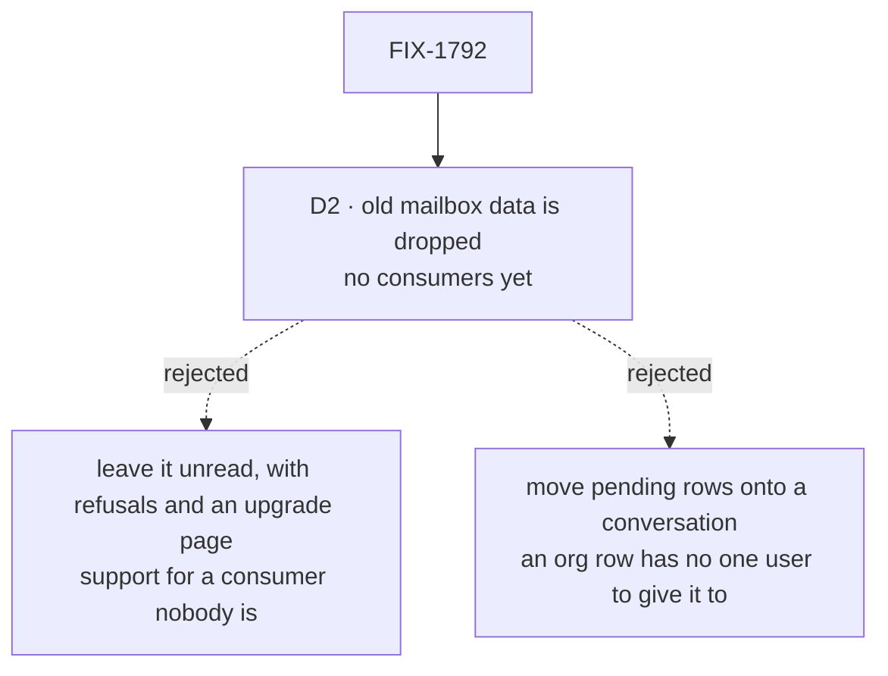

# FIX-1792 · Decisions

[Spec](SPEC.md) · **Decisions** · [Rules](BUSINESS-RULES.md) · [Plan](PLAN.md) · [Docs](DOCS.md) · [Evolution](EVOLUTION.md)

What was chosen, what lost, and what each choice locks in. D2 was the sign-off surface, and the
product owner answered it (2026-10-07). D1 is decided, not asked. The counts here are the checker's ([poc/inventory](poc/inventory/README.md)),
not a hand count.

## The tree

Solid edges are what was answered. Dashed edges lost, and the label says why.

## D1 · Where each board goes: now decided, not asked

[Decided, not asked](#decided-not-asked) records it. The table stays here, because the plan and
the checker cite it.

### The table

| Tree · coordinator | Board | What it is used for | Becomes |
|---|---|---|---|
| kitchen-sink · `support.help` | `escalations` | A specialist files a case that needs a person; nobody works it; the team panel lists it | **Removed** with the escalation feature (product owner, 2026-10-06). `support.help` is a best-fit coordinator whose specialists take tasks, so it has the task tools; nothing asks it to file |
| `mailbox-boards` hire goal · `ops.desk` | `work` | A coordinator hires a worker and files it a task by name | Conversation board, with the task tools |
| `mailbox-boards` row goal · `eng.feature` | `triage`, `parked` | One worker files a row and another's board runs it; nobody drains `parked` | The filer's own session board; the filer has the task tools through its delegates. `parked` goes |
| `manager-queue-lab` · `eng.queue` (lab; two refusal trees) | `work` | The manager files a row per desk; each desk's worker takes its own | The manager's own session board; the manager has the task tools through its delegates, and a row names its delegate. The two board-in-a-seat-folder refusal trees go: no file declares a board, so the leg they served has no subject |
| Shift Manager chief-of-staff goal · `desk.front` (two labs) | `work` | The landing summary counts what waits and what runs | Conversation board, with the task tools |
| Shift Manager look goal · `desk.front` | `work` | Every screen draws the board's rows | Conversation board, with the task tools |
| Shift Manager roster goal · `eng.desk` | `work` | The roster shows each worker's tasks; the lead drains it | Conversation board, with the task tools |
| `task-run-link` · `lab.desk` | `work` | Each handed-off row links its run | Conversation board, with the task tools |
| Shift Manager test labs · `ops.desk`, `eng.queue`, `lab.desk` | `work` | Tasks, asks, parked rows and runs in Shift Manager's tests | Conversation board, with the task tools; multi-seat-collab's planner (`eng.queue`) has them too, through its delegates, and files on its own session board |
| **DevTeam · `eng.feature`** | `work` | The team builds a feature; the storefront project lists it; its coding runs find the project through the claim | **Workstream** on storefront, led by the EM, which has the task tools through its delegates and files the coder's tasks |
| DevTeam · `ops.release` | none | Storefront lists it beside `eng.feature` | **Workstream** on storefront, led by the EM |

Every file, with or without a board, is a row in the checker; [PLAN](PLAN.md#the-files) lists the
other 18.

**With the task tools** means the worker's turn has orchestration's eight task tools (`addTask`,
`assignTask`, `completeTask`, `failTask`, `blockTask`, `cancelTask`, `updateTask`, `listTasks`),
from `createTaskToolsCapability(resolver, roster)` with the session's board as the resolver and
the delegates that can take a task as the roster. A worker has them when at least one of its
`delegates:` can take a task, as an `agent` worker does through the task entry
([FIX-1794 S6](../FIX-1794/PLAN.md#surfaces)); no line in its file grants them, and there is no
`filing:` key (product owner, 2026-10-07). A routing coordinator whose delegates only take posts
has none. The built-in `agent` and coordinator flows carry them through FIX-1802's wiring of the
existing task tools. The EM's `em` flow composes the capability on its generator block and spreads
`taskToolActions(<board id>, resolver, roster)` into its `actions` (the EM keeps `flow: em`). So each converted coordinator
whose delegates are agents has them, board or not, kitchen-sink's help desk included; so do the
chief of staff, the members that filed on a mailbox's board when a post reached it
(manager-queue-lab's manager, multi-seat-collab's planner, the row goal's filer) and the DevTeam's
EM. Each keeps its `delegates:` list, and that list is what gives the tools. A member's rows land
on its own session's board. No coordinator files for a member, and no coordinator needs `rounds:`.

## D2 · Old mailbox data is dropped; no consumers yet

| | |
|---|---|
| **Answered** | Approved by the product owner (2026-10-07), and widened: no backwards support of any kind while there are no consumers |
| **Instead of** | Leaving it in the store, unread, with refusals that name each old file and key and an upgrade page that says to finish or re-file tasks first (this spec's draft) · moving each pending row onto the converted coordinator's conversation at first boot · stopping the boot until the store is reset, as the channel rename did ([FIX-1748 D1](../FIX-1748/DECISIONS.md#d1)) |
| **Because** | Nobody outside this repo runs a mailbox yet. Every file is in the repo and converted here, so an old file could only exist by mistake, and the conversion deletes them. Every path kept for old files or data (a refusal, a dual-read, an upgrade page, a pinned old store) is code to build, test and remove later for a reader who doesn't exist. Moving rows would also have to pick a user for an org row, the leak the epic closes |
| **Locks in** | No code reads, moves, migrates or refuses an old `MAILBOX.md`, a `flows/mailboxes/` folder, a `boards:` line, a `workstreams` write, the `mailboxes` discovery domain, or a store's mailbox sessions, board rows, claims and inventory rows. No upgrade page. Pending tasks on an old board don't carry over |

![D2, what happens to old mailbox files and data. Chosen: dropped, since there are no consumers yet. Instead of: leaving them unread, with refusals and an upgrade page, or moving each pending row onto a conversation. It comes down to the first row: what we build and keep for them. Dropped keeps nothing; left unread keeps a refusal, a page and a pinned old store, each to test and remove later; moved keeps a migration that must pick a user for an org row. Whose a row is: dropped and left unread guess nothing; moved can hand one member another's task. The price is the last row: a waiting task is gone, where moving it keeps it waiting, but nobody has one yet. Locks in: no reader, refusal, upgrade page or dual-read for old files and data. Flips if: a consumer runs mailboxes before the removal lands](figures/d2-old-data.svg)

It comes down to who needs it: nobody yet, so anything kept for it is a second path with no reader.

**What would change my mind:** a consumer outside this repo running mailboxes before P4 lands.
Then a refusal and an upgrade page land first, as one PR ahead of P4, and BP-030 applies from then
on.

## Decided, not asked

- **D1 · Where each board goes ([the table](#the-table)): the DevTeam's feature becomes a
  Storefront workstream the EM leads, 11 other board files keep a session board, manager-queue-lab's
  two board-in-a-seat-folder trees go with the leg they served, and kitchen-sink's escalations goes
  with its feature.** Its only close call was that escalations board, and the
  product owner answered it by removing the escalation feature (2026-10-06).
- **The conversion, key by key.** `description:` and the body unchanged; `flow: coordinator`
  added; `members:` → `delegates:`; `routing: { fallback: x }` → `routing: best-fit` and
  `fallback: x`; no `routing:` → `routing: everyone`. FIX-1791's default for a missing
  `routing:` calls a model (judgment as merged; evaluator first once #2837 lands), so a file
  without the line would start calling a model where its mailbox woke everyone. `rounds:` is left out (zero). `boards:` and `boardActions:` go. The epic's draft said
  "`routing:` unchanged"; FIX-1791's pinned keys made that wrong. The old file is deleted.
- **A `flow:` naming a kind of the tree's own has no conversion.** Both such files name `digest`,
  a goal fixture's kind, and both go with the goals they served. `flows/mailboxes/` stops being a
  codegen slot, and nothing reads or refuses the folder. A flow that should run workers belongs in
  `flows/workers/` and the worker-flow list ([FIX-1789](../FIX-1789/SPEC.md)).
- **BP-030 does not apply while there are no consumers** (epic decision, product owner,
  2026-10-07). No dual-read, no tolerated legacy field, and no refusal of an old file, key, write
  or domain by name. It applies again from the first consumer.
- **The pre-rename refusal goes too.** `PRE_RENAME_NAMES` and its refusals of `CHANNEL.md`,
  `channels/` and a store from before the rename are backwards support for the same nobody, and
  kept they would point at `MAILBOX.md`, a file that no longer exists. They go in P4 with the
  pre-rename goal and the DevTeam's pre-rename store test. This supersedes FIX-1748 D1's "until
  1.0" by D2's answer. Flips if D2's rule was meant to stop at mailboxes: then S3 comes back as a
  re-pointed refusal.
- **A standard coordinator naming a delegate no file declares is refused at load**, by FIX-1791's
  BR-11. The pentest scenario that opened and skipped such a member now asserts the refusal.
- **No `mailbox` flow is kept for old sessions.** A flow kept only for old data is a second path.
- **Goals convert by default.** 13 rewrite an outcome the epic or the product owner changes (who
  sees a board's rows, a delegate instead of a desk, an unknown member refused, kitchen-sink's
  escalation legs gone). Three retire, each named under BR-24 with its reason: one whose subjects
  are gone, kitchen-sink's filed-case goal, whose feature is removed, and the pre-rename goal,
  whose refusal is removed. No converted step waits on another issue. The table is in
  [PLAN](PLAN.md#goals).
- **Claims, a project's list of mailboxes, `setWorkstreams` and `projectWritesMailboxInventory`
  are removed here**, as the epic records, and the project's `workstreams` field with them; nothing
  refuses a write that still carries it. The chief of staff loses `post-to-mailbox` and
  `setWorkstreams`.
- **The DevTeam's `feature` and `release` files become workstreams, not coordinators.**
  Storefront's seed opens both as the lab's member, each led by the EM, and lists them as entries,
  not as the project's `workstreams` (S10). `triage` and `oncall` are coordinators no project lists,
  as today.
- **Desks are lab code** (`answersFor:` is read only by lab flows). A converted lab files for the
  delegate, through the worker that filed today. A step that can't hold on a session board is
  retired under BR-24 with its reason; none waits on another issue.
- **The task tools come from a worker's delegates** (product owner, 2026-10-07). A worker has
  orchestration's eight task tools when at least one of its `delegates:` can take a task; there is
  no `filing:` key, and nothing else grants them. They are the existing
  `createTaskToolsCapability(resolver, roster)` and, for an app's own actions,
  `taskToolActions(<board id>, resolver, roster)`, both in `packages/orchestration/src/skills/task-tools-capability.ts`;
  FIX-1802's wiring of the existing task tools puts them on worker flows. `mailboxBoardTaskTools`,
  the mailbox's wrapper over them, is retired here. [The table](#the-table) names who has them.
  A converted coordinator with no board still has them when its delegates take tasks; the two
  files with an empty `members:` list, and a coordinator whose delegates only take posts, have
  none. The same rule lets a filed task's worker file pieces in turn. No coordinator files for a
  member.
- **Kitchen-sink's escalation feature is removed, not replaced** (product owner, 2026-10-06): the
  `escalate` tool, its test and `no-filing` control, the escalations board and panel, and the
  specialists' instruction to escalate. Shift Manager is where Workforce is proved now. The help
  desk converts key by key, to best fit with its fallback. Its specialists take tasks, so it has
  the task tools; nothing asks it to file a case.
- **A converted coordinator keeps its mailbox's id**, `<team>.<name>`, as a worker id; no tree on
  `main` has a worker by that name. Its conversation is found by `findWorkerSession({ worker })`,
  whose key-set match (FIX-1788 S5a) never returns a delegate's or a task's session.
- **The last PR is one.** With nothing to refuse first, P4 removes the mailbox floor, the codegen
  slot, the pre-rename refusal and the last readers of claims, and adds the goal check. It adds no
  behaviour and reviews as one question: does anything still import this.
- **The retiring goal retires on a condition**: each leg that still has a subject is named against
  a leg FIX-1791's, FIX-1794's or a converted goal passes on `main`, or it moves rather than goes.
- **No old-term export is left for FIX-1796:** the mailbox floor's and the pre-rename module's
  exports are removed, not left.

## Considered and dropped

| Alternative | Why not |
|---|---|
| A loader that reads `MAILBOX.md` as a coordinator | The FIX-1367 lock: one way to declare a worker |
| Refusing an old `MAILBOX.md`, `boards:`, a `workstreams` write and the `mailboxes` domain by name, with an upgrade page (this spec's draft; the epic's ER-6) | No consumer has an old file or store, and every one in the repo is converted. Cut by the product owner (2026-10-07) |
| Proving old data stays unread on a pinned old store (the draft's leg d) | A promise to nobody; D2's answer drops the data |
| A `filing: true` line that grants the task tools (FIX-1802's draft) | The product owner's answer (2026-10-07): the `delegates:` list is the grant |
| Converting files at boot | The same lock; every file is in this repo |
| Keeping org-scoped boards as a third shape | The epic's [D5](../../epics/FIX-1786/DECISIONS.md#d5): the shape this epic removes |
| Every board a lab's people look at becomes a workstream: Shift Manager's `desk.front` and `eng.desk` labs too | Each lab grows a project and a workstream nobody follows, where D5 sends a working list to a session board. It flips if a Shift Manager lab's board is meant to list work across a person's conversations; that lab then opens a workstream, as the DevTeam does |
| Retiring every goal that ran on a mailbox | Kitchen-sink and the goals are the proof spine; the Architect's lock keeps them passing |

## Settled

- **The counts**: 33 files, 15 with boards, 16 boards, 3 `boardActions:`, 0 `mintFor:`, 2 `flow:`
  (both `digest`) — **CONFIRMED** by [poc/inventory](poc/inventory/README.md) on `cad4e2780`, again
  on `ce06cb5c7` with the full removed-export list, and again after the sign-off fold, its control
  refusing every plant.
- **FIX-1794's filing takes a delegate's session as a caller** — **REFUTED** at spec time against
  FIX-1794 S1, S4 and BR-21 ([architect](https://github.com/fixpoint-labs/flow-state-dev/pull/2833#issuecomment-6026639909)).
  Kitchen-sink's case was settled by the coordinator, then made moot when the product owner
  removed the escalation feature.
- **A coordinator can lead a workstream** — **REFUTED** for merged FIX-1791 in review round 2: a
  workstream's lead takes a delegated post (FIX-1793 S3, FIX-1791 BR-4), and FIX-1791 S9 gives that
  entry to `agent` and app flows, not to the coordinator flow. So the EM, a worker, leads the
  DevTeam's workstreams.

## How it got here

- **Draft** — framed as one declaration and a loud refusal over sibling-built parts; the census
  found 16 boards and two `flow:` lines naming a kind of the tree's own; D5 applied board by
  board, one workstream; old data left unread; four PRs.
- **Review round 1** — `escalate` stopped filing from a delegate's session, because FIX-1794
  refuses that caller: the coordinator files the case (the coordinator's decision, option 1), on
  `routing: judgment` with `rounds: 1`, keyed on an `Escalate:` line in the answer, so FIX-1791
  doesn't change. The
  last PR split into refuse and remove. `flows/mailboxes/` gained a load-time refusal. Leg d's old
  store became a pinned fixture. The `--after` gate covers the full removed-export list and only
  the two pinned old files.
- **Review round 2** — the DevTeam's feature moved from a workstream to its coordinator's
  conversation, because a coordinator can't lead a workstream before FIX-1802; all 15 boards are
  conversation boards. No converted step waits on FIX-1802.
- **Direction change** (product owner, 2026-10-06) — filing became a tool any worker can be
  granted, with multi-level delegation in the MVP (FIX-1802), and kitchen-sink's escalation
  feature was removed. The DevTeam's feature is a Storefront workstream again, led by the EM, which
  files its own tasks; members that filed file themselves; `rounds:` and the `Escalate:` line went.
- **Aligned with FIX-1802** (2026-10-07) — took its pinned names. Every worker that files is
  granted, coordinators included, through `createTaskFilingCapability()`, and lists who it files
  for in `delegates:`. D1 moved to decided, not asked, so D2 is the one sign-off item.
- **Sign-off** (product owner, 2026-10-07) — D2 approved and widened: no backwards support of any
  kind while there are no consumers. The refusals, the upgrade page, the pinned old store and the
  goal check's refusal and old-store legs went; P4a collapsed into the removal, now P4; the
  pre-rename refusal went by the same rule; BP-030 recorded as not applying. No `filing:` key: a
  worker has the task tools when one of its delegates can take a task, and the tools are
  orchestration's existing eight, `createTaskToolsCapability(resolver, roster)` and
  `taskToolActions(<board id>, resolver, roster)`.

**Open: none.**
