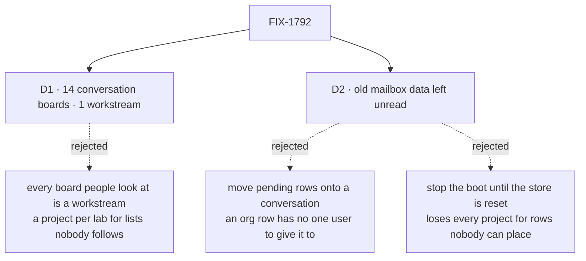

# FIX-1792 · Decisions

[Spec](SPEC.md) · **Decisions** · [Rules](BUSINESS-RULES.md) · [Plan](PLAN.md) · [Docs](DOCS.md) · [Evolution](EVOLUTION.md)

What was chosen, what lost, and what each choice locks in. Two decisions are the sign-off surface.
The counts here are the checker's ([poc/inventory](poc/inventory/README.md)), not a hand count.

## The tree

Solid edges are what you're signing. Dashed edges lost, and the label says why.

## D1 · 14 of the 15 files with boards keep them on the coordinator's conversation; the DevTeam's feature board becomes a workstream

| | |
|---|---|
| **Instead of** | Every board a lab's people look at becomes a workstream: kitchen-sink's escalations, Shift Manager's `desk.front` and `eng.desk` labs, the DevTeam's feature |
| **Because** | The epic's question, per board ([D5](../../epics/FIX-1786/DECISIONS.md#d5)): does the work outlive one conversation, and does a person track it? Only the DevTeam's feature does both: its project lists it today, people follow it for days, and its coding runs find the project through it. The rest are a coordinator's working list or fixtures that test board mechanics, which D5 sends to the conversation. Kitchen-sink's escalations is the close call: a person follows a case up, but nobody works that board in the app, kitchen-sink has no projects, and one list across customers' conversations is the sharing between users the epic rules out ([ER-18](../../epics/FIX-1786/BUSINESS-RULES.md#what-no-child-may-do)). Unclear goes to the conversation |
| **Locks in** | Every converted board belongs to one user, in the partition only its conversation reaches (epic [D6](../../epics/FIX-1786/DECISIONS.md#d6)). Only a coordinator files on its board, so in kitchen-sink a specialist's answer carries the case and the help coordinator files it, unassigned. A case shows in the conversation that filed it, in every tab on it, and nowhere else. In the DevTeam, the storefront project's feature and release work are two workstreams the lab's member opens; other members see each entry, not its tasks. No file declares a board any more: a lab that wants one people track opens a workstream |

![D1, where a mailbox's board goes. Chosen: 14 conversation boards and 1 workstream. Instead of: every board a lab's people look at becomes a workstream. It comes down to the first row: a board nobody follows stays a conversation's list with nothing new to set up, where the other way gives each lab a project and a workstream it never uses. The price is the second row: kitchen-sink's escalations show only in the conversation that filed them, where a workstream would show one list across a person's conversations but needs projects in kitchen-sink. The DevTeam's feature is a workstream either way. Locks in: every converted board belongs to one user, and no file declares a board. Flips if: kitchen-sink's support desk is meant to show one list of cases across a person's conversations](figures/d1-boards.svg)

It comes down to boards nobody follows: as workstreams, each lab grows a project it never uses.

### The table

| Tree · coordinator | Board | What it is used for | Becomes |
|---|---|---|---|
| kitchen-sink · `support.help` | `escalations` | A specialist files a case that needs a person; nobody works it; the team panel lists it | Conversation board. The specialist's answer carries the case; the coordinator files it, an unassigned row |
| `mailbox-boards` hire goal · `ops.desk` | `work` | A coordinator hires a worker and files it a task by name | Conversation board |
| `mailbox-boards` row goal · `eng.feature` | `triage`, `parked` | One worker files a row and another's board runs it; nobody drains `parked` | Conversation board; `parked` goes |
| `manager-queue-lab` · `eng.queue` (lab and two refusal trees) | `work` | The manager files a row per desk; each desk's worker takes its own | Conversation board; a row names its delegate |
| Shift Manager chief-of-staff goal · `desk.front` (two labs) | `work` | The landing summary counts what waits and what runs | Conversation board |
| Shift Manager look goal · `desk.front` | `work` | Every screen draws the board's rows | Conversation board |
| Shift Manager roster goal · `eng.desk` | `work` | The roster shows each worker's tasks; the lead drains it | Conversation board |
| `task-run-link` · `lab.desk` | `work` | Each handed-off row links its run | Conversation board |
| Shift Manager test labs · `ops.desk`, `eng.queue`, `lab.desk` | `work` | Tasks, asks, parked rows and runs in Shift Manager's tests | Conversation board |
| **DevTeam · `eng.feature`** | `work` | The team builds a feature; the storefront project lists it; its coding runs find the project through the claim | **Workstream** on storefront |
| DevTeam · `ops.release` | none | Storefront lists it beside `eng.feature` | **Workstream** on storefront |

Every file, with or without a board, is a row in the checker; [PLAN](PLAN.md#the-files) lists the
other 18.

**What would change my mind:** kitchen-sink's support desk being meant to show one list of cases
across all of a person's conversations. Then its escalations is a workstream, and kitchen-sink
gains one shared project.

## D2 · Old mailbox data stays in the store, unread; no pending task carries over

| | |
|---|---|
| **Instead of** | Moving each pending row on an old board onto the converted coordinator's conversation at first boot · or stopping the boot until the store is reset, as the channel rename did ([FIX-1748 D1](../FIX-1748/DECISIONS.md#d1)) |
| **Because** | A mailbox board is an org row, filed and run by whoever; a conversation belongs to one user. Moving a row means picking a user, and any pick can hand one member another's task, the leak the epic closes. A reset costs every project, worker and conversation in the store for rows nobody can place anyway. Rooms set the precedent: left in the store, unread, refused by name ([FIX-1793](../FIX-1793/DECISIONS.md#decided-not-asked)) |
| **Locks in** | Upgrading a store with tasks waiting on a mailbox board drops them from every view. The upgrade page says so, and says to finish or re-file them first. An operator can still read the rows; nothing reads them for you |

![D2, what happens to a mailbox's stored sessions and board rows. Chosen: left in the store, unread. Instead of: moving each pending row onto the converted coordinator's conversation, or stopping the boot until the store is reset. It comes down to the first row: whose a row is. Left unread, nobody guesses; moved, the boot must pick one user for an org row, and a pick can hand one member another's task. A reset keeps nothing else in the store. The price is the last row: a waiting task drops out of view and has to be re-filed, where moving it would keep it waiting. Locks in: pending mailbox tasks don't carry over on upgrade. Flips if: a store you run holds pending board tasks you want kept](figures/d2-old-data.svg)

It comes down to whose a row is: moving it means guessing, and a wrong guess shares a task.

**What would change my mind:** your DevTeam lab store, or the deployed kitchen-sink database,
holding pending board tasks you want kept. Then a one-off script you run once files them on the
converted coordinator's conversation as the user you name, and nothing reads old rows after.

## Decided, not asked

- **The conversion, key by key.** `description:` and the body unchanged; `flow: coordinator`
  added; `members:` → `delegates:`; `routing: { fallback: x }` → `routing: best-fit` and
  `fallback: x`; no `routing:` → `routing: everyone`. FIX-1791 reads a missing `routing:` as
  judgment, so a file without the line would start calling a model where its mailbox woke
  everyone. `rounds:` is left out (zero). `boards:` and `boardActions:` go. The epic's draft said
  "`routing:` unchanged"; FIX-1791's pinned keys made that wrong, and this DOCS.md corrects it.
- **A `flow:` naming a kind of the tree's own has no conversion.** Both such files name `digest`,
  a goal fixture's kind: one goes with the goal it served, one stays as an old file the refusal
  goal reads. `flows/mailboxes/` is refused by name at `fsdev gen` and, separately, at load, so an
  app that never regenerates is still refused. It is refused whatever it holds, where an empty
  `mailboxes/` team folder is passed over: a code slot is itself a declaration, a team folder
  declares only through its file. A flow that should run workers moves to `flows/workers/` and the
  worker-flow list ([FIX-1789](../FIX-1789/SPEC.md)).
- **A renamed file that keeps the old lines is refused by name**: `members:`, `boards:`,
  `boardActions:` or `mintFor:` on a `WORKER.md`, each with what replaced it.
- **The `CHANNEL.md` refusal stays until 1.0** ([FIX-1748](../FIX-1748/DECISIONS.md#d1)); it now
  names the `WORKER.md` conversion, so it never sends someone to a file that is itself refused.
- **A standard coordinator naming a delegate no file declares is refused at load**, by FIX-1791's
  BR-11. The pentest scenario that opened and skipped such a member now asserts the refusal.
- **No refusing `mailbox` flow is kept for old sessions.** The engine already answers
  `Unknown flow "mailbox"`; a flow kept only to refuse is a second path.
- **Goals convert by default.** 11 rewrite an outcome the epic changes (who sees a board's rows,
  a delegate instead of a desk, an unknown member refused). One retires because every subject it
  had is gone, and names what proves the rest. The pre-rename goal folds into this issue's goal
  check. The table is in [PLAN](PLAN.md#goals).
- **Claims, a project's list of mailboxes, `setWorkstreams` and `projectWritesMailboxInventory`
  are removed here**, as the epic records; the chief of staff loses `post-to-mailbox` and
  `setWorkstreams`.
- **The DevTeam's `release` leads a workstream** because storefront lists it; `triage` and
  `oncall` are coordinators no project lists, as today.
- **Desks are lab code** (`answersFor:` is read only by lab flows). A converted lab files for the
  delegate. A leg that can't hold on a conversation board goes to FIX-1794, or to FIX-1802 when it
  needs a delegate to file, not out of the goal.
- **Only a coordinator conversation files on its board** ([FIX-1794](../FIX-1794/SPEC.md) S1, S4).
  Kitchen-sink's `escalate` takes the coordinator's option 1 (review round 1): the specialist's
  answer carries the case, and the help coordinator files it with `fileTask` and no assignee,
  FIX-1794 BR-6's pending, unassigned row. No delegate-session filing, no second path, and
  FIX-1794 and the epic's D6 stay as merged.
- **A converted coordinator keeps its mailbox's id**, `<team>.<name>`, as a worker id; no tree on
  `main` has a worker by that name. Its conversation is found by `findWorkerSession({ worker })`,
  whose key-set match (FIX-1788 S5a) never returns a delegate's or a task's session.
- **The last PR is two.** P4a adds the refusals and the goal check; P4b removes the mailbox floor
  and adds no behaviour. Each is reviewed against one question, and S1 lands before S9.
- **Leg d's old store is a checked-in file** generated once from the commit P4a branches from, by a
  committed script, with the SHA beside it. After P4b no commit on `main` can write a mailbox
  store, so a store seeded "through today's code" would stop being old. A published older package
  can't seed it: the labs that open mailboxes aren't published.
- **The retiring goal retires on a condition**: each leg that still has a subject is named against
  a leg FIX-1791's, FIX-1794's or a converted goal passes on `main`, or it moves rather than goes.
- **Old-term exports left for FIX-1796:** `PRE_RENAME_NAMES` and its refusal helpers (until 1.0).
  The mailbox floor's exports are removed, not left.

## Considered and dropped

| Alternative | Why not |
|---|---|
| A loader that reads `MAILBOX.md` as a coordinator | The FIX-1367 lock: one way to declare a worker, and old files refused loudly |
| Converting files at boot | The same lock; every file is in this repo |
| Keeping org-scoped boards as a third shape | The epic's [D5](../../epics/FIX-1786/DECISIONS.md#d5): the shape this epic removes |
| Retiring every goal that ran on a mailbox | Kitchen-sink and the goals are the proof spine; the Architect's lock keeps them passing |

## Settled

- **The counts**: 33 files, 15 with boards, 16 boards, 3 `boardActions:`, 0 `mintFor:`, 2 `flow:`
  (both `digest`) — **CONFIRMED** by [poc/inventory](poc/inventory/README.md) on `cad4e2780`, and
  again on `ce06cb5c7` with the full removed-export list, its control refusing every plant.
- **FIX-1794's filing takes a delegate's session as a caller** — **REFUTED** at spec time against
  FIX-1794 S1, S4 and BR-21 ([architect](https://github.com/fixpoint-labs/flow-state-dev/pull/2833#issuecomment-6026639909)).
  D1's kitchen-sink row and BR-14 carry the coordinator's answer.

## How it got here

- **Draft** — framed as one declaration and a loud refusal over sibling-built parts; the census
  found 16 boards and two `flow:` lines naming a kind of the tree's own; D5 applied board by
  board, one workstream; old data left unread; four PRs.
- **Review round 1** — `escalate` stopped filing from a delegate's session, because FIX-1794
  refuses that caller: the coordinator files the case (the coordinator's decision, option 1). The
  last PR split into refuse and remove. `flows/mailboxes/` gained a load-time refusal. Leg d's old
  store became a pinned fixture. The `--after` gate covers the full removed-export list and only
  the two pinned old files.

**Open: none.**
