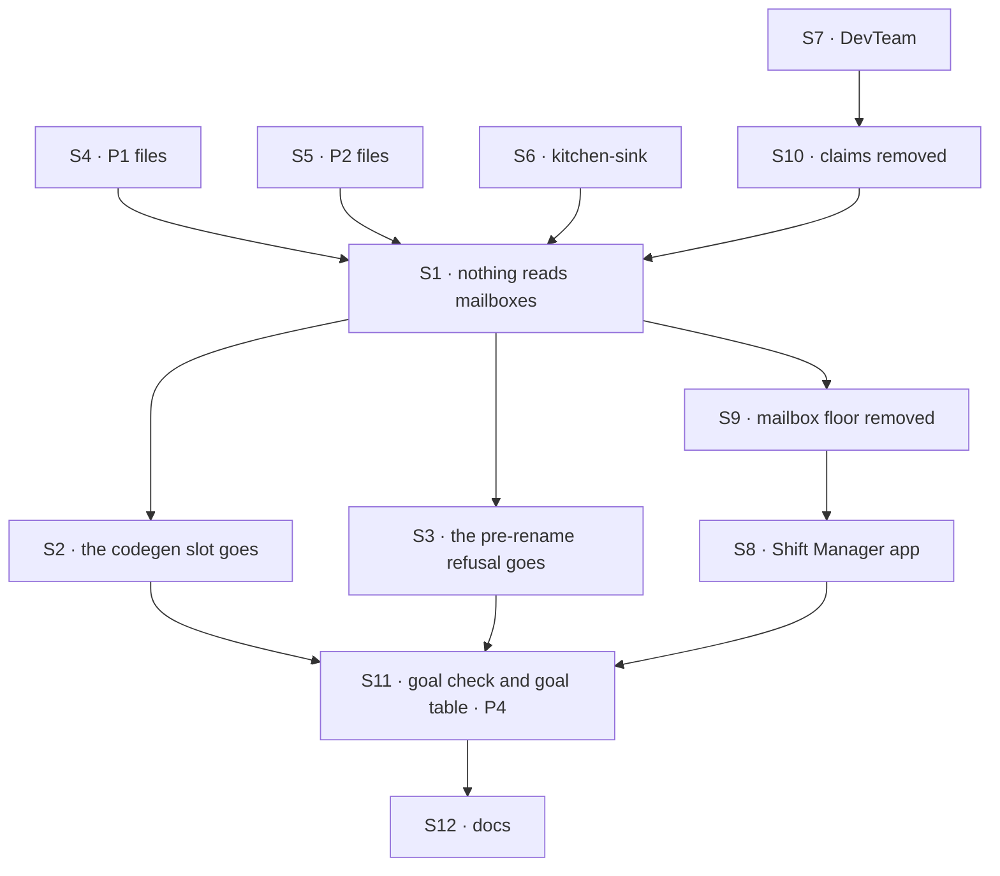

# FIX-1792 · Plan

[Spec](SPEC.md) · [Decisions](DECISIONS.md) · [Rules](BUSINESS-RULES.md) · **Plan** · [Docs](DOCS.md) · [Evolution](EVOLUTION.md)

Written for the implementing agent. IDs cross-reference [BUSINESS-RULES.md](BUSINESS-RULES.md)
(BR-n) and [DECISIONS.md](DECISIONS.md). `tdd`. Four PRs, a GitHub stack (epic ER-26). "FIX-1791
merged" means through its P2, where `everyone` ships; nothing here needs `rounds`. P1 starts after
FIX-1791; P2 also after FIX-1794 and FIX-1802; P3 also after FIX-1793 (epic D4, ER-23). P4, the
removal, lands last. Nothing here supports an old file or old data ([D2](DECISIONS.md#d2)).
Run `node specs/issues/FIX-1792/poc/inventory/check.mjs` in every PR and update its tables when a
classification changes.

## Surfaces

| ID | Package · role | Change | Rules |
|---|---|---|---|
| S1 | `workforce` · the loader | `read-mailboxes-directory.ts` and its tests go: nothing reads a `mailboxes/` folder or a `MAILBOX.md`. The roster, the manifest sources and `MailboxManifest` lose mailboxes. No refusal is added (D2) | BR-1 |
| S2 | `workforce` · codegen | The `flows/mailboxes` slot goes; `mailboxKinds` is no longer rendered; every committed `workforce.gen.ts` regenerated | BR-4 |
| S3 | `workforce` · the pre-rename module | `pre-rename.ts`, `PRE_RENAME_NAMES` and its refusals go, with their calls in the loader, codegen and binder, their tests, the DevTeam's pre-rename store test and the pre-rename goal; the rename guard script's allow list follows (D2, [decided, not asked](DECISIONS.md#decided-not-asked)) | BR-24 |
| S4 | goals · P1's files | The 10 board-less files in [the files](#the-files) marked P1, with their hosts and goals, on the coordinator flow | BR-7–BR-10 |
| S5 | goals, Shift Manager test labs · P2's files | The 11 board files outside kitchen-sink and the DevTeam, and the 2 sibling coordinators marked P2. Every worker that files keeps a `delegates:` list, and that list gives it the task tools: each converted coordinator that keeps a conversation board, and, where a member filed (manager-queue-lab's manager, multi-seat-collab's planner, the row goal's filer), that worker, whose desks become its `delegates:` and whose rows land on its own session's board. No file gains a `filing:` line. manager-queue-lab's two board-in-a-seat-folder refusal trees go with the leg they served | BR-13 BR-13a |
| S6 | kitchen-sink | `support.help` is a coordinator on `routing: best-fit` with `fallback: support.general`, converted key by key, with no board; its specialists take tasks, so it has the task tools (BR-13), and its instructions don't ask it to file. The escalation feature is removed, not replaced: the `escalate` tool and its test, the `no-filing` control, the escalations board, panel and board ref, and the specialists' escalation instruction. The mailbox notify, wiring and other controls go or move to the coordinator; panels find the conversation by worker id (BR-7a) | BR-7a BR-14 BR-25 |
| S7 | `shift-manager` · DevTeam | Storefront's seed opens two workstreams, `feature` and `release`, as the lab's second user, `LAB_USERS.member`, not its owner; the closure doesn't rely on them, since its owner opens her own `feature` through the app (FIX-1797 b5); the `feature` and `release` files become them, not `WORKER.md` files. The EM leads both as an ordinary worker: it takes the project coordinator's delegated post (FIX-1791 S9) and files the coder's tasks on its workstream session's board. Its `WORKER.md` gains `delegates:` naming the coder and reviewer, which take tasks, and that list gives it the task tools. The EM's `em` flow composes `createTaskToolsCapability(resolver, roster)` on its generator block, with the session's board as the resolver and the task-taking delegates as the roster, and spreads `taskToolActions(<board id>, resolver, roster)` into its `actions`. The chief of staff keeps its `delegates:` list, which gives it the tools. `triage`, `oncall` are coordinators; the host, notify, board, `em` and `coder` move off mailboxes; the chief of staff loses `post-to-mailbox` and `setWorkstreams` | BR-13a BR-15–BR-17 |
| S8 | `shift-manager` · the app | Reads workstream entries and conversation boards, never mailboxes or claims; renders `coordinator-route` | BR-17 BR-18 |
| S9 | `workforce`, `ui`, `devtool`, `react`, `contracts` · **removals** | The mailbox flow, binder, boards and `mailboxTaskLists`, route record, best-fit wrapper, wake, post lines (unless FIX-1791 took them), `post-to-mailbox`; the hire's `mailboxBoards`, `agent`'s mailbox `taskLists`, and `mailboxBoardTaskTools`, the mailbox's wrapper over orchestration's task tools; the inventory's mailbox and membership rows; discovery's `mailboxes` domain: its entry in `MANIFEST_DOMAINS` (`contracts`), the workforce's mailboxes manifest source, and the domain in `discover`'s description (`core`), so the pinned list is `seats`, `skills`, `resources` (FIX-1796 renames `seats`), a Layer 1 public removal the epic's D3 counts (ER-22); their exports and tests. The checker's `REMOVED_EXPORTS` is the list ([poc/inventory](poc/inventory/README.md)) | BR-5a BR-18 BR-23 |
| S10 | `workforce` · projects · **removals** | Claims stop being declared; a project's `workstreams` field, `setWorkstreams`, `projectWritesMailboxInventory` and `projectWorkspace`'s claim path go. Nothing refuses a write that still carries `workstreams` by name (D2) | BR-16 BR-18 |
| S11 | goals | The goal check, `goals/coordinators/every-coordinator-is-a-worker-file/`, legs a and b. [The goal table](#goals) re-runs in P4; three goals retire there, one on [its condition](#at-implement-time) | BR-24 · goal |
| S12 | Docs | [DOCS.md](DOCS.md), in P4. The READMEs it names. A `minor` changeset for each published package whose exports S9 removes: one sentence naming what's gone, no upgrade steps (epic D9's changeset policy) | — |

## Sequence · the PR plan

| PR | Delivers | Depends on |
|---|---|---|
| P1 · coordinators without boards | S4, S6 | FIX-1791 merged, through its P2 (`everyone`) |
| P2 · session boards | S5 | FIX-1791 through its P2, FIX-1794 and FIX-1802 merged |
| P3 · the DevTeam, its workstreams, and claims | S7, S10, S8's DevTeam parts | FIX-1791 through its P2, FIX-1793, FIX-1794 and FIX-1802 merged |
| P4 · remove | S1, S2, S3, S9, the rest of S8, S11, S12; VG | P1, P2, P3 |



The mailbox flow keeps running until P4, so P1 to P3 each land green on their own. P4 adds no
behaviour. It is judged by `check.mjs --after`, the goal check and the goal table, and reviews as
one question: does anything still import this.

## The files

The 33 rows are the checker's `FILES`. Board files and their targets are [D1's table](DECISIONS.md#the-table).

| PR | Files |
|---|---|
| P1 | pentest-lab's 6 (`lab/workforce`, two refusal trees and their twins, the unknown-member scenario) · `a-routed-post-gets-one-answer`'s `help` and `lounge` · `a-fresh-host-wakes-its-member-agents`'s `front` · `it-sends-a-turn-into-a-seat-session`'s `front` · kitchen-sink's `help`, whose board goes with its feature |
| P2 | The 11 board files of D1's table outside kitchen-sink and the DevTeam (S5) · `it-shows-who-is-on-shift`'s `ops.desk` and `ask-lab`'s `side`, which share a lab with a board file · manager-queue-lab's two board-in-a-seat-folder trees, removed with their leg |
| P3 | The DevTeam's `feature`, `release`, `triage`, `oncall` |
| P4 | The pre-rename goal's `front` and `notices`, and `mailbox-boards`'s `notices`, removed with their retired goals |

Every converted file's `MAILBOX.md` is deleted in the PR that converts it.

## Goals

Every goal unit the checker finds, by disposition. CONVERT and REWRITE re-run on P4's commit with
a verdict line; a REWRITE states its new outcome in `goal.md` and logs the old run's FAIL first.

| Disposition | Goals |
|---|---|
| **REWRITE** (13) | devforce-lab `it-keeps-its-rows-on-the-mailboxes-board` (the org sees the entry, the owner the rows) · devtool `the-checklist-rows` (row 5: workers and a coordinator's delegates) · kitchen-sink-talk `a-person-talks-to-a-seat-a-mailbox-and-back` and `answers-a-clerk-note-or-files-it` (the escalation legs and the `no-filing` control go) · manager-queue-lab's two goals and `lab` (the manager files for its `delegates:`, which give it the task tools; a row names its delegate; the board-in-a-seat-folder leg goes with its trees) · multi-seat-collab's goal and `run-scenario.mts` (the planner files for delegates, not desks) · org-seats `cos-changes-the-roster` (the delegate read, not `discover`) · pentest `a-post-reaches-both-declared-seats` (BR-10) · shift-manager `it-opens-a-lab` (a workstream shows its entry; its owner sees the lead's board) · workforce-conventions `code-comes-from-files-alone` (its `flows/mailboxes` leg goes with the slot) |
| **RETIRE** (3) | workforce-conventions `a-mailbox-holds-the-work-a-seat-drains`: its mailbox subjects are gone; retired in P4 only on the condition in [At implement time](#at-implement-time) · kitchen-sink-talk `lists-a-filed-case-without-a-reload`: the escalation feature is removed, so nothing files a case · workforce-mailboxes `a-pre-rename-lab-is-refused-by-name`: the pre-rename refusal is removed (D2) (BR-24) |
| **FIX-1793** (1) | shift-manager `it-groups-workstreams-under-their-projects`: rewritten there, re-run here |
| **EDIT** (6) | `goals/README.md`, agent-discovery, design-system, hire-plane, workforce-packages, `capabilities-come-from-files-alone`: a field or a word |
| **CONVERT** (26) | The rest, each with its line in the checker's `GOALS` |

## Checks

| ID | Runs after | Passes when |
|---|---|---|
| V1 | S1 S3 | BR-1: the loader and roster tests PASS with every mailbox and pre-rename case removed, and no tree, roster or manifest source holds a mailbox |
| V2 | S2 | BR-4; no committed `workforce.gen.ts` renders `mailboxKinds` |
| V3 | S4 | P1's goals PASS; BR-8, BR-9, BR-10 through them |
| V4 | S5 S6 | BR-13, BR-13a: each converted coordinator with a board, and each member that filed, has the task tools because a delegate takes a task, with no `filing:` line, through `createTaskToolsCapability(resolver, roster)`, a member's rows on its own session's board; a worker none of whose delegates takes a task has none and files nothing; BR-14: the escalation tool, board, panel and control are gone from kitchen-sink; BR-7a; P2's goals and kitchen-sink's suite PASS. **D1** |
| V5 | S7 S10 | BR-13a, BR-15–BR-17; no claim read anywhere (grep plus a test that deletes the claim rows and still runs); P3's goals PASS |
| V6 | S9 | BR-5a, BR-18, BR-23: `check.mjs --after` PASSES on P4, after it FAILED on `main`. `--control` PASSES: the gate refuses a removed export it once missed and a `MAILBOX.md` left in the tree. **D2** |
| V7 | S6 S7 | BR-25: kitchen-sink's named-org test and the DevTeam's legacy-org test PASS |
| VG | S11 | [The goal](SPEC.md#the-goal-and-how-well-know-its-met): `goals/coordinators/every-coordinator-is-a-worker-file/run.mts` legs a and b PASS on P4, after FAILING under `GOAL_CONTROL=mailbox-left` and on today's `main`, and every CONVERT and REWRITE goal has a PASS line on that commit |

One check per decision: D1 by V4 and V5, D2 by V6. The second path (BP-035): a half-converted
tree (V6's control), two users (V4), a worker whose delegates only take posts (V4). An old store is
not a path while there are no consumers (D2).

## Pinned names

| Where | Name | Why pinned |
|---|---|---|
| The goal check | `goals/coordinators/every-coordinator-is-a-worker-file/` | VG cites it; sits beside FIX-1791's and FIX-1794's |
| The control | `GOAL_CONTROL=mailbox-left` | VG |
| A converted coordinator | `teams/<team>/workers/<name>/WORKER.md`, id `<team>.<name>` | Goals and apps address it by the mailbox's id, as a worker id (BR-7a); no collision on `main` |
| The task tools (orchestration's) | `createTaskToolsCapability(resolver, roster)` and `taskToolActions(<board id>, resolver, roster)` in `packages/orchestration/src/skills/task-tools-capability.ts`; the tools `addTask`, `assignTask`, `completeTask`, `failTask`, `blockTask`, `cancelTask`, `updateTask`, `listTasks`; `delegates:` in a `WORKER.md` | The capability and the actions exist on `main`; T1 (FIX-1794, amended by #2839) adds the per-call roster and the actions' roster; FIX-1802's wiring puts them on worker flows; converted files and READMEs write them |

Everything else is yours to name, in the new terms.

## Guardrails

| Rule | Because |
|---|---|
| No loader reads `MAILBOX.md`, nothing converts at boot, and nothing refuses an old file, key, write or domain by name | The FIX-1367 lock: one way; D2: no backwards support while there are no consumers |
| Nothing reads, moves or migrates old mailbox data, and nothing dual-reads | D2; BP-030 doesn't apply while there are no consumers |
| A converted worker keeps the flow it names | The epic's note from Jake's concept comment |
| No goal stops running without a line naming what proves its outcome | Goals and kitchen-sink are the proof spine (the Architect's lock) |
| Nothing new builds on the mailbox flow between P1 and P4 | The conversion must not grow (FIX-1791's guardrail) |
| A worker has the task tools when at least one of its `delegates:` can take a task, and only then; no file has a `filing:` line. The tools are orchestration's `createTaskToolsCapability(resolver, roster)`, with the session's board as the resolver and the task-taking delegates as the roster: the built-in `agent` and coordinator flows carry them, and the EM's `em` flow composes the capability on its generator block and spreads `taskToolActions(<board id>, resolver, roster)` into its `actions`, so the EM keeps `flow: em`. Nothing files any other way | The product owner's answer (2026-10-07); FIX-1802's wiring of the existing task tools |
| P4 adds no behaviour | It reviews as "nothing imports this", gated by `--after` |
| Every converted host and fixture keeps org identity required | FIX-1442 |

## Docs

Reconcile [DOCS.md](DOCS.md) against what ships, and publish it in P4.

## Sketch · pseudocode, illustrative, react to the shape

```
on each call that lists a session's tools or runs one of its task actions:
    takers = [d for d in this session's delegates if d's flow serves the task entry]   ← read per call, the list the assignee check reads; it starts as a copy of the file's delegates:
    if takers is empty: no task tools, and the actions answer no_delegation_board
    else: uses += createTaskToolsCapability(resolve = this session's board, roster = takers)
an app flow (the EM's em): the same capability on its generator block,
    and actions = { ...ownActions, ...taskToolActions(<board id>, resolver, roster) }
```

**POC:** [`poc/inventory/`](poc/inventory/README.md), the checker the factual base rests on. It
confirmed the issue's 33 files and 15 board files, found 16 boards and two `flow:` lines naming a
kind of the tree's own, and classifies 197 files, 49 goal units and the removed exports. Its control refuses every plant.

## At implement time

- Take FIX-1791's shipped keys and FIX-1793's workstream action. If any differ from this plan,
  use theirs.
- The task tools are orchestration's, on `main` today. FIX-1802's wiring of the existing task
  tools puts them on worker flows; if it ships a different wiring, use that.
  FIX-1791's default policy is being amended on #2837 (evaluator first, judgment as the fallback);
  every converted file writes `routing:` explicitly, so the amendment changes nothing here.
- `everyone` must not be cut from FIX-1791 P2 (round robin is its stated first cut, and no file
  here uses round robin or `rounds`). If it is, raise it on FIX-1791; there's no second path.
- Where a member filed on a mailbox board when a post reached it (manager-queue-lab's manager,
  multi-seat-collab's planner, the row goal's filer, the DevTeam's EM), give its `WORKER.md`
  `delegates:` naming whom it filed for, which gives it the task tools when they take tasks, and
  let it file on its own session's board. No coordinator files for a member. No converted step
  waits on another issue; one that can't hold on a session board is retired under BR-24 with its
  reason.
- The EM names `flow: em`, and a converted worker keeps its flow (BR-12). It takes the project
  coordinator's delegated post through FIX-1791 S9's entry, which an app flow can declare. The
  EM's `em` flow composes `createTaskToolsCapability(resolver, roster)` on its generator block and
  spreads `taskToolActions(<board id>, resolver, roster)` into its `actions`. A flow definition has no `uses`, and no core
  change is needed. If an app flow can't take the capability, raise it on FIX-1802 rather than
  moving the EM.
- Before retiring `a-mailbox-holds-the-work-a-seat-drains` in P4: FIX-1794's goal check and
  FIX-1791's must have PASS verdicts on `main`. Name each leg that still has a subject against a
  passing leg: V8's subset drain (FIX-1794 leg c), V14's writer half (FIX-1791's answers), V2's
  kind spread and V10's vocabulary (`code-comes-from-files-alone`, kitchen-sink-talk). A leg with
  no home moves into a converted goal; the retirement waits until it has one.
- The `feature` file names `eng.coder`, `eng.reviewer` and `chief-of-staff` as members. The EM
  files for the coder and reviewer, its `delegates:`. The chief of staff,
  on the coordinator flow, takes no delegated post (FIX-1791 S9, BR-4) and isn't carried over; say
  so in the PR.
- manager-queue-lab's "waits for its desk to free": if a session board can't hold it, take it to
  FIX-1794 (board mechanics) or FIX-1802 (the task tools on worker flows); if it still can't,
  retire the step under BR-24 with its reason.
- FIX-1791 may have moved post lines or best fit out of the mailbox folder; remove only what
  nothing imports.
- If a consumer of mailboxes appears before P4 lands, stop and raise it: D2 flips, and a refusal
  with an upgrade page lands first.

## Notes from review

Inputs, not instructions. Adopt, adapt or discard.

- "This is the only sampled inventory POC that unions `git ls-files` with `--others --exclude-standard`. FIX-1793's control uses `git add --intent-to-add` on a tracked plant instead. Either is defensible; worth one sentence in `poc/inventory/README.md` on *why* untracked union is required here (if the real failure mode is "forgot to `git add`"), or align with 1793 so implementers learn one control pattern across the mailbox epic." — cursor ([thread](https://github.com/fixpoint-labs/flow-state-dev/pull/2833#discussion_r4201042281))
- "`read()` swallows all read errors and returns `undefined`, which skips the file silently in the scan loop. For tracked paths this is probably fine; if this script ever runs in CI on a partial checkout, consider failing loud on `ENOENT` for paths `git ls-files` returned." — cursor ([thread](https://github.com/fixpoint-labs/flow-state-dev/pull/2833#discussion_r4201042289))
- "`classed[c[0]]` buckets by the *first character* of the disposition string (`"R · S12 · …"`). Works today, but a label like `"REMOVE · …"` or a leading space would skew the summary counts without failing totality. A one-line comment tying counts to that prefix convention, or bucketing on `c.split('·')[0].trim()`, would make this safer through P4 edits." — cursor ([thread](https://github.com/fixpoint-labs/flow-state-dev/pull/2833#discussion_r4201042300))
- "Part 2 walks every non-skipped file and applies this large alternation regex to full file bodies. FIX-1793 already uses `git grep -E` for identifier hits, then classifies paths — much less I/O and the same totality story for identifier matches. Consider grep-first for non-`goals/` paths and reserve full reads for `/mailbox/i` goal prose + `--after` `REMOVED_EXPORTS` (overlapping identifiers with 1793 are another reason to share shape, not necessarily a shared module)." — cursor ([thread](https://github.com/fixpoint-labs/flow-state-dev/pull/2833#discussion_r4201042307))
- "Requiring `check.mjs` + table updates in *every* implementation PR is the right anti-skip guard, but with ~189 `FILE_CLASS` rows it is the highest ongoing tax in this spec. If P1–P3 churn becomes painful, consider amending PLAN to allow "touch only rows for paths changed in this PR" while keeping census + `--after` full totality — *if* you still run identifier grep on the whole tree each time." — cursor ([thread](https://github.com/fixpoint-labs/flow-state-dev/pull/2833#discussion_r4201042312))
- "Title/issue name emphasize refuse-by-name; the fold above correctly states the full goal (coordinator flow, boards, claims, goal legs). For reviewers scanning the PR list only, one short subtitle in the PR description ("four PRs · D1/D2 · inventory POC") already helps — not a spec edit requirement." — cursor ([thread](https://github.com/fixpoint-labs/flow-state-dev/pull/2833#discussion_r4201042317))
- "**Align Part 2 with FIX-1793's runner** (`specs/issues/FIX-1793/poc/removal-inventory/check.mjs`: `git grep` for identifiers, classified path set) | Less duplicate scan logic; shared overlap on `mintFor`, `setWorkstreams`, claims. Keep full-file read only for goal `/mailbox/i` prose and `--after` `REMOVED_EXPORTS`." — cursor ([review](https://github.com/fixpoint-labs/flow-state-dev/pull/2833#pullrequestreview-5435243585))
- "**Split ledger from runner** (FIX-1575 / FIX-1611 pattern: `ledger.mjs` + thin `check.mjs`) | Same behavior; easier PR-by-PR table edits during P1–P4." — cursor ([review](https://github.com/fixpoint-labs/flow-state-dev/pull/2833#pullrequestreview-5435243585))
- "**Two-tier totality** | Census + `MAILBOX.md` `FILES`/`EXPECT` stay in spec; defer or generate "unclassified" for the full repo until P4, or classify only paths touched per PR. Weakens "nothing slips" during P1–P3 unless CI still runs grep." — cursor ([review](https://github.com/fixpoint-labs/flow-state-dev/pull/2833#pullrequestreview-5435243585))
- "**Split Linear issues** (refuse/convert vs remove floor) | Smaller sign-off surface; **rejected by current epic framing** — only if product re-slices." — cursor ([review](https://github.com/fixpoint-labs/flow-state-dev/pull/2833#pullrequestreview-5435243585))
- "**Dual maintenance with FIX-1793** on overlapping paths and identifiers (`FILE_CLASS` rows tagged `T · FIX-1793` vs 1793's own `EDIT` map)." — cursor ([review](https://github.com/fixpoint-labs/flow-state-dev/pull/2833#pullrequestreview-5435243585))
- "**`stale` registry keys** are reported but do not fail — fine for ergonomics; easy to misread PASS as "registry still accurate."" — cursor ([review](https://github.com/fixpoint-labs/flow-state-dev/pull/2833#pullrequestreview-5435243585))
- "**Perf** — full-repo `readFileSync` per file is fine for a manual/occasional gate; if this lands in every PR CI, consider grep-first or caching (low priority today)." — cursor ([review](https://github.com/fixpoint-labs/flow-state-dev/pull/2833#pullrequestreview-5435243585))

- (Superseded: the escalation feature is removed, 2026-10-06) "An `Escalate:` line goes unfiled in two cases. One is an answer that lands after the round's deadline (FIX-1791 BR-24b). The other is an answer to a hand-off made in the woken turn (BR-25). Tell the coordinator not to hand off in that turn, and cover a late answer in V5 or on the upgrade page." — fsd-head-of-engineering, round 2 ([review](https://github.com/fixpoint-labs/flow-state-dev/pull/2833#pullrequestreview-5435442811))
- "An unassigned filing triggers the board's run (FIX-1794 BR-10, BR-10a). Check that the run clears the pending-wake marker on a row nobody is assigned. Also check that the coordinator doesn't treat the filing's "assign it" reply as a failure." — fsd-head-of-engineering, round 2 ([review](https://github.com/fixpoint-labs/flow-state-dev/pull/2833#pullrequestreview-5435442811))
- "BR-7a: `findWorkerSession({ worker })` returns the user's *most recent* conversation, so a panel should read the conversation it is showing. A workstream session carries `workstreamId`, so `{ worker: eng.feature }` never finds it (S5a)." — fsd-head-of-engineering, round 2 ([review](https://github.com/fixpoint-labs/flow-state-dev/pull/2833#pullrequestreview-5435442811))

## Follow-ups

- Goal folder names `workforce-mailboxes/` and `mailbox-boards/`, kitchen-sink's control file
  names, and the remaining word: FIX-1796.
- The epic's ER-6, third clause (an old `MAILBOX.md` refused by name), the epic's DOCS draft of
  the upgrade page, and FIX-1796's DOCS link to `upgrading.md` follow D2's answer: an epic
  amendment, not this issue's files.
- Files as migrations, held for later (the epic).
