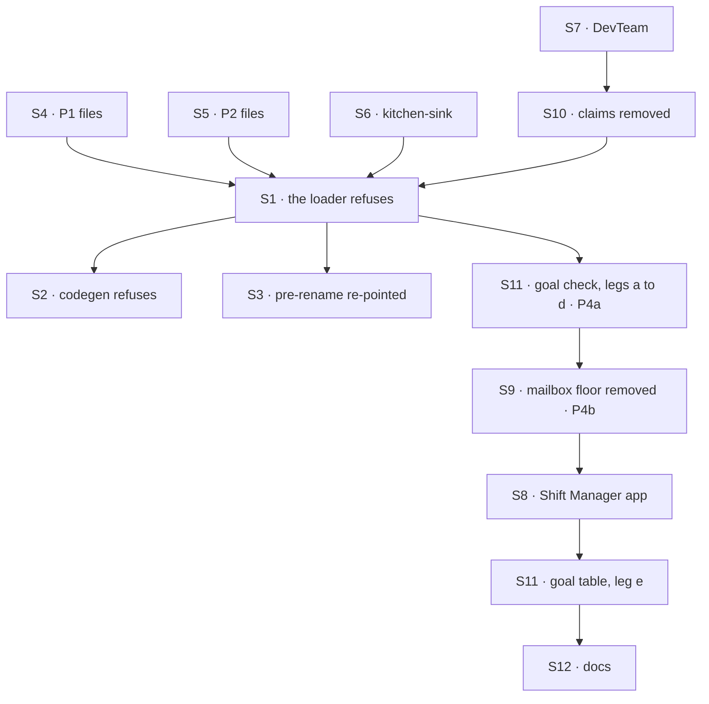

# FIX-1792 · Plan

[Spec](SPEC.md) · [Decisions](DECISIONS.md) · [Rules](BUSINESS-RULES.md) · **Plan** · [Docs](DOCS.md) · [Evolution](EVOLUTION.md)

Written for the implementing agent. IDs cross-reference [BUSINESS-RULES.md](BUSINESS-RULES.md)
(BR-n) and [DECISIONS.md](DECISIONS.md). `tdd`. Five PRs, a GitHub stack (epic ER-26). "FIX-1791
merged" means all of its PRs: `everyone` and `rounds` ship in its P2. P1 starts after FIX-1791;
P2 after FIX-1791 and FIX-1794; P3 also after FIX-1793 (epic D4, ER-23). P4a, the refusal, lands
before P4b, the removal.
Run `node specs/issues/FIX-1792/poc/inventory/check.mjs` in every PR and update its tables when a
classification changes.

## Surfaces

| ID | Package · role | Change | Rules |
|---|---|---|---|
| S1 | `workforce` · the loader | `read-mailboxes-directory.ts` becomes the refusal: a `mailboxes/` folder holding a `MAILBOX.md` stops the load, every one collected. The same refusal checks the workforce root for `flows/mailboxes/`, so the declared-roster read every boot takes refuses it without codegen. The roster, the manifest sources and `MailboxManifest` lose mailboxes. A `WORKER.md` with a mailbox-only key is refused by name | BR-1–BR-3 BR-4a BR-5 |
| S2 | `workforce` · codegen | The `flows/mailboxes` slot is refused by name; `mailboxKinds` is no longer rendered; every committed `workforce.gen.ts` regenerated | BR-4 |
| S3 | `workforce` · the pre-rename module | The `CHANNEL.md` and `channels/` refusals name the `WORKER.md` conversion; the rename guard script's allow list follows | BR-6 |
| S4 | goals · P1's files | The 10 board-less files in [the files](#the-files) marked P1, with their hosts and goals, on the coordinator flow | BR-7–BR-10 |
| S5 | goals, Shift Manager test labs · P2's files | The 13 board files outside kitchen-sink and the DevTeam, and the 2 sibling coordinators marked P2. Each board's work goes on the conversation's board through FIX-1794's filing; desks become delegates | BR-13 |
| S6 | kitchen-sink | `support.help` is a coordinator on `routing: judgment`, `rounds: 1`, with no `fallback:`. The `escalate` tool goes: each specialist's `WORKER.md` ends an escalating answer with `Escalate: <the case>`, and the coordinator's instructions file that case on its own conversation's board with FIX-1794's `fileTask` and no assignee (FIX-1794 BR-6), in the turn the closed round wakes (FIX-1791 BR-24). No delegate session files and no second filing path is added; the `no-filing` control takes `fileTask` from the coordinator's turn. The mailbox notify, wiring and controls go or move to the coordinator; panels find the conversation by worker id (BR-7a) and read its board | BR-7a BR-14 BR-25 |
| S7 | `shift-manager` · DevTeam | `eng.feature` is a coordinator on `routing: judgment`, `rounds: 1`, its board its conversation's; the EM's answer says what to file and the woken turn files it. `ops.release`, `triage`, `oncall` are coordinators with no board. Storefront's seed opens no workstream and writes no list: the DevTeam's workstreams need a coordinator to take a delegated post, and come with FIX-1802; the host, notify, board, `em` and `coder` move off mailboxes; the chief of staff loses `post-to-mailbox` and `setWorkstreams` | BR-15–BR-17 |
| S8 | `shift-manager` · the app | Reads workstream entries and conversation boards, never mailboxes or claims; renders `coordinator-route` | BR-17 BR-18 |
| S9 | `workforce`, `ui`, `devtool`, `react`, `contracts` · **removals** | The mailbox flow, binder, boards and `mailboxTaskLists`, route record, best-fit wrapper, wake, post lines (unless FIX-1791 took them), `post-to-mailbox`; the hire's `mailboxBoards` and `agent`'s mailbox `taskLists`; the inventory's mailbox and membership rows; discovery's `mailboxes` domain: its entry in `MANIFEST_DOMAINS` (`contracts`), the workforce's mailboxes manifest source, and the domain in `discover`'s description (`core`), so the pinned list is `seats`, `skills`, `resources` (FIX-1796 renames `seats`); their exports and tests. The checker's `REMOVED_EXPORTS` is the list ([poc/inventory](poc/inventory/README.md): 29 files, about 11,700 lines) | BR-5a BR-18 BR-19 BR-22 BR-23 |
| S10 | `workforce` · projects · **removals** | Claims stop being declared (rows kept); a project's `workstreams` list, `setWorkstreams`, `projectWritesMailboxInventory` and `projectWorkspace`'s claim path go; a write carrying `workstreams` is refused by name | BR-16 BR-20 BR-21 |
| S11 | goals | The goal check folds in the pre-rename goal and its two old files move under it unchanged (P4a). Leg d's old store is a checked-in SQLite file, generated once by a committed script against the commit P4a branches from, with that SHA recorded beside it. [The goal table](#goals) re-runs in P4b; one goal retires there, on [its condition](#at-implement-time) | BR-24 · goal |
| S12 | Docs | [DOCS.md](DOCS.md): the upgrade page in P4a, since every refusal links it; the rest in P4b. The READMEs it names; a `minor` changeset for `workforce` | — |

## Sequence · the PR plan

| PR | Delivers | Depends on |
|---|---|---|
| P1 · coordinators without boards | S4 | FIX-1791 merged, through its P2 (`everyone`) |
| P2 · conversation boards | S5, S6 | FIX-1791's P2 (`rounds`) and FIX-1794 merged |
| P3 · the DevTeam and claims | S7, S10, S8's DevTeam parts | FIX-1791's P2 (`rounds`), FIX-1794 and FIX-1793 merged. S7 alone no longer needs FIX-1793; S10 does, since removing the claim path edits FIX-1793's `projectWorkspace` and BR-21 names its workstream action |
| P4a · refuse | S1, S2, S3; S11's goal check, legs a to d; the upgrade page | P1, P2, P3 |
| P4b · remove | S9, the rest of S8, S11's goal table and retirement, the rest of S12; VG with leg e | P4a |



The mailbox flow keeps running until P4b, so P1 to P4a each land green on their own. P4a is
new behaviour, judged by the goal check; P4b adds none, and is judged by `check.mjs --after` and
the goal table. Each reviews as one question.

## The files

The 33 rows are the checker's `FILES`. Board files and their targets are [D1's table](DECISIONS.md#the-table).

| PR | Files |
|---|---|
| P1 | pentest-lab's 6 (`lab/workforce`, two refusal trees and their twins, the unknown-member scenario) · `a-routed-post-gets-one-answer`'s `help` and `lounge` · `a-fresh-host-wakes-its-member-agents`'s `front` · `it-sends-a-turn-into-a-seat-session`'s `front` |
| P2 | The 14 board files of D1's table outside the DevTeam: S5's 13 and kitchen-sink's · `it-shows-who-is-on-shift`'s `ops.desk` and `ask-lab`'s `side`, which share a lab with a board file |
| P3 | The DevTeam's `feature`, `release`, `triage`, `oncall` |
| P4a | The pre-rename goal's `front` and `notices` move, unchanged, under the goal check as old files, at the checker's `AFTER_FIXTURES` paths |
| P4b | `mailbox-boards`'s `notices` removed with its retired goal |

## Goals

Every goal unit the checker finds, by disposition. CONVERT and REWRITE re-run on P4b's commit with
a verdict line; a REWRITE states its new outcome in `goal.md` and logs the old run's FAIL first.

| Disposition | Goals |
|---|---|
| **REWRITE** (11) | devforce-lab `it-keeps-its-rows-on-the-mailboxes-board` (only the feature coordinator's user sees the rows; another member sees nothing) · devtool `the-checklist-rows` (row 5: workers and a coordinator's delegates) · manager-queue-lab's two goals and `lab` (a row names its delegate; `boards:` on a worker refused by name) · multi-seat-collab's goal and `run-scenario.mts` (delegates, not desks) · org-seats `cos-changes-the-roster` (the delegate read, not `discover`) · pentest `a-post-reaches-both-declared-seats` (BR-10) · shift-manager `it-opens-a-lab` (the DevTeam's feature opens as its coordinator's conversation; only its user sees the board) · workforce-conventions `code-comes-from-files-alone` (the slot refused) |
| **RETIRE** (2) | workforce-conventions `a-mailbox-holds-the-work-a-seat-drains`: its mailbox subjects are gone; retired in P4b only on the condition in [At implement time](#at-implement-time) · devforce-lab `it-codes-in-the-projects-repository`: a DevTeam run has no project until FIX-1802; FIX-1793's goal check proves a run placed through its workstream (BR-24) |
| **FOLD** (1) | workforce-mailboxes `a-pre-rename-lab-is-refused-by-name` → the goal check |
| **FIX-1793** (1) | shift-manager `it-groups-workstreams-under-their-projects`: rewritten there, re-run here |
| **EDIT** (6) | `goals/README.md`, agent-discovery, design-system, hire-plane, workforce-packages, `capabilities-come-from-files-alone`: a field or a word |
| **CONVERT** (28) | The rest, each with its line in the checker's `GOALS` |

## Checks

| ID | Runs after | Passes when |
|---|---|---|
| V1 | S1 | BR-1–BR-3, BR-4a, BR-5 on fixture trees: one old file; two in two teams, both named; an empty `mailboxes/`; a `flows/mailboxes/` folder with a stale generated module and with none; a renamed file with each old key. Nothing registered on a refusal |
| V2 | S2 | BR-4; no committed `workforce.gen.ts` renders `mailboxKinds` |
| V3 | S3 | BR-6 names `WORKER.md`, never `MAILBOX.md` |
| V4 | S4 | P1's goals PASS; BR-8, BR-9, BR-10 through them |
| V5 | S5 S6 | BR-13; BR-14 with two users and two tabs: an answer with an `Escalate:` line wakes the coordinator's turn once and that turn files one row, unassigned and pending; an answer without one files nothing; the delegate's session made no filing call; one coordinator turn per answered post, no more; BR-7a; P2's goals and kitchen-sink's suite PASS. **D1** |
| V6 | S7 S10 | BR-15–BR-17, BR-21; no claim read anywhere (grep plus a test that deletes the claim rows and still runs); P3's goals PASS |
| V7 | S9 | BR-18, BR-19, BR-22 on leg d's pinned old store, rows compared byte for byte; BR-5a. **D2** |
| V8 | S9 | `check.mjs --after` PASSES on P4b, after it FAILED on `main` (BR-23). `--control` PASSES: the gate refuses a removed export it once missed and a fixture left at its old path |
| V9 | S6 S7 | BR-25: kitchen-sink's named-org test and the DevTeam's legacy-org test PASS |
| VG | S11 | [The goal](SPEC.md#the-goal-and-how-well-know-its-met): `goals/coordinators/refuses-a-mailbox-file-by-name/run.mts` legs a to d PASS on P4a, after FAILING under `GOAL_CONTROL=silent-skip` and on today's `main`. On P4b, every leg PASSES with leg e, and every CONVERT and REWRITE goal has a PASS line on that commit |

One check per decision: D1 by V5 and V6, D2 by V7. The second path (BP-035): an old store (V7), a
half-converted tree (V1), an app that never regenerated (V1), two users (V5), a renamed file (V1).

## Pinned names

| Where | Name | Why pinned |
|---|---|---|
| The goal check | `goals/coordinators/refuses-a-mailbox-file-by-name/` | VG cites it; sits beside FIX-1791's and FIX-1794's |
| The control | `GOAL_CONTROL=silent-skip` | VG |
| The upgrade page | `apps/docs/docs/workforce/upgrading.md` | Every refusal links it |
| A converted coordinator | `teams/<team>/workers/<name>/WORKER.md`, id `<team>.<name>` | Goals and apps address it by the mailbox's id, as a worker id (BR-7a); no collision on `main` |
| The old store | `goals/coordinators/refuses-a-mailbox-file-by-name/fixtures/old-store/`: the SQLite file, its generator, and the SHA it ran on | VG leg d; regenerating it needs that commit, so the old store can't drift after P4b |
| The kept old files | The checker's `AFTER_FIXTURES` | `--after` exempts exactly those two paths |

Everything else is yours to name, in the new terms.

## Guardrails

| Rule | Because |
|---|---|
| No loader reads `MAILBOX.md`, nothing converts at boot, and no refusing `mailbox` flow is kept | The FIX-1367 lock: one way, refused loudly |
| Every refusal collects every problem and registers nothing | A half-loaded lab is the quiet failure the refusal prevents |
| Nothing stored is deleted or rewritten | D2; BP-030 |
| A converted worker keeps the flow it names | The epic's note from Jake's concept comment |
| No goal stops running without a line naming what proves its outcome | Goals and kitchen-sink are the proof spine (the Architect's lock) |
| Nothing new builds on the mailbox flow between P1 and P4b | The conversion must not grow (FIX-1791's guardrail) |
| Only a coordinator conversation files on its board; no second filing path | FIX-1794 S1 and S4; the coordinator's decision on `escalate` |
| P4b adds no behaviour | It reviews as "nothing imports this", gated by `--after` |
| Leg d's store is never hand-written or regenerated from a later commit | Either makes leg d pass on a store no real install wrote |
| Every converted host and fixture keeps org identity required | FIX-1442 |

## Docs

Reconcile [DOCS.md](DOCS.md) against the shipped refusal wording. Publish the upgrade page in P4a
and the rest in P4b.

## Sketch · pseudocode, illustrative, react to the shape

```
on load, for each team:
    for each folder under mailboxes/ holding a MAILBOX.md:
        problems += refusal(path, where its WORKER.md goes, its lines' conversion, the upgrade page)
    for each WORKER.md:
        for each key in members, boards, boardActions, mintFor:
            problems += refusal(key, what replaced it)
if problems: stop, naming every one; register nothing
```

**POC:** [`poc/inventory/`](poc/inventory/README.md), the checker the factual base rests on. It
confirmed the issue's 33 files and 15 board files, found 16 boards and two `flow:` lines naming a
kind of the tree's own, and classified 196 files, 49 goal units and the removed exports. Its control refused every plant.

## At implement time

- Take FIX-1791's shipped keys, FIX-1794's filing action names and FIX-1793's workstream action. If
  any differ from this plan, use theirs and update the upgrade page.
- The escalation rides the answer's text, never a field (FIX-1791 BR-27 ignores fields it doesn't
  define). The help coordinator, on `routing: judgment` and `rounds: 1`, reads the answers in the
  turn the closed round wakes (FIX-1791 BR-24) and files on an `Escalate:` line. The exact line
  wording is yours; the specialists' `WORKER.md` files and the coordinator's instructions must
  agree on it. Never let a specialist file.
- `rounds` (and `everyone`) must not be cut from FIX-1791 P2. If it is, raise it on FIX-1791;
  there's no second path. Five coordinators here hear answers only through it.
- Only a coordinator conversation files (FIX-1794 S4). Where a member filed on a mailbox board
  when a post reached it (manager-queue-lab's manager, multi-seat-collab's planner, the DevTeam's
  EM, the row goal's filer), give its coordinator the help desk's shape: judgment, `rounds: 1`, the
  delegate's answer says what to file, the woken turn files it. No converted step waits on
  FIX-1802: a step that needs a delegate to file is rewritten so its coordinator files, and one
  that can't be is retired under BR-24 with its reason.
- Before retiring `a-mailbox-holds-the-work-a-seat-drains` in P4b: FIX-1794's goal check and
  FIX-1791's must have PASS verdicts on `main`. Name each leg that still has a subject against a
  passing leg: V8's subset drain (FIX-1794 leg c), V14's writer half (FIX-1791's answers), V2's
  kind spread and V10's vocabulary (`code-comes-from-files-alone`, kitchen-sink-talk). A leg with
  no home moves into a converted goal; the retirement waits until it has one.
- The DevTeam's `feature` names `chief-of-staff` as a member. The chief of staff is on the
  coordinator flow, which takes no delegated post (FIX-1791 S9, BR-4), so drop it as a delegate
  and say so in the PR.
- manager-queue-lab's "waits for its desk to free": if a conversation board can't hold it, take it
  to FIX-1794 (board mechanics); if it still can't, retire the step under BR-24 with its reason.
- Leg d's generator boots the old tree on the commit P4a branches from, opens the desk's mailbox
  and files one pending row, through that commit's code only.
- FIX-1791 may have moved post lines or best fit out of the mailbox folder; remove only what
  nothing imports.

## Notes from review

Inputs, not instructions. Adopt, adapt or discard.

- "This is the only sampled inventory POC that unions `git ls-files` with `--others --exclude-standard`. FIX-1793's control uses `git add --intent-to-add` on a tracked plant instead. Either is defensible; worth one sentence in `poc/inventory/README.md` on *why* untracked union is required here (if the real failure mode is "forgot to `git add`"), or align with 1793 so implementers learn one control pattern across the mailbox epic." — cursor ([thread](https://github.com/fixpoint-labs/flow-state-dev/pull/2833#discussion_r4201042281))
- "`read()` swallows all read errors and returns `undefined`, which skips the file silently in the scan loop. For tracked paths this is probably fine; if this script ever runs in CI on a partial checkout, consider failing loud on `ENOENT` for paths `git ls-files` returned." — cursor ([thread](https://github.com/fixpoint-labs/flow-state-dev/pull/2833#discussion_r4201042289))
- "`classed[c[0]]` buckets by the *first character* of the disposition string (`"R · S12 · …"`). Works today, but a label like `"REMOVE · …"` or a leading space would skew the summary counts without failing totality. A one-line comment tying counts to that prefix convention, or bucketing on `c.split('·')[0].trim()`, would make this safer through P4 edits." — cursor ([thread](https://github.com/fixpoint-labs/flow-state-dev/pull/2833#discussion_r4201042300))
- "Part 2 walks every non-skipped file and applies this large alternation regex to full file bodies. FIX-1793 already uses `git grep -E` for identifier hits, then classifies paths — much less I/O and the same totality story for identifier matches. Consider grep-first for non-`goals/` paths and reserve full reads for `/mailbox/i` goal prose + `--after` `REMOVED_EXPORTS` (overlapping identifiers with 1793 are another reason to share shape, not necessarily a shared module)." — cursor ([thread](https://github.com/fixpoint-labs/flow-state-dev/pull/2833#discussion_r4201042307))
- "Requiring `check.mjs` + table updates in *every* implementation PR is the right anti-skip guard, but with ~189 `FILE_CLASS` rows it is the highest ongoing tax in this spec. If P1–P3 churn becomes painful, consider amending PLAN to allow "touch only rows for paths changed in this PR" while keeping census + `--after` full totality — *if* you still run identifier grep on the whole tree each time." — cursor ([thread](https://github.com/fixpoint-labs/flow-state-dev/pull/2833#discussion_r4201042312))
- "Title/issue name emphasize refuse-by-name; the fold above correctly states the full goal (coordinator flow, boards, claims, goal legs). For reviewers scanning the PR list only, one short subtitle in the PR description ("four PRs · D1/D2 · inventory POC") already helps — not a spec edit requirement." — cursor ([thread](https://github.com/fixpoint-labs/flow-state-dev/pull/2833#discussion_r4201042317))
- "**Align Part 2 with FIX-1793's runner** (`specs/issues/FIX-1793/poc/removal-inventory/check.mjs`: `git grep` for identifiers, classified path set) | Less duplicate scan logic; shared overlap on `mintFor`, `setWorkstreams`, claims. Keep full-file read only for goal `/mailbox/i` prose and `--after` `REMOVED_EXPORTS`." — cursor ([review](https://github.com/fixpoint-labs/flow-state-dev/pull/2833#pullrequestreview-5435243585))
- "**Split ledger from runner** (FIX-1575 / FIX-1611 pattern: `ledger.mjs` + thin `check.mjs`) | Same behavior; easier PR-by-PR table edits during P1–P4." — cursor ([review](https://github.com/fixpoint-labs/flow-state-dev/pull/2833#pullrequestreview-5435243585))
- "**Two-tier totality** | Census + `MAILBOX.md` `FILES`/`EXPECT` stay in spec; defer or generate "unclassified" for the full repo until P4, or classify only paths touched per PR. Weakens "nothing slips" during P1–P3 unless CI still runs grep." — cursor ([review](https://github.com/fixpoint-labs/flow-state-dev/pull/2833#pullrequestreview-5435243585))
- "**Split Linear issues** (refuse/convert vs remove floor) | Smaller sign-off surface; **rejected by current epic framing** — only if product re-slices." — cursor ([review](https://github.com/fixpoint-labs/flow-state-dev/pull/2833#pullrequestreview-5435243585))
- "**Dual maintenance with FIX-1793** on overlapping paths and identifiers (`FILE_CLASS` rows tagged `T · FIX-1793` vs 1793's own `EDIT` map)." — cursor ([review](https://github.com/fixpoint-labs/flow-state-dev/pull/2833#pullrequestreview-5435243585))
- "**`stale` registry keys** are reported but do not fail — fine for ergonomics; easy to misread PASS as "registry still accurate."" — cursor ([review](https://github.com/fixpoint-labs/flow-state-dev/pull/2833#pullrequestreview-5435243585))
- "**Perf** — full-repo `readFileSync` per file is fine for a manual/occasional gate; if this lands in every PR CI, consider grep-first or caching (low priority today)." — cursor ([review](https://github.com/fixpoint-labs/flow-state-dev/pull/2833#pullrequestreview-5435243585))

- "An `Escalate:` line goes unfiled in two cases. One is an answer that lands after the round's deadline (FIX-1791 BR-24b). The other is an answer to a hand-off made in the woken turn (BR-25). Tell the coordinator not to hand off in that turn, and cover a late answer in V5 or on the upgrade page." — fsd-head-of-engineering, round 2 ([review](https://github.com/fixpoint-labs/flow-state-dev/pull/2833#pullrequestreview-5435442811))
- "An unassigned filing triggers the board's run (FIX-1794 BR-10, BR-10a). Check that the run clears the pending-wake marker on a row nobody is assigned. Also check that the coordinator doesn't treat the filing's "assign it" reply as a failure." — fsd-head-of-engineering, round 2 ([review](https://github.com/fixpoint-labs/flow-state-dev/pull/2833#pullrequestreview-5435442811))
- "BR-7a: `findWorkerSession({ worker })` returns the user's *most recent* conversation, so a panel should read the conversation it is showing. A workstream session carries `workstreamId`, so `{ worker: eng.feature }` never finds it (S5a)." — fsd-head-of-engineering, round 2 ([review](https://github.com/fixpoint-labs/flow-state-dev/pull/2833#pullrequestreview-5435442811))

## Follow-ups

- Goal folder names `workforce-mailboxes/` and `mailbox-boards/`, kitchen-sink's control file
  names, and the remaining word: FIX-1796.
- `PRE_RENAME_NAMES` and the channel refusals go at 1.0.
- Files as migrations, held for later (the epic).
- The DevTeam's `feature` and `release` as workstreams on storefront, and its coding runs placed in
  the project: needs a coordinator to take a delegated post; with FIX-1802.
