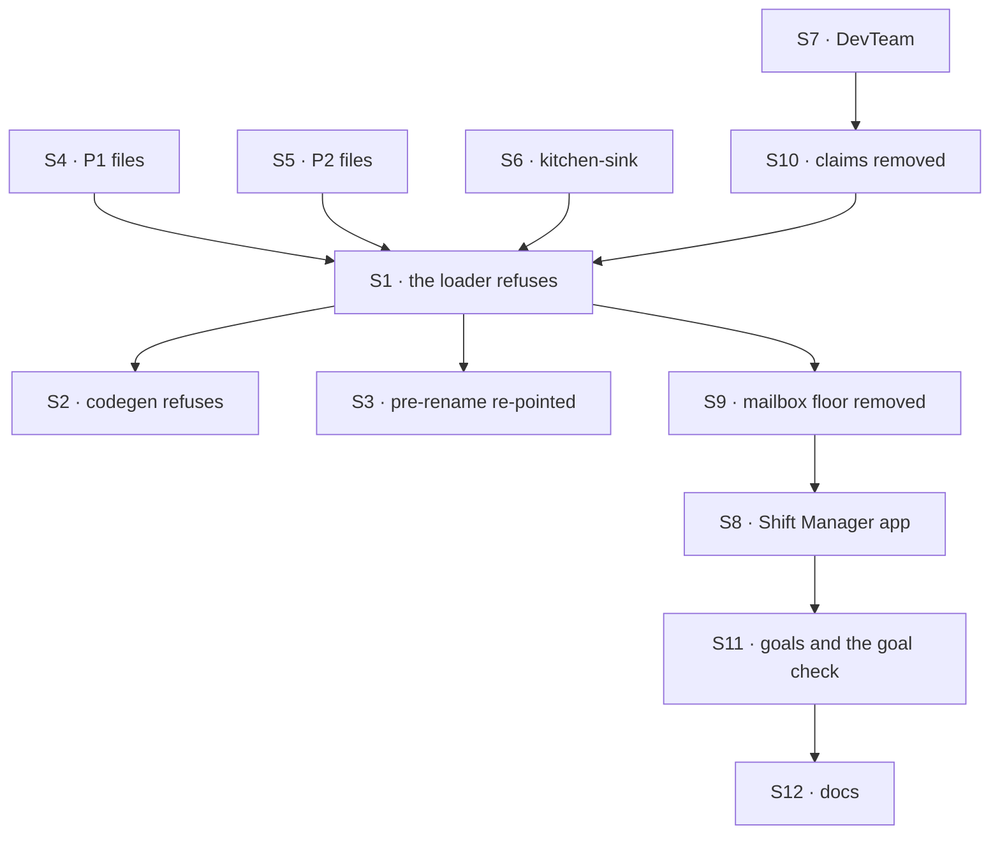

# FIX-1792 · Plan

[Spec](SPEC.md) · [Decisions](DECISIONS.md) · [Rules](BUSINESS-RULES.md) · **Plan** · [Docs](DOCS.md) · [Evolution](EVOLUTION.md)

Written for the implementing agent. IDs cross-reference [BUSINESS-RULES.md](BUSINESS-RULES.md)
(BR-n) and [DECISIONS.md](DECISIONS.md). `tdd`. Four PRs, a GitHub stack (epic ER-26). P1 starts
after FIX-1791 merges; P2 after FIX-1794; P3 after FIX-1793 and FIX-1794 (epic D4, ER-23).
Run `node specs/issues/FIX-1792/poc/inventory/check.mjs` in every PR and update its tables when a
classification changes.

## Surfaces

| ID | Package · role | Change | Rules |
|---|---|---|---|
| S1 | `workforce` · the loader | `read-mailboxes-directory.ts` becomes the refusal: a `mailboxes/` folder holding a `MAILBOX.md` stops the load, every one collected. The roster, the manifest sources and `MailboxManifest` lose mailboxes. A `WORKER.md` with a mailbox-only key is refused by name | BR-1–BR-3 BR-5 |
| S2 | `workforce` · codegen | The `flows/mailboxes` slot is refused by name; `mailboxKinds` is no longer rendered; every committed `workforce.gen.ts` regenerated | BR-4 |
| S3 | `workforce` · the pre-rename module | The `CHANNEL.md` and `channels/` refusals name the `WORKER.md` conversion; the rename guard script's allow list follows | BR-6 |
| S4 | goals · P1's files | The 10 board-less files in [the files](#the-files) marked P1, with their hosts and goals, on the coordinator flow | BR-7–BR-10 |
| S5 | goals, Shift Manager test labs · P2's files | The 13 board files outside kitchen-sink and the DevTeam, and the 2 sibling coordinators marked P2. Each board's work goes on the conversation's board through FIX-1794's filing; desks become delegates | BR-13 |
| S6 | kitchen-sink | `support.help` is a coordinator; `escalate` files one unassigned row on the conversation that delivered the post; the mailbox notify, wiring and controls go or move to the coordinator; panels read the conversation's board | BR-14 BR-25 |
| S7 | `shift-manager` · DevTeam | `eng.feature` and `ops.release` lead workstreams storefront's seed opens as the lab's member; `triage`, `oncall` are coordinators; the host, notify, board, `em` and `coder` move off mailboxes; the chief of staff loses `post-to-mailbox` and `setWorkstreams` | BR-15–BR-17 |
| S8 | `shift-manager` · the app | Reads workstream entries and conversation boards, never mailboxes or claims; renders `coordinator-route` | BR-17 BR-18 |
| S9 | `workforce`, `ui`, `devtool`, `react`, `contracts` · **removals** | The mailbox flow, binder, boards and `mailboxTaskLists`, route record, best-fit wrapper, wake, post lines (unless FIX-1791 took them), `post-to-mailbox`; the hire's `mailboxBoards` and `agent`'s mailbox `taskLists`; the inventory's mailbox and membership rows; discovery's mailboxes domain; their exports and tests ([poc/inventory](poc/inventory/README.md): 32 files, about 11,500 lines) | BR-18 BR-19 BR-22 BR-23 |
| S10 | `workforce` · projects · **removals** | Claims stop being declared (rows kept); a project's `workstreams` list, `setWorkstreams`, `projectWritesMailboxInventory` and `projectWorkspace`'s claim path go; a write carrying `workstreams` is refused by name | BR-16 BR-20 BR-21 |
| S11 | goals | [The goal table](#goals); the goal check folds in the pre-rename goal; one goal retires | BR-24 · goal |
| S12 | Docs | [DOCS.md](DOCS.md); the READMEs it names; a `minor` changeset for `workforce` | — |

## Sequence · the PR plan

| PR | Delivers | Depends on |
|---|---|---|
| P1 · coordinators without boards | S4 | FIX-1791 merged |
| P2 · conversation boards | S5, S6 | FIX-1794 merged |
| P3 · the DevTeam, its workstreams, and claims | S7, S10, S8's DevTeam parts | FIX-1793 and FIX-1794 merged |
| P4 · remove and refuse | S1, S2, S3, S9, the rest of S8, S11, S12 | P1, P2, P3 |



The mailbox flow keeps running until P4, so P1 to P3 each land green on their own.

## The files

The 33 rows are the checker's `FILES`. Board files and their targets are [D1's table](DECISIONS.md#the-table).

| PR | Files |
|---|---|
| P1 | pentest-lab's 6 (`lab/workforce`, two refusal trees and their twins, the unknown-member scenario) · `a-routed-post-gets-one-answer`'s `help` and `lounge` · `a-fresh-host-wakes-its-member-agents`'s `front` · `it-sends-a-turn-into-a-seat-session`'s `front` |
| P2 | The 14 board files of D1's table outside the DevTeam: S5's 13 and kitchen-sink's · `it-shows-who-is-on-shift`'s `ops.desk` and `ask-lab`'s `side`, which share a lab with a board file |
| P3 | The DevTeam's `feature`, `release`, `triage`, `oncall` |
| P4 | `mailbox-boards`'s `notices` removed with its retired goal; the pre-rename goal's `front` and `notices` move, unchanged, under the goal check as old files |

## Goals

Every goal unit the checker finds, by disposition. CONVERT and REWRITE re-run on P4's commit with
a verdict line; a REWRITE states its new outcome in `goal.md` and logs the old run's FAIL first.

| Disposition | Goals |
|---|---|
| **REWRITE** (11) | devforce-lab `it-keeps-its-rows-on-the-mailboxes-board` (the org sees the entry, the owner the rows) · devtool `the-checklist-rows` (row 5: workers and a coordinator's delegates) · manager-queue-lab's two goals and `lab` (a row names its delegate; `boards:` on a worker refused by name) · multi-seat-collab's goal and `run-scenario.mts` (delegates, not desks) · org-seats `cos-changes-the-roster` (the delegate read, not `discover`) · pentest `a-post-reaches-both-declared-seats` (BR-10) · shift-manager `it-opens-a-lab` · workforce-conventions `code-comes-from-files-alone` (the slot refused) |
| **RETIRE** (1) | workforce-conventions `a-mailbox-holds-the-work-a-seat-drains`: every subject is gone; FIX-1791's and FIX-1794's goal checks and kitchen-sink-talk prove the rest |
| **FOLD** (1) | workforce-mailboxes `a-pre-rename-lab-is-refused-by-name` → the goal check |
| **FIX-1793** (1) | shift-manager `it-groups-workstreams-under-their-projects`: rewritten there, re-run here |
| **EDIT** (6) | `goals/README.md`, agent-discovery, design-system, hire-plane, workforce-packages, `capabilities-come-from-files-alone`: a field or a word |
| **CONVERT** (29) | The rest, each with its line in the checker's `GOALS` |

## Checks

| ID | Runs after | Passes when |
|---|---|---|
| V1 | S1 | BR-1–BR-3, BR-5 on fixture trees: one old file; two in two teams, both named; an empty `mailboxes/`; a renamed file with each old key. Nothing registered on a refusal |
| V2 | S2 | BR-4; no committed `workforce.gen.ts` renders `mailboxKinds` |
| V3 | S3 | BR-6 names `WORKER.md`, never `MAILBOX.md` |
| V4 | S4 | P1's goals PASS; BR-8, BR-9, BR-10 through them |
| V5 | S5 S6 | BR-13, BR-14 with two users and two tabs; P2's goals and kitchen-sink's suite PASS. **D1** |
| V6 | S7 S10 | BR-15–BR-17, BR-21; no claim read anywhere (grep plus a test that deletes the claim rows and still runs); P3's goals PASS |
| V7 | S9 | BR-18, BR-19, BR-22 on a store today's `main` wrote, rows compared byte for byte. **D2** |
| V8 | S9 | `check.mjs --after` PASSES, after it FAILED on `main` (BR-23) |
| V9 | S6 S7 | BR-25: kitchen-sink's named-org test and the DevTeam's legacy-org test PASS |
| VG | S11 | [The goal](SPEC.md#the-goal-and-how-well-know-its-met): `goals/coordinators/refuses-a-mailbox-file-by-name/run.mts` PASSES, after FAILING under `GOAL_CONTROL=silent-skip` and on today's `main`; every CONVERT and REWRITE goal has a PASS line on that commit |

One check per decision: D1 by V5 and V6, D2 by V7. The second path (BP-035): an old store (V7), a
half-converted tree (V1), two users (V5), a renamed file (V1).

## Pinned names

| Where | Name | Why pinned |
|---|---|---|
| The goal check | `goals/coordinators/refuses-a-mailbox-file-by-name/` | VG cites it; sits beside FIX-1791's and FIX-1794's |
| The control | `GOAL_CONTROL=silent-skip` | VG |
| The upgrade page | `apps/docs/docs/workforce/upgrading.md` | Every refusal links it |
| A converted coordinator | `teams/<team>/workers/<name>/WORKER.md`, id `<team>.<name>` | Goals and apps address it by the mailbox's id; no collision on `main` |

Everything else is yours to name, in the new terms.

## Guardrails

| Rule | Because |
|---|---|
| No loader reads `MAILBOX.md`, nothing converts at boot, and no refusing `mailbox` flow is kept | The FIX-1367 lock: one way, refused loudly |
| Every refusal collects every problem and registers nothing | A half-loaded lab is the quiet failure the refusal prevents |
| Nothing stored is deleted or rewritten | D2; BP-030 |
| A converted worker keeps the flow it names | The epic's note from Jake's concept comment |
| No goal stops running without a line naming what proves its outcome | Goals and kitchen-sink are the proof spine (the Architect's lock) |
| Nothing new builds on the mailbox flow between P1 and P4 | The conversion must not grow (FIX-1791's guardrail) |
| Every converted host and fixture keeps org identity required | FIX-1442 |

## Docs

Reconcile [DOCS.md](DOCS.md) in P4 against the shipped refusal wording, then publish it.

## Sketch · pseudocode, illustrative, react to the shape

```
on load, for each team:
    for each folder under mailboxes/ holding a MAILBOX.md:
        problems += refusal(path, where its WORKER.md goes, its lines' conversion, the upgrade page)
    for each WORKER.md:
        for each key in members, boards, boardActions, mintFor:
            problems += refusal(key, what replaced it)
if problems: stop, naming every one; register nothing
```

**POC:** [`poc/inventory/`](poc/inventory/README.md), the checker the factual base rests on. It
confirmed the issue's 33 files and 15 board files, found 16 boards and two `flow:` lines naming a
kind of the tree's own, and classified 189 files and 49 goal units. Its control refused both plants.

## At implement time

- Take FIX-1791's shipped keys, FIX-1794's filing action names and FIX-1793's workstream action. If
  any differ from this plan, use theirs and update the upgrade page.
- `escalate` files from a delegate's session onto the conversation that delivered the post. If
  FIX-1794's filing refuses that caller, raise it on FIX-1794; don't add a second filing path.
- The DevTeam's `feature` names `chief-of-staff` as a member. Keep it as a delegate only if its
  flow takes a delegated post (FIX-1791 BR-4); otherwise drop it and say so in the PR.
- manager-queue-lab's "waits for its desk to free": if a conversation board can't hold it, take it
  to FIX-1794 rather than dropping the leg.
- FIX-1791 may have moved post lines or best fit out of the mailbox folder; remove only what
  nothing imports.

## Follow-ups

- Goal folder names `workforce-mailboxes/` and `mailbox-boards/`, kitchen-sink's control file
  names, and the remaining word: FIX-1796.
- `PRE_RENAME_NAMES` and the channel refusals go at 1.0.
- Files as migrations, held for later (the epic).
