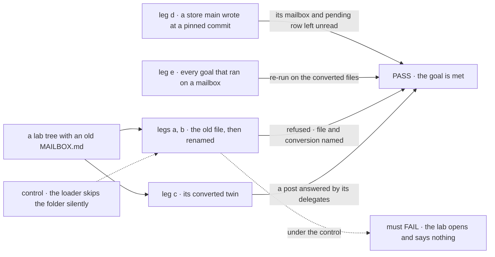
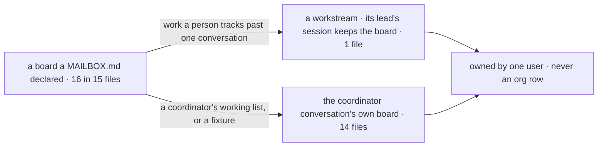

# FIX-1792 · MAILBOX.md becomes WORKER.md on the coordinator flow, and old files are refused by name

**Spec** · [Decisions](DECISIONS.md) · [Rules](BUSINESS-RULES.md) · [Plan](PLAN.md) · [Docs](DOCS.md) · [Evolution](EVOLUTION.md)

## Six people, before and after

| Someone who… | Today | After |
|---|---|---|
| **declares a team in files** | Writes a `WORKER.md` per worker and a `MAILBOX.md` per place they talk: two formats, two loaders | Writes `WORKER.md` for both. A coordinator is a worker whose `flow:` is `coordinator`, with its `delegates:` |
| **upgrades an app that still has a `MAILBOX.md`** | n/a | The app stops at load. The message names the file, where its `WORKER.md` goes, and what each line becomes |
| **renames the file and keeps the old lines** | n/a | Refused, naming `members:` (now `delegates:`) and `boards:` (gone), not a generic unknown key |
| **keeps work on a mailbox's board** | The board is an org row any member's session can run | The board belongs to the coordinator's conversation and its user. The DevTeam's feature work is a workstream its owner leads |
| **runs coding work for a project in Shift Manager** | A claim row puts the run in the project | The run finds its project through its workstream. Claims, and a project's list of mailboxes, are gone |
| **has tasks waiting on an old board** | n/a | They stay in the store, unread. The upgrade page says to finish or re-file them first |

The epic's one way to declare a worker ([FIX-1786](../../epics/FIX-1786/SPEC.md), ER-6, D5), on
the coordinator flow ([FIX-1791](../FIX-1791/SPEC.md)), conversation boards
([FIX-1794](../FIX-1794/SPEC.md)) and workstreams
([FIX-1793](../FIX-1793/SPEC.md)).

## The goal, and how we'll know it's met

**Every coordinator in the repo is declared in a `WORKER.md` on the coordinator flow, naming only
standard workers as delegates; no board is an org row and no project finds its work through a
claim; an old `MAILBOX.md` stops the app at load with the file and its conversion named; and every
goal and kitchen-sink check that ran on a mailbox passes on the converted files.**

| Is it the right goal? | |
|---|---|
| **The real need** | The [issue](https://linear.app/fixpoint-labs/issue/FIX-1792): one way to declare a worker, a standard coordinator that names only standard workers, old files refused by name with the conversion, every file converted and every board resolved. The Architect's locks: no compatibility loader, no conversion at runtime, and kitchen-sink and the goals keep passing |
| **Smaller, and rejected** | "The loader refuses `MAILBOX.md`." Met by deleting the mailbox loader while the 30 files still in use stop loading and the goals built on them stop running. Or "the files are renamed": met while every board stays an org row, the shape the epic removes |
| **Bigger, and not this issue's** | The word "mailbox" gone from code and docs ([FIX-1796](https://linear.app/fixpoint-labs/issue/FIX-1796)) · files as migrations (held for later) · channels |
| **Not done if** | A `MAILBOX.md` loads, or is skipped without a word · a board is still org-scoped · a goal that ran on a mailbox stopped running with no line naming what proves it now · a claim is still read · the check ran on a tree with no old file in it |



The check reads what a person reads when the boot stops, and what the store and the converted
coordinator hold. Under the control the old folder is passed over, and leg a must fail.

| How we verify | |
|---|---|
| **Goal check** | `goals/coordinators/refuses-a-mailbox-file-by-name/`, which folds in `a-pre-rename-lab-is-refused-by-name` · scripted model for leg c, n/a elsewhere · a real host from the published packages, on SQLite · run by the implementer · legs a to d pass in P4a; the verdict, with leg e, in P4b |
| **Signal** | **a**: the boot stops naming `teams/desk/mailboxes/front/MAILBOX.md`, `teams/desk/workers/front/WORKER.md`, `members:` → `delegates:` and that boards are removed; a `flows/mailboxes/` folder, with no `fsdev gen` run, and the old `CHANNEL.md` are named too; nothing is registered. **b**: the file renamed with its old lines is refused naming `members:` and `boards:`. **c**: the converted desk loads, and one post gets one answer per delegate, as the mailbox gave. **d**: on a store `main` wrote at a pinned commit, with the desk's mailbox session and a pending board row, the converted lab boots; a request to the old session is refused naming the `mailbox` flow; the row is unchanged byte for byte, and no conversation's board lists it. **e**: `check.mjs --after` passes, and every goal [PLAN](PLAN.md#goals) marks convert or rewrite has a PASS line on the same commit |
| **Input** | The folded goal's desk tree (a mailbox on the built-in kind, one on a kind of its own, and a `flows/mailboxes/` folder). For leg d, a SQLite store checked in once, written by the mailbox code at the commit P4a branches from, with that SHA and its generator beside it. Another team, mailbox name or delegate list must pass too |
| **Anti-game** | Assert on the words a person reads, never only that something threw: an unknown key already throws today and names nothing useful. The old store is never hand-written and never regenerated from a later commit, which by then can't write one. Leg e reads verdict lines, not a subset's exit codes |
| **Control that must fail** | `GOAL_CONTROL=silent-skip`, the loader passing over `mailboxes/` as deleting it would: leg a FAILS on *the boot names the file*. Today's `main`: every leg FAILS |

## What changes

![Two panels, today and after, for one support team. Today the team folder holds worker files and a mailboxes folder whose MAILBOX.md lists members and a board; the board's rows are an org row any member's session runs. After, the same team folder holds only worker files: the help desk is a WORKER.md on the coordinator flow with delegates, its board belongs to each conversation and its user, and a MAILBOX.md left in the tree stops the load with its conversion named. Case by case: how a coordinator is declared goes from its own file to a worker file; who keeps a board goes from the org to one conversation's user, or a workstream's owner; how a coding run finds its project goes from a claim row to its workstream; an old file goes from loading to stopping the load; tasks on an old board stay in the store, unread](figures/what-changes.svg)

One folder, one file shape. The board moves from the org to whoever's conversation or
workstream it is, and the old file can't load by accident.

**What an installation writes**, kitchen-sink's help desk:

```diff
- # teams/support/mailboxes/help/MAILBOX.md
- members: [support.devices, support.accounts, support.fsd, support.general]
- boards: [escalations]
- boardActions: true
- routing:
-   fallback: support.general
+ # teams/support/workers/help/WORKER.md
+ flow: coordinator
+ delegates: [support.devices, support.accounts, support.fsd, support.general]
+ routing: judgment
+ rounds: 1
  description: Ask the support team anything.
```

The help desk is the one file that doesn't convert key by key. Its coordinator reads each round of
answers, so a specialist's answer that ends `Escalate: …` becomes an open case on that
conversation's board; that costs one coordinator turn per answered post. A file with no
`routing:` line gets `routing: everyone`, which is what its mailbox did. The
coordinator keeps the mailbox's id, `support.help`. The full table is the upgrade page in
[DOCS.md](DOCS.md).

## Where each board goes



The epic's question ([D5](../../epics/FIX-1786/DECISIONS.md#d5)), asked board by board; the
table is [D1](DECISIONS.md#d1).

## What stays as it is

- The coordinator flow and its keys ([FIX-1791](../FIX-1791/SPEC.md)), conversation boards and
  their filing ([FIX-1794](../FIX-1794/SPEC.md)) and workstreams ([FIX-1793](../FIX-1793/SPEC.md)).
  This issue converts onto them and builds none: a kitchen-sink case is filed by the coordinator,
  through FIX-1794's own action.
- A `WORKER.md` that isn't a coordinator keeps the flow it names; nothing moves onto `agent`.
- Stored data: nothing is deleted or rewritten.
- The pre-rename `CHANNEL.md` refusal, until 1.0. Channels themselves aren't built.
- Goal folder names and other words that say "mailbox" without naming a removed part: FIX-1796.

## Sign off

**[The goal](#the-goal-and-how-well-know-its-met), at that size:** one declaration, every file and
board converted, old files refused by name, and the goals still green. If wrong: we delete a
loader and call it a conversion while half the proof spine stops running.

1. **[D1](DECISIONS.md#d1) · 14 of the 15 files with boards keep them on the coordinator's
   conversation; the DevTeam's feature board becomes a workstream, with `release` beside it.** In
   kitchen-sink, a specialist's answer carries a case and the coordinator files it, unassigned, in
   one more turn per answered post.
   The one to weigh. If wrong: work people follow is hidden in one conversation, or a fixture
   grows a project it never uses.
2. **[D2](DECISIONS.md#d2) · Old mailbox data stays in the store, unread; no pending task carries
   over.** If wrong: someone's waiting task drops out of view on upgrade.

**Open: none.** Reasoning and what lost: [DECISIONS.md](DECISIONS.md). The cases:
[BUSINESS-RULES.md](BUSINESS-RULES.md).

Improvement · `workforce`, `shift-manager`, kitchen-sink, `goals/`, docs · large · 5 PRs · epic [FIX-1786](../../epics/FIX-1786/SPEC.md)
