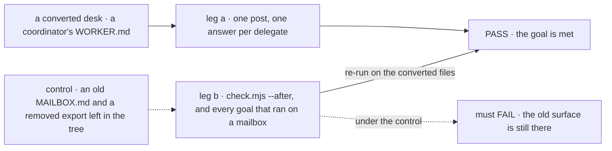
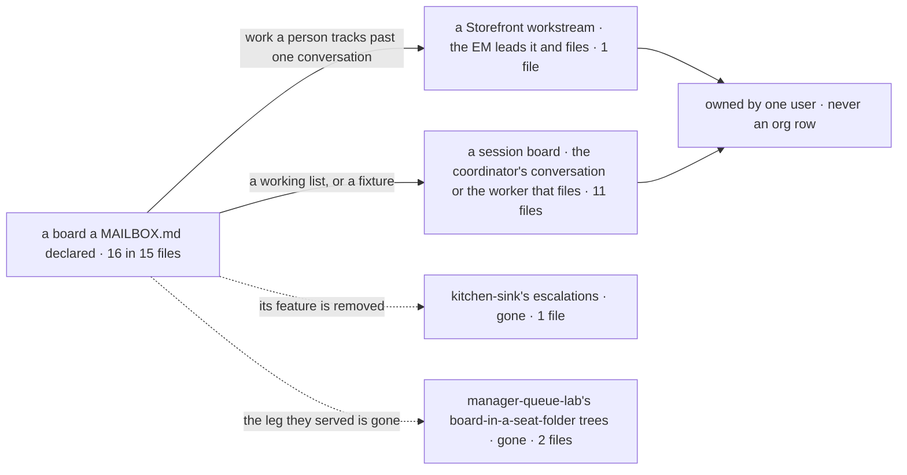

# FIX-1792 · MAILBOX.md becomes WORKER.md on the coordinator flow, and the mailbox is removed

**Spec** · [Decisions](DECISIONS.md) · [Rules](BUSINESS-RULES.md) · [Plan](PLAN.md) · [Docs](DOCS.md) · [Evolution](EVOLUTION.md)

## Five people, before and after

| Someone who… | Today | After |
|---|---|---|
| **declares a team in files** | Writes a `WORKER.md` per worker and a `MAILBOX.md` per place they talk: two formats, two loaders | Writes `WORKER.md` for both. A coordinator is a worker whose `flow:` is `coordinator`, with its `delegates:` |
| **keeps work on a mailbox's board** | The board is an org row any member's session can run | The board belongs to one user's session: the coordinator's conversation, or the worker that files on it. The DevTeam's feature work is a Storefront workstream the EM leads |
| **wants a worker to hand out tasks** | A mailbox file declares the board, and a seat's kind composes its tools | The worker has orchestration's eight task tools when at least one of its `delegates:` can take a task. No line in its file grants them |
| **runs coding work for a project in Shift Manager** | A claim row puts the run in the project | The run finds its project through its workstream. Claims, and a project's list of mailboxes, are gone |
| **still has a `MAILBOX.md`, or mailbox data in a store** | n/a | Nobody does yet. Every file in the repo is converted and its old file deleted; stored mailbox data is dropped. Nothing reads, refuses or migrates either ([D2](DECISIONS.md#d2)) |

The epic's one way to declare a worker ([FIX-1786](../../epics/FIX-1786/SPEC.md), ER-6, D5), on
the coordinator flow ([FIX-1791](../FIX-1791/SPEC.md)), conversation boards
([FIX-1794](../FIX-1794/SPEC.md)), workstreams ([FIX-1793](../FIX-1793/SPEC.md)) and
orchestration's existing task tools, which a worker has when one of its delegates can take a task
(FIX-1802's wiring of the existing task tools, [FIX-1802](https://linear.app/fixpoint-labs/issue/FIX-1802)).

## The goal, and how we'll know it's met

**Every coordinator in the repo is declared in a `WORKER.md` on the coordinator flow, naming only
standard workers as delegates; no board is an org row and no project finds its work through a
claim; no `MAILBOX.md` and no mailbox code is left; and every goal and kitchen-sink check that ran
on a mailbox passes on the converted files, unless the feature it tested was removed.**

| Is it the right goal? | |
|---|---|
| **The real need** | The [issue](https://linear.app/fixpoint-labs/issue/FIX-1792): one way to declare a worker, a standard coordinator that names only standard workers, every file converted and every board resolved. Its "old files refused by name" is cut: no backwards support of any kind while there are no consumers (product owner, 2026-10-07; [D2](DECISIONS.md#d2)). The Architect's locks: no compatibility loader, no conversion at runtime, and kitchen-sink and the goals keep passing |
| **Smaller, and rejected** | "The mailbox code is deleted." Met by deleting it while the 30 files still in use stop loading and the goals built on them stop running. Or "the files are renamed": met while every board stays an org row, the shape the epic removes |
| **Bigger, and not this issue's** | The word "mailbox" gone from code and docs ([FIX-1796](https://linear.app/fixpoint-labs/issue/FIX-1796)) · the task tools on any worker flow and multi-level delegation (FIX-1802) · a refusal or upgrade path for old files and data, until there is a consumer (D2) · files as migrations (held for later) · channels |
| **Not done if** | A `MAILBOX.md` is left in the repo, or anything reads one · a board is still org-scoped · a goal that ran on a mailbox stopped running with no line naming what proves it now · a claim is still read · a `filing:` line is written anywhere, or a worker has the task tools with no delegate that can take a task |



The check reads what the converted coordinator answers and what the tree still holds. Under the
control an old file and a removed export are left in the tree, and leg b must fail.

| How we verify | |
|---|---|
| **Goal check** | `goals/coordinators/every-coordinator-is-a-worker-file/` · scripted model for leg a, n/a for leg b · a real host from the published packages, on SQLite · run by the implementer · the verdict in P4 |
| **Signal** | **a**: the converted desk loads, and one post gets one answer per delegate, as the mailbox gave. **b**: `check.mjs --after` passes (no `MAILBOX.md`, no removed export, no `mailboxes` discovery domain), every goal [PLAN](PLAN.md#goals) marks convert or rewrite has a PASS line on the same commit, and each retired goal names its proof under BR-24 |
| **Input** | A converted desk tree: a coordinator's `WORKER.md` on `routing: everyone` and its `agent` delegates. Another team, coordinator name or delegate list must pass too |
| **Anti-game** | Leg a asserts on the answers a person reads, never only that the load didn't throw. Leg b reads verdict lines, not a subset's exit codes |
| **Control that must fail** | `GOAL_CONTROL=mailbox-left`, the desk's old `MAILBOX.md` and one removed export left in the tree: leg b FAILS on *no old file and no removed export remain*. Today's `main`: every leg FAILS |

## What changes

![Two panels, today and after, for one support team. Today the team folder holds worker files and a mailboxes folder whose MAILBOX.md lists members and a board; the board's rows are an org row any member's session runs. After, the same team folder holds only worker files: the help desk is a WORKER.md on the coordinator flow with delegates, its escalations board is removed with the feature it served, and its MAILBOX.md is deleted in the conversion. Case by case: how a coordinator is declared goes from its own file to a worker file; who keeps a board goes from the org to one user's session, or a workstream's owner; how a coding run finds its project goes from a claim row to a workstream, never a claim; an old MAILBOX.md goes from loading to deleted, with nothing reading one; tasks on an old board go from waiting on the org row to dropped, since nobody has one yet](figures/what-changes.svg)

One folder, one file shape. The board moves from the org to whoever's session or workstream it
is, and the old file is deleted with the code that read it.

**What the repo's files say**, kitchen-sink's help desk:

```diff
- # teams/support/mailboxes/help/MAILBOX.md
- members: [support.devices, support.accounts, support.fsd, support.general]
- boards: [escalations]
- boardActions: true
- routing:
-   fallback: support.general
+ # teams/support/workers/help/WORKER.md
+ flow: coordinator
+ delegates: [support.devices, support.accounts, support.fsd, support.general]
+ routing: best-fit
+ fallback: support.general
  description: Ask the support team anything.
```

Its `escalations` board goes with kitchen-sink's escalation feature, which the product owner
removed (2026-10-06): a specialist answers, and nothing asks anyone to file a case. Its
specialists run on `agent`, which takes tasks, so the help desk has the task tools, as every
coordinator whose delegates take tasks does. A file with no `routing:` line gets
`routing: everyone`, which is what its mailbox did. The coordinator keeps the mailbox's id,
`support.help`. The conversion, key by key, is in [DECISIONS](DECISIONS.md#decided-not-asked).

## Where each board goes



The epic's question ([D5](../../epics/FIX-1786/DECISIONS.md#d5)), asked board by board; the
table is [D1's](DECISIONS.md#the-table).

## What stays as it is

- The coordinator flow and its keys ([FIX-1791](../FIX-1791/SPEC.md)), conversation boards
  ([FIX-1794](../FIX-1794/SPEC.md)), workstreams ([FIX-1793](../FIX-1793/SPEC.md)) and
  orchestration's task tools, `createTaskToolsCapability(resolver, roster)` and
  `taskToolActions(<board id>, resolver, roster)` (FIX-1802's wiring of the existing task tools). This issue converts
  onto them and builds none.
- A `WORKER.md` that isn't a coordinator keeps the flow it names; nothing moves onto `agent`.
- Channels aren't built.
- Goal folder names and other words that say "mailbox" without naming a removed part: FIX-1796.

## Sign off

**[The goal](#the-goal-and-how-well-know-its-met), at that size:** one declaration, every file and
board converted, the mailbox removed with no backwards support, and the goals still green. If
wrong: we delete a loader and call it a conversion while half the proof spine stops running.

**Answered:** [D2](DECISIONS.md#d2) (product owner, 2026-10-07). Old mailbox data is dropped, and
nothing supports old files or data while there are no consumers: no refusal, no upgrade page, no
dual-read. BP-030 does not apply until there is one.

**Decided, not asked:** [D1](DECISIONS.md#d1), where each board goes. Its only close call,
kitchen-sink's escalations board, went with the escalation feature the product owner removed
(2026-10-06). The pre-rename `CHANNEL.md` refusal goes too, by D2's rule
([DECISIONS](DECISIONS.md#decided-not-asked)).

**Open: none.** Reasoning and what lost: [DECISIONS.md](DECISIONS.md). The cases:
[BUSINESS-RULES.md](BUSINESS-RULES.md).

Improvement · `workforce`, `shift-manager`, kitchen-sink, `goals/`, docs · large · 4 PRs · epic [FIX-1786](../../epics/FIX-1786/SPEC.md)
