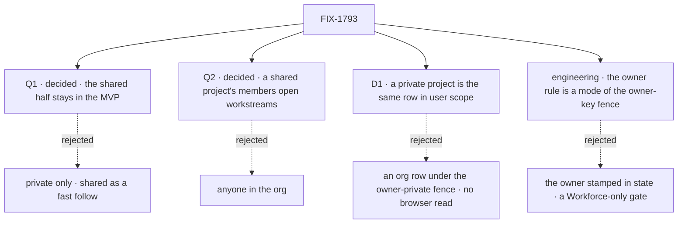

# FIX-1793 · Decisions

[Spec](SPEC.md) · **Decisions** · [Rules](BUSINESS-RULES.md) · [Plan](PLAN.md) · [Docs](DOCS.md) · [Evolution](EVOLUTION.md)

Two questions and one decision are the sign-off surface, all decided: Jake answered Q1 and Q2 on
2026-10-06 ("yes to all recommendations"). Q1 is the epic's own ask
([epic Q2](../../epics/FIX-1786/DECISIONS.md#q2)), put here as it said. Q2 is the Architect's.
D1 answers the epic's cost check. The model itself (a workstream is an entry plus its lead's
session, rooms removed, progress computed) is the epic's, and is not reopened.

## The tree

Solid edges are what you're signing. Dashed edges lost, and the label says why.

## Q1 · decided · The shared half stays in the MVP

**Jake, 2026-10-06:** "yes to all recommendations": shared projects stay in the MVP.

Not [epic Q2](../../epics/FIX-1786/DECISIONS.md#q2), which is decided: private projects are in.
This asks whether shared projects stay in beside them.

**The fork.** Keep shared projects, with workstreams owned by different users and the new
engine rule behind them, in the MVP; or ship private projects only and make sharing a fast
follow?

**In plain terms.** With shared projects, Alice and Bob each own part of one project and see
each other's progress in the app. Private only, every project is one user's, and a teammate's
work is invisible in the app until the follow.

**The trade-off.** Keeping it costs this issue one engine rule, a second mode of a check the
engine already has (PR 1 of four), and the cross-owner reads in the project view and the
coordinator. Cutting it saves that, but today's projects are all shared org rows: a private-only
MVP needs an operator step that gives each one to a single user, and takes sharing away from
the people on it.

**My recommendation, taken: keep shared projects.** Sharing is what projects do today, so cutting it
removes a feature rather than deferring a new one, and the rule it needs is the epic's one
planned Layer 1 change here. The library (FIX-1795) is the other part of the epic's "shared
half"; its cost is FIX-1795's to price at its own gate, and nothing here depends on it.

**What would change my mind.** If no installation shares a project today (the DevTeam lab is run
by one person) and the MVP's users are single-user installs, then cut it here, take the rows to
their creators, and the epic drops leg b's two-owner half.

**If wrong.** Keep, wrongly: the owner rule and its tests land about one PR before anyone uses
them. Cut, wrongly: a team's shared projects become one person's until the follow. Either is
an epic amendment ([ER-24](../../epics/FIX-1786/BUSINESS-RULES.md#how-the-set-is-run)).

It comes down to today's projects: they are shared already, so private-only takes sharing away.

**Amended by [epic D9](../../epics/FIX-1786/DECISIONS.md#d9) (2026-10-07):** the decision stands, but rows stored before this release are dropped, not read as shared, so the figure's "every existing row reads as shared" no longer holds. A project created after it is shared unless made private.

## Q2 · decided · Only a shared project's members open workstreams

**Jake, 2026-10-06:** "yes to all recommendations": only its members open workstreams. Editing
members after create is a follow-up ([PLAN](PLAN.md#follow-ups)).

**The fork.** Only the project's members, or anyone in the org?

**In plain terms.** Members are the people the project's creator listed when making it, as
today. With anyone, every user in the org can attach a workstream they own to any shared project.

**The trade-off.** Members keeps the creator in charge of who works on the project, with a list
projects already keep. But nothing changes members after create today, so a teammate who joins
later can't take a workstream until that write exists. Anyone needs no list, but the project's
creator can't remove a workstream someone else attached: the owner rule protects it.

**My recommendation, taken: members.** It reuses what a project already has, it is one check, and it
keeps a stray workstream off a project nobody can then tidy. Changing members after create is a
small follow-up ([PLAN](PLAN.md#follow-ups)).

**What would change my mind.** Shared projects turning out to be org-wide efforts that anyone
should be able to join without asking, such as a standing "engineering" project.

**If wrong.** Members, wrongly: a late teammate waits for the member write. Anyone, wrongly:
projects collect workstreams their creators can't remove. Either flips by changing one check.

It comes down to tidying: with anyone, a creator can't remove a workstream they don't own.

## D1 · A private project is today's project, kept in its owner's user scope

| | |
|---|---|
| **Instead of** | Private projects as org rows under the owner-private fence · or no private projects (the epic's cost condition) |
| **Because** | The [POC](poc/scope-config/README.md) shows one row schema declared at org scope and at user scope in one flow: both land, Bob lists none of Alice's private ones, and the browser reads each (S1 to S4). User scope is where the epic keeps a user's private things: their workers are there. The cost, against the epic's "mostly a scope configuration": three declarations at user scope, one `visibility` option on create, a second list read, and an address that names the visibility. The owner-private route is not engine-impossible; it is two Layer 1 changes the epic hasn't budgeted. The fence refuses a browser read when a collection is defined (G3), and lifting that for the owner alone is a change to it outside the epic's three ([D3](../../epics/FIX-1786/DECISIONS.md#d3), ER-22). Project files are `project-files/**`, and the fence refuses `**`, so private files need a second. It would still take a second pattern with an owner segment, a second list, and an address that tells the two apart. What it saves is the wait on FIX-1790, which the epic's order runs first anyway |
| **Locks in** | A private project needs FIX-1790 merged first: today user scope crosses orgs and Alice's private project reads in her second org (POC O1). A project's address is its visibility and its id, so a private and a shared project can share an id. No write turns a private project into a shared one: it would move rows between scopes, and nothing asks for it |

It comes down to the browser: the owner-private fence refuses the app's own list, and lifting that is an engine change the epic hasn't budgeted.

**What would change my mind:** FIX-1790 slipping past this issue's build. Then private projects
wait, and this issue ships shared ones first rather than hold. Or the epic choosing to spend
Layer 1 changes on an owner-only browser read and `**` under the fence; then private projects
don't wait on FIX-1790.

## Decided, not asked

Engineering calls, recorded so nobody re-derives them.

- **The owner rule is a mode of the owner-key fence: `ownerWrites: { param }`.** The owner is
  read off the key, as for `ownerPrivate`: every read path admits the row to anyone the scope
  serves, and a create, update or delete is refused loudly unless the session's user is the one
  the key names. The startup fence applies, so no wider collection can reach the rows. The
  epic's `workstreams/<project>/<workstream>` gains the owner segment for it. POC G1 and G2:
  neither shape the engine has today is the rule.
- **The visibility is where the row lives**, not a field on it, so the two can't disagree. A
  create with no visibility makes a shared project, as today.
- **Room rows are dropped.** No history view: rooms are removed, and nothing reads their rows
  ([epic D9](../../epics/FIX-1786/DECISIONS.md#d9)).
- **Claims and a row's mailbox list stay, deprecated, until FIX-1792.** They place a mailbox
  board's coding runs in a project today; they go when FIX-1792 converts each board, and its
  per-board table can use them. This moves their removal to FIX-1792, so it binds once the epic
  records it ([ER-24](../../epics/FIX-1786/BUSINESS-RULES.md#how-the-set-is-run)).
- **No engine record of the collections a turn wrote.** It would be a fourth Layer 1 change
  ([ER-22](../../epics/FIX-1786/BUSINESS-RULES.md#what-no-child-may-do)); it is raised to the
  epic. Shift Manager reads the Lab again after each project coordinator turn (#2720's floor),
  and special-cases no tool name. A project view opens on its row and one entry prefix, not a Lab
  read, and its Board reads only the viewer's own workstream sessions. If the reload cost bites,
  the smaller move is to narrow what the reload reads, not to reopen ER-22.
- **The project coordinator is a session of a standard coordinator worker the installation
  names**, linked to one project when it is created, through FIX-1788's helpers with a
  `projectId` criterion. Its delegates have one source, FIX-1791's server-written session state,
  so epic ER-1 and D3 hold as written. Each open workstream the user owns there is one delegate
  record, the lead plus the entry's address, written by the entry's open and done paths through
  FIX-1791's delegate path; the coordinator starts with no defaults. Delivery goes through
  FIX-1791's ledger into the session the record's target resolves, the workstream session. Both
  rules are FIX-1791's ([#2821](https://github.com/fixpoint-labs/flow-state-dev/pull/2821) BR-1,
  BR-2, BR-5, BR-20a); this issue is their second caller. A done workstream is not a delegate:
  nothing hands work to finished work.
- **Shared means the whole org reads it.** A shared project's row and every workstream entry are
  read by everyone in the org, as epic ER-7 and today's org rows have it; members decide who opens
  workstreams (Q2), not who reads. Reads limited to members would be a reader rule on a row, a
  Layer 1 change outside the epic's three (ER-22): an epic amendment, not this issue's call. The
  docs say it plainly.
- **Each entry carries FIX-1789's `writtenBy`**, stamped through its helper on every write
  ([FIX-1789 D1](../FIX-1789/DECISIONS.md#d1), epic ER-11). Who may write stays the owner rule.
- **A workstream's lead is chosen when it opens and doesn't change**, because a session's
  worker never does (FIX-1788). A workstream id is unique per project and owner.
- **Out of scope:** changing members after create, private to shared, and waking a lead on a
  schedule. A quiet entry shows as stale.

## Considered and dropped

| Alternative | Why not |
|---|---|
| A project row listing its workstreams | Every owner's update races every other's (the concept) |
| Progress kept on the row | It drifts from the entries and becomes another shared write (ER-7) |
| The owner stamped in the entry's state and checked on write | A stored field direct flow code can set, and a rule only processes that loaded it enforce |
| The owner rule as a Workforce check | Another flow declaring the collection writes around it; the epic put it in Layer 1 (D3) |
| A room kept read-only for its history | A second reader for a removed feature |
| The project coordinator as its own flow | The epic's D2: one coordinator flow |
| A delivery ledger for project coordinators | FIX-1791's ledger, reused (the EM's note) |
| Delegates read from the entries on each post | A second delegate source outside FIX-1791's mutation path and roster check (epic ER-1, D3) |
| One workstream per lead, per owner and project | A product limit adopted only to avoid a data-model fix; a delegate record carries its target instead |

## What the POC showed

[`poc/scope-config/`](poc/scope-config/README.md) held D1's premise and moved nothing.
[`poc/removal-inventory/`](poc/removal-inventory/README.md) sizes the removal. Results are in
their READMEs.

## How it got here

- **Draft** — framed as the epic's leg b; private projects as a scope configuration, workstream
  entries under a new owner-writes mode of the owner-key fence, a project coordinator on
  FIX-1791's flow and ledger, rooms removed with their rows kept; four PRs.
- **Review round 1** — the project coordinator's delegates moved from entries read per post to
  FIX-1791's delegate records, written by the entries' open and done paths, because delegates
  have one server-written source (epic ER-1, D3); delivery and the record's identity cite
  FIX-1791's amendment (#2821). Entries gained `writtenBy`, removed room calls keep refusing
  entries, and the removal inventory matches prose, which found DevTeam room code it had missed.
- **Amendment 1, the gate's answers** — Jake took both recommendations on 2026-10-06: shared
  projects stay in the MVP, and only a shared project's members open workstreams. Opening a
  workstream from the coordinator follows FIX-1791's Q1, and S3 and S5 cite FIX-1791's internal
  delegate mutation for records that carry a target.
- **Amended after merge, the D9 sweep (2026-10-07)** — [epic D9](../../epics/FIX-1786/DECISIONS.md#d9): old project rows aren't read as
  shared (BR-5), room rows aren't kept for an operator (BR-30), and nothing refuses room calls,
  `mintFor:` or `talk` by name (BR-29, BR-31). Leg d, V7 and the deprecation markers went with
  them. Claims stay until FIX-1792, as build order ([EVOLUTION.md](EVOLUTION.md#amendment-d9)).
- **Amended after merge (cross-spec alignment, 2026-10-07)** — reading the epic's child specs
  against each other ([epic](../../epics/FIX-1786/DECISIONS.md#how-it-got-here)): P3 waits on
  FIX-1794's P2 and FIX-1802's P1, and carries V6's walk-up leg.
  ([EVOLUTION.md](EVOLUTION.md#amendment-cross-spec))

**Open: none.**
