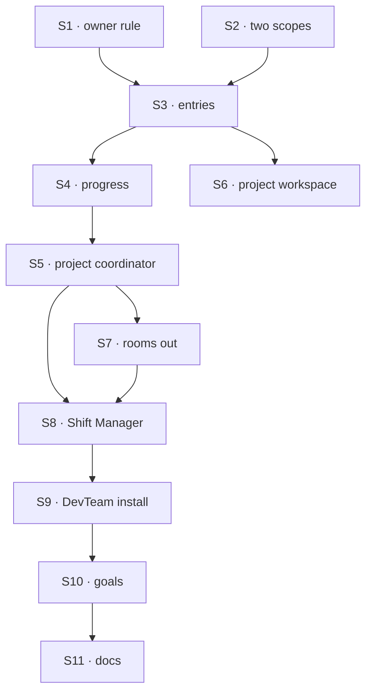

# FIX-1793 · Plan

[Spec](SPEC.md) · [Decisions](DECISIONS.md) · [Rules](BUSINESS-RULES.md) · **Plan** · [Docs](DOCS.md) · [Evolution](EVOLUTION.md)

Written for the implementing agent. IDs cross-reference [BUSINESS-RULES.md](BUSINESS-RULES.md)
(BR-n) and [DECISIONS.md](DECISIONS.md). `tdd`. Four PRs, a GitHub stack (epic ER-26). P1 starts
once FIX-1787's merge-first rows land (ER-23); P2 waits on FIX-1790 and FIX-1788, P3 on FIX-1791
(epic PLAN step 4).

## Surfaces

| ID | Package · role | Change | Rules |
|---|---|---|---|
| S1 | `core` + `engine` · the owner-key fence | A second mode beside `ownerPrivate`: `ownerWrites: { param }`. Same key shape and startup fence. Every read path (the handle, the seed cache, projected reads, the browser routes, `/state`, debug) admits the row to anyone the scope serves; create, update and delete are refused unless the session's user is the key's owner, with a loud error. Browser read allowed. `ownerPrivate` unchanged | BR-11 BR-13 |
| S2 | `workforce` · projects at two scopes | The projects and project-files collections declared again at user scope, same schemas. `createProject` takes `visibility` (`"shared"` default); a private create refuses other members. Every project read and write takes an address, visibility plus id, and picks the collection from it | BR-1–BR-6 |
| S3 | `workforce` · workstream entries | `workstreams/[project]/[owner]/[workstream]` under S1, at both scopes. State: lead, session id, title, status, due, objectives (each met or not, when, by whom), updated at; the latest report as content. `openWorkstream` (member gate per Q2 on shared; lead on the caller's roster; entry, then the lead's session through FIX-1788's `ensureWorkerSession` with a `workstream` criterion; the session id onto the entry), `updateWorkstream` (owner only, by S1). An app action and a tool for the lead | BR-7–BR-17 |
| S4 | `workforce` · progress | One read: the project's entries by prefix, direct children only, computed at read. Never stored | BR-18–BR-20 |
| S5 | `workforce` · the project coordinator | A session of a standard coordinator worker the installation names, linked at create to one project by a `project` criterion on FIX-1788's helpers, created on first open. Its delegates are the user's own entries in that project, read per post; each delivery goes into the entry's workstream session through FIX-1791's ledger. Tools: read the project (rows, every entry, S4), hand a post to one of the user's workstreams. If FIX-1791's Q1 holds, also open a workstream (FIX-1774's leg d) | BR-21–BR-27 |
| S6 | `workforce` · `projectWorkspace` | A run finds its project from its workstream, by server-written data on the workstream session, then the entry, then the row by visibility; files from that scope. The run's owner must be the workstream's owner. The claim path stays for mailbox boards (S7) | BR-32–BR-34 |
| S7 | `workforce` · **removals** and deprecations | Rooms: `talk.ts`, `room-store.ts`, `room-answer.ts`, `talk-template.ts`; the mailbox kind's `join`, `bind`, `onTalkPosted` and the talk branches of `post`, `read`, `answer`; the room collections stop being declared (rows untouched); `mintFor` and the `talk` option refused by name. Claims, `setWorkstreams` and a row's mailbox list: deprecation markers naming FIX-1792 | BR-29–BR-32 |
| S8 | `shift-manager` · views | PROJECTS lists shared and the viewer's private projects. A project's Workstreams tab lists entries with S4; its Stream tab is the viewer's project coordinator session; its Board draws the viewer's own workstreams' boards only. An entry's view: its owner sees the lead's workstream session, others the entry. Open a workstream from the project. Read the Lab again after each coordinator turn. `lib/talk.ts`, `talkFor` and the room session **removed** | BR-12 BR-18 BR-28 |
| S9 | `shift-manager` · DevTeam install | A standard `project-coordinator` `WORKER.md` (`flow: coordinator`, `routing: judgment`), named in the project setup; the chief of staff's project tools gain `visibility` and `openWorkstream`. Default projects stay shared | BR-21 |
| S10 | goals | `goals/projects/a-shared-project-has-one-owner-per-workstream/` with both controls. `it-groups-workstreams-under-their-projects` rewritten to entries; the room legs of `one-person-runs-a-labs-projects-and-people` retired with a line naming BR-29; the shell goal's Stream part moved to the coordinator. The coding goal keeps its claim path until FIX-1792 | goal |
| S11 | Docs | [DOCS.md](DOCS.md); `core`, `engine` and `workforce` READMEs; `minor` changesets for `core`, `engine`, `workforce`; the two unreleased changesets announcing rooms rewritten | — |

## Sequence · the PR plan

| PR | Delivers | Depends on |
|---|---|---|
| P1 · the owner rule | S1, proved on a fixture collection | — |
| P2 · projects and workstreams | S2, S3, S4, S6 | P1, FIX-1790 and FIX-1788 merged |
| P3 · the coordinator, rooms out, Shift Manager | S5, S7, S8, S9 | P2, FIX-1791 merged |
| P4 · the goal and the docs | S10, S11, VG | P3 |



Rooms come out only once the coordinator that replaces them is in (P3).

## Checks

| ID | Runs after | Passes when |
|---|---|---|
| V1 | S1 | BR-11 at the engine: create, update and delete under another owner's key refused through the handle, from a second process over one store too; reads admitted by the handle, a prefix list, the browser route and `/state`; BR-13 both orders of registration. `ownerPrivate`'s suite unchanged |
| V2 | S2 | BR-1–BR-6 on the real engine with two users and two orgs; BR-5 on a row today's `main` wrote |
| V3 | S3 | BR-7–BR-17; BR-11 through the action, a tool and a flow writing the collection; BR-14 with two opens in flight |
| V4 | S4 | BR-18–BR-20, counting store reads: one per view |
| V5 | S5 | BR-21–BR-23, BR-26, BR-27 on a scripted model |
| V6 | S6 | BR-33, BR-34 on both visibilities; BR-32's claim path on a mailbox board |
| V7 | S7 | BR-29, BR-31; BR-30 on a store today's `main` wrote, every room row compared before and after |
| V8 | S8 | BR-12, BR-28 in Shift Manager's tests |
| V9 | S10 | Rerun [`poc/removal-inventory/`](poc/removal-inventory/README.md): every match classified, and the rooms' rows gone from it |
| VG | P4 | [The goal](SPEC.md#the-goal-and-how-well-know-its-met): the run PASSES, after it FAILED leg b under `GOAL_CONTROL=no-owner-rule`, leg c under `all-entries-delegate`, and legs a to c on today's `main` |

One check per decision: D1 by V2, Q1 by V1 and VG leg b, Q2 by V3's BR-8. The second path
(BP-035): a second process (V1), stored rows from today (V2, V7), the default visibility (V2),
two writers at once (V3, V4), a lead on another user's roster (V3).

## Pinned names

| Where | Name | Why pinned |
|---|---|---|
| Collection option | `ownerWrites: { param }` | Public, beside `ownerPrivate` |
| Entry collection | `workstreams/[project]/[owner]/[workstream]`, org and user scope | Persisted; FIX-1792 and FIX-1794 read it |
| Create option | `visibility: "private" \| "shared"` | Public; an app sends it |
| Actions | `openWorkstream`, `updateWorkstream` | Public; an app and a lead call them |
| Session criteria | `project`, `workstream`, each an address | Public, on FIX-1788's `findWorkerSession` and `ensureWorkerSession` |

Everything else is yours to name, in the new terms (worker, workstream, project coordinator; not
seat, room or talk).

## Guardrails

| Rule | Because |
|---|---|
| Every write to an entry meets S1 at the store; no Workforce-only gate | A check in the action is open to any flow that writes the collection (tenet 5, ER-16) |
| Access from the session's recorded user and the key, never input or session state (ER-17, BP-031) | A project link or entry a caller can name grants nothing |
| Progress is computed at read; one prefix read per view | A stored total goes stale under concurrency (FIX-1779 lesson 4), and per-entry reads multiply |
| Coordinator sessions are created on first open | A session per user per project at create is waste for projects nobody opens |
| FIX-1791's ledger and best-fit helper, FIX-1788's lookup helpers: extended, not copied | Two ledgers or two lookups drift (the EM's notes) |
| Nothing stored is deleted or rewritten (BP-030) | Rooms and claims stay readable by an operator |
| No Layer 1 change beyond S1 (ER-22) | A turn's written-collections record goes to the epic |
| Examples use only the public client and Workforce exports | Shift Manager's lab wrapper is not an API (the EM's note) |
| Nothing new builds on claims or a row's mailbox list | FIX-1792 removes them |

## Docs

Reconcile and publish [DOCS.md](DOCS.md) in P4, after V1 to V8 pass, against the shipped refusal
reasons and the stale threshold. The projects opening is the epic's draft
([epic DOCS](../../epics/FIX-1786/DOCS.md#update--appsdocsdocsworkforceprojectsmd--opening));
this issue publishes it with its own sections.

## Sketch · pseudocode, illustrative, react to the shape

```
on any write to a row of an ownerWrites collection:
    owner ← the key's owner segment                         ← read off the key, never the state
    refuse unless owner = the session's user                ← the whole rule
on a read: admit, like any row of the scope

on a post to a project coordinator:
    entries ← list workstreams/<project>/ once               ← every owner's, read-only
    mine ← entries keyed to this session's user
    pick from mine (judgment); deliver into the pick's workstream session with a token
```

**POC:** [`poc/scope-config/`](poc/scope-config/README.md), 8 legs on the real engine. One row
at two scopes holds apart, with a browser read each (D1's premise held). User scope crosses orgs
today (O1), so P2 waits on FIX-1790. Neither shape the engine has is the owner rule (G1, G2).
[`poc/removal-inventory/`](poc/removal-inventory/README.md) re-derives S7's ground: 53 files, 14
removed whole (1,474 source and 1,475 test lines), its control failing on a planted file.

## At implement time

- **FIX-1791's delivery.** Its spec delivers to a fresh conversation per delegate. S5 needs a
  delivery into an existing session the user owns, the workstream session. If its shipped
  ledger can't take one, add the option there, once; don't fork it.
- **FIX-1794's answer** to how a board whose rows cross a flow stays its own decides where a
  workstream's board lives. S6 reads the workstream from whatever server-written data that leaves
  on a run's session.
- Take FIX-1788's shipped helper names and criteria shape, FIX-1790's key, and the epic's record
  of Q1, Q2 and the claims move.
- Old-term exports left for FIX-1792 and FIX-1796: `setWorkstreams`, `setWorkstreamsInputSchema`,
  `setWorkstreamsOutputSchema`, `SetWorkstreamsInput`, `WORKSTREAM_CLAIMS_RESOURCE`,
  `defineWorkstreamClaimsCollection`, `workstreamClaimSchema`, `WorkstreamClaim`,
  `projectWritesMailboxInventory`.

## Follow-ups

- The project's creator changes its members after create (Q2's price).
- A private project becomes shared, or the reverse.
- A lead woken on a schedule to refresh its entry.
- A request's durable record of the collections it wrote, if the epic takes it (ER-19, ER-22).
