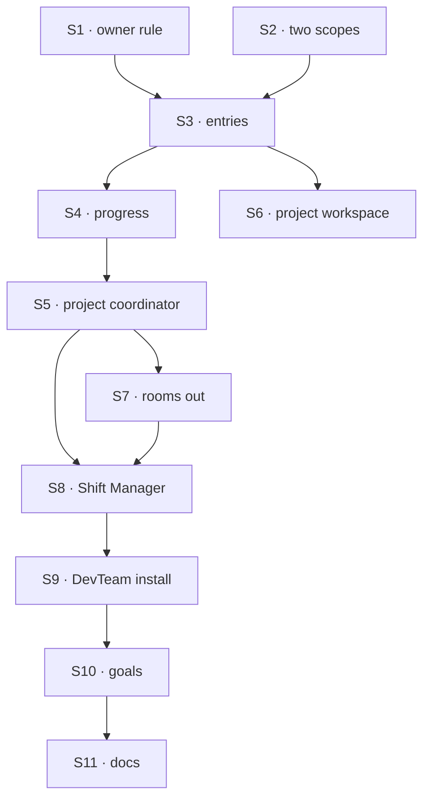

# FIX-1793 · Plan

[Spec](SPEC.md) · [Decisions](DECISIONS.md) · [Rules](BUSINESS-RULES.md) · **Plan** · [Docs](DOCS.md) · [Evolution](EVOLUTION.md)

Written for the implementing agent. IDs cross-reference [BUSINESS-RULES.md](BUSINESS-RULES.md)
(BR-n) and [DECISIONS.md](DECISIONS.md). `tdd`. Four PRs, a GitHub stack (epic ER-26). P1 starts
once FIX-1787's merge-first rows land (ER-23); P2 waits on FIX-1790 and FIX-1788, P3 on FIX-1791,
FIX-1794's P2 and FIX-1802's P1 (epic PLAN step 4). P3's Board and S6's walk-up test need a
lead's session board (FIX-1794's P2) and the task tools for a lead on `em` or `agent`
(FIX-1802's P1). *Amended after merge: the cross-spec alignment, and each workstream's own
coordinator in Shift Manager ([D2](DECISIONS.md#d2)).*

## Surfaces

| ID | Package · role | Change | Rules |
|---|---|---|---|
| S1 | `core` + `engine` · the owner-key fence | A second mode beside `ownerPrivate`: `ownerWrites: { param }`. Same key shape and startup fence. Every read path (the handle, the seed cache, projected reads, the browser routes, `/state`, debug) admits the row to anyone the scope serves; create, update and delete are refused unless the session's user is the key's owner, with a loud error. Browser read allowed. `ownerPrivate` unchanged | BR-11 BR-13 |
| S2 | `workforce` · projects at two scopes | The projects and project-files collections declared again at user scope, same schemas. `createProject` takes `visibility` (`"shared"` default); a private create refuses other members. Every project read and write takes an address, visibility plus id, and picks the collection from it | BR-1–BR-6 |
| S3 | `workforce` · workstream entries | `workstreams/[project]/[owner]/[workstream]` under S1, at both scopes. State: lead, session id, title, status, due, objectives (each met or not, when, by whom), updated at, and FIX-1789's `writtenBy` stamped through its helper on every write ([FIX-1789 D1](../FIX-1789/DECISIONS.md#d1), epic ER-11); the latest report as content. `openWorkstream` (member gate per Q2 on shared; lead on the caller's roster; entry, then the lead's session through FIX-1788's `ensureWorkerSession` with a `workstreamId` criterion; the session id onto the entry; then one delegate record on the owner's project coordinator), `updateWorkstream` (owner only, by S1; done and back out of done remove and restore the record). Each delegate record carries a target, the lead plus the entry's address, so it is written only through FIX-1791's internal delegate mutation ([FIX-1791 BR-2, BR-5](../FIX-1791/BUSINESS-RULES.md#delegates), its PLAN S2 and S3, on `main` via [#2821](https://github.com/fixpoint-labs/flow-state-dev/pull/2821)); FIX-1791's public delegate actions and tools refuse `target`. These entry paths (the open, and the done and back-out-of-done updates) call that mutation to add, remove and restore the record, and supply the resolver that turns its target into the workstream session ([FIX-1791 BR-20a](../FIX-1791/BUSINESS-RULES.md#answers-and-rounds)). An app action and a tool for the lead | BR-7–BR-17, BR-16a, BR-21a, BR-21b |
| S4 | `workforce` · progress | One read: the project's entries by prefix, direct children only, computed at read. Never stored | BR-18–BR-20 |
| S5 | `workforce` · the project coordinator | A session of a standard coordinator worker the installation names, linked at create to one project by a `projectId` criterion on FIX-1788's helpers, created on first open. Its delegates are delegate records in server-written session state, one source: no defaults ([#2821](https://github.com/fixpoint-labs/flow-state-dev/pull/2821) BR-1), one record per open workstream the user owns there, taken when the session is created and kept by S3's writes. Every record carries a target, so it is written only through FIX-1791's internal delegate mutation, never its public delegate actions, which refuse `target` ([FIX-1791 BR-2](../FIX-1791/BUSINESS-RULES.md#delegates)); the records taken at create go through it too. A post reads delegates from session state only, never from entries. Each delivery goes through FIX-1791's ledger into the session its caller resolves from the record's target, the workstream session, by the resolver this spec supplies ([FIX-1791 BR-20a](../FIX-1791/BUSINESS-RULES.md#answers-and-rounds), PLAN S5, on `main` via [#2821](https://github.com/fixpoint-labs/flow-state-dev/pull/2821)). Tools: read the project (row, every entry, S4), hand a post to one of the user's workstreams. Opening a workstream from the coordinator (FIX-1774's leg d) is this issue's: FIX-1791's Q1 moved task filing and follow-through to FIX-1794 and sent leg d here ([FIX-1791 DECISIONS Q1](../FIX-1791/DECISIONS.md#q1), Jake, 2026-10-06) | BR-21–BR-27 |
| S6 | `workforce` · `projectWorkspace` | A run finds its project from its workstream, by server-written data on the workstream session, then the entry, then the row by visibility; files from that scope. The run's owner must be the workstream's owner. The claim path stays for mailbox boards (S7) | BR-32–BR-34 |
| S7 | `workforce` · **removals** | Rooms: `talk.ts`, `room-store.ts`, `room-answer.ts`, `talk-template.ts`; the mailbox kind's `bind`, `onTalkPosted`, `join`, and the talk branches of `post`, `read`, `answer`, with no entry kept to refuse them. No room collection is read or written, and the room collections stop being declared; their rows are dropped ([epic D9](../../epics/FIX-1786/DECISIONS.md#d9)). `mintFor` and the `talk` option go with them, not refused by name. Claims, `setWorkstreams` and a row's mailbox list stay, with no markers, until FIX-1792 | BR-32 |
| S8 | `shift-manager` · views | PROJECTS lists shared and the viewer's private projects. A project's Workstreams tab lists entries with S4; its Stream tab is the viewer's project coordinator session; its Board draws the viewer's own workstream sessions' boards only, never through the Lab-wide inventory walk. An entry's view: its owner sees the lead's workstream session, others the entry. Open a workstream from the project, with a coordinator of its own as the lead ([D2](DECISIONS.md#d2)): the view forks the standard workstream coordinator (S9) onto the viewer's roster through FIX-1788's fork action, under an id derived from the workstream's address, then sends `openWorkstream` naming it as the lead. S3 is unchanged, and so is every rule it runs: the roster check on the lead, the workstream session, the delegate record. The view offers no choice of an existing worker. A worker already at that id, forked from the standard workstream coordinator, is used, not forked again; any other worker at that id refuses the open, naming it. A refused open fires the coordinator that open forked. A project view opens on the row plus one entry prefix, not a Lab read; the whole Lab is read again only after a coordinator turn. `lib/talk.ts`, `talkFor` and the room session **removed** | BR-12 BR-18 BR-28 BR-35–BR-37 |
| S9 | `shift-manager` · DevTeam install | A standard `project-coordinator` `WORKER.md` (`flow: coordinator`, `routing: judgment`), named in the project setup. Beside it, the standard workstream coordinator: a `WORKER.md` on `flow: coordinator`, `routing: judgment`, whose default delegates are standard DevTeam workers, at least one that takes a task, so its workstream session keeps a board (FIX-1802 BR-2); the project setup names it as the worker S8 forks; the chief of staff's project tools gain `visibility` and `openWorkstream`. Default projects stay shared. The room parts out: `resources/projects.ts`'s `talk:` template (the option goes, S7), the EM's room-answer action, and the room door in `notify.mts` ([inventory](poc/removal-inventory/README.md#what-was-observed)) | BR-21 BR-35 |
| S10 | goals | `goals/projects/a-shared-project-has-one-owner-per-workstream/` with both controls. `it-groups-workstreams-under-their-projects` rewritten to entries; the room legs of `one-person-runs-a-labs-projects-and-people` retired with a line saying rooms were removed (S7); the shell goal's Stream part moved to the coordinator. The coding goal keeps its claim path until FIX-1792 | goal |
| S11 | Docs | [DOCS.md](DOCS.md); `core`, `engine`, `workforce` and `shift-manager` READMEs; the owner-key contracts in `docs/architecture/resources-and-client-data.md` and `docs/contributing/architecture-reference.md`, reconciled with `ownerWrites`; `minor` changesets for `core`, `engine`, `workforce`; the two unreleased changesets announcing rooms rewritten | — |

## Sequence · the PR plan

| PR | Delivers | Depends on |
|---|---|---|
| P1 · the owner rule | S1, proved on a fixture collection | — |
| P2 · projects and workstreams | S2, S3, S4, S6 | P1, FIX-1790 and FIX-1788 merged |
| P3 · the coordinator, rooms out, Shift Manager | S5, S7, S8, S9; V6's walk-up leg | P2, FIX-1791 merged, FIX-1794's P2 and FIX-1802's P1 merged |
| P4 · the goal and the docs | S10, S11, VG | P3 |



Rooms come out only once the coordinator that replaces them is in (P3).

## Checks

| ID | Runs after | Passes when |
|---|---|---|
| V1 | S1 | BR-11 at the engine: create, update and delete under another owner's key refused through the handle, from a second process over one store too; reads admitted by the handle, a prefix list, the browser route and `/state`; BR-13 both orders of registration. `ownerPrivate`'s suite unchanged |
| V2 | S2 | BR-1–BR-6 on the real engine with two users and two orgs |
| V3 | S3 | BR-7–BR-17; BR-11 through the action, a tool and a flow writing the collection; BR-14 with two opens in flight; BR-16a on the owner's write and the lead's; BR-21a and BR-21b, with two workstreams led by one worker as two records |
| V4 | S4 | BR-18–BR-20, counting store reads: one per view |
| V5 | S5 | BR-21–BR-23, BR-26, BR-27 on a scripted model, counting store reads: at most one entry prefix list per coordinator turn, shared by routing and the read-project tool |
| V6 | S6 | BR-33, BR-34 on both visibilities; BR-32's claim path on a mailbox board. Its walk-up leg, a run in a task session filed from the workstream session, runs in P3, once a lead files (FIX-1794's P2, FIX-1802's P1) |
| ~~V7~~ | ~~S7~~ | Removed by [epic D9](../../epics/FIX-1786/DECISIONS.md#d9), with BR-29 to BR-31. V9's inventory rerun shows the room code is gone |
| V8 | S8 | BR-12, BR-18, BR-28 in Shift Manager's tests: a project view's open reads the row and one prefix, and its Board reads only the viewer's own workstream sessions |
| V8a | S8, S9 | BR-35–BR-37 in Shift Manager's tests, two users, the view's open with no lead chosen: Alice's open puts exactly one new coordinator on her roster, forked from the standard workstream coordinator, and it is the entry's lead, its workstream session's worker and her project coordinator's delegate record; her second workstream gets a second one; Bob's roster is unchanged. A repeated open and two at once fork once; a refused open (`not-a-member`) leaves her roster as it was; marking the workstream done keeps its coordinator, and moving it back out of done restores the record |
| V9 | S10 | Rerun [`poc/removal-inventory/`](poc/removal-inventory/README.md): every match classified, every file it removes reported deleted |
| VG | P4 | [The goal](SPEC.md#the-goal-and-how-well-know-its-met): the run PASSES, after it FAILED leg b under `GOAL_CONTROL=no-owner-rule`, leg c under `all-entries-delegate`, and legs a to c on today's `main` |

One check per decision: D1 by V2, D2 by V8a, Q1 by V1 and VG leg b, Q2 by V3's BR-8. The second path
(BP-035): a second process (V1), the default visibility (V2),
two writers at once (V3, V4), a lead on another user's roster (V3).

## Pinned names

| Where | Name | Why pinned |
|---|---|---|
| Collection option | `ownerWrites: { param }` | Public, beside `ownerPrivate` |
| Entry collection | `workstreams/[project]/[owner]/[workstream]`, org and user scope | Persisted; FIX-1792 and FIX-1794 read it |
| Create option | `visibility: "private" \| "shared"` | Public; an app sends it |
| Actions | `openWorkstream`, `updateWorkstream` | Public; an app and a lead call them |
| Session criteria | `projectId` (a project's address) and `workstreamId` (its project's address plus the workstream id; the owner is the caller) | Public, on FIX-1788's `findWorkerSession` and `ensureWorkerSession`; `workstreamId` is the slot FIX-1788 reserved |
| Entry field | `writtenBy: { userId, workerId? }` | Persisted; [FIX-1789's](../FIX-1789/DECISIONS.md#d1) |

Everything else is yours to name, in the new terms (worker, workstream, project coordinator; not
seat, room or talk).

## Guardrails

| Rule | Because |
|---|---|
| Every write to an entry meets S1 at the store; no Workforce-only gate | A check in the action is open to any flow that writes the collection (tenet 5, ER-16) |
| Access from the session's recorded user and the key, never input or session state (ER-17, BP-031) | A project link or entry a caller can name grants nothing |
| Progress is computed at read; one prefix read per view | A stored total goes stale under concurrency (FIX-1779 lesson 4), and per-entry reads multiply |
| Coordinator sessions are created on first open | A session per user per project at create is waste for projects nobody opens |
| FIX-1791's ledger and best-fit helper, FIX-1788's lookup helpers: extended, not copied | Two ledgers or two lookups drift (the EM's notes) |
| A project coordinator's delegates live only in its server-written session state, written through FIX-1791's delegate path | A second delegate source outside the roster check is what epic ER-1 and D3 rule out |
| No Layer 1 change beyond S1 (ER-22) | A turn's written-collections record goes to the epic |
| Examples use only the public client and Workforce exports | Shift Manager's lab wrapper is not an API (the EM's note) |
| Nothing new builds on claims or a row's mailbox list | FIX-1792 removes them |

## Docs

Reconcile and publish [DOCS.md](DOCS.md) in P4, after V1 to V8 pass, against the shipped refusal
reasons and the stale threshold. The projects opening is the epic's draft
([epic DOCS](../../epics/FIX-1786/DOCS.md#update--appsdocsdocsworkforceprojectsmd--opening));
this issue publishes it with its own sections.

## Sketch · pseudocode, illustrative, react to the shape

```
on any write to a row of an ownerWrites collection:
    owner ← the key's owner segment                         ← read off the key, never the state
    refuse unless owner = the session's user                ← the whole rule
on a read: admit, like any row of the scope

on openWorkstream, after the entry and the session:
    add a delegate record { lead, target: the entry's address } to the owner's coordinator
        through FIX-1791's delegate path                       ← roster check on the lead; cap by record

on a post to a project coordinator:
    delegates ← this session's server-written state            ← never the entries
    entries ← list workstreams/<project>/ at most once          ← for answers and the read tool
    pick a delegate (judgment); the ledger delivers into the session its target resolves
```

**POC:** [`poc/scope-config/`](poc/scope-config/README.md) (D1's premise, FIX-1790's wait, the
owner rule as new engine work) and [`poc/removal-inventory/`](poc/removal-inventory/README.md)
(S7 and S9's ground). Their READMEs hold the results.

## At implement time

- **FIX-1791's delivery and delegates** are settled in its spec, not left to here: the ledger
  delivers into a session its caller resolves, and a delegate record is a worker plus an optional
  target, unique and capped by the record ([#2821](https://github.com/fixpoint-labs/flow-state-dev/pull/2821)
  BR-1, BR-2, BR-5, BR-20a, PLAN S2 and S5). Take its shipped names; if they differ, change them
  there, once, rather than fork them.
- **FIX-1794's answer** to how a board whose rows cross a flow stays its own decides where a
  workstream's board lives. S6 reads the workstream from whatever server-written data that leaves
  on a run's session.
- Take FIX-1788's shipped helper names and criteria shape, FIX-1790's key, and the epic's record
  of Q1, Q2 and the claims move.
- **Each workstream's own coordinator ([D2](DECISIONS.md#d2))** rests on two facts to check on
  the shipped siblings before P3 builds S8. FIX-1791's coordinator flow must take a delegated
  post, so the project coordinator's post reaches a lead on it: a delegate that takes only tasks
  is accepted but skipped for posts (FIX-1802 BR-9), and leg c would fail. And the DevTeam must
  not keep the coordinator flow for standard workers, or the fork is refused (FIX-1788 BR-6). If
  either doesn't hold, raise it to that issue; don't build it here.
- Old-term exports left for FIX-1792 and FIX-1796: `setWorkstreams`, `setWorkstreamsInputSchema`,
  `setWorkstreamsOutputSchema`, `SetWorkstreamsInput`, `WORKSTREAM_CLAIMS_RESOURCE`,
  `defineWorkstreamClaimsCollection`, `workstreamClaimSchema`, `WorkstreamClaim`,
  `projectWritesMailboxInventory`.

## Notes from review

- "PR 3 is the heaviest PR. It holds the coordinator (S5), removal of rooms (S7, about 14 files removed whole and 53 touched), Shift Manager views (S8) and the install (S9). Rooms removal only needs the coordinator to exist, so it could be its own PR after S5." — architect ([comment](https://github.com/fixpoint-labs/flow-state-dev/pull/2823#issuecomment-6025318339))
- "The predicate has to decide on the collection's mode, not on the key alone. The BR-13 startup check and `ownerKeyMaySeed` both need that same distinction. Test the case of an `ownerWrites` key reached through a wider collection in the other registration order." — architect ([comment](https://github.com/fixpoint-labs/flow-state-dev/pull/2823#issuecomment-6025318339))
- "`OWNER_ROW_REFUSAL` is phrased as a read refusal. The write refusal for `ownerWrites` needs its own message, so the 'naming the owner rule' part of BR-11 is distinguishable." — architect ([comment](https://github.com/fixpoint-labs/flow-state-dev/pull/2823#issuecomment-6025318339))
- "Stale 7 days (BR-19) is a constant. Keep it a named export so Shift Manager and the coordinator share one value." — architect ([comment](https://github.com/fixpoint-labs/flow-state-dev/pull/2823#issuecomment-6025318339))
- "Entry schema richness (objectives met/when/by whom + report in state): VG mostly needs status + owner rule; could phase objectives if UI allows." — cursor ([review](https://github.com/fixpoint-labs/flow-state-dev/pull/2823#pullrequestreview-5434536784)). Kept: the goal's board reads objectives (HoE).
- "Consider committing the observed 53-file summary and running the script only at P4 unless you want every S7 edit to maintain `REMOVE`/`EDIT` maps." — cursor ([review](https://github.com/fixpoint-labs/flow-state-dev/pull/2823#pullrequestreview-5434536784)). Kept: the totality check guards a deletion of about 1.5k lines (HoE).
- "Q1/Q2 are the right sign-off surface; leaving them open in DECISIONS is fine for this PR, but PLAN checks reference them — resolve at approval so V1/V3 aren't ambiguous." — cursor ([review](https://github.com/fixpoint-labs/flow-state-dev/pull/2823#pullrequestreview-5434536784))

These are inputs, not instructions. A note that turns out to reveal a design problem is a spec
blind spot: fold it back and say so.

## Follow-ups

- The project's creator changes its members after create (Q2's price).
- A private project becomes shared, or the reverse.
- Choosing an existing worker as the lead in Shift Manager's open, beside the default ([D2](DECISIONS.md#d2)).
- The chief of staff's `openWorkstream` tool still names a lead; giving it the same default.
- A lead woken on a schedule to refresh its entry.
- A request's durable record of the collections it wrote, if the epic takes it (ER-19, ER-22).
