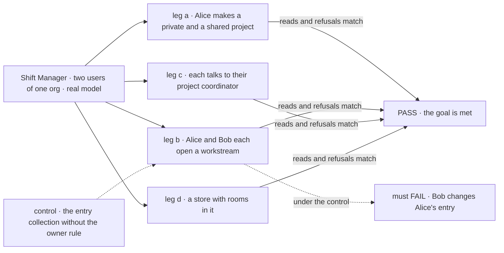
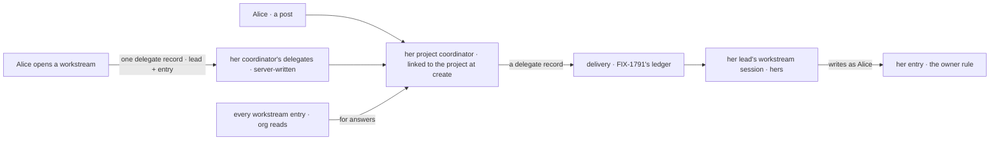

# FIX-1793 · Projects are private or shared, and each workstream has one owner

**Spec** · [Decisions](DECISIONS.md) · [Rules](BUSINESS-RULES.md) · [Plan](PLAN.md) · [Docs](DOCS.md) · [Evolution](EVOLUTION.md)

## Six users, before and after

| Someone who… | Today | After |
|---|---|---|
| **wants a project only they can see** | Can't. Every project is an org row that every member lists | Makes it private. Nobody else in the org can list, open or read it, and it doesn't show in their other orgs |
| **shares a project with a teammate** | Both are members of one row. A workstream is a mailbox listed on the row, and anyone who can edit the row can move it | Each owns the workstreams they open. Everyone in the org reads the project and every workstream's status and objectives; members are who may open workstreams. Only the owner can change theirs, and only the owner sees its tasks |
| **talks to a project** | Posts in the project's room, which every member shares, through a talk session of their own | Talks to their own project coordinator. It reads every workstream's status and hands work only to the user's own workstreams |
| **asks how a project is going** | Reads the room, or opens each mailbox | Sees it computed from the workstreams: how many are on track, objectives met, the next due date, and which entries have gone quiet |
| **had a conversation in a project's room** | Reads it in the project's Stream tab | The lines stay in the store, untouched. The app no longer shows them ([decided, not asked](DECISIONS.md#decided-not-asked)) |
| **runs coding work on a project** | A mailbox board finds its project through a claim row | A workstream's work finds its project through the workstream. A private project's files are its owner's. Mailbox boards keep today's path until FIX-1792 converts them |

This is the epic's leg b ([FIX-1786](../../epics/FIX-1786/SPEC.md), ER-7 and ER-8), and the
one new engine rule the epic allows here: a row its owner writes and the org reads.

## The goal, and how we'll know it's met

**Two users of one org each own workstreams in one shared project: each sees both workstreams'
status, and neither can change the other's. Each talks to the project through their own
coordinator, which hands work only to their own workstreams. A user's private project is
reachable by nobody else, and rooms are gone with nothing deleted.**

| Is it the right goal? | |
|---|---|
| **The real need** | The [PRD](https://linear.app/fixpoint-labs/issue/FIX-1793): one project type, private or shared; a workstream owned by one user, readable by the project's readers and writable only by its owner; one coordinator per user per project; rooms removed; progress computed. The epic's [security model](../../epics/FIX-1786/concept/CONCEPT.md#the-security-model), rules 5 and 6 |
| **Smaller, and rejected** | "Projects can be private." A scope option, met while every workstream is still a mailbox anyone can move. Or "workstreams are rows": met while any member's session can overwrite any row, which today's engine allows ([POC G1](poc/scope-config/README.md#what-was-observed)) |
| **Bigger, and not this issue's** | Converting mailbox boards into workstreams and removing claims (FIX-1792) · tasks down the owner's chain (FIX-1794) · the org's worker library (FIX-1795) · a turn's own record of the collections it wrote, a fourth engine change raised to the epic; views reload after every turn until then ([decided, not asked](DECISIONS.md#decided-not-asked)) · changing members after create, or private to shared ([follow-ups](PLAN.md#follow-ups)) |
| **Not done if** | The check ran with one user · Bob's write is refused only through the app, not through flow code writing the row · the progress is stored on the row · a project coordinator hands work to Bob's workstream · a private project shows in Alice's second org · a room row was deleted or rewritten |



The check reads what each user gets back through the app's routes and what the store holds,
never a key string. Under the dashed control, Bob's write to Alice's entry must land.

| How we verify | |
|---|---|
| **Goal check** | `goals/projects/a-shared-project-has-one-owner-per-workstream/` · `openai/gpt-5.4-mini` for leg c, a scripted model elsewhere · Shift Manager's DevTeam install over HTTP, SQLite, two users of one org and a second org · run by the implementer at completion · verdict in the last implementation PR |
| **Signal** | **a**: Bob can't list, open or read Alice's private project; Alice in her second org doesn't see it; both see the shared one. **b**: each opens a workstream with a lead from their own roster; each workstream session is its owner's; Bob's write to Alice's entry is refused through the app, a worker's tool and flow code writing the row; the project view counts two workstreams and both owners' objectives. **c**: asked about the project, Alice's coordinator names Bob's workstream's held-out status word; asked for work, it delivers once to her own lead's workstream session and never to Bob's. **d**: on a store today's `main` wrote with a room in it, `join` is refused, and every room row is still there, byte for byte |
| **Input** | The DevTeam standard install; two users and a second org through sign-in; held-out status words and asks. Another project id, workstream id or lead must pass too |
| **Anti-game** | No entry, project or session seeded by a fixture: the users make each one through the app. Leg b's direct write runs in a registered flow, not a test double. Leg d's store is written by today's code |
| **Control that must fail** | `GOAL_CONTROL=no-owner-rule`: leg b FAILS on *Bob's write is refused*. `GOAL_CONTROL=all-entries-delegate`: leg c FAILS on *never to Bob's*. Today's `main`: legs a to c FAIL |

## What changes

![Two panels, today and after. Today one org row per project holds members, a list of mailbox ids and their claims, and a room every member reaches through a talk session. After, a shared project is the same org row, and each workstream is its own entry keyed by its owner: the org reads every entry, only the owner writes it. A private project is the same row in its owner's user scope. Each user talks to the project through their own project coordinator, which reads every entry and hands work only to the user's own workstream sessions](figures/what-changes.svg)

On the left, the room and the row are shared and anyone on the row moves its workstreams. On
the right, sharing is reading: each entry has one writer, and work stays in its owner's sessions.

**What an app writes**, on the public client (`createClient`, FIX-1788's `createWorkforceClient`):

```diff
  const projects = createClient({ flowKind: "projects", userId })
- await projects.sendAction("createProject", { id: "apollo", title: "Apollo", members: ["bob"], workstreams: ["eng.checkout"] }, { sessionId })
+ await projects.sendAction("createProject", { id: "apollo", title: "Apollo", visibility: "shared", members: ["bob"] }, { sessionId })
+ await projects.sendAction("createProject", { id: "notes", title: "My notes", visibility: "private" }, { sessionId })
+ const apollo = { visibility: "shared", id: "apollo" }   // a project's address: its visibility and its id
+ await projects.sendAction("openWorkstream", { project: apollo, id: "checkout", title: "Checkout", lead: "eng-lead" }, { sessionId })
+ // the entry is the caller's; its lead's workstream session is linked when the session is created
+ const workforce = createWorkforceClient({ userId })
+ const coordinator = await workforce.ensureWorkerSession({ worker: "project-coordinator", projectId: apollo })
```

**What a framework user writes** to get a row one user writes and the org reads:

```diff
  defineResourceCollection({
    pattern: "workstreams/[project]/[owner]/[workstream]",
    scope: "org",
+   ownerWrites: { param: "owner" },   // everyone the scope serves reads; only that user writes
    stateSchema: entrySchema,
  })
```

## How a user's ask reaches a workstream



Work goes only to delegates, and only Alice's own workstreams become hers. The owner rule sits at
the one place every write meets the store, so it holds whichever flow writes the entry.

## What stays as it is

- A project row's fields, its members, repository and files, and FIX-1762's locks.
- Mailboxes, their boards, a row's mailbox list and its claims, deprecated, until FIX-1792.
- Sessions stay private; Bob never sees Alice's workstream session, board or tasks.
- `ownerPrivate` collections, unchanged beside the new mode.

## Sign off

**[The goal](#the-goal-and-how-well-know-its-met), at that size:** private and shared projects,
one owner per workstream enforced at the store, a coordinator per user, rooms gone with nothing
deleted. If wrong: we rename the room and still let any member change anyone's work.

**Open, the hardest first** (full asks in [DECISIONS.md](DECISIONS.md)):

- **[Q1](DECISIONS.md#q1) · Does the shared half stay in the MVP?** I recommend yes for shared
  projects; the library is priced at FIX-1795's gate. If wrong: we build the owner rule a
  release before anyone shares a project.
- **[Q2](DECISIONS.md#q2) · Who may open a workstream on a shared project?** I recommend its
  members. If wrong: a teammate added late can't take a workstream until members can change.

**Decided:**

1. **[D1](DECISIONS.md#d1) · A private project is today's project kept in its owner's user
   scope.** The epic's cost check: it adds three declarations, one create option and a second
   list. If wrong: a private project waits on FIX-1790, and can't later become shared.
2. **[Shared means the whole org reads it](DECISIONS.md#decided-not-asked)**, the project and
   every workstream, as epic ER-7 has it; members decide who opens workstreams. If wrong: keeping
   reads to members is a reader rule on a row, an epic amendment.

Feature · `core`, `engine`, `workforce`, `shift-manager` · large · 4 PRs · epic [FIX-1786](../../epics/FIX-1786/SPEC.md)
