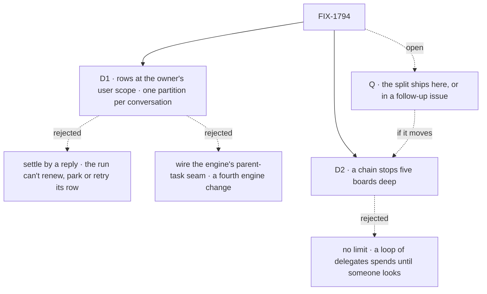

# FIX-1794 · Decisions

[Spec](SPEC.md) · **Decisions** · [Rules](BUSINESS-RULES.md) · [Plan](PLAN.md) · [Docs](DOCS.md) · [Evolution](EVOLUTION.md)

What was considered, what was chosen, why, and what each choice locks in. Two decisions and one
answered question ([Q](#q), the split's scope) are the sign-off surface. The chain itself (tasks from delegates, a new task session per task, every
session the owner's) is the PRD's and the epic's, and is not reopened here.

## The tree

Solid edges are what you're signing. Dashed edges lost, and the label says why. [Q](#q) is
open; if the split moves to a follow-up, D2 moves with it.

## D1 · A board whose tasks run on another flow keeps them at its owner's user scope, in a partition only its own conversation reaches

| | |
|---|---|
| **Instead of** | (a) The board stays in its conversation's session, and the task session settles the row by replying to it · (b) the engine's declared parent-task seam, wired so a task session settles one row in its parent's session |
| **Because** | A lineage stops at a flow, and every coordinator hands work to an `agent` worker. The owner's user scope crosses flows today, and the task session then reads, renews, parks and settles its row exactly as a same-flow run does: lease, retries, run link and park all work unchanged. Unpartitioned, one conversation takes another's tasks ([POC](poc/board-partition/README.md) U1); a claim narrow at Layer 2, the shape of harness-manager's `runOwnerDispatcher`, holds the claim but not the read or the wake (E1). So the ledger itself is kept per conversation, named from the conversation's own server-written identity. (a) leaves a run nobody renews: a lapsed lease runs the task twice, a missing one strands it when the run dies. (b) changes the engine as well as the board, and the seam's verbs read and settle a row but don't renew, park or link a run |
| **Locks in** | A change to the task board, Layer 1, so it binds only once the epic records it ([ER-9](../../epics/FIX-1786/BUSINESS-RULES.md#what-a-team-gets-and-what-it-doesnt), [ER-22](../../epics/FIX-1786/BUSINESS-RULES.md#what-no-child-may-do)). One shape for every board in the chain, same flow or not, so FIX-1792's converted boards and FIX-1793's workstream boards are built on it. The engine is untouched |

![D1: where a board keeps tasks a worker on another flow runs. At the owner's user scope, one partition per conversation, chosen, beside the board staying in its session and settled by a reply. Decides it: what still works when a run dies or waits; lease, retries and park work unchanged, where a reply-settled row can't be renewed. The price: a change to the task board, Layer 1, raised to the epic. A user's rows never reach another user under either. Locks in one board shape for the chain; flips if the engine gets a cross-session row seam](figures/d1-per-conversation.svg)

It comes down to a run that dies or waits: a reply-settled row can't renew, so it runs twice or never.

**What would change my mind:** the epic choosing to give the engine a seam that settles, renews
and parks one row in another session, for its own reasons. Then the board stays in its session,
and the partition is dropped before it ships.

## D2 · A chain stops at five boards deep; a filing below that is refused, naming the limit

| | |
|---|---|
| **Instead of** | No limit, "as deep as the work needs" (the PRD) · or a check that refuses only a worker already in the chain |
| **Because** | Each level is a new session and at least one model turn, and a coordinator splits by judgment. Two delegates that hand each other the same work, or one that keeps splitting, spend a run per level with no person in the loop. A cycle check misses the second. Five covers the concept's own picture (a workstream, a feature, a piece, a coding run) with a level to spare |
| **Locks in** | A public limit, refused at filing, said in the tool's answer so the coordinator does the piece itself or tells the person. Raising it later is cheap; lowering it breaks chains that use it |
| **Breadth** | Depth bounds a loop, not a fan-out. If the split ships here, each conversation's board sets the task board's existing caps (`maxTotalTasks`, `maxEnqueuedTasks`, per partition under S1) as its breadth cap, values the implementer's; if [Q](#q) moves the split, the follow-up carries this with it |

It comes down to a loop nobody watches: without a limit, it spends until someone looks.

**What would change my mind:** a real chain that needs a sixth level. Then the limit rises, and
the docs state the cost per level.

## Decided, not asked

- **Filing is the hand-off** (FIX-1777, carried). A filing returns once the task is stored; the
  conversation's board runs in a request of its own, as its owner. Only an add starts a run, plus
  a retry after a failed attempt and a reassign (FIX-1780 BR-6a, BR-16), and any action on the
  board that finds an owed marker and retries it (S5, S6).
- **The filer is the board's conversation**, by construction. FIX-1780's filer record
  (`filingSession`, `filingWorker`) isn't needed: a task's notice goes to the session that
  dispatched it, through the engine's stamped sender (`{ from: true }`), never an address on the
  row ([POC](poc/board-partition/README.md) F1).
- **Three endings are heard** (FIX-1780 D3): completed, failed for good, parked. A failed attempt
  with attempts left re-runs the board with no coordinator turn. A cancel or a relabel is silent.
- **Reassign and cancel are FIX-1780's rules** (its BR-16 to BR-22): a waiting task moves in
  place; a failed one is carried on by a new task; a running one is refused; three moves per
  piece of work.
- **An assignee is one of this conversation's delegates**, checked by FIX-1791's one check at
  filing and again at hand-over. FIX-1778's lookup still resolves the name to a flow; it never
  authorizes. A delegate record with a target (FIX-1793's workstreams) takes posts, not tasks.
- **An unassigned task goes to the conversation's only delegate.** With none or several it
  waits, and the filing's answer says to assign it (FIX-1777 BR-4, BR-19).
- **A task session is a child of the conversation that filed it**, born linked to its worker
  (FIX-1788 BR-18) and keyed by the task, its worker and the filing conversation's incarnation,
  so a retry re-enters it, a reassign opens a new one, and two conversations that file the same
  task id for the same worker get two sessions. It carries the `taskId` criterion beside
  FIX-1791's `filingSessionId` ([BR-20a](../FIX-1791/BUSINESS-RULES.md#answers-and-rounds)), which the hand-off
  sets server-side: `findWorkerSession` finds it within its conversation, and
  `ensureWorkerSession` with a `taskId` never creates one.
- **Every ending is heard, even across a crash.** The write that records a task's ending also
  writes a pending-notice marker on its row, server-side; only the notice's delivery clears it.
  Any later run of the board, or action on it, replays an outstanding marker into the
  conversation, and S7's dedup absorbs the replay. The row is the outbox; no sweeper.
- **A filed task always gets its start.** The add writes a pending-wake marker on the row in
  the same write, and only the board's run clears it. A wake refused or lost to a crash leaves
  it for the next filing or action on the board to retry; with no sweeper, it waits for that
  touch. Filing a still-pending task's id again re-triggers the wake, idempotently.
- **A split task settles through its own board: FIX-1802's** ([Q](#q); *amended after merge*).
  Its parent binding (the row's partition and claim ticket) and settle-owed marker are carried
  there as written in S8.
- **The partition is the conversation's incarnation**: its id plus a value minted at its birth
  that only the server writes, the same incarnation FIX-1791 keys delegate sessions by. A
  conversation deleted and created again starts with an empty board; the old rows stay in the
  store, unread (BP-030).
- **Who may file is FIX-1802's** (*amended after merge*, epic [D8](../../epics/FIX-1786/DECISIONS.md#d8); this line read "a worker that
  splits its task is a coordinator"). This issue ships the final shape: a board per session, and
  Orchestration's existing eight task tools wired to it, with the session's board as their
  resolver and its task-taking delegates as their roster (S3, S4, T1). Only its answer to "may
  this session file" is interim, "a coordinator conversation, not a task session";
  [FIX-1802](../FIX-1802/DECISIONS.md#d1) swaps in its delegate rule: a worker files when one of
  its delegates takes a task. Any worker flow takes tasks.
- **Reassign and cancel are the task tools' own** (*amended after merge*). FIX-1780's
  `reassignTask` rules this spec cited (a failed task carried on by a new one, three moves, a
  running task's cancel refused) are not carried: on this board `assignTask` moves a task no
  attempt holds, a failed task is filed again with `addTask`, and a cancel of a running task
  lands while its worker's late result is declined. Stopping a running task stays FIX-1659's.
- **Mailbox boards stay until FIX-1792**, which moves each onto this shape or a workstream (epic
  [D5](../../epics/FIX-1786/DECISIONS.md#d5)) and deletes `mailboxTaskLists` with them.

## Considered and dropped

| Alternative | Why not |
|---|---|
| `sharedToLineage` boards, as the PRD wrote | A lineage stops at a flow (epic POC C1); every coordinator-to-`agent` hand-off crosses one |
| Lineage for same-flow hops, a partition for cross-flow ones | Two ways to keep one board, chosen by which flow a delegate names, so a delegate edited to another flow moves its tasks' storage |
| One unpartitioned ledger at the owner's user scope | One conversation takes another's tasks ([POC](poc/board-partition/README.md) U1); struck by the epic in review |
| A claim narrow at Layer 2, the shape of harness-manager's `runOwnerDispatcher` | Holds the claim only: the read lists, and the drain waits on, every conversation's rows (POC E1). Named so a Layer-2-only fix isn't proposed again |
| The task session opened by `ensureWorkerSession`, then an `id` delivery | A second task-board change, and the session loses the parent link a workstream's runs walk up |
| A per-task owner field, checked at claim | Orphaned by the partition: the row's scope is its owner |

## Open

### Q · answered · Does the split ship in this issue, or in a follow-up issue?

**Answered (product owner, 2026-10-06): a follow-up issue, [FIX-1802](https://linear.app/fixpoint-labs/issue/FIX-1802).** This issue ships one level, and a task session's filing is refused. **Reversed after merge, the same day (epic [D8](../../epics/FIX-1786/DECISIONS.md#d8)):** FIX-1802 is in the MVP and builds right after this issue, so the refusal lasts only until it lands. Wherever this spec reads "if Q moves the split", that branch holds. D2's limit, the breadth cap, goal leg b, BR-7, BR-30 to BR-32, S8, S10 and V6 are carried to FIX-1802 as written.

**The fork.** A worker given a big task can split it: hand the pieces to its own delegates,
wait for them, and finish from what they return. Build that here, or in a follow-up issue built
straight after this one?

**In plain terms.** Without the split, a coordinator files a task for a delegate, the delegate
does it, and the conversation hears how it went: one level. With it, a delegate that is itself a
coordinator hands pieces of its task to its own delegates; its task waits, with no notice, until
the last piece ends, then finishes with what the pieces returned, and the conversation above
hears that. If the split moves out, a delegate that tries to hand a piece on is told it can't
yet, and does the work itself, so no task ever finishes before its pieces.

**The trade-off.** Moving it: this issue ships filing, notices, reassign and cancel, and each
conversation's board kept its own, one level deep. The split, its five-level limit
([D2](#d2)) and goal leg b land in the follow-up, on the same board, with nothing stored
reshaped. Keeping it: the PRD's chain ships whole, and this issue carries its largest new
behaviour after D1, the one review's hardest finding landed on (a waiting task settled later,
by a turn that no longer holds the authority to settle it).

**My recommendation: move it to a follow-up issue.** The epic's MVP doesn't check it. Its leg b
asks that every session in each owner's chain be theirs, and that two of Alice's boards that
hand rows to another flow each drain only their own
([epic goal](../../epics/FIX-1786/SPEC.md#the-goal-and-how-well-know-its-met)); a workstream
lead filing for an `agent` delegate, and two conversations, meet both at one level.
[FIX-1780](../FIX-1780/SPEC.md), whose notices and reassign this issue carries, has no split.
The PRD does ask for it ("a worker that splits its task files the pieces on its own board"), and
so does the concept ("as deep as the work needs"), so this is an amendment to this issue's
outcome, said out loud, not a trim. It is the cheapest place to cut: one level proves the board
and the notices in use before anything stacks on them, and the follow-up adds to the row rather
than changing it.

**What would change my mind.** Something before the MVP that needs a delegate to hand pieces
on: the closure run scripted with a lead that splits a feature, or Shift Manager's coding work
([FIX-1763](https://linear.app/fixpoint-labs/issue/FIX-1763)) expecting a lead to split a
feature across coding workers before then. Or "as deep as the work needs" already shown or
promised to someone. Then it stays here, with the parent binding in *decided, not asked*.

**If wrong.** Low, and reversible either way. Cut wrongly: a user whose delegate needs to split
waits one follow-up issue, and the delegate does the work itself meanwhile. Kept wrongly: a
larger middle PR and a longer review for a part the MVP's check never runs.

![Q, open: whether the split ships in this issue or a follow-up. A follow-up, recommended, beside building it here. Decides it: what the epic's MVP check needs, which one level meets. The price of moving: the PRD's chain ships one level deep for now, and a delegate that must split does the work itself. A tie: what is stored, since the follow-up adds to the row and reshapes nothing. Locks in: this issue ships one level; the split, D2 and goal leg b go to the follow-up. Flips if: something before the MVP needs a delegate to split](figures/open-split-scope.svg)

It comes down to what the MVP checks: one level meets it, and the split is the riskiest part
left.

## Settled

- **An unpartitioned user-scoped ledger lets one conversation take another's tasks** —
  **CONFIRMED** on `fa8161e88`: `conv_a`'s drain ran `conv_b`'s task under itself
  ([POC](poc/board-partition/README.md) U1).
- **Today's claim narrow keeps a board its own** — **REFUTED**: it holds the claim, but the
  read lists and the drain waits on the other conversation's rows (E1). This is why D1 changes
  the task board.
- **A task session on another flow reaches its filer as the owner** — **CONFIRMED**:
  `{ from: true }` lands in the conversation, as alice (F1).

## How it got here

- **Draft** — framed as the epic's chain, with FIX-1791's tasks and FIX-1780's follow-through
  folded in (Jake, 2026-10-06). Per-conversation partitions at the owner's user scope over a reply
  or an engine seam, after a POC showed a Workforce-only narrow leaves the read and the wake
  open. A depth limit of five. Three PRs.
- **Review round 1** (Codex, Cursor) — an ending's notice and a filing's start each made durable
  by a marker on the row that the next touch of the board replays; a task session found within
  its own conversation; a parked task given a server-written binding to settle through its own
  board. The split's scope raised as [Q](#q).
- **Review round 2** (final) — a post to a delegate never lands in a task session, by FIX-1788's
  lookup matching on the key set (amended in #2831); a split parent's settle made owed on the
  row like a notice, so a failed turn can't strand it; the wake marker written with the add; a
  breadth cap named beside D2.

- **Amended after merge (FIX-1802's spec PR #2839)** — epic [D8](../../epics/FIX-1786/DECISIONS.md#d8) brought FIX-1802 into the MVP and made
  filing a tool any worker can be granted. This issue now ships the board per session and wires
  Orchestration's eight task tools to it, so FIX-1802 only swaps the answer to "may this session
  file". The product owner, 2026-10-07: build on the existing task tools, not new ones; their one
  extension, T1, is a Layer 1 change for the epic to record. The split's acceptance (leg b,
  BR-30 to BR-32, S8, S10, V6) points there; BR-7 is the interim refusal.
- **Terminology** (the product owner, 2026-10-07; epic [D7](../../epics/FIX-1786/DECISIONS.md#d7)) —
  a board's seat is now an *assignee*, so the plan and the docs draft say "an assignee that hands
  off" and "the default assignee".

**Open: none.** [Q](#q) is answered: the split moves to FIX-1802, which is in the MVP (epic D8).
