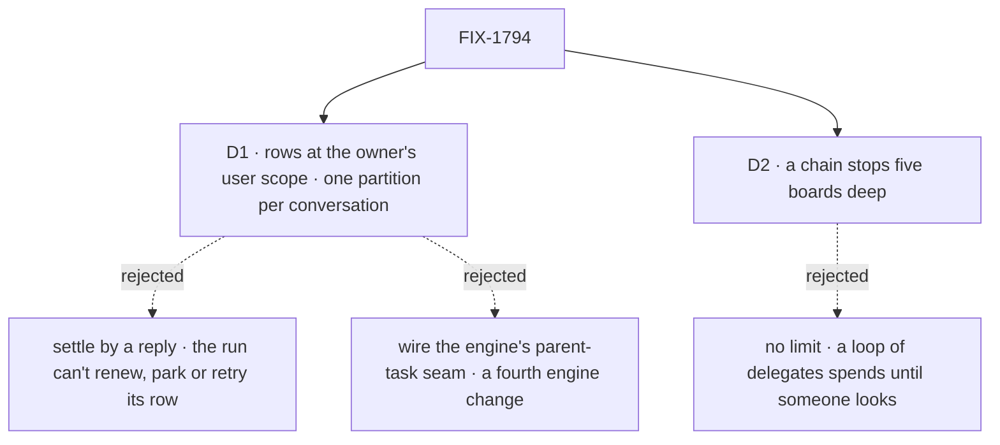

# FIX-1794 · Decisions

[Spec](SPEC.md) · **Decisions** · [Rules](BUSINESS-RULES.md) · [Plan](PLAN.md) · [Docs](DOCS.md) · [Evolution](EVOLUTION.md)

What was considered, what was chosen, why, and what each choice locks in. Two decisions are the
sign-off surface. The chain itself (tasks from delegates, a new task session per task, every
session the owner's) is the PRD's and the epic's, and is not reopened here.

## The tree

Solid edges are what you're signing. Dashed edges lost, and the label says why.

## D1 · A board whose tasks run on another flow keeps them at its owner's user scope, in a partition only its own conversation reaches

| | |
|---|---|
| **Instead of** | (a) The board stays in its conversation's session, and the task session settles the row by replying to it · (b) the engine's declared parent-task seam, wired so a task session settles one row in its parent's session |
| **Because** | A lineage stops at a flow, and every coordinator hands work to an `agent` worker. The owner's user scope crosses flows today, and the task session then reads, renews, parks and settles its row exactly as a same-flow run does: lease, retries, run link and park all work unchanged. Unpartitioned, one conversation takes another's tasks ([POC](poc/board-partition/README.md) U1); a claim narrow in Workforce holds the claim but not the read or the wake (E1). So the ledger itself is kept per conversation, named from the conversation's own server-written identity. (a) leaves a run nobody renews: a lapsed lease runs the task twice, a missing one strands it when the run dies. (b) changes the engine as well as the board, and the seam's verbs read and settle a row but don't renew, park or link a run |
| **Locks in** | A change to the task board, Layer 1, so it binds only once the epic records it ([ER-9](../../epics/FIX-1786/BUSINESS-RULES.md#what-a-team-gets-and-what-it-doesnt), [ER-22](../../epics/FIX-1786/BUSINESS-RULES.md#what-no-child-may-do)). One shape for every board in the chain, same flow or not, so FIX-1792's converted boards and FIX-1793's workstream boards are built on it. The engine is untouched |

![D1: where a board keeps tasks a worker on another flow runs. At the owner's user scope, one partition per conversation, chosen, beside the board staying in its session and settled by a reply. Decides it: what still works when a run dies or waits; lease, retries and park work unchanged, where a reply-settled row can't be renewed. The price: a change to the task board, Layer 1, raised to the epic. A user's rows never reach another user under either. Locks in one board shape for the chain; flips if the engine gets a cross-session row seam](figures/d1-per-conversation.svg)

It comes down to a run that dies or waits: a reply-settled row can't renew, so it runs twice or never.

**What would change my mind:** the epic choosing to give the engine a seam that settles, renews
and parks one row in another session, for its own reasons. Then the board stays in its session,
and the partition is dropped before it ships.

## D2 · A chain stops at five boards deep; a filing below that is refused, naming the limit

| | |
|---|---|
| **Instead of** | No limit, "as deep as the work needs" (the PRD) · or a check that refuses only a worker already in the chain |
| **Because** | Each level is a new session and at least one model turn, and a coordinator splits by judgment. Two delegates that hand each other the same work, or one that keeps splitting, spend a run per level with no person in the loop. A cycle check misses the second. Five covers the concept's own picture (a workstream, a feature, a piece, a coding run) with a level to spare |
| **Locks in** | A public limit, refused at filing, said in the tool's answer so the coordinator does the piece itself or tells the person. Raising it later is cheap; lowering it breaks chains that use it |

It comes down to a loop nobody watches: without a limit, it spends until someone looks.

**What would change my mind:** a real chain that needs a sixth level. Then the limit rises, and
the docs state the cost per level.

## Decided, not asked

- **Filing is the hand-off** (FIX-1777, carried). A filing returns once the task is stored; the
  conversation's board runs in a request of its own, as its owner. Only an add starts a run, plus
  a retry after a failed attempt and a reassign (FIX-1780 BR-6a, BR-16).
- **The filer is the board's conversation**, by construction. FIX-1780's filer record
  (`filingSession`, `filingWorker`) isn't needed: a task's notice goes to the session that
  dispatched it, through the engine's stamped sender (`{ from: true }`), never an address on the
  row ([POC](poc/board-partition/README.md) F1).
- **Three endings are heard** (FIX-1780 D3): completed, failed for good, parked. A failed attempt
  with attempts left re-runs the board with no coordinator turn. A cancel or a relabel is silent.
- **Reassign and cancel are FIX-1780's rules** (its BR-16 to BR-22): a waiting task moves in
  place; a failed one is carried on by a new task; a running one is refused; three moves per
  piece of work.
- **An assignee is one of this conversation's delegates**, checked by FIX-1791's one check at
  filing and again at hand-over. FIX-1778's lookup still resolves the name to a flow; it never
  authorizes. A delegate record with a target (FIX-1793's workstreams) takes posts, not tasks.
- **An unassigned task goes to the conversation's only delegate.** With none or several it
  waits, and the filing's answer says to assign it (FIX-1777 BR-4, BR-19).
- **A task session is a child of the conversation that filed it**, born linked to its worker
  (FIX-1788 BR-18) and keyed by the task and its worker, so a retry re-enters it and a reassign
  opens a new one. It carries the `taskId` criterion: `findWorkerSession` finds it, and
  `ensureWorkerSession` with a `taskId` never creates one.
- **The partition is the conversation's incarnation**: its id plus a value minted at its birth
  that only the server writes, the same incarnation FIX-1791 keys delegate sessions by. A
  conversation deleted and created again starts with an empty board; the old rows stay in the
  store, unread (BP-030).
- **A worker that splits its task is a coordinator** (epic [D2](../../epics/FIX-1786/DECISIONS.md#d2)).
  The board and the filing tools are the coordinator flow's; any worker flow takes tasks.
- **Mailbox boards stay until FIX-1792**, which moves each onto this shape or a workstream (epic
  [D5](../../epics/FIX-1786/DECISIONS.md#d5)) and deletes `mailboxTaskLists` with them.

## Considered and dropped

| Alternative | Why not |
|---|---|
| `sharedToLineage` boards, as the PRD wrote | A lineage stops at a flow (epic POC C1); every coordinator-to-`agent` hand-off crosses one |
| Lineage for same-flow hops, a partition for cross-flow ones | Two ways to keep one board, chosen by which flow a delegate names, so a delegate edited to another flow moves its tasks' storage |
| One unpartitioned ledger at the owner's user scope | One conversation takes another's tasks ([POC](poc/board-partition/README.md) U1); struck by the epic in review |
| A claim narrow in Workforce, the `runOwnerDispatcher` shape | Holds the claim only: the read lists, and the drain waits on, every conversation's rows (POC E1) |
| The task session opened by `ensureWorkerSession`, then an `id` delivery | A second task-board change, and the session loses the parent link a workstream's runs walk up |
| A per-task owner field, checked at claim | Orphaned by the partition: the row's scope is its owner |

## Settled

- **An unpartitioned user-scoped ledger lets one conversation take another's tasks** —
  **CONFIRMED** on `fa8161e88`: `conv_a`'s drain ran `conv_b`'s task under itself
  ([POC](poc/board-partition/README.md) U1).
- **Today's claim narrow keeps a board its own** — **REFUTED**: it holds the claim, but the
  read lists and the drain waits on the other conversation's rows (E1). This is why D1 changes
  the task board.
- **A task session on another flow reaches its filer as the owner** — **CONFIRMED**:
  `{ from: true }` lands in the conversation, as alice (F1).

## How it got here

- **Draft** — framed as the epic's chain, with FIX-1791's tasks and FIX-1780's follow-through
  folded in (Jake, 2026-10-06). Per-conversation partitions at the owner's user scope over a reply
  or an engine seam, after a POC showed a Workforce-only narrow leaves the read and the wake
  open. A depth limit of five. Three PRs.

**Open: none.**
