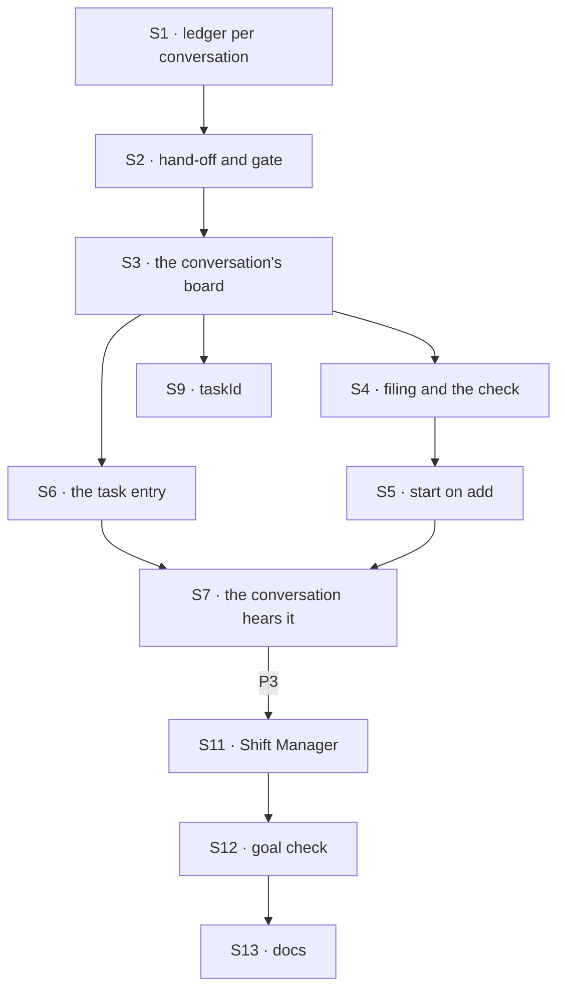

# FIX-1794 · Plan

[Spec](SPEC.md) · [Decisions](DECISIONS.md) · [Rules](BUSINESS-RULES.md) · **Plan** · [Docs](DOCS.md) · [Evolution](EVOLUTION.md)

Written for the implementing agent. IDs cross-reference [BUSINESS-RULES.md](BUSINESS-RULES.md)
(BR-n) and [DECISIONS.md](DECISIONS.md). `tdd`. Three PRs, a GitHub stack (epic ER-26). P1 starts
only after the epic's record of D1, its [D6](../../epics/FIX-1786/DECISIONS.md#d6) (amendment
[#2831](https://github.com/fixpoint-labs/flow-state-dev/pull/2831); ER-9, ER-22, ER-24), merges.
**P1 may start before FIX-1791 merges**: it touches only orchestration, on its own two-flow
fixtures, and reads no delegate or worker. The epic's path, where FIX-1794 builds after
FIX-1791, mirrors this exception. P2 starts only after FIX-1788 and FIX-1791 merge (epic D4,
ER-23).

## Surfaces

| ID | Package · role | Change | Rules |
|---|---|---|---|
| S1 | `orchestration` · a ledger kept per conversation (D1) | A durable task collection whose rows sit at the owner's user scope, one partition per keeping session. A ref resolved in a session reaches only its partition, for **every** operation: list, read, claim, the drain's wake and exit counts, the task tools, change events, caps. The partition comes from a function of the running context that the composing layer supplies, from server-written data only; orchestration knows no conversation or worker | BR-11 BR-13 BR-14 |
| S2 | `orchestration` · hand-off and the receiving gate | `taskBoard` accepts S1 for seats that hand off. The hand-off puts the partition on the envelope, from the ref it claimed through. `taskLedgers` can resolve a ref over the partition the envelope names, at the running user's scope only; every gate check runs unchanged | BR-16 BR-21 |
| S3 | `workforce` · the session's board | Each coordinator conversation keeps one board on S1, partitioned by the conversation's incarnation (the value FIX-1791 keys delegate sessions by). *Amended after merge:* every session of a flow carrying S4's task tools keeps one, partitioned by that session's incarnation; only S4's answer limits who files onto it. One `defaultWorker` seat hands every row to `work` on the flow its assignee names (FIX-1778's per-task target, narrowed to delegates), keyed by task and worker. The dispatched child's birth names the worker (FIX-1788 S1), the `taskId` criterion and the chain depth | BR-16–BR-18 |
| S4 | `workforce` · filing and the check | *Amended after merge ([#2839](https://github.com/fixpoint-labs/flow-state-dev/pull/2839)):* Orchestration's existing eight task tools, not new ones. `createTaskToolsCapability(resolver, roster)` gives the coordinator's model the eight as tools; `taskToolActions(<board id>, resolver, roster)` gives any coordinator conversation the same eight as public actions. The **resolver** is the running session's own board (S3, its D6 partition); the ref it returns writes S5's start on add and reassign. The **roster** is the session's delegates that take a task (on its delegate list, without a target, passing FIX-1791's S2 check, flow takes tasks), read per call, which needs T1 below. Run at filing and again at hand-over. The answer to "may this session file" is interim: a coordinator conversation, not a task session (the resolver gives a task session no board); [FIX-1802](../FIX-1802/PLAN.md) swaps in its delegate rule (epic D8). Reassign and cancel are the tools' existing contract on this board: `assignTask` moves a task no attempt holds, and the board's frozen assignee declines the rest; `cancelTask` settles any unfinished task, and a running worker's own later result is declined | BR-1–BR-9 |
| S5 | `workforce` · start on add | The add writes a server-written pending-wake marker on the row, in the same write. After it commits, dispatch a run of this board into this conversation as its own request; that run clears the marker. The filing succeeds once the add commits, whether the dispatch is enqueued or refused: a refused or crash-lost wake leaves the marker, and the next filing or action on the board retries it. Filing the id of a row still pending re-triggers the wake, idempotently. A reassign does the same; a bare assign doesn't. No sweeper | BR-9 BR-10 BR-10a BR-23 |
| S6 | `workforce` · the task entry | `work` (`WORKER_TASK_ENTRY`) on `agent` and the coordinator flow, `from` an S2 resolver over the conversation ledger. The write that records an ending also writes a server-written pending-notice marker on the row; then one notice to the sender through `{ from: true }`, never an address from the row or payload. Only the notice's delivery clears the marker (a refusal under BR-28 clears it too, recorded on the task session). Any run of the board, or action on it, replays an outstanding marker into its own conversation: the row is the outbox | BR-16 BR-22 BR-24 BR-25 BR-26a |
| S7 | `workforce` · the conversation hears it | `onTaskSettled`, an internal entry on the coordinator flow. Deduped by task, attempt and ending, which absorbs S6's replays. A retried attempt runs the board again, with no turn. An ending wakes the judgment turn, or lands as a line under a fixed policy. Refused when the conversation is gone or its worker fired | BR-22–BR-29 |
| S8 | `workforce` · the split. *Amended after merge:* owned by [FIX-1802](../FIX-1802/PLAN.md) (its S4); not built here. As written for it: | A coordinator task session that filed pieces parks its own row on the board above, marked as waiting on its pieces; S7 sends no notice for that park. Parking writes a parent binding, server-side and recoverable after a restart: the parked row's partition and its claim ticket, on the row and in the task session's server-written state. The write that records the last open piece's ending also writes a settle-owed marker on that board, naming the parent binding. After the turn that piece's notice woke, if no piece is open, the parent's row settles from its pieces through the owning board, using that binding and fenced by its ticket, never a coordinate a caller or payload supplies; only that settle clears the marker. If the turn fails, any later touch of the board replays the settle, exactly as BR-26a replays a notice. A replay never runs inside a turn, so that turn can still reassign; a reassign that reopens a piece leaves the marker for that piece's next ending. The ticket fences a replay after the settle and before the clear, which then only clears | BR-30–BR-32 |
| S9 | `workforce` · the criterion | `taskId` on FIX-1788's `findWorkerSession` and `ensureWorkerSession` criteria, through their shared lookup, beside FIX-1791's `filingSessionId` ([BR-20a](../FIX-1791/BUSINESS-RULES.md#answers-and-rounds)): the hand-off sets it server-side to the filing conversation's incarnation, so the task session's criteria are `{ worker, taskId, filingSessionId }` and two conversations filing one task id for one worker get distinct sessions. A lookup that names no `taskId` never returns a task session, per FIX-1788 S5a as amended in [#2831](https://github.com/fixpoint-labs/flow-state-dev/pull/2831), so FIX-1791's `ensureWorkerSession({ worker, filingSessionId })` still delivers a post into the delegate's session. `ensure` with a `taskId` never creates | BR-19 BR-20 |
| S10 | `workforce` · depth. *Amended after merge:* owned by FIX-1802 (its S5) | Counted from server-written data at each task session's birth (the parent's depth plus one), never from input | BR-7 BR-8 |
| S11 | `shift-manager` | The chief of staff gains the eight task tools. Its Board shows the viewer's conversations' `listTasks`. The Lab reloads after each coordinator turn (#2720's floor); no tool name is special-cased (ER-19) | VG |
| S12 | `goals/coordinators/files-tasks-down-the-owners-chain/` | The goal check and its two controls, per [SPEC.md](SPEC.md#the-goal-and-how-well-know-its-met) | goal |
| S13 | Docs | [DOCS.md](DOCS.md); the `orchestration` and `workforce` READMEs; `minor` changesets for both | — |

**T1 · the one extension to the task tools.** *Amended after merge
([#2839](https://github.com/fixpoint-labs/flow-state-dev/pull/2839)).* A **Layer 1 change** to
Orchestration's `taskTools` (`packages/orchestration/src/skills/task-tools-capability.ts`),
outside the epic's D3 four, so the epic records it (ER-22): the roster may be read per call from
the running context, as the board is (`(ctx) => Promise<WorkerRoster>` beside today's fixed
`WorkerRoster`), and `taskToolActions` takes a roster too, as `createTaskToolsCapability` does.
Why: a conversation's delegates are its own and change mid-conversation, and the app's actions
must run the model's check (tenet 5); today `taskToolActions` checks no assignee, so an app could
add a task for Bob's worker and be refused only at hand-over. Additive: every existing caller
passes what it passes today. Nothing else needs a task-tool change: the start rides the
resolver's ref (S5), the notices come from the board's gate (S6, S7), and FIX-1802's depth and
chain limits throw the existing `TaskCapExceededError` from that ref. Considered and dropped:
building the roster per run in a `uses` function needs no Layer 1 change for the model's tools,
but actions are fixed at definition, so the app's filing would go unchecked.

S1 and S2 are one invariant: every operation goes through the partition, and the hand-off
carries the partition it claimed through. Build and check them together in P1; neither is done
alone.

**Removed here: nothing.** Mailbox boards, `mailboxTaskLists` and `runOwnerDispatcher`'s use on
them go with FIX-1792's conversion, which moves each board onto S1 or a workstream.

## Sequence · the PR plan

| PR | Delivers | Depends on |
|---|---|---|
| P1 · the conversation ledger | S1, S2, on orchestration fixtures with two flows and two users | The epic's D6 merged · FIX-1787's merge-first rows · not FIX-1791 |
| P2 · filing and the chain | T1, S3–S7, S9 (S8 and S10 are FIX-1802's) | P1 · FIX-1788 and FIX-1791 merged |
| P3 · Shift Manager, the goal, the docs | S11–S13, VG | P2 |



## Checks

| ID | Runs after | Passes when |
|---|---|---|
| V1 | S1 | BR-11 for every operation S1 lists, two sessions on one flow and on two flows; BR-13 with two users; BR-14 after delete and recreate; a partition function that reads input is refused at construction or has no input to read |
| V2 | S2 | A cross-flow child settles, renews and parks its row in the named partition; an envelope naming another of the user's partitions fails the claim check (BR-21); the task entry is not a public action. BR-15 across a flow: kill a claimed cross-flow child, let its lease lapse, and the next run of its board reclaims the row through the partitioned path and runs it once more, within the abandonment allowance |
| V3 | S4, T1 | BR-1–BR-9 through the actions and the tools alike; BR-2 with two users, one answer for Bob's worker and a missing one; BR-3 after firing a delegate between filing and hand-over; a delegate added mid-conversation is accepted on the next call (T1); `assignTask` on a running task declined, `cancelTask` on one lands and the worker's late result is declined |
| V4 | S5 | BR-10 with no drain call in the test; the filing returns before the run starts. BR-10a: a refused wake, and a kill between the add and the dispatch, each leave the add stored with the marker on the row, and a re-file of the same id then starts the task, once; so does the next filing of another task |
| V5 | S6 S7 | BR-22–BR-29: each ending once, re-read after a grace period; a redelivered notice; a mid-turn notice; a notice to a deleted conversation. BR-26a: kill after the ending's write and before the notice's dispatch; the next run of the board delivers the notice exactly once, and the marker is cleared |
| V6 | S8: FIX-1802's (its V3); not run here. As written for it: | BR-31, BR-32 with one piece completed and one errored; a reassign in the turn the errored notice woke keeps the task open; the parent settles through its binding after a restart between park and the last piece's notice, and a coordinate on the input or payload is ignored. The settle-owed marker: the turn the last piece's notice woke fails, and the next touch of that board settles the parent, once; a kill after the settle and before the clear settles nothing twice |
| V7 | S9 | BR-19, BR-20; two conversations of one user filing the same task id for the same worker: two sessions, and each conversation's `findWorkerSession` finds its own. A task filed for X in conversation C, then a post to X in C: the post lands in X's delegate session, not the task session. BR-7: a task session's filing refused |
| VG | P3 | [The goal](SPEC.md#the-goal-and-how-well-know-its-met): `goals/coordinators/files-tasks-down-the-owners-chain/run.mts` PASSES, after the same run FAILED leg c under `unpartitioned`, legs a and e under `no-follow-up`, and every leg on today's `main` |

One check per decision: D1 by V1, V2 and VG leg c; D2 is FIX-1802's (its V4). The second path (BP-035): a
recreated conversation (V1), a dead cross-flow run (V2), a fired delegate (V3), a refused start
and a re-file (V4), a duplicate, a late and a crash-lost notice (V5), two users (V1, V3, VG), the off state of the follow-up (VG control).

## Pinned names

| Where | Name | Why pinned |
|---|---|---|
| Actions and tools | Orchestration's existing eight: `addTask`, `assignTask`, `completeTask`, `failTask`, `blockTask`, `cancelTask`, `updateTask`, `listTasks`; as actions, named `<tool>_<board>` by `taskToolActions`' rule (*amended after merge*, [#2839](https://github.com/fixpoint-labs/flow-state-dev/pull/2839)) | Existing public names and signatures; an app sends them. The board's collection id fixes the action names: drafted `tasks`, final in P1 |
| The criterion | `taskId` | FIX-1788 reserved it for this issue |
| The task session's lookup key | `filingSessionId`, beside `taskId` and `worker` | FIX-1791's key and value (the filing conversation's incarnation, set server-side), so a task session is found only within the conversation that filed it |
| The notice entry | `onTaskSettled` | The goal check reads notices by it, as FIX-1780 pinned |
| The depth limit | 5 | Public (D2) |
| Controls | `GOAL_CONTROL=unpartitioned`, `GOAL_CONTROL=no-follow-up` | The goal check |

S1's option name is FIX-1794's: the epic's [D6](../../epics/FIX-1786/DECISIONS.md#d6) records
only the partition shape and leaves the name here, because no other child names it. Drafted as
`partitionBy` in [DOCS.md](DOCS.md); pick the final name in P1. Everything else is yours, in the
new terms (worker, delegate, conversation; not seat, mailbox or member).

## Guardrails

| Rule | Because |
|---|---|
| Every board operation goes through the partitioned ref, including the wake and exit counts (tenet 5) | A claim narrow alone leaves the read and the wake on every conversation's rows ([POC](poc/board-partition/README.md) E1) |
| Partition, depth and owner come from server-written data, never input (BP-031, ER-17) | Each decides whose work a run touches |
| Every ending gives exactly one notice, from one of two producers: the task session's gate, or the board's own run (a refused hand-over, an abandonment). Both write the pending-notice marker with the ending, and a replay of it goes through S7's dedup | FIX-1780's *not done if*: none, or twice |
| Every owed start, owed notice and (with the split) owed parent settle is a marker on the row, written in the same write as what owes it, and cleared only by what it owes | A crash between the write and the dispatch otherwise strands the task, or its ending goes unheard |
| The filing never waits for the run, and never fails because the start did | A coding run inside a tool call holds the coordinator; a failed add invites a second filing |
| The assignee check runs at filing and at hand-over | A delegate fired between the two must not run |
| No engine change, and no worker or delegate name in orchestration (ER-22, the layer split). The only task-tool change is T1 (*amended after merge*) | S1's partition is a function the composing layer supplies; so are T1's roster and the resolver |
| Nothing new builds on mailbox boards | FIX-1792's conversion must not grow |

## Docs

Reconcile and publish [DOCS.md](DOCS.md) in P3, after V1 to V7 pass, against the name P1 gave
S1's option and the shipped refusal wording.

## Sketch · pseudocode, illustrative, react to the shape

```
addTask(goal, assignee) in conversation C, tool or action:        ← Orchestration's tool (amended after merge)
    roster: C's delegates that take a task, read now (T1)            ← the tools' one check, app and tool
    resolver's ref: add the row to C's partition, wake-owed, one write   ← partition = C's incarnation
        (same id still pending: keep it, and it stays wake-owed)
    dispatch "run my board" into C, own request; return             ← never waits; refused or lost,
                                                                       the marker stays, next touch retries
run my board, in C, as C's owner:
    replay any notice-owed or settle-owed marker; clear any wake-owed one
    claim from C's partition only; hand each row to work on its worker's flow,
        key (task, worker, filingSessionId = C's incarnation)
work, in the task session (any flow):
    gate reads the row in the partition the envelope names           ← at the owner's user scope
    run; record the ending + notice-owed, one write; notify { from: true }; clear on delivery
onTaskSettled in C:
    retried → run my board again
    ended   → the coordinator's turn; if C is itself a task session with no open piece (Q),
              settle its own row on the board above through its parent binding, then clear
              the settle-owed marker the last piece's ending wrote (a failed turn: next touch)
```

**POC:** [`poc/board-partition/`](poc/board-partition/README.md), 4 legs. It confirmed an
unpartitioned user ledger lets one conversation take another's task (U1), refuted a Workforce-only
claim narrow as enough (E1: the read and the wake stay open), and confirmed the follow-up path
back across a flow (F1). D1 rests on E1. No counted fact carries the design, so no checker.

## At implement time

- Take the epic's D6 (the partition shape; the option's name stays this issue's), FIX-1788's
  dispatched-child birth input and criteria shape, and FIX-1791's delegate check, incarnation
  function and `filingSessionId` key. If any differ from this plan, change them there,
  once.
- How an app names the conversation in `findWorkerSession({ worker, taskId,
  filingSessionId })`: adopt FIX-1791's shape for the key. The app passes the conversation's
  id (SPEC and DOCS pass `session.id`); the server maps it to the incarnation, reading the stamp
  from the conversation's record, never from a caller.
- Promote the POC's U1 and E1 into `packages/orchestration/test/task-board/hand-off-cross-flow.test.ts`
  in P1, as a describe over the partitioned ledger (U1 green, E1's read and wake closed), so the
  regression runs in default CI. Keep the retained POC as a pointer to it.
- Where flow code reads a conversation's incarnation: FIX-1788's server-written data at birth
  first. If only the engine can supply it, that is part of the change the epic records.
- S1's key layout: adopt only a partition's direct children and refuse an id containing `/`
  (FIX-1779's lesson 7, closed #2760). Pin both in a new test file under
  `packages/orchestration/test/collection/`.
- FIX-1793's S6 walks a run's `parentSessionId` up to the workstream session; S3 keeps that link.
- The coordinator flow both hands off to `work` and serves `work` with `from`. `defineFlow`
  refuses a `from` entry a same-flow board hands off to, so S3's seat keeps the per-task target
  function (cross-flow at definition), and V3 covers a coordinator delegating to a coordinator.
- Old-term exports left for FIX-1792 and FIX-1796: `mailboxBoard`, `mailboxBoardIds`,
  `mailboxBoardRowSchema`, `mailboxBoardTaskTools`, `mailboxTaskLists`.

## Follow-ups

- A task into a workstream's existing session (a delegate record with a target, BR-4): after
  FIX-1793, if a project coordinator needs to file rather than post.
- A row whose run died is taken back only when its board runs again (BR-15), and an owed start,
  notice or parent settle is sent only at the board's next touch (BR-10a, BR-26a, BR-32). A
  sweeper that wakes such boards is out of scope.
- The split: [FIX-1802](../FIX-1802/PLAN.md), in the MVP (epic D8), for S8, D2's limit (S10) and
  its breadth cap, BR-30 to BR-32, V6 and goal leg b, with the parent binding and settle-owed
  marker as written here (*amended after merge*).
- A coding worker's harness task list (concept step 5) composes under FIX-1763.
