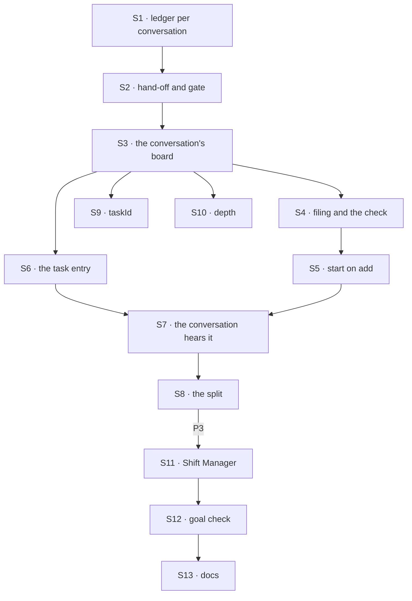

# FIX-1794 · Plan

[Spec](SPEC.md) · [Decisions](DECISIONS.md) · [Rules](BUSINESS-RULES.md) · **Plan** · [Docs](DOCS.md) · [Evolution](EVOLUTION.md)

Written for the implementing agent. IDs cross-reference [BUSINESS-RULES.md](BUSINESS-RULES.md)
(BR-n) and [DECISIONS.md](DECISIONS.md). `tdd`. Three PRs, a GitHub stack (epic ER-26). P1 starts
only after a follow-up epic PR records D1 (ER-9, ER-22, ER-24); P2 only after FIX-1788 and
FIX-1791 merge (epic D4, ER-23).

## Surfaces

| ID | Package · role | Change | Rules |
|---|---|---|---|
| S1 | `orchestration` · a ledger kept per conversation (D1) | A durable task collection whose rows sit at the owner's user scope, one partition per keeping session. A ref resolved in a session reaches only its partition, for **every** operation: list, read, claim, the drain's wake and exit counts, the task tools, change events, caps. The partition comes from a function of the running context that the composing layer supplies, from server-written data only; orchestration knows no conversation or worker | BR-11 BR-13 BR-14 |
| S2 | `orchestration` · hand-off and the receiving gate | `taskBoard` accepts S1 for seats that hand off. The hand-off puts the partition on the envelope, from the ref it claimed through. `taskLedgers` can resolve a ref over the partition the envelope names, at the running user's scope only; every gate check runs unchanged | BR-16 BR-21 |
| S3 | `workforce` · the conversation's board | Each coordinator conversation keeps one board on S1, partitioned by the conversation's incarnation (the value FIX-1791 keys delegate sessions by). One `defaultWorker` seat hands every row to `work` on the flow its assignee names (FIX-1778's per-task target, narrowed to delegates), keyed by task and worker. The dispatched child's birth names the worker (FIX-1788 S1), the `taskId` criterion and the chain depth | BR-16–BR-18 |
| S4 | `workforce` · filing and the check | `fileTask`, `reassignTask`, `cancelTask`, `listTasks` as public actions on any coordinator conversation and as the coordinator's tools; both call one module. The check: on this conversation's delegate list, without a target, passing FIX-1791's S2 check, flow takes tasks, depth under the limit. Run at filing and again at hand-over. Reassign and cancel are FIX-1780's BR-16 to BR-22 on this board | BR-1–BR-9, FIX-1780 BR-16–22 |
| S5 | `workforce` · start on add | After an add commits, dispatch a run of this board into this conversation as its own request, rescued so the add never fails. A reassign does the same; a bare assign doesn't | BR-10 BR-23 |
| S6 | `workforce` · the task entry | `work` (`WORKER_TASK_ENTRY`) on `agent` and the coordinator flow, `from` an S2 resolver over the conversation ledger. After the gate records an ending, one notice to the sender through `{ from: true }`, never an address from the row or payload | BR-16 BR-22 BR-24 BR-25 |
| S7 | `workforce` · the conversation hears it | `onTaskSettled`, an internal entry on the coordinator flow. Deduped by task, attempt and ending. A retried attempt runs the board again, with no turn. An ending wakes the judgment turn, or lands as a line under a fixed policy. Refused when the conversation is gone or its worker fired | BR-22–BR-29 |
| S8 | `workforce` · the split | A coordinator task session that filed pieces parks its own row on the board above, marked as waiting on its pieces; S7 sends no notice for that park. After any turn a piece's notice woke, if its board has no open piece, it settles that row from its pieces | BR-30–BR-32 |
| S9 | `workforce` · the criterion | `taskId` on FIX-1788's `findWorkerSession` and `ensureWorkerSession` criteria, through their shared lookup. `ensure` with a `taskId` never creates | BR-19 BR-20 |
| S10 | `workforce` · depth | Counted from server-written data at each task session's birth (the parent's depth plus one), never from input | BR-7 BR-8 |
| S11 | `shift-manager` | The chief of staff gains the four tools. Its Board shows the viewer's conversations' `listTasks`. The Lab reloads after each coordinator turn (#2720's floor); no tool name is special-cased (ER-19) | VG |
| S12 | `goals/coordinators/files-tasks-down-the-owners-chain/` | The goal check and its two controls, per [SPEC.md](SPEC.md#the-goal-and-how-well-know-its-met) | goal |
| S13 | Docs | [DOCS.md](DOCS.md); the `orchestration` and `workforce` READMEs; `minor` changesets for both | — |

**Removed here: nothing.** Mailbox boards, `mailboxTaskLists` and `runOwnerDispatcher`'s use on
them go with FIX-1792's conversion, which moves each board onto S1 or a workstream.

## Sequence · the PR plan

| PR | Delivers | Depends on |
|---|---|---|
| P1 · the conversation ledger | S1, S2, on orchestration fixtures with two flows and two users | The epic's record of D1 · FIX-1787's merge-first rows |
| P2 · filing and the chain | S3–S10 | P1 · FIX-1788 and FIX-1791 merged |
| P3 · Shift Manager, the goal, the docs | S11–S13, VG | P2 |



## Checks

| ID | Runs after | Passes when |
|---|---|---|
| V1 | S1 | BR-11 for every operation S1 lists, two sessions on one flow and on two flows; BR-13 with two users; BR-14 after delete and recreate; a partition function that reads input is refused at construction or has no input to read |
| V2 | S2 | A cross-flow child settles, renews and parks its row in the named partition; an envelope naming another of the user's partitions fails the claim check (BR-21); the task entry is not a public action |
| V3 | S4 | BR-1–BR-9 through the actions and the tools alike; BR-2 with two users, one answer for Bob's worker and a missing one; BR-3 after firing a delegate between filing and hand-over; FIX-1780 BR-16–BR-22 on this board |
| V4 | S5 | BR-10 with no drain call in the test; the filing returns before the run starts; a failed start leaves the task pending and the add stored |
| V5 | S6 S7 | BR-22–BR-29: each ending once, re-read after a grace period; a redelivered notice; a mid-turn notice; a notice to a deleted conversation |
| V6 | S8 | BR-31, BR-32 with one piece completed and one errored; a reassign in the turn the errored notice woke keeps the task open |
| V7 | S9 S10 | BR-19, BR-20; BR-7 at depth six, with a forged depth on the input ignored |
| VG | P3 | [The goal](SPEC.md#the-goal-and-how-well-know-its-met): `goals/coordinators/files-tasks-down-the-owners-chain/run.mts` PASSES, after the same run FAILED leg c under `unpartitioned`, legs a and e under `no-follow-up`, and every leg on today's `main` |

One check per decision: D1 by V1, V2 and VG leg c; D2 by V7. The second path (BP-035): a
recreated conversation (V1), a fired delegate (V3), a failed start (V4), a duplicate and a late
notice (V5), two users (V1, V3, VG), the off state of the follow-up (VG control).

## Pinned names

| Where | Name | Why pinned |
|---|---|---|
| Actions and tools | `fileTask`, `reassignTask`, `cancelTask`, `listTasks` | Public; an app sends them. Signatures are yours |
| The criterion | `taskId` | FIX-1788 reserved it for this issue |
| The notice entry | `onTaskSettled` | The goal check reads notices by it, as FIX-1780 pinned |
| The depth limit | 5 | Public (D2) |
| Controls | `GOAL_CONTROL=unpartitioned`, `GOAL_CONTROL=no-follow-up` | The goal check |

S1's option name is the epic's to record with D1. Everything else is yours, in the new terms
(worker, delegate, conversation; not seat, mailbox or member).

## Guardrails

| Rule | Because |
|---|---|
| Every board operation goes through the partitioned ref, including the wake and exit counts (tenet 5) | A claim narrow alone leaves the read and the wake on every conversation's rows ([POC](poc/board-partition/README.md) E1) |
| Partition, depth and owner come from server-written data, never input (BP-031, ER-17) | Each decides whose work a run touches |
| Every ending gives exactly one notice, from one of two producers: the task session's gate, or the board's own run (a refused hand-over, an abandonment) | FIX-1780's *not done if*: none, or twice |
| The filing never waits for the run, and never fails because the start did | A coding run inside a tool call holds the coordinator; a failed add invites a second filing |
| The assignee check runs at filing and at hand-over | A delegate fired between the two must not run |
| No engine change, and no worker or delegate name in orchestration (ER-22, the layer split) | S1's partition is a function the composing layer supplies |
| Nothing new builds on mailbox boards | FIX-1792's conversion must not grow |

## Docs

Reconcile and publish [DOCS.md](DOCS.md) in P3, after V1 to V7 pass, against S1's recorded name
and the shipped refusal wording.

## Sketch · pseudocode, illustrative, react to the shape

```
fileTask(goal, assignee) in conversation C:
    check assignee against C's delegates, live                       ← one module, app and tool
    add the row to C's partition                                     ← partition = C's incarnation
    dispatch "run my board" into C, own request; return             ← never waits
run my board, in C, as C's owner:
    claim from C's partition only; hand each row to work on its worker's flow, key (task, worker)
work, in the task session (any flow):
    gate reads the row in the partition the envelope names           ← at the owner's user scope
    run; record; notify the sender { from: true }                   ← one notice per ending
onTaskSettled in C:
    retried → run my board again
    ended   → the coordinator's turn; if C is itself a task session with no open piece,
              settle its own row on the board above
```

**POC:** [`poc/board-partition/`](poc/board-partition/README.md), 4 legs. It confirmed an
unpartitioned user ledger lets one conversation take another's task (U1), refuted a Workforce-only
claim narrow as enough (E1: the read and the wake stay open), and confirmed the follow-up path
back across a flow (F1). D1 rests on E1. No counted fact carries the design, so no checker.

## At implement time

- Take the epic's record of D1 and its name for S1's option, FIX-1788's dispatched-child birth
  input and criteria shape, and FIX-1791's delegate check and incarnation function. If any
  differ from this plan, change them there, once.
- Where flow code reads a conversation's incarnation: FIX-1788's server-written data at birth
  first. If only the engine can supply it, that is part of the change the epic records.
- S1's key layout: adopt only a partition's direct children and refuse an id containing `/`
  (FIX-1779's lesson 7, closed #2760, `key-prefix.test.ts`).
- FIX-1793's S6 walks a run's `parentSessionId` up to the workstream session; S3 keeps that link.
- The coordinator flow both hands off to `work` and serves `work` with `from`. `defineFlow`
  refuses a `from` entry a same-flow board hands off to, so S3's seat keeps the per-task target
  function (cross-flow at definition), and V3 covers a coordinator delegating to a coordinator.
- Old-term exports left for FIX-1792 and FIX-1796: `mailboxBoard`, `mailboxBoardIds`,
  `mailboxBoardRowSchema`, `mailboxBoardTaskTools`, `mailboxTaskLists`.

## Follow-ups

- A task into a workstream's existing session (a delegate record with a target, BR-4): after
  FIX-1793, if a project coordinator needs to file rather than post.
- A row whose run died is taken back only when its board runs again (BR-15). A sweeper that wakes
  such boards is out of scope.
- A coding worker's harness task list (concept step 5) composes under FIX-1763.
