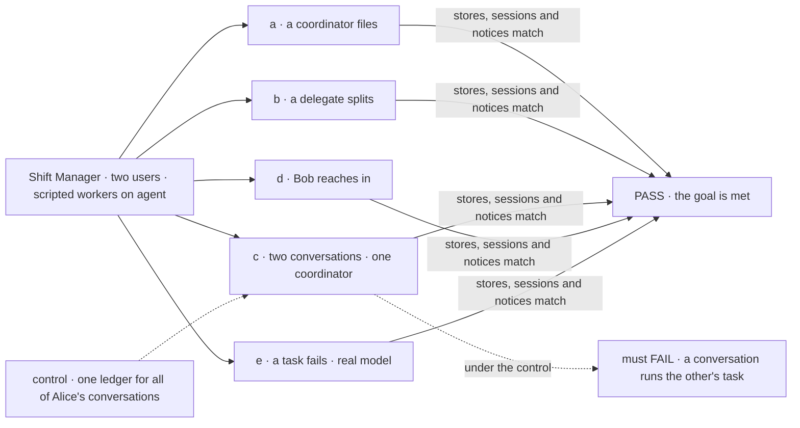
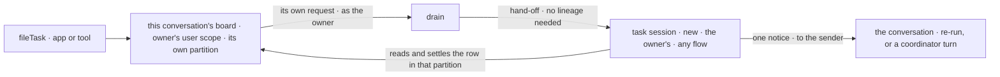

# FIX-1794 · Tasks go down the owner's chain and run as the owner

**Spec** · [Decisions](DECISIONS.md) · [Rules](BUSINESS-RULES.md) · [Plan](PLAN.md) · [Docs](DOCS.md) · [Evolution](EVOLUTION.md)

## Six people, before and after

| Someone who… | Today | After |
|---|---|---|
| **asks their coordinator for work that has to be done, not just answered** | A coordinator can hand a post to a delegate, and files nothing ([FIX-1791](https://linear.app/fixpoint-labs/issue/FIX-1791) left tasks here) | It files a task for one of its delegates. The task starts at once, in a new session of that delegate's, and nobody runs a list by hand |
| **works in an org with other users** | A board is an org row. Whoever's request runs it claims its tasks, and the work runs as them | A board belongs to one conversation. Only its owner's requests run it, and every task under it runs as that owner |
| **talks to one coordinator in two conversations** | n/a | Each conversation's board is its own. Running one never takes, shows or waits on the other's tasks |
| **hands a big task to a worker that splits it** | The pieces go on a board any member can run | The worker files the pieces on its own task session's board, for its own delegates, up to five boards deep. Results come back up board by board |
| **has a task fail for good, or stop on a question** | Nobody hears unless they open the list | The conversation that filed it is told once, and the coordinator reassigns it, cancels it, or tells the person |
| **builds an app on Workforce** | Finds a task's run through the board's run link only | Also finds it with `findWorkerSession({ worker, taskId })` |

The epic's assignment chain ([FIX-1786](../../epics/FIX-1786/SPEC.md), ER-9), built on private
workers ([FIX-1788](../FIX-1788/SPEC.md)) and delegates ([FIX-1791](../FIX-1791/SPEC.md)).

## The goal, and how we'll know it's met

**Every task a user's coordinator files for one of its delegates, and every piece a delegate
splits it into, runs in a new session that belongs to that user and acts as them. Only the
board that filed a task claims, wakes on or settles it, even when its worker runs on another
flow. The conversation that filed it hears how it ended and can reassign or cancel it.**

| Is it the right goal? | |
|---|---|
| **The real need** | The [PRD](https://linear.app/fixpoint-labs/issue/FIX-1794): work moves down through session boards and status comes back up, every session belongs to the owner, as deep as the work needs. Jake, 2026-10-06: filing tasks for delegates and following them through is this issue's ([FIX-1791 Q1](../FIX-1791/DECISIONS.md#q1)). Carried: FIX-1777's "runs as the filer", FIX-1780's notices and reassign, FIX-1774's leg e |
| **Smaller, and rejected** | "A drain runs as the board's owner." A session board meets it today, within one flow. Every coordinator hands work to an `agent` worker on another flow, where a lineage board can't reach (epic POC C1) |
| **Bigger, and not this issue's** | Converting the 15 mailbox boards ([FIX-1792](https://linear.app/fixpoint-labs/issue/FIX-1792)) · workstreams and the project coordinator ([FIX-1793](../FIX-1793/SPEC.md)) · harness task lists · stopping a running task ([FIX-1659](https://linear.app/fixpoint-labs/issue/FIX-1659)) |
| **Not done if** | The check ran with one user · only on one flow · a task ran in a session the owner doesn't own · one conversation's drain claims, lists or waits on another's task · the checker drained by hand · a filing waited for its run · a failed task woke nobody, or woke twice · a split task ended before its pieces · a reassign forked a run · a chain went past five · Bob's worker took a task in Alice's chain |



The check files, then only reads the boards, the sessions and the notices. Under the control
the ledger isn't kept per conversation, and leg c must fail.

| How we verify | |
|---|---|
| **Goal check** | `goals/coordinators/files-tasks-down-the-owners-chain/` · scripted workers for legs a to d, `openai/gpt-5.4-mini` for leg e · Shift Manager over HTTP, two users · run by the implementer at completion · verdict in the last implementation PR |
| **Signal** | **a**: Alice's coordinator files a task for her `agent` delegate; within 60 s it is `completed` in a new session that is hers, a child of the conversation, linked to the delegate and found by `findWorkerSession`; one `completed` notice; the filing returned first. **b**: a coordinator delegate splits its task into two pieces for two `agent` delegates; four sessions, all hers; each row on its own board; the top task completes after both pieces. **c**: two conversations each file one task for one delegate; each runs only its own, lists only its own, and its drain returns without waiting on the other's. **d**: Bob opening, posting to or filing on Alice's conversation, and naming her worker on his own, are each refused; none of his runs touch her rows. **e**: a task that fails both attempts gives one `errored` notice; the coordinator reassigns or cancels it, and its reply names the task and the error |
| **Input** | The DevTeam standard install; two users through sign-in; a goal-local tree with a scripted coordinator delegate and two scripted `agent` workers. Asks held out at run time |
| **Anti-game** | No drain from the check; no row, notice or session written by a fixture. Counts read again after 5 s. Leg c reads each conversation's own read, not the store |
| **Control that must fail** | `GOAL_CONTROL=unpartitioned`: leg c FAILS on *each runs only its own*. `GOAL_CONTROL=no-follow-up`: legs a and e FAIL on *one notice*. Today's `main`: every leg FAILS |

## What changes


On the left, whoever runs the board decides who the work runs as. On the right, the board's
conversation does, and nobody else can run it.

**What an app writes to file a task and follow it**, on a coordinator conversation
[FIX-1791](../FIX-1791/SPEC.md#what-changes) opens:

```ts
const coordinator = createClient({ flowKind: session.flowKind, userId, baseUrl })
await coordinator.sendAction("fileTask", { goal: "Audit our dependencies' licenses", assignee: "researcher" }, { sessionId: session.id })
// refused, like a missing worker, unless researcher is one of this conversation's delegates
await coordinator.sendAction("listTasks", {}, { sessionId: session.id })          // this conversation's board only
await coordinator.sendAction("reassignTask", { taskId, assignee: "writer" }, { sessionId: session.id })
const run = await workforce.findWorkerSession({ worker: "researcher", taskId })  // the task's own session
```

The coordinator has the same four as tools. No action names a board, a ledger or an owner.

## How a task reaches its worker



The board never leaves its conversation. The task session reaches its one row because the row
sits at the owner's user scope, which crosses flows, and the partition is named by the hand-off,
never by the worker.

## What stays as it is

- Mailbox boards, `mailboxTaskLists` and `runOwnerDispatcher` keep today's path until FIX-1792
  converts each board. Nothing new builds on them.
- `sharedToLineage` boards, unchanged. The chain doesn't use them ([D1](DECISIONS.md#d1)).
- Sessions stay private; engine session ownership and the dispatch seam are unchanged.
- FIX-1791's posts and their delivery ledger. A post is answered, a task is worked.

## Sign off

**[The goal](#the-goal-and-how-well-know-its-met), at that size:** tasks filed from delegates,
down the chain, each on its own conversation's board, as the owner, across flows, with the
ending heard. If wrong: work runs as the right user while one conversation still runs another's.

1. **[D1](DECISIONS.md#d1) · A board whose tasks run on another flow keeps them at its owner's
   user scope, in a partition only its own conversation reaches.** If wrong: a change to the task
   board that every durable board then carries. **The one to weigh**, and it changes the task
   board, so it binds once the epic records it (ER-9, ER-22).
2. **[D2](DECISIONS.md#d2) · A chain stops at five boards deep.** If wrong: a real chain refused,
   or a limit that came too late to save the spend.

**Open: none.** Reasoning and what lost: [DECISIONS.md](DECISIONS.md). The cases:
[BUSINESS-RULES.md](BUSINESS-RULES.md).

Feature · `orchestration`, `workforce`, `shift-manager` · large · 3 PRs · epic [FIX-1786](../../epics/FIX-1786/SPEC.md)
