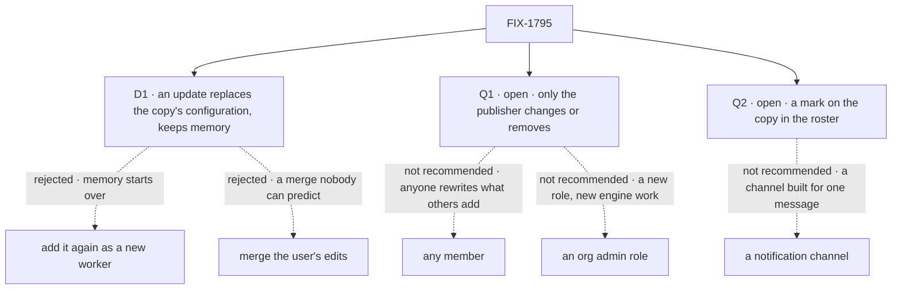

# FIX-1795 · Decisions

[Spec](SPEC.md) · **Decisions** · [Rules](BUSINESS-RULES.md) · [Plan](PLAN.md) · [Docs](DOCS.md)

What the model already decided is the epic's and the concept's, and is not reopened here: a
template is a non-standard worker's configuration, the library is a shared resource, a copy is a
snapshot ([ER-10](../../epics/FIX-1786/BUSINESS-RULES.md#what-a-team-gets-and-what-it-doesnt)),
standard workers stay out. These are the calls about what a user sees when a template moves on,
and two the Architect asked to be raised rather than picked.

## The tree

Solid edges are what you're signing or asked. Q1 and Q2 are the two open asks.

## D1 · Taking an update replaces the copy's configuration, and the worker keeps its id, sessions and memory

| | |
|---|---|
| **Instead of** | Adding the new version as a second worker beside the old one · or merging the user's own edits with the template's new version |
| **Because** | The worker a user has worked with keeps what it learned: its memory and sessions are keyed by the worker ([FIX-1788](../FIX-1788/BUSINESS-RULES.md#what-a-worker-runs-with) BR-23), so a new worker starts with none. A merge of two edited instruction texts is a result neither side wrote. Replacing in place goes through the same save check as a hire, so a taken update can't run what a hire would refuse |
| **Locks in** | A user who edited their copy loses those edits when they take an update. The offer says so before they take it, and nothing merges. A user who wants both keeps their copy and adds the template again as a second worker |

It comes down to memory: a second worker starts with none of what the copy learned.

**What would change my mind:** users who mostly edit their copies after adding them. Then a
take that replaces edits is the wrong default, and taking an update should add a second worker.

## Q1 · open · Who can change or remove a published template?

**The fork.** Only the user who published it · any member of the org · or an org admin role.

**In plain terms.** Alice publishes a release-notes writer. Bob finds a typo in its instructions.
Under *only the publisher*, Bob tells Alice, or publishes his own fixed copy beside hers. Under
*any member*, Bob fixes it in place, and every copy is told the template changed, with Bob named
as the writer. If Alice leaves the org, under *only the publisher* her template stays as it is
until an operator removes it.

**The trade-off.** *Only the publisher* is the "owner writes, org reads" rule FIX-1793 builds
for workstreams, so the library adds no access check of its own. Its cost is templates nobody
can tidy once their publisher is gone. *Any member* keeps a library current, at the price that
anyone rewrites what the people who added it trusted. An update is never applied on its own, so
nobody's running worker changes either way. *An org admin* needs a role the framework doesn't
have: every user is equal inside an org today.

**My recommendation: only the publisher.** It needs no new rule, it matches who a template
names, and a teammate with a fix can publish their own. An admin override can come later on
whatever role the framework adds.

**What would change my mind:** orgs that expect a shared library to be curated by the team, the
way a wiki is. Then *any member*, with every change named.

**If wrong:** the library fills with templates whose publishers have left. Cheap to reverse:
widening who may write later changes no stored template.

It comes down to whose words a copy trusts: under *any member*, anyone rewrites them.

## Q2 · open · How does a user learn that an update exists?

**The fork.** A mark on the copy in their own roster · a message from their chief of staff · a
notification channel built for it.

**In plain terms.** Alice republishes her template. Under *a mark*, Bob sees "update available"
on his copy the next time he opens his roster, and nothing tells him sooner. Under *the chief of
staff*, his chief of staff mentions it in its next conversation with him. Under *a channel*, he
gets a notification wherever the app sends them.

**The trade-off.** A mark is data on the roster listing every view reads, so Shift Manager shows
it as a badge and any later view or coordinator can read the same field. It reaches only a user
who looks. The chief of staff reaches the user sooner, but puts a library concern inside a
coordinator FIX-1791 is building now, and works only for users who have one. A channel is new
infrastructure for one message.

**My recommendation: a mark on the copy.** It is the smallest thing that keeps the promise, "you
can be told an update exists", and it invents no channel. The chief of staff can read the mark
later without any change here.

**What would change my mind:** templates that change for security reasons, where a user who
doesn't open their roster keeps running the old one. Then the chief of staff should say so.

**If wrong:** users keep stale copies longer. Cheap to reverse: anything that tells a user later
reads the same mark.

It comes down to new machinery: a mark is one field, a message is a coordinator change.

## Decided, not asked

- **Model variants are copied, never referenced.** Each variant is its own template, and each
  carries its own copy of the shared core instructions. Jake answered the same question for forks
  on [#2812](https://github.com/fixpoint-labs/flow-state-dev/pull/2812) (FIX-1788's Q1, 2026-10-06:
  copy), and one rule covers every copy a user holds.
- **A template is configuration only.** Its flow, instructions, team instructions, and skill,
  tool, package and document names, plus the flow's own settings. Never a session, a memory
  layer, or a skill a worker wrote into its drawer (security rule 2).
- **Only a user's own non-standard worker can be published.** A standard worker is refused with
  "fork it first". Another user's worker reads as missing.
- **Publishing again onto your own template makes a new version.** Publishing a worker that has
  no template of yours makes a new one. Template ids come from the server; names need not be
  unique, and the listing shows the publisher.
- **A copy is a hire.** It goes through FIX-1788's one write path and its save check, records the
  template and version it came from, and that record is never an access input.
- **Deleting the source worker leaves the template.** Copies stay as they are; the template just
  gets no more versions from that worker. Removing a template leaves every copy running and
  clears their marks.
- **Change and removal wait for FIX-1793's owner rule** (epic ER-16). The first implementation
  PR stacks on it; nothing that lets a template change merges before it.
- **The library is reached through blocks the app wires**, like the hire blocks. No worker tool
  publishes in this issue; a worker that does is stamped by FIX-1789's helper all the same.
- **No predecessor design.** There is no library today; the 2026-10-04 variants lock is the
  epic's [EVOLUTION](../../epics/FIX-1786/EVOLUTION.md#predecessor-designs) row.

## Considered and dropped

| Alternative | Why not |
|---|---|
| A copy that follows the template | Anyone who edits the template changes what runs with your access (the concept) |
| Copy straight from another user's roster | Bob would read Alice's roster: the hole the epic closes |
| A library-only check of who wrote a template | `writtenBy` is never an access input (ER-11), and the Architect fenced a second ACL |
| A variant group in the library | Ergonomic only; a template's description can name its variant |

## How it got here

- **Draft** — framed as the only way a team shares a private worker: a template is configuration
  published to an org-scoped library, a copy is a hire that never reads the template again, and an
  update is the user's choice; two open asks the Architect flagged; two PRs on FIX-1788 and
  FIX-1793's owner rule.

**Open:** Q1, Q2.
