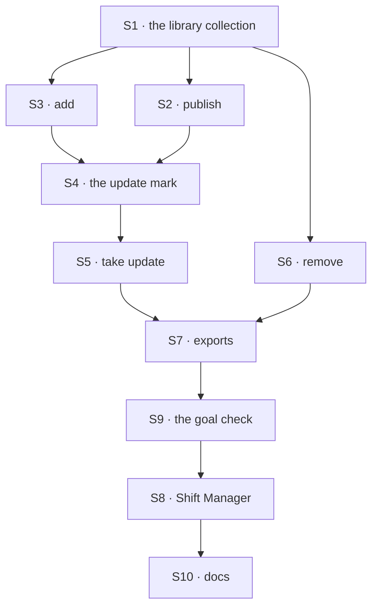

# FIX-1795 · Plan

[Spec](SPEC.md) · [Decisions](DECISIONS.md) · [Rules](BUSINESS-RULES.md) · **Plan** · [Docs](DOCS.md)

Written for the implementing agent. IDs cross-reference [BUSINESS-RULES.md](BUSINESS-RULES.md)
(BR-n) and [DECISIONS.md](DECISIONS.md). `tdd`. Two PRs, a GitHub stack (epic ER-26). Builds
start only after FIX-1788 merges (it owns the write path and the worker row) and FIX-1793's
owner rule is on a PR this one can stack on (epic ER-16, D4).

## Surfaces

| ID | Package · role | Change | Rules |
|---|---|---|---|
| S1 | `workforce` · the library collection | Org scope, one row per template: name, description, version, and the configuration in FIX-1788's stored shape (names, flow-owned settings), minus the worker row's owner and copy record. Keyed `workforce/library/[owner]/[template]` and declared with FIX-1793's rule, `ownerWrites: { param: "owner" }`, which reads the owner off the key, never from state; the owner segment is the session user at publish. Declared with FIX-1789's shared-resource helper, so `writtenBy` is required, and it names; it never decides. No client write config: only S2, S5 and S6 write it. The collection is new, so there is no older shape to read; BP-030 applies from its first schema change | BR-1 BR-6 BR-9–11 |
| S2 | `workforce` · publish | Reads the session user's own worker at their scope (FIX-1788's roster read); refuses a standard worker or a missing one; runs FIX-1788's save check on the configuration; writes a new template, or the next version of one the user owns and names, through FIX-1789's stamping write. A worker on a flow other than the named template's makes a new template (BR-19a). Copies names only: no session, memory or drawer read | BR-1–8 BR-19 BR-19a BR-25 |
| S3 | `workforce` · add | Reads a template at org scope; builds a hire from it; calls FIX-1788's one hire write (no second save path); sets the copy record on the new row, with the digest of the configuration as saved | BR-12–18 |
| S4 | `workforce` · the update mark | The roster listing (FIX-1788 BR-9) gains, per copy, whether a newer version exists and whether the copy was edited since it was taken. One filtered read of the template ids the roster's copies name (BP-033), at list time, never at run time. The digest covers BR-1's configuration fields only, as the save check stored them, on both sides, so a save that normalizes an unedited copy reads as unedited. Kept in `workforce` beside the listing, not in Shift Manager, so every view reads one mark | BR-18 BR-20 BR-28 |
| S5 | `workforce` · take update | Its offer, read before the take, lists the grants the current version adds over the copy (BR-20a), carries S4's edited flag, and says when the take moves the copy back to the template's flow (BR-22). The take sends the template version and copy digest the offer showed; it refuses if either changed since, so the user sees a fresh offer (BR-20b), a compare-and-set on the copy row with no lock. Otherwise it replaces the copy's configuration with that version through FIX-1788's edit write and save check; keeps id, sessions, memory; updates the copy record and its digest | BR-20a BR-20b BR-21–24 |
| S6 | `workforce` · remove | Deletes a template under the owner rule. Changing one is S2's next version | BR-26–30 |
| S7 | `workforce` · exports | S2, S3, S5, S6 and a list block, returned as `library` by FIX-1788's hire-block factory. README entry. A `minor` changeset for `workforce` | — |
| S8 | `shift-manager` · Roster | A Library list, with what each template grants; *Add* on a template; *Share* on a worker of the user's own; the update mark with *Take update*, listing what the version adds and saying when edits will be replaced; *Remove* on the user's own template. Reloads after each, at least as well as FIX-1761's reload | BR-8 BR-20 BR-20a BR-30 |
| S9 | goals | `goals/worker-library/a-copy-is-yours-and-stays-put/`, the goal check, both controls | VG |
| S10 | Docs | [DOCS.md](DOCS.md) | — |

## Sequence · the PR plan

The library is post-MVP (Jake, 2026-10-06): this spec takes its gate now, and P1 starts after the MVP ships.

| PR | Delivers | Depends on |
|---|---|---|
| P1 · the library | S1–S7, S9, `library.md` and the README | FIX-1788 merged · FIX-1793's owner-rule PR (stacked on it until it merges) |
| P2 · Shift Manager | S8 and its docs | P1 · FIX-1788's Roster change (its S12) |



## Checks

| ID | Runs after | Passes when |
|---|---|---|
| V1 | S1 | BR-9–11 on the real engine, two orgs; a resource-route write is refused |
| V2 | S2 | BR-1–8; BR-2 with a worker holding a note, a session and a drawer skill: the stored template holds none, and a configuration naming the drawer skill is refused; BR-19a: the old template's copies keep running their sessions |
| V3 | S3 | BR-12–17 through FIX-1788's write path; BR-15 for each of the three reasons; BR-17 with three variants |
| V4 | S4 | BR-18, BR-20 (edited and unedited copies, and an unedited copy the save check normalized), BR-28; one template read per listing |
| V5 | S5 | BR-20a with a version that adds a tool; BR-20b with a republish, and with an edit to the copy, between the offer and the take; BR-21–24; BR-21 asserts the copy's memory reads after the take, on the session it had |
| V6 | S6 | BR-26–30 under FIX-1793's rule; BR-27 by every write path, the resource routes included |
| VG | P1 | [The goal](SPEC.md#the-goal-and-how-well-know-its-met) PASSES, after the same run FAILED under `GOAL_CONTROL=live-template` (leg b) and `GOAL_CONTROL=org-writes` (leg c), and leg a on today's `main` |

One check per decision: D1 by V5, Q1 by V6, Q2 by V4. The second path (BP-035): a copy whose
template was removed (V4), a user in two orgs (V1), a stale offer (V5), and the off state of
every mark (V4).

## Pinned names · the only three

| Where | Name | Why pinned |
|---|---|---|
| The library collection | `workforce/library/[owner]/[template]`, org scope, `ownerWrites: { param: "owner" }` | Persisted; FIX-1797's closure and Shift Manager read it; the owner segment is what FIX-1793's rule reads |
| The copy record on a worker row | `fromTemplate: { templateId, version, digest }` | Persisted on FIX-1788's row, an additive field: a row without it is not a copy; `digest` is the configuration as saved at add or take, which the edited flag compares |
| A template's version | `version`, a whole number from 1 | Persisted; the mark compares it |

Everything else is yours to name, in the new terms: template, worker library, worker, roster.
`library` on the hire blocks and the action names in [SPEC.md](SPEC.md#what-changes) are
proposals. FIX-1788's own pinned names are used as it pins them: `createWorkforceClient`,
`ensureWorkerSession`, `findWorkerSession`, `worker` on a session create.

## Guardrails

| Rule | Because |
|---|---|
| A copy and a take go through FIX-1788's one write path and save check | A second path is the drift the WorkerConfig lock forbids (ER-14), and it would skip a check |
| No turn reads a template. The per-turn load reads the worker row only | A live read is the reference ER-10 rules out, and what `live-template` must catch |
| Who may change a template is FIX-1793's rule, never `writtenBy`, the copy record or a check of the library's own | ER-11, ER-16 and the Architect's fence on a second ACL |
| Publish reads configuration only, never a session, memory layer or drawer | Security rule 2: those stay private |
| The org comes from the session, never input (ER-13, BP-031) | A template never crosses orgs |
| No tool-name special case for a reload (ER-19) | FIX-1761 |

## Docs

Publish [DOCS.md](DOCS.md)'s `library.md` and README entries in P1, after V1 to V6 pass; the
Shift Manager section in P2. Reconcile wording with the shipped refusals and with Q1 and Q2.

## Sketch · pseudocode, illustrative, react to the shape

```
publish(worker, onto?):
    w ← the session user's own worker, else refuse        ← standard or missing refused
    check w's configuration as a save would
    if onto and onto.flow = w.flow: next version of onto   ← the owner rule decides
    else: a new template, version 1                        ← another flow is another template
    write through the stamping helper                      ← names the user, and the worker

add(template, id?):
    t ← read template at org scope
    row ← hire(id ?? t.name, t's configuration)            ← FIX-1788's write and save check
    row.fromTemplate ← t.id, t.version, digest(row's saved configuration)

list roster:
    ts ← one read of the templates the copies name
    for each copy: offer ← ts[id].version > copy.version; edited ← digest(row) ≠ copy.digest

take(copy, offered version v, offered digest d):
    if template.version ≠ v or digest(row) ≠ d: refuse, show a fresh offer   ← compare-and-set
    edit(row, template version v's configuration)   ← FIX-1788's edit write and save check
    row.fromTemplate ← template.id, v, digest(row's saved configuration)
```

**POC:** none. Every premise is a sibling's surface that doesn't exist yet (FIX-1788's write
path, FIX-1793's rule), so a POC would test a stand-in. The factual base is two greps, rerun in
P1: `grep -rniE "workforce/library|worker library" packages/` finds nothing (no library today),
and `grep -rnE "isAdmin|orgAdmin" packages/engine/src packages/core/src` finds nothing (no admin
role, Q1).

## At implement time

- Read FIX-1793's owner rule as merged. If it can't apply to a collection the library declares,
  stop and take it to the epic (ER-22): don't build a check beside it.
- Read FIX-1788's merged write path, its roster listing and its copy of the save check; S3 and S5
  call them, they don't wrap them. The goal check reaches each copy through its
  `ensureWorkerSession`.
- Q1 and Q2 are answered as recommended (Jake, 2026-10-06), and FIX-1793's gate kept the shared
  half this issue rests on.
- Old-term exports: this issue adds none. It extends FIX-1788's hire-block factory under the
  name FIX-1788 ships (today's `createSeatHireBlocks`, renamed there).

## Follow-ups

- A chief-of-staff tool for the library, and Q2's richer notice if asked for, read S4's mark.

## Notes from review

Recorded verbatim for the implementer to weigh against real code; not folded into the design.

- **Concurrent publish** (PR #2819, second look): "Two publishes onto the same template from two
  tabs can both read version N and write N+1 (BP-035, concurrent 409). V2 needs one case."
- **A removed template's id** (PR #2819, second look): "BR-28: a copy's `fromTemplate` still names
  a removed template. The mark clears, but a later add of a different template with the same id
  is impossible only because ids come from the server. Say so in one line."
