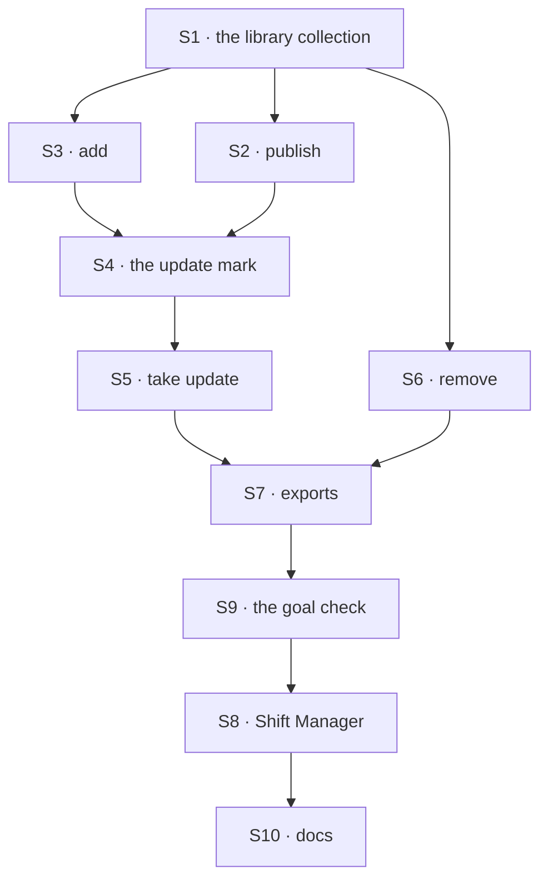

# FIX-1795 · Plan

[Spec](SPEC.md) · [Decisions](DECISIONS.md) · [Rules](BUSINESS-RULES.md) · **Plan** · [Docs](DOCS.md)

Written for the implementing agent. IDs cross-reference [BUSINESS-RULES.md](BUSINESS-RULES.md)
(BR-n) and [DECISIONS.md](DECISIONS.md). `tdd`. Two PRs, a GitHub stack (epic ER-26). Builds
start only after FIX-1788 merges (it owns the write path and the worker row) and FIX-1793's
owner rule is on a PR this one can stack on (epic ER-16, D4).

## Surfaces

| ID | Package · role | Change | Rules |
|---|---|---|---|
| S1 | `workforce` · the library collection | Org scope, one row per template: name, description, version, the source worker's id, and the configuration in FIX-1788's stored shape (names, flow-owned settings), minus owner and copy record. Declared with FIX-1789's shared-resource helper, so `writtenBy` is required, and under FIX-1793's owner rule. No client write config: only S2, S5 and S6 write it. Old shapes read (BP-030) | BR-1 BR-6 BR-9–11 |
| S2 | `workforce` · publish | Reads the session user's own worker at their scope (FIX-1788's roster read); refuses a standard worker or a missing one; runs FIX-1788's save check on the configuration; writes a new template, or the next version of one the user owns, through FIX-1789's stamping write. Copies names only: no session, memory or drawer read | BR-1–8 BR-19 BR-25 |
| S3 | `workforce` · add | Reads a template at org scope; builds a hire from it; calls FIX-1788's one hire write (no second save path); sets the copy record on the new row | BR-12–18 |
| S4 | `workforce` · the update mark | The roster listing (FIX-1788 BR-9) gains, per copy, whether a newer version exists and whether the copy was edited since it was taken (a digest of the configuration taken, kept in the copy record). Read from the template at list time, never at run time | BR-18 BR-20 BR-28 |
| S5 | `workforce` · take update | Replaces the copy's configuration with the template's current version through FIX-1788's edit write and save check; keeps id, sessions, memory; updates the copy record | BR-21–24 |
| S6 | `workforce` · remove | Deletes a template under the owner rule. Changing one is S2's next version | BR-26–30 |
| S7 | `workforce` · exports | One factory returning S2, S3, S5, S6 and a list block, beside the hire blocks. README entry. A `minor` changeset for `workforce` | — |
| S8 | `shift-manager` · Roster | A Library list; *Add* on a template; *Share* on a worker of the user's own; the update mark with *Take update*, saying when edits will be replaced; *Remove* on the user's own template. Reloads after each, at least as well as FIX-1761's reload | BR-8 BR-20 BR-30 |
| S9 | goals | `goals/worker-library/a-copy-is-yours-and-stays-put/`, the goal check, both controls | VG |
| S10 | Docs | [DOCS.md](DOCS.md) | — |

## Sequence · the PR plan

| PR | Delivers | Depends on |
|---|---|---|
| P1 · the library | S1–S7, S9, `library.md` and the README | FIX-1788 merged · FIX-1793's owner-rule PR (stacked on it until it merges) |
| P2 · Shift Manager | S8 and its docs | P1 · FIX-1788's Roster change (its S12) |



## Checks

| ID | Runs after | Passes when |
|---|---|---|
| V1 | S1 | BR-9–11 on the real engine, two orgs; a resource-route write is refused |
| V2 | S2 | BR-1–8; BR-2 with a worker holding a note, a session and a drawer skill: the stored template holds none |
| V3 | S3 | BR-12–17 through FIX-1788's write path; BR-15 for each of the three reasons; BR-17 with three variants |
| V4 | S4 | BR-18, BR-20 (edited and unedited copies), BR-28 |
| V5 | S5 | BR-21–24; BR-21 asserts the copy's memory reads after the take |
| V6 | S6 | BR-26–30 under FIX-1793's rule; BR-27 by every write path, the resource routes included |
| VG | P1 | [The goal](SPEC.md#the-goal-and-how-well-know-its-met) PASSES, after the same run FAILED under `GOAL_CONTROL=live-template` (leg b) and `GOAL_CONTROL=org-writes` (leg c), and leg a on today's `main` |

One check per decision: D1 by V5, Q1 by V6, Q2 by V4. The second path (BP-035): a stored
template of an older shape (V1), a copy whose template was removed (V4), a user in two orgs (V1),
and the off state of every mark (V4).

## Pinned names · the only three

| Where | Name | Why pinned |
|---|---|---|
| The library collection | `workforce/library/*`, org scope | Persisted; FIX-1797's closure and Shift Manager read it |
| The copy record on a worker row | `fromTemplate: { templateId, version }` | Persisted on FIX-1788's row (an additive field, BP-030) |
| A template's version | `version`, a whole number from 1 | Persisted; the mark compares it |

Everything else is yours to name, in the new terms: template, worker library, worker, roster.
The factory and action names in [SPEC.md](SPEC.md#what-changes) are proposals.

## Guardrails

| Rule | Because |
|---|---|
| A copy and a take go through FIX-1788's one write path and save check | A second path is the drift the WorkerConfig lock forbids (ER-14), and it would skip a check |
| No turn reads a template. The per-turn load reads the worker row only | A live read is the reference ER-10 rules out, and what `live-template` must catch |
| Who may change a template is FIX-1793's rule, never `writtenBy`, the copy record or a check of the library's own | ER-11, ER-16 and the Architect's fence on a second ACL |
| Publish reads configuration only, never a session, memory layer or drawer | Security rule 2: those stay private |
| The org comes from the session, never input (ER-13, BP-031) | A template never crosses orgs |
| No tool-name special case for a reload (ER-19) | FIX-1761 |

## Docs

Publish [DOCS.md](DOCS.md)'s `library.md` and README entries in P1, after V1 to V6 pass; the
Shift Manager section in P2. Reconcile wording with the shipped refusals and with Q1 and Q2.

## Sketch · pseudocode, illustrative, react to the shape

```
publish(worker, onto?):
    w ← the session user's own worker, else refuse        ← standard or missing refused
    check w's configuration as a save would
    if onto: next version of a template the user owns      ← the owner rule decides
    else: a new template, version 1
    write through the stamping helper                      ← names the user, and the worker

add(template, id?):
    t ← read template at org scope
    hire(id ?? t.name, t's configuration) with fromTemplate ← t.id, t.version   ← FIX-1788's write

list roster:  for each copy: offer ← template.version > copy.version; edited ← digest differs
```

**POC:** none. Every premise is a sibling's surface that doesn't exist yet (FIX-1788's write
path, FIX-1793's rule), so a POC would test a stand-in. The factual base is two greps, rerun in
P1: `grep -rniE "workforce/library|worker library" packages/` finds nothing (no library today),
and `grep -rnE "isAdmin|orgAdmin" packages/engine/src packages/core/src` finds nothing (no admin
role, Q1).

## At implement time

- Read FIX-1793's owner rule as merged. If it can't apply to a collection the library declares,
  stop and take it to the epic (ER-22): don't build a check beside it.
- Read FIX-1788's merged write path, its roster listing and its copy of the save check; S3 and S5
  call them, they don't wrap them.
- Read Q1 and Q2's answers on `main`. A different Q1 answer changes BR-26–29 and V6 only.
- If FIX-1793's gate drops the shared half (epic Q2), this issue closes; nothing here is built.
- Old-term exports this issue leaves in place for FIX-1796: it adds none. It calls
  `createSeatHireBlocks` and FIX-1788's hire blocks under their current names.

## Follow-ups

- FIX-1788 D2 keeps old org-wide hire rows "so it can become a library template": an operator
  step that publishes them is not built here.
- A chief-of-staff tool for the library, and Q2's richer notice if asked for, read S4's mark.

## Notes from review

None yet.
