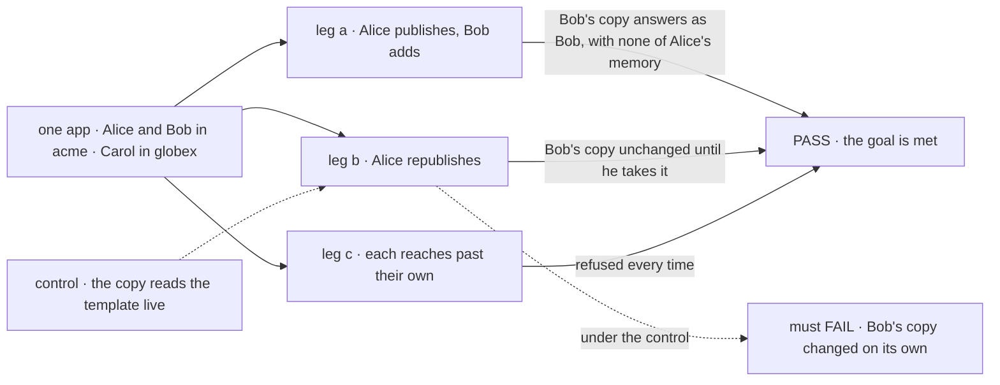
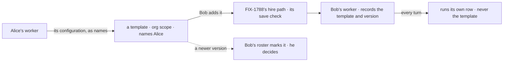

# FIX-1795 · An org's worker library: templates a user copies onto their own roster

**Spec** · [Decisions](DECISIONS.md) · [Rules](BUSINESS-RULES.md) · [Plan](PLAN.md) · [Docs](DOCS.md)

## Six people, before and after

| Someone who… | Today | After |
|---|---|---|
| **built a worker their teammates would like** | Can't share it. Once workers are private ([FIX-1788](../FIX-1788/SPEC.md)), there is no way for a teammate to get it | Shares it: a template in the org's library, named as theirs. Their worker, its sessions and its memory stay theirs |
| **wants a teammate's worker** | Asks for the files and rebuilds it by hand | Adds the template: a worker of their own that only they hold, and that acts as them |
| **relies on a copy they added** | n/a | Their copy runs what they took until they choose otherwise. When the template changes, they're told, and they decide |
| **improves a template they published** | n/a | Publishes again. Every copy is told; no copy changes on its own |
| **keeps Codex, Claude and Cursor variants of one worker** | n/a | Publishes each as its own template. Each copy carries its own copy of the shared instructions |
| **belongs to two orgs** | n/a | Each org has its own library. Nothing published in one shows in the other |

With workers private, a library is the only way a team shares a worker
([epic D1](../../epics/FIX-1786/DECISIONS.md#d1), the set table).

## The goal, and how we'll know it's met

**A user can share a worker of their own with their org as a template, and any other member can
add it as a worker that only they hold, which doesn't change unless they take an update; none of
the publisher's sessions, memory or other workers cross with it, and no template leaves its org.**

| Is it the right goal? | |
|---|---|
| **The real need** | The [issue](https://linear.app/fixpoint-labs/issue/FIX-1795): "with workers private, a team has no way to share a good worker configuration." The concept's [library](../../epics/FIX-1786/concept/CONCEPT.md#the-library): "your copy doesn't change when the template does, so nobody else can alter what runs with your access." Epic [ER-10](../../epics/FIX-1786/BUSINESS-RULES.md#what-a-team-gets-and-what-it-doesnt) |
| **Smaller, and rejected** | "Bob can copy Alice's worker." Met by letting Bob read Alice's roster, which is the hole the epic closes. Or "copies exist" with no update: a fix to a shared worker then reaches nobody, and teams rebuild by hand again |
| **Bigger, and not this issue's** | Publishing standard workers (every user has them) · a library across orgs · a worker that publishes for its owner · a notification channel · turning FIX-1788's org-wide hire rows into templates ([follow-ups](PLAN.md#follow-ups)) |
| **Not done if** | The check ran with one user · a copy reads the template at run time · a template carries a session, a memory note or a skill a worker wrote · Bob changes or removes Alice's template · a template shows in another org · a copy skipped [FIX-1788](../FIX-1788/BUSINESS-RULES.md#holding-a-worker)'s save check · an update applied without its owner's action |



The check reads what each user's turn answers over HTTP, never the stored rows. Under the dashed
control, Bob's copy must change when Alice republishes.

| How we verify | |
|---|---|
| **Goal check** | `goals/worker-library/a-copy-is-yours-and-stays-put/` · scripted model that answers with the instructions marker it was given (configuration is under test, not answers) · real HTTP router, SQLite · run by the implementer at completion · verdict in the implementation PR |
| **Signal** | a: Bob lists Alice's template, naming her; his copy answers marker M1 in his session; it reads none of Alice's notes. b: Alice republishes with M2; Bob's next turn answers M1, his roster marks an update; he takes it; his next turn answers M2 and still reads the note his copy wrote. c: Bob changing or removing Alice's template, Alice publishing a standard worker, and Bob adding a template whose flow became standard-only are each refused with their reason; Carol lists nothing |
| **Input** | One standard worker, one worker Alice hires, three users across two orgs. A template on another worker flow must pass too |
| **Anti-game** | No assertion on a stored row or a key. No template or copy written by a fixture: each is made through the app's actions |
| **Control that must fail** | `GOAL_CONTROL=live-template`: leg b FAILS on *Bob's next turn answers M1*. `GOAL_CONTROL=org-writes` (the owner rule off): leg c FAILS on *Bob's change is refused*. Today's `main`: leg a FAILS, no library |

## What changes


The band is the only shared place. Only configuration crosses it, and only by an owner's action.

**What an app wires, and what it sends:**

```diff
 const { hire, fork, fire } = createSeatHireBlocks({ workerFlows })
+const library = createWorkerLibraryBlocks({ workerFlows })

 defineFlow({
   kind: "roster-admin",
   actions: {
     hire: { block: hire }, fork: { block: fork }, fire: { block: fire },
+    publishTemplate: { block: library.publish },
+    addFromLibrary: { block: library.add },
+    takeTemplateUpdate: { block: library.takeUpdate },
+    removeTemplate: { block: library.remove },
   },
 })

+const admin = createClient({ flowKind: "roster-admin", userId })
+await admin.sendAction("addFromLibrary", { template: templateId, id: "release-notes" }, { sessionId })
```

The factory and action names are proposed, the implementer's to settle
([PLAN](PLAN.md#pinned-names--the-only-three)). Hire, fork and fire are FIX-1788's.

## How a copy is made



A copy is made by the same write as a hire, so it passes the same checks, and from then on it
reads only its own row.

## What stays as it is

- Workers, their sessions and memory, and the hire write path: [FIX-1788](../FIX-1788/SPEC.md)'s.
- Attribution on shared writes and standard-only flows: [FIX-1789](../FIX-1789/SPEC.md)'s.
- "Owner writes, org reads" is [FIX-1793](https://linear.app/fixpoint-labs/issue/FIX-1793)'s
  rule, consumed here. No library-only access check.
- Standard workers stay out of the library. `seat*` names wait for FIX-1796.

## Sign off

**[The goal](#the-goal-and-how-well-know-its-met), at that size:** share as a template, add as
your own, unchanged until you take an update, nothing private crossing. If wrong: a library that
leaks, or one nobody can keep current. It also rests on the epic's
[Q2](../../epics/FIX-1786/DECISIONS.md#q2): if FIX-1793's gate drops the shared half, this
issue goes with it.

1. **[D1](DECISIONS.md#d1) · Taking an update replaces your copy's configuration and keeps its
   memory and sessions.** If wrong: edits a user made to their copy are lost when they take one.

**Open, hardest first** (full asks in [DECISIONS.md](DECISIONS.md#q1)):

- **[Q1](DECISIONS.md#q1) · Who can change or remove a template?** I recommend: only the user
  who published it. If wrong: templates nobody can tidy once their publisher leaves.
- **[Q2](DECISIONS.md#q2) · How does a user learn an update exists?** I recommend: a mark on the
  copy in their roster, no new channel. If wrong: updates go unnoticed.

Feature · `workforce`, `shift-manager` · medium · 2 PRs, after FIX-1788 and FIX-1793's owner rule · epic [FIX-1786](../../epics/FIX-1786/SPEC.md)
