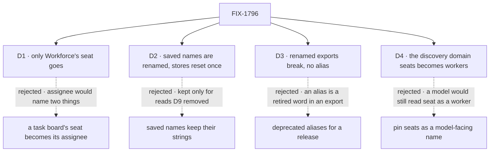

# FIX-1796 · Decisions

[Spec](SPEC.md) · **Decisions** · [Rules](BUSINESS-RULES.md) · [Plan](PLAN.md) · [Docs](DOCS.md) · [Evolution](EVOLUTION.md)

The vocabulary itself is decided in the epic's [concept](../../epics/FIX-1786/concept/CONCEPT.md#vocabulary)
and not reopened here. These are the three calls the Architect's guidance on the issue said to
put to the owner, priced, and a fourth that review found. The owner answered D1 in review.

## The tree

Solid edges are what you're signing. Dashed edges lost, and the label says why.

## D1 · Only Workforce's seat goes; a task board keeps "seat"

| | |
|---|---|
| **Instead of** | Renaming the task board's seat to assignee too: its `TaskSeat…` and `HandOffSeat` types and the hand-off record's `seat` field |
| **Because** | The product owner's answer (2026-10-06): "seat" is a fair word for a place on a board. An assignee is a seat on one specific task, so it names something else. Once the Workforce sweep lands, "seat" has one meaning in the codebase, the board's, and the glossary defines it there and nowhere else. Nothing in the epic's Layer 1 changes (ER-22), so the epic's "Task boards … consumed as they ship" holds, no epic decision is needed, and FIX-1794's new board text stands as written |
| **Locks in** | The board's types and the hand-off record's `seat` field keep their names; no board app changes. The discovery tool's `seats` domain is Workforce's seat, not the board's, and is [D4](#d4)'s. The guard needs a board-seat exception scoped to the board's surface: its named types and the hand-off field read off its envelope anywhere, its bare word on its modules and the code off Workforce's ground that uses them, and a Workforce "seat" counts even on the same line |

It comes down to what a seat is on a board: renamed, "assignee" would name both the place and the seat on one task.

**What would change my mind:** readers who still take a board's seat for a worker once
Workforce's seat is gone, for example on Shift Manager's task screens, where both meet. Then the
board's word becomes assignee at 1.0, as an epic decision.

## D2 · Saved names are renamed outright; the in-repo stores are reset once

**The product owner, 2026-10-07**, under [epic D9](../../epics/FIX-1786/DECISIONS.md#d9): stored keys are renamed outright, with no read of
the old keys and no copy step, and the kitchen-sink app's and the DevTeam lab's stores are reset
once when this ships. It flips this card as merged, which kept saved strings so the other
children's upgrade reads would find them ([the card as merged](https://github.com/fixpoint-labs/flow-state-dev/blob/2ab5e6b0bd77c798142a48922131aa52f45f737d/specs/issues/FIX-1796/DECISIONS.md#d2)).

| | |
|---|---|
| **Instead of** | Keeping the stored strings behind renamed constants, `LEGACY_` for a name only an upgrade reads |
| **Because** | The reads those strings were kept for are gone: D9 withdrew FIX-1788's upgrade step, FIX-1790's copy step and FIX-1793's kept room rows, and nobody outside this repo has a store to keep reading. A kept string is a retired word the guard has to except, and the devtool's storage view keeps showing it |
| **Locks in** | Every stored key, collection pattern, id or saved field name that uses a retired word takes the new word, in the PR that renames the code writing it. Nothing reads the old name, and nothing copies a record. A store written before this release loses those records: the kitchen-sink app and the DevTeam lab reset theirs once. The guard keeps no stored-key exception |

It comes down to who still reads the old names: since D9, nobody.

**What would change my mind:** a consumer outside this repo before the closure run. Then D9's
reversal applies: the product owner decides what upgrade path that consumer needs.

## D3 · Renamed exports break outright, with no aliases

| | |
|---|---|
| **Instead of** | Keeping each old export as a deprecated alias for one release |
| **Because** | ER-12 forbids a retired term in any package export at the closure, and every alias is one. Since [epic D9](../../epics/FIX-1786/DECISIONS.md#d9) the epic deprecates nothing first, not even flow instances and owner pins. Pre-1.0, a minor release may break (BP-022), and the last rename, FIX-1748, shipped with no aliases. Every in-repo caller moves in the same PR |
| **Locks in** | An app on the old names edits its imports once, on its first upgrade past this release. There is no rename table and no upgrading page ([epic D9](../../epics/FIX-1786/DECISIONS.md#d9)). A custom worker flow with a hand-written schema on the old keys is refused at boot, naming the key it lacks |

It comes down to ER-12: an alias is a retired word in an export, so the closure fails or waits.

**What would change my mind:** an app outside this repo pinned to these exports and promised a
deprecation window. Then alias for one release, and the closure waits for their removal.

## D4 · The discovery domain `seats` becomes `workers`

| | |
|---|---|
| **Instead of** | Keeping `seats` in `MANIFEST_DOMAINS` (`contracts`) as a pinned, model-facing name |
| **Because** | The domain lists Workforce's workers, so it is Workforce's seat, not the board's, and the owner's rule is seat for boards, not workers. It is the one surface a model reads by name, so a surviving `seats` would teach a model the meaning the sweep removes. D3 rules out an alias |
| **Locks in** | `MANIFEST_DOMAINS`, core's discovery tool and Workforce's `discover:` key say `workers`. A saved prompt, skill or eval that passes `seats` gets the "unknown domain" listing, and a worker file with `discover: [seats]` is refused when it is minted, listing the known domains. **Binds once the epic records it** in its next amendment (amend-5): it is a Layer 1 public name (ER-22) |

It comes down to what a model reads by name: pinned, "seats" keeps a Workforce meaning that only a model sees.

**What would change my mind:** the epic declining the rename at amend-5. Then `seats` is pinned
with that cost named, and it goes to the product owner at the gate, because it reverses part of
his answer to D1.

The `mailboxes` domain is not decided here: FIX-1792 removes it ([its PLAN S9](https://github.com/fixpoint-labs/flow-state-dev/pull/2833)).

## Decided, not asked

- **The list is derived.** Each child names the old exports it leaves ([PLAN.md](PLAN.md#at-implement-time));
  the census on the build commit finds the rest. Nothing a sibling is about to delete is renamed.
- **Scope** is the issue's (package source, published docs, labs, apps) plus package tests,
  READMEs, examples, `docs/architecture/` and the root README: they describe current behaviour,
  and BP-034 already makes a rename reach them. `goals/`, process files and history keep their words.
- **"Kind", "owner pin", "flow instance", "member" and "thread" are retired on Workforce's ground
  only.** The engine keeps its flow `kind`, its flow instances and owner pins until FIX-1798; a
  project's member and a chat thread keep theirs. Ground is a surface, not a folder: Workforce's
  own packages and pages, plus any file that imports Workforce or Shift Manager.
- **"Person" stays guarded, on Workforce's ground.** The owner's standing rule is "user, not
  person", so the permanent guard keeps it, on Workforce's ground only. A person who isn't the
  signed-in user (an author, someone a case goes to) is an exception pinned by file and phrase.
  This answers the architecture review's point 2, which asked to drop "person" from the
  permanent guard.
- **"Target" is not scanned.** It never reached Workforce code; the engine's dispatch target stays.
- **Template and library enter the glossary with FIX-1795**, which builds after the MVP. The
  issue's outcome lists them; the epic's later call moves them ([Q2](../../epics/FIX-1786/DECISIONS.md#q2)).
- **The census becomes a CI guard and replaces `scripts/check-mailbox-rename.mjs`.** That guard
  keeps "channel" off the mailbox's surfaces; once mailboxes are gone it guards a retired thing,
  and it would block the later channels feature.
- **`hireWorkforce` is renamed only if it no longer hires.** Neither word is retired; what it
  returns stops saying seat.
- **Two PRs**: Workforce and its apps, then prose, the glossary and the guard
  ([PLAN.md](PLAN.md#pr-plan)). With D1 the task-board PR has no renames left; its few lines
  where "seat" means a Workforce worker ride with the first. Each PR's pages move with its code (ER-25).
- **Glossary entries promise no memory layer a flow doesn't keep** (ER-15, FIX-1364).

## Considered and dropped

| Alternative | Why not |
|---|---|
| A scripted find and replace | "Seat" is a worker in Workforce and a place on a board; "person" is sometimes any human. A blind replace writes wrong words |
| One PR | About 600 files across several packages. Code and its pages first, prose and the guard after, review faster apart |
| Sweep `goals/` too | Outside the PRD's scope: about 250 files of test prose and folder names. A follow-up if wanted |
| Keep the CI guard for "channel" | Its subject, the mailbox, is retired, and channels come back as their own feature |

## Settled

- **The counts this spec rests on** are re-derived by the census, not counted by hand: on
  `cad4e2780`, 22,058 unswept lines in 527 files; every one of 5,802 tracked files has an area;
  `--control` refuses all eighteen plants ([README](poc/term-census/README.md#what-was-observed)).
- **The channel-kind paths the issue fences don't exist on `main`**: CONFIRMED, no
  `flows/channels/` path is tracked at all, and `CHANNEL.md` appears only in one goal fixture and
  two retained specs. So the guard carries no exception for them: one that strips nothing fails it. Channels were renamed to mailboxes before this epic; today
  `CHANNEL.md` is refused by name, pointing at mailboxes ([EVOLUTION.md](EVOLUTION.md)).

## How it got here

- **Draft** — framed as the epic's last sweep before the closure; a census with exceptions that
  strip tokens, not lines, is the goal check and becomes the CI guard; three PRs.
- **Review round 1** — the product owner answered D1: the board keeps "seat", only Workforce's
  goes, so the board PR dropped out (two PRs) and no epic decision is needed. The census now
  scopes ground and the board's seat by surface, scans "member", "thread" and lower-camel
  `room…` names, strips a stored key without the rest of its literal, and fails on a stale
  exception, so the unused channel-path exception went. Then the architect and the epic's
  coordinator split the discovery domain from the board: `seats` lists workers, so it becomes
  `workers` (D4), and "person" keeps its permanent guard, on Workforce's ground.
- **Review round 2** — the board's surface is defined by module, like Workforce's ground, not by
  a closed file list that left about 125 of the board's own lines to rename against D1; the
  hand-off field strips like `TaskSeat`. D4's `seats` value reaches `goals/` too.
- **Amended after merge, the D9 sweep (2026-10-07)** — [epic D9](../../epics/FIX-1786/DECISIONS.md#d9) and the product owner's answer of
  the same day flipped D2: stored names are renamed outright, and the kitchen-sink app's and the
  DevTeam lab's stores are reset once. The `LEGACY_` constants, the upgrading page and its rename
  table, the changeset rows, V5 and the refusal-module exception (BR-12) went with it
  ([EVOLUTION.md](EVOLUTION.md#amendment-d9)).

**Open: none.**
