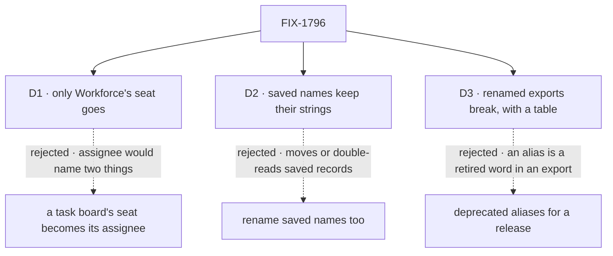

# FIX-1796 · Decisions

[Spec](SPEC.md) · **Decisions** · [Rules](BUSINESS-RULES.md) · [Plan](PLAN.md) · [Docs](DOCS.md) · [Evolution](EVOLUTION.md)

The vocabulary itself is decided in the epic's [concept](../../epics/FIX-1786/concept/CONCEPT.md#vocabulary)
and not reopened here. These are the three calls the Architect's guidance on the issue said to
put to the owner, priced. The owner answered D1 in review.

## The tree

Solid edges are what you're signing. Dashed edges lost, and the label says why.

## D1 · Only Workforce's seat goes; a task board keeps "seat"

| | |
|---|---|
| **Instead of** | Renaming the task board's seat to assignee too: its `TaskSeat…` and `HandOffSeat` types, the hand-off record's `seat` field, and the discovery tool's domain names |
| **Because** | The product owner's answer (2026-10-06): "seat" is a fair word for a place on a board. An assignee is a seat on one specific task, so it names something else. Once the Workforce sweep lands, "seat" has one meaning in the codebase, the board's, and the glossary defines it there and nowhere else. Nothing in the epic's Layer 1 changes (ER-22), so the epic's "Task boards … consumed as they ship" holds, no epic decision is needed, and FIX-1794's new board text stands as written |
| **Locks in** | The board's types, the hand-off record's `seat` field and `MANIFEST_DOMAINS` keep their names; no board app changes. The guard needs a board-seat exception scoped to the board's surface: its named types anywhere, its bare word only in its own files, and a Workforce "seat" counts even on the same line |

It comes down to what a seat is on a board: renamed, "assignee" would name both the place and the seat on one task.

**What would change my mind:** readers who still take a board's seat for a worker once
Workforce's seat is gone, for example on Shift Manager's task screens, where both meet. Then the
board's word becomes assignee at 1.0, as an epic decision.

## D2 · Saved names keep their strings; only code and pages change

| | |
|---|---|
| **Instead of** | Renaming stored keys and ids too: moving each record by an operator step, or reading the old and new name for good (BP-030) |
| **Because** | The strings that survive the other children are names only storage sees: collection patterns such as `inventory/seats/*`, the old roster's `workforce/roster/*` that FIX-1788's upgrade step reads, the room rows FIX-1793 keeps. They are not exports and not on a published page, so ER-12 doesn't reach them. Moving them changes data for a word, and a missed read path hides records. The last rename, FIX-1748, renamed its stored names and refused older stores; this epic reads old data instead (ER-3's operator step, FIX-1788's upgrade step, FIX-1793's kept room rows), and a rename here would break those reads |
| **Locks in** | A few storage strings keep old words. The code constant that holds each takes the new term (`LEGACY_` for a name only an upgrade reads), and the guard lists each string with the code that reads it |

It comes down to saved records: renaming them moves or double-reads every one, for a word.

**What would change my mind:** app builders reading those keys as product names, in the
devtool's storage view or on a published page. Then the still-written ones get new names with
the old read alongside, and an only-read one stays.

## D3 · Renamed exports break outright, with a rename table, and no aliases

| | |
|---|---|
| **Instead of** | Keeping each old export as a deprecated alias for one release |
| **Because** | ER-12 forbids a retired term in any package export at the closure, and every alias is one. The epic locks deprecate-then-remove only for flow instances and owner pins. Pre-1.0, a minor release may break (BP-022), and the last rename, FIX-1748, shipped with no aliases. Every in-repo caller moves in the same PR |
| **Locks in** | An app on the old names edits its imports once, on its first upgrade past this release, from each package's changeset table and the upgrading page. A custom worker flow with a hand-written schema on the old keys is refused at boot, naming the key it lacks |

It comes down to ER-12: an alias is a retired word in an export, so the closure fails or waits.

**What would change my mind:** an app outside this repo pinned to these exports and promised a
deprecation window. Then alias for one release, and the closure waits for their removal.

## Decided, not asked

- **The list is derived.** Each child names the old exports it leaves ([PLAN.md](PLAN.md#at-implement-time));
  the census on the build commit finds the rest. Nothing a sibling is about to delete is renamed.
- **The discovery tool's domain names stay** with D1: `seats` and `mailboxes` are pinned,
  model-facing strings in `contracts` (ER-22). What the tool and its page say about each domain
  is reworded to worker and coordinator; the guard strips only the domain value.
- **Scope** is the issue's (package source, published docs, labs, apps) plus package tests,
  READMEs, examples, `docs/architecture/` and the root README: they describe current behaviour,
  and BP-034 already makes a rename reach them. `goals/`, process files and history keep their words.
- **"Kind", "owner pin", "flow instance", "member" and "thread" are retired on Workforce's ground
  only.** The engine keeps its flow `kind`, its flow instances and owner pins until FIX-1798; a
  project's member and a chat thread keep theirs. Ground is a surface, not a folder: Workforce's
  own packages and pages, plus any file that imports Workforce or Shift Manager.
- **"Person" goes where it means the signed-in user**, everywhere in scope; where it means any
  human (an author, a reviewer), it stays, pinned by file and phrase in the guard.
- **"Target" is not scanned.** It never reached Workforce code; the engine's dispatch target stays.
- **Template and library enter the glossary with FIX-1795**, which builds after the MVP. The
  issue's outcome lists them; the epic's later call moves them ([Q2](../../epics/FIX-1786/DECISIONS.md#q2)).
- **The census becomes a CI guard and replaces `scripts/check-mailbox-rename.mjs`.** That guard
  keeps "channel" off the mailbox's surfaces; once mailboxes are gone it guards a retired thing,
  and it would block the later channels feature.
- **`hireWorkforce` is renamed only if it no longer hires.** Neither word is retired; what it
  returns stops saying seat.
- **Two PRs**: Workforce and its apps, then prose, the glossary and the guard
  ([PLAN.md](PLAN.md#pr-plan)). With D1 the task-board PR has no renames left; its few lines
  where "seat" means a Workforce worker ride with the first. Each PR's pages move with its code (ER-25).
- **Glossary entries promise no memory layer a flow doesn't keep** (ER-15, FIX-1364).

## Considered and dropped

| Alternative | Why not |
|---|---|
| A scripted find and replace | "Seat" is a worker in Workforce and a place on a board; "person" is sometimes any human. A blind replace writes wrong words |
| One PR | About 600 files across several packages. Code and its pages first, prose and the guard after, review faster apart |
| Sweep `goals/` too | Outside the PRD's scope: about 250 files of test prose and folder names. A follow-up if wanted |
| Keep the CI guard for "channel" | Its subject, the mailbox, is retired, and channels come back as their own feature |

## Settled

- **The counts this spec rests on** are re-derived by the census, not counted by hand: on
  `cad4e2780`, 22,627 unswept lines in 650 files; every one of 5,802 tracked files has an area;
  `--control` refuses all eleven plants ([README](poc/term-census/README.md#what-was-observed)).
- **The channel-kind paths the issue fences don't exist on `main`**: CONFIRMED, no
  `flows/channels/` path is tracked at all, and `CHANNEL.md` appears only in one goal fixture and
  two retained specs. So the guard carries no exception for them: one that strips nothing fails it. Channels were renamed to mailboxes before this epic; today
  `CHANNEL.md` is refused by name, pointing at mailboxes ([EVOLUTION.md](EVOLUTION.md)).

## How it got here

- **Draft** — framed as the epic's last sweep before the closure; a census with exceptions that
  strip tokens, not lines, is the goal check and becomes the CI guard; three PRs.
- **Review round 1** — the product owner answered D1: the board keeps "seat", only Workforce's
  goes, so the board PR dropped out (two PRs) and no epic decision is needed. The census now
  scopes ground and the board's seat by surface, scans "member", "thread" and lower-camel
  `room…` names, strips a stored key without the rest of its literal, and fails on a stale
  exception, so the unused channel-path exception went.

**Open: none.**
