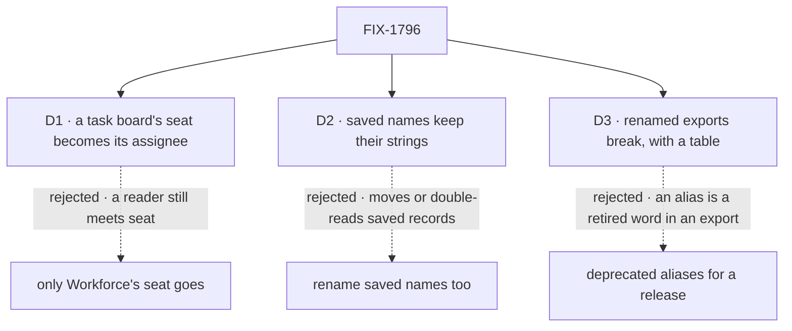

# FIX-1796 · Decisions

[Spec](SPEC.md) · **Decisions** · [Rules](BUSINESS-RULES.md) · [Plan](PLAN.md) · [Docs](DOCS.md) · [Evolution](EVOLUTION.md)

The vocabulary itself is decided in the epic's [concept](../../epics/FIX-1786/concept/CONCEPT.md#vocabulary)
and not reopened here. These are the three calls the Architect's guidance on the issue said to
put to the owner, priced.

## The tree

Solid edges are what you're signing. Dashed edges lost, and the label says why.

## D1 · A task board's seat becomes its assignee

| | |
|---|---|
| **Instead of** | Retiring "seat" only in Workforce, and keeping it as the task board's word for an assignee slot |
| **Because** | The published glossary already calls it the assignee, and the task-board page calls the same thing a seat. The Workforce docs teach "seat" as a worker, so a reader meeting it on a board reads a worker. ER-12 forbids a retired term in any export, and `TaskSeat`, `HandOffSeat` and the hand-off record's `seat` field are exports. The discovery tool tells models "the seats you can hand work to" |
| **Locks in** | Apps that build task boards, with or without Workforce, rename a handful of types this release. A hand-off saved or queued with `seat` is read as `assignee` until 1.0, and never written |

It comes down to the reader: keep the board's word, and "seat" still reads as a worker.

**What would change my mind:** an app outside this repo that builds task boards on a published
release and was promised a stable surface. Then the board keeps "seat", the glossary lists it
under words that mean two things, and the rename waits for 1.0.

## D2 · Saved names keep their strings; only code and pages change

| | |
|---|---|
| **Instead of** | Renaming stored keys and ids too: moving each record by an operator step, or reading the old and new name for good (BP-030) |
| **Because** | The strings that survive the other children are names only storage sees: collection patterns such as `inventory/seats/*`, the old roster's `workforce/roster/*` that FIX-1788's upgrade step reads, the room rows FIX-1793 keeps. They are not exports and not on a published page, so ER-12 doesn't reach them. Moving them changes data for a word, and a missed read path hides records. The last rename, FIX-1748, renamed its stored names and refused older stores; this epic reads old data instead (ER-3's operator step, FIX-1788's upgrade step, FIX-1793's kept room rows), and a rename here would break those reads |
| **Locks in** | A few storage strings keep old words. The code constant that holds each takes the new term (`LEGACY_` for a name only an upgrade reads), and the guard lists each string with the code that reads it |

It comes down to saved records: renaming them moves or double-reads every one, for a word.

**What would change my mind:** app builders reading those keys as product names, in the
devtool's storage view or on a published page. Then the still-written ones get new names with
the old read alongside, and an only-read one stays.

## D3 · Renamed exports break outright, with a rename table, and no aliases

| | |
|---|---|
| **Instead of** | Keeping each old export as a deprecated alias for one release |
| **Because** | ER-12 forbids a retired term in any package export at the closure, and every alias is one. The epic locks deprecate-then-remove only for flow instances and owner pins. Pre-1.0, a minor release may break (BP-022), and the last rename, FIX-1748, shipped with no aliases. Every in-repo caller moves in the same PR |
| **Locks in** | An app on the old names edits its imports once, on its first upgrade past this release, from each package's changeset table and the upgrading page. A custom worker flow with a hand-written schema on the old keys is refused at boot, naming the key it lacks |

It comes down to ER-12: an alias is a retired word in an export, so the closure fails or waits.

**What would change my mind:** an app outside this repo pinned to these exports and promised a
deprecation window. Then alias for one release, and the closure waits for their removal.

## Decided, not asked

- **The list is derived.** Each child names the old exports it leaves ([PLAN.md](PLAN.md#at-implement-time));
  the census on the build commit finds the rest. Nothing a sibling is about to delete is renamed.
- **Scope** is the issue's (package source, published docs, labs, apps) plus package tests,
  READMEs, examples, `docs/architecture/` and the root README: they describe current behaviour,
  and BP-034 already makes a rename reach them. `goals/`, process files and history keep their words.
- **"Kind", "owner pin" and "flow instance" are retired on Workforce's ground only.** The engine
  keeps its flow `kind`, its flow instances and owner pins until FIX-1798.
- **"Person" goes where it means the signed-in user**, everywhere in scope; where it means any
  human (an author, a reviewer), it stays, pinned by file and phrase in the guard.
- **"Target" is not scanned.** It never reached Workforce code; the engine's dispatch target stays.
- **Template and library enter the glossary with FIX-1795**, which builds after the MVP. The
  issue's outcome lists them; the epic's later call moves them ([Q2](../../epics/FIX-1786/DECISIONS.md#q2)).
- **The census becomes a CI guard and replaces `scripts/check-mailbox-rename.mjs`.** That guard
  keeps "channel" off the mailbox's surfaces; once mailboxes are gone it guards a retired thing,
  and it would block the later channels feature.
- **`hireWorkforce` is renamed only if it no longer hires.** Neither word is retired; what it
  returns stops saying seat.
- **Three PRs**: the task board, then Workforce and its apps, then prose, the glossary and the
  guard ([PLAN.md](PLAN.md#pr-plan)). Each PR's pages move with its code (ER-25).
- **Glossary entries promise no memory layer a flow doesn't keep** (ER-15, FIX-1364).

## Considered and dropped

| Alternative | Why not |
|---|---|
| A scripted find and replace | "Seat" is a worker in Workforce and an assignee on a board; "person" is sometimes any human. A blind replace writes wrong words |
| One PR | About 600 files across six packages. The board rename is independent and reviews faster alone |
| Sweep `goals/` too | Outside the PRD's scope: about 250 files of test prose and folder names. A follow-up if wanted |
| Keep the CI guard for "channel" | Its subject, the mailbox, is retired, and channels come back as their own feature |

## Settled

- **The counts this spec rests on** are re-derived by the census, not counted by hand: on
  `cad4e2780`, 21,436 unswept lines in 661 files; every one of 5,790 tracked files has an area;
  `--control` refuses all four plants ([README](poc/term-census/README.md#what-was-observed)).
- **The channel-kind paths the issue fences don't exist on `main`** — CONFIRMED by the census:
  its `channel-kind-paths` exception strips nothing, no `flows/channels/` is tracked at all, and
  `CHANNEL.md` appears only in one goal fixture and two retained specs. Channels were renamed to mailboxes before this epic; today
  `CHANNEL.md` is refused by name, pointing at mailboxes ([EVOLUTION.md](EVOLUTION.md)).

## How it got here

- **Draft** — framed as the epic's last sweep before the closure; a census with exceptions that
  strip tokens, not lines, is the goal check and becomes the CI guard; three PRs.

**Open: none.**
