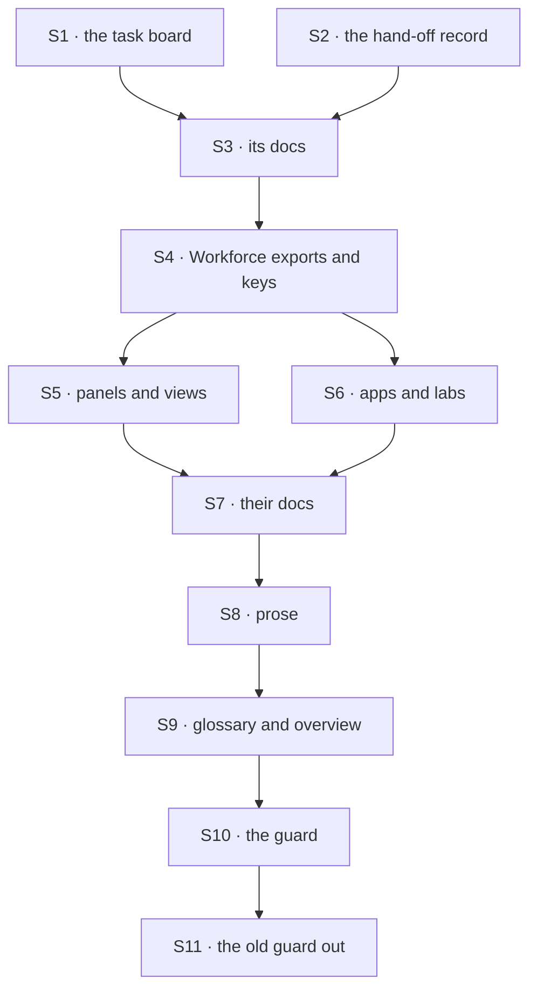

# FIX-1796 · Plan

[Spec](SPEC.md) · [Decisions](DECISIONS.md) · [Rules](BUSINESS-RULES.md) · **Plan** · [Docs](DOCS.md) · [Evolution](EVOLUTION.md)

Written for the implementing agent. IDs cross-reference [BUSINESS-RULES.md](BUSINESS-RULES.md)
(BR-n) and [DECISIONS.md](DECISIONS.md) (D-n). A rename refactor: tests green before and after
each PR, `tdd` for BR-15 to BR-17. Three PRs. Starts after FIX-1792 and FIX-1794 merge (the
epic's [order](../../epics/FIX-1786/PLAN.md#what-unblocks-what-from-here)).

## Surfaces

| ID | Package · role | Change | Rules |
|---|---|---|---|
| S1 | `orchestration` · the task board | Its seat types, fields and prose become assignee (D1): the registry, hand-off and address types, `board.handedOff`, refusal messages | BR-3 BR-6 |
| S2 | `core` + `contracts` · the hand-off record and discovery | The record's `seat` field becomes `assignee`; a record carrying `seat` is read as `assignee`, never written (BP-030), and its dedupe key keeps its value. The discovery tool's description and its domain names (`MANIFEST_DOMAINS` in `contracts`: `seats`, `mailboxes`) lose seat and mailbox; an unknown domain already returns the known names | BR-3 BR-6 BR-16 BR-17 |
| S3 | Docs for S1–S2 | `task-board.md` and every anchor to "Seats that hand off", `discovery.md`, `agents.md`, `background-work.md`, the guide; `minor` changesets for `contracts`, `core` and `orchestration` with the rename table | BR-7 BR-14 |
| S4 | `workforce` · exports and keys | Every old-term export the children leave ([below](#at-implement-time)) and every one the census finds; the worker configuration's `seat*` keys become `worker*`; storage-only strings keep their value behind renamed constants (D2) | BR-1 BR-2 BR-11 BR-14 BR-15 |
| S5 | `react`, `devtool` · Workforce panels and views | Roster and detail panels, the inventory and resources views: names, labels, `data-*` attributes | BR-1 BR-6 |
| S6 | `shift-manager`, `apps/kitchen-sink`, `labs`, `examples` | Consumers, UI text, team profiles, fixtures under them | BR-1 BR-6 |
| S7 | Docs for S4–S6 | Package READMEs and the Workforce and Shift Manager pages naming what S4–S6 rename; `minor` changesets per published package; the upgrading page's rename table ([DOCS.md](DOCS.md)) | BR-7 BR-14 |
| S8 | Prose | "Person" for the user (BR-4, BR-5), and every remaining retired word in the docs site, `docs/architecture/`, the root README and figures' text | BR-1 BR-4 BR-5 |
| S9 | The glossary and the overview | [DOCS.md](DOCS.md): the glossary's opening, its Workforce and Shift Manager sections, words that mean two things, three figures redrawn; the epic's overview opening, each sentence checked on `main` | BR-18–20 |
| S10 | The guard | The census becomes `scripts/check-retired-terms.mjs` with a vitest test of its controls, run in CI beside the other repository guards. It also asserts each shipped vocabulary term has exactly one row in the glossary | BR-8 BR-12 BR-18 |
| S11 | **Removals** | `scripts/check-mailbox-rename.mjs`, its test, its CI step (S10 replaces it) | — |

## Sequence

### PR plan

| PR | Deliverables | depends_on |
|---|---|---|
| P1 | S1 S2 S3 | — |
| P2 | S4 S5 S6 S7 | P1 |
| P3 | S8 S9 S10 S11 | P2 |

A stack (ER-26): P2 rebases on P1, P3 on P2. The seam between P1 and P2 is the orchestration
types Workforce imports.

## Checks

| ID | Runs after | Passes when |
|---|---|---|
| V1 | S1 S2 | Typecheck; `orchestration` and `core` suites green. BR-16: a hand-off recorded with `seat` on today's `main` runs and settles; a new one carries only `assignee`. BR-17 |
| V2 | S3 S7 S9 | The docs build passes with no broken link or anchor warning naming a renamed heading (BR-7) |
| V3 | S4 | BR-15: a worker flow whose hand-written schema keeps `seatTools` is refused at boot, naming `workerTools`. BR-11: a store written by `main` before the sweep lists and reads the same records after it |
| V4 | S5 S6 | `shift-manager`, `kitchen-sink` and `devtool` suites green; `fsdev run` on a kitchen-sink Workforce flow |
| V5 | S3 S7 | Every name removed from a published package's index between the PR's base and head appears in that package's changeset table (BR-14) |
| VG | S10 | [The goal](SPEC.md#the-goal-and-how-well-know-its-met): the guard PASSES on P3's head, rebased on `main`, after it FAILED on `main` before P1 (record both counts), and `--control` refuses every plant. Typecheck, tests and V2 green |

## Pinned names

| Where | Name | Why pinned |
|---|---|---|
| The worker configuration's keys | `workerId`, `workerSkills`, `workerTools`, `workerPackages`, from `seatId`, `seatSkills`, `seatTools`, `seatPackages` | A custom worker flow reads them, and the docs show them. `workerId` is FIX-1788's name for the same id |
| The hand-off record | `assignee`, from `seat` | It rides queues and saved rows; the board already routes on assignee |
| The task board's types | `TaskAssignee…`, `HandOffAssignee`, from `TaskSeat…`, `HandOffSeat` | Public; the glossary's word |
| The guard | `scripts/check-retired-terms.mjs` | The closure runs it (FIX-1797) |

Everything else follows the rule: seat to worker, kind to worker flow, hired roster to roster,
mailbox leftovers to coordinator, a storage-only constant to `LEGACY_…`.

## Guardrails

| Rule | Because |
|---|---|
| Rename by meaning, never by string | "Seat" is a worker in Workforce and an assignee on a board; "person" is sometimes any human |
| Never widen an exception to go green; rename the line | An exception that absorbs a live use is how a guard lies. The census's control plants exactly that |
| An exception strips a token, never a line; only a refusal module (ER-6) is listed whole, by path | A second retired word on an excepted line must still count |
| Each PR's pages move with its code | ER-25 |
| Don't rename what a sibling is about to delete | The epic's sequencing; start from `main` after FIX-1792 and FIX-1794 |
| No saved string changes | D2; BR-11's check proves it |
| Read the old hand-off field, never write it | BP-030 |
| Leave `goals/` words alone; typecheck carries their identifiers | Scope (DECISIONS → decided, not asked) |

## Docs

Each PR publishes the [DOCS.md](DOCS.md) operations for what it renames; P3 publishes the
glossary and the epic's overview opening last, after S8.

## POC

**`poc/term-census/`**: the census and its controls ([README](poc/term-census/README.md)). On
`cad4e2780` it read 5,790 tracked files: 21,436 unswept lines in 661 files, every file with an
area, all four plants refused. The premise held: 288 of the 661 files are Workforce and Shift
Manager, and the rest is the task board, the panels and prose. It starts with eight token
exceptions; one strips nothing, the fenced channel paths. The "person" keeps are the implementer's.

## At implement time

- Rebase on `main` and re-run the census; its counts are the sweep's real size. Most of today's
  hits are in code FIX-1788, FIX-1791, FIX-1792 and FIX-1793 rewrite or remove.
- Each child's list of old exports it left: FIX-1788 [PLAN](../FIX-1788/PLAN.md#at-implement-time)
  (`hireWorkforce`, `seatDoorOf`, `SeatDoor`, `createSeatHireCapability`, the `seat*` keys,
  `HIRED_ROSTER_*`); FIX-1789 [PLAN](../FIX-1789/PLAN.md#at-implement-time) (`resolvableKinds`,
  `missingKindRefusal`, `KindRefusedHireError`; it renamed `kinds` to `workerFlows`); FIX-1791
  [PLAN](../FIX-1791/PLAN.md#at-implement-time) (the mailbox flow's exports, likely gone with
  FIX-1792); FIX-1793 [PLAN](../FIX-1793/PLAN.md#at-implement-time) (the workstream-claim
  exports, FIX-1792's to remove). FIX-1792's and FIX-1794's lists come with their specs.
- FIX-1790's `IsolationFlow.ownerPin`, `ScheduleResolutionContext.ownerPin` and `InstanceOwnerPin`
  are the engine's, for FIX-1798; leave them.
- If the `CHANNEL.md` refusal still points at mailboxes, it tells a user to adopt a refused
  format. That is FIX-1792's; flag it to the epic, don't fix it here.
- Publish the epic's overview opening with Q2's answer (private projects in) and without the
  library's lines. Use only the public client surface in any example (`createClient`,
  `createWorkforceClient`); never a lab wrapper.
- `CLAUDE.md`'s package map calls Workforce a "Seat factory": fix the one line (BP-034), though
  process files are outside the guard.
- "Person" is the judgment-heavy term: about 900 lines today, many meaning the user, some any human.

## Follow-ups

- The words in `goals/` and their folder names (`goals/org-seats/`, `goals/workforce-seats/`).
- Saved names, if D2 flips.
