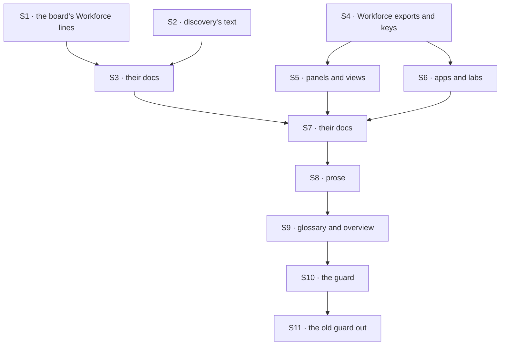

# FIX-1796 · Plan

[Spec](SPEC.md) · [Decisions](DECISIONS.md) · [Rules](BUSINESS-RULES.md) · **Plan** · [Docs](DOCS.md) · [Evolution](EVOLUTION.md)

Written for the implementing agent. IDs cross-reference [BUSINESS-RULES.md](BUSINESS-RULES.md)
(BR-n) and [DECISIONS.md](DECISIONS.md) (D-n). A rename refactor: tests green before and after
each PR, `tdd` for BR-15 and BR-16. Two PRs. Starts after FIX-1792 and FIX-1794 merge (the
epic's [order](../../epics/FIX-1786/PLAN.md#what-unblocks-what-from-here)).

## Surfaces

| ID | Package · role | Change | Rules |
|---|---|---|---|
| S1 | `orchestration` · Workforce's seat only | The board keeps its seat, its types and `board.handedOff` (D1). Only a line where "seat" means a Workforce worker ("a hired seat", "a workforce seat") says worker | BR-1 BR-3 |
| S2 | `contracts` + `core` · discovery | `MANIFEST_DOMAINS`' `seats` becomes `workers` (D4), and the discovery tool's description and each domain's say worker. `mailboxes` is FIX-1792's to remove (its PLAN S9); nothing here touches it. The hand-off record's `seat` field is unchanged (D1) | BR-3 BR-6 BR-16 |
| S3 | Docs for S1–S2 | `discovery.md`'s domains and its seat definition; any orchestration page line where "seat" means a Workforce worker. `patch` changesets for `contracts` and `core` with D4's row and its cost: a saved prompt, skill or eval that passes `seats` gets the "unknown domain" listing | BR-1 BR-3 BR-14 BR-16 |
| S4 | `workforce` · exports and keys | Every old-term export the children leave ([below](#at-implement-time)) and every one the census finds; the worker configuration's `seat*` keys become `worker*`; its manifest source and `discover:` key follow `workers` (D4, a `patch` changeset row); storage-only strings keep their value behind renamed constants (D2) | BR-1 BR-2 BR-11 BR-14 BR-15 |
| S5 | `react`, `devtool` · Workforce panels and views | Roster and detail panels, the inventory and resources views: names, labels, `data-*` attributes | BR-1 BR-6 |
| S6 | `shift-manager`, `apps/kitchen-sink`, `labs`, `examples` | Consumers, UI text, team profiles, fixtures under them | BR-1 BR-6 |
| S7 | Docs for S4–S6 | Package READMEs and the Workforce and Shift Manager pages naming what S4–S6 rename; `minor` changesets per published package; the upgrading page's rename table ([DOCS.md](DOCS.md)) | BR-7 BR-14 |
| S8 | Prose | "Person" for the user on Workforce's ground (BR-4, BR-5), and every remaining retired word in the docs site, `docs/architecture/`, the root README and figures' text | BR-1 BR-4 BR-5 |
| S9 | The glossary and the overview | [DOCS.md](DOCS.md): the glossary's opening, seat and assignee in its task-board section, its Workforce and Shift Manager sections, words that mean two things, three figures redrawn; the epic's overview opening, each sentence checked on `main` | BR-17–20 |
| S10 | The guard | The census becomes `scripts/check-retired-terms.mjs` with a vitest test of its controls, run in CI beside the other repository guards. Ground and the board's seat are scoped by surface (the POC's `onWorkforceGround`, `BOARD_FILES`). It also asserts each shipped vocabulary term has exactly one row in the glossary | BR-2 BR-3 BR-5 BR-8 BR-12 BR-17 |
| S11 | **Removals** | `scripts/check-mailbox-rename.mjs`, its test, its CI step (S10 replaces it) | — |

## Sequence

### PR plan

| PR | Deliverables | depends_on |
|---|---|---|
| P1 | S1 S2 S3 S4 S5 S6 S7 | — |
| P2 | S8 S9 S10 S11 | P1 |

A stack (ER-26): P2 rebases on P1. With D1 the task board renames nothing, so it has no PR of
its own; its few Workforce-meaning lines ride with P1.

## Checks

| ID | Runs after | Passes when |
|---|---|---|
| V1 | S1 S2 | Typecheck; `orchestration` and `core` suites green with no board name changed: the index of `orchestration`, `core` and `contracts` exports the same names before and after (BR-3) |
| V2 | S3 S7 S9 | The docs build passes with no broken link or anchor warning naming a renamed heading (BR-7) |
| V3 | S4 | BR-15: a worker flow whose hand-written schema keeps `seatTools` is refused at boot, naming `workerTools`. BR-11: a store written by `main` before the sweep lists and reads the same records after it |
| V4 | S5 S6 | `shift-manager`, `kitchen-sink` and `devtool` suites green; `fsdev run` on a kitchen-sink Workforce flow |
| V5 | S7 | Every name removed from a published package's index between the PR's base and head appears in that package's changeset table (BR-14) |
| V6 | S2 S4 | BR-16: `discover({ domain: "workers" })` answers what `seats` did on `main`; `seats` gets the "unknown domain" listing; a worker file with `discover: [seats]` is refused at its mint, naming `workers` |
| VG | S10 | [The goal](SPEC.md#the-goal-and-how-well-know-its-met): the guard PASSES on P2's head, rebased on `main`, after it FAILED on `main` before P1 (record both counts), and `--control` refuses every plant. Typecheck, tests and V2 green |

## Pinned names

| Where | Name | Why pinned |
|---|---|---|
| The worker configuration's keys | `workerId`, `workerSkills`, `workerTools`, `workerPackages`, from `seatId`, `seatSkills`, `seatTools`, `seatPackages` | A custom worker flow reads them, and the docs show them. `workerId` is FIX-1788's name for the same id |
| The discovery domain | `workers`, from `seats` | D4: a model and a worker file pass it by name |
| What stays | The task board's `TaskSeat…`, `HandOffSeat`, the hand-off record's `seat` | D1: the board keeps "seat" |
| The guard | `scripts/check-retired-terms.mjs` | The closure runs it (FIX-1797) |

Everything else follows the rule: seat to worker, kind to worker flow, hired roster to roster,
mailbox leftovers to coordinator, a storage-only constant to `LEGACY_…`.

## Guardrails

| Rule | Because |
|---|---|
| Rename by meaning, never by string | "Seat" is a worker in Workforce and a place on a board; "person" is sometimes any human |
| Never widen an exception to go green; rename the line | An exception that absorbs a live use is how a guard lies. The census's control plants exactly that |
| Scope by surface, never by folder | A Workforce consumer sits in many folders (kitchen-sink's seat pane, the React panels); the board's bare "seat" strips only in its own files |
| An exception strips a token, never a line; only a refusal module (ER-6) is listed whole, by path | A second retired word on an excepted line must still count |
| Each PR's pages move with its code | ER-25 |
| Don't rename what a sibling is about to delete | The epic's sequencing; start from `main` after FIX-1792 and FIX-1794 |
| No saved string changes | D2; BR-11's check proves it |
| Leave `goals/` words alone; typecheck carries their identifiers | Scope (DECISIONS → decided, not asked) |

## Docs

Each PR publishes the [DOCS.md](DOCS.md) operations for what it renames; P2 publishes the
glossary and the epic's overview opening last, after S8.

## POC

**`poc/term-census/`**: the census and its controls ([README](poc/term-census/README.md)). On
`cad4e2780` it read 5,802 tracked files: 22,247 unswept lines in 556 files, every file with an
area, all thirteen plants refused. Most of it is Workforce, Shift Manager and their consumers; the
rest is the panels and prose. It starts with twelve token exceptions, each stripping something;
it names one board file on Workforce's ground (the task-board page's mailbox section). The
"person" keeps and the project-member keeps are the implementer's.

## At implement time

- Rebase on `main` and re-run the census; its counts are the sweep's real size. Most of today's
  hits are in code FIX-1788, FIX-1791, FIX-1792 and FIX-1793 rewrite or remove.
- Each child's list of old exports it left: FIX-1788 [PLAN](../FIX-1788/PLAN.md#at-implement-time)
  (`hireWorkforce`, `seatDoorOf`, `SeatDoor`, `createSeatHireCapability`, the `seat*` keys,
  `HIRED_ROSTER_*`); FIX-1789 [PLAN](../FIX-1789/PLAN.md#at-implement-time) (`resolvableKinds`,
  `missingKindRefusal`, `KindRefusedHireError`; it renamed `kinds` to `workerFlows`); FIX-1791
  [PLAN](../FIX-1791/PLAN.md#at-implement-time) (the mailbox flow's exports, likely gone with
  FIX-1792); FIX-1793 [PLAN](../FIX-1793/PLAN.md#at-implement-time) (the workstream-claim
  exports, FIX-1792's to remove). FIX-1792's list comes with its spec. FIX-1794's new board text
  ("a seat that hands off", `defaultWorker`'s seat) is the board's word and stays (D1).
- The discovery domain `mailboxes` is FIX-1792's: its PLAN S9 removes it
  ([#2833](https://github.com/fixpoint-labs/flow-state-dev/pull/2833)), and nothing here decides it.
  If it is still on `main` when P1 is built, raise it to the epic rather than renaming it here.
- D4 binds once the epic records it (amend-5). Don't build S2's rename before that amendment merges.
- FIX-1790's `IsolationFlow.ownerPin`, `ScheduleResolutionContext.ownerPin` and `InstanceOwnerPin`
  are the engine's, for FIX-1798; leave them.
- If the `CHANNEL.md` refusal still points at mailboxes, it tells a user to adopt a refused
  format. That is FIX-1792's; flag it to the epic, don't fix it here.
- Publish the epic's overview opening with Q2's answer (private projects in) and without the
  library's lines. Use only the public client surface in any example (`createClient`,
  `createWorkforceClient`); never a lab wrapper.
- `CLAUDE.md`'s package map calls Workforce a "Seat factory": fix the one line (BP-034), though
  process files are outside the guard.
- "Person" is the judgment-heavy term: about 500 lines on Workforce's ground today, many meaning the
  user, some a human who isn't the signed-in user. Pin each keep by file and phrase, as the POC's
  `person-any-human` does.

## Notes from review

- "**Possible tighten at S10:** `WORKFORCE_GROUND` ends with `|workforce/i`, which matches *any* path containing the substring `workforce`, not only the three prefix families described in the comment. If that is intentional (e.g. catch `examples/.../workforce/...`), worth one line in PLAN guardrails; if not, dropping the bare alternation would narrow false “workforce ground” hits and slightly simplify mental model for implementers." — cursor ([thread](https://github.com/fixpoint-labs/flow-state-dev/pull/2832#discussion_r4201022205))
- "**Reuse / less drift:** S10+S11 replaces `check-mailbox-rename.mjs` with a *wider* guard. The POC re-implements totality (`AREAS`) parallel to `groupsFor` in the mailbox script. When implementing, I'd strongly favor extracting shared **history/process/goals/config** classification (small `scripts/lib/…` or shared table) rather than a third copy — same behavior, fewer future “why did CI pass on mailbox but fail on retired-terms for `spec-poc/`?” diffs." — cursor ([thread](https://github.com/fixpoint-labs/flow-state-dev/pull/2832#discussion_r4201022219))
- "**Spec gap (optional):** `person` is called out as judgment-heavy (~900 lines) but the exception list in the POC is almost empty for it (BR-5). A short subsection here — *exception class for “any human” pins* (file + phrase, mailbox-style) — would reduce implementer improvisation in P3 and keep the guard from growing one-off regexes. Not blocking for spec approval." — cursor ([thread](https://github.com/fixpoint-labs/flow-state-dev/pull/2832#discussion_r4201022225))
- "Agree with rejecting blind find-replace. For implementers: the middle ground worth naming explicitly is **identifier-targeted renames** (exports, `data-*`, schema keys) via codemod/typescript rename, plus this guard for **prose and string literals** — not two competing CI systems, one mechanical pass per PR then census goes green." — cursor ([thread](https://github.com/fixpoint-labs/flow-state-dev/pull/2832#discussion_r4201022228))
- "**S10 production guard** — Plan adds glossary row uniqueness on top of the POC. Before CI lands, mirror **`check-mailbox-rename.mjs`**: export pure `scanFile` / `census` (in-memory maps), vitest plants in **`packages/core/test/`** (not workforce), CLI thin. Consider a small **`scripts/lib/guard-totality.mjs`** shared with the mailbox guard’s history/process/goals buckets so area regexes do not drift a third time." — cursor ([review](https://github.com/fixpoint-labs/flow-state-dev/pull/2832#pullrequestreview-5435221824))
- "**POC hot loop** — Measured ~0.6s full census on ~5.8k tracked files today; CI is fine. If the tree grows, prefilter (`indexOf` before `/seat/gi` on every line) is enough — no caching needed yet." — cursor ([review](https://github.com/fixpoint-labs/flow-state-dev/pull/2832#pullrequestreview-5435221824))
- "Whether future **channels** need a new guard when reintroduced — out of FIX-1796 scope; just don’t assume S11’s removal covers non-mailbox “channel” product language forever." — cursor ([review](https://github.com/fixpoint-labs/flow-state-dev/pull/2832#pullrequestreview-5435221824))
- "P2 bundles S4–S7 (workforce exports, panels, apps/labs, docs: ~290+ files). Splitting the library rename from the consumers lets the typecheck fail narrowly. Optional." — architecture review ([comment](https://github.com/fixpoint-labs/flow-state-dev/pull/2832#issuecomment-6026555582))
- "The census counts a lot of code that FIX-1788/1791/1792/1793 rewrite. The plan already says re-run on `main`, so just don't size P2 off 21,436." — architecture review ([comment](https://github.com/fixpoint-labs/flow-state-dev/pull/2832#issuecomment-6026555582))

These are inputs, not instructions. Adopt, adapt, or discard; you owe no justification for
discarding one. A note that turns out to reveal a design problem is a spec blind spot: surface
it and fold it back. Plan IDs in the notes are from before round 1, when there were three PRs.

## Follow-ups

- The words in `goals/` and their folder names (`goals/org-seats/`, `goals/workforce-seats/`).
- Saved names, if D2 flips.
