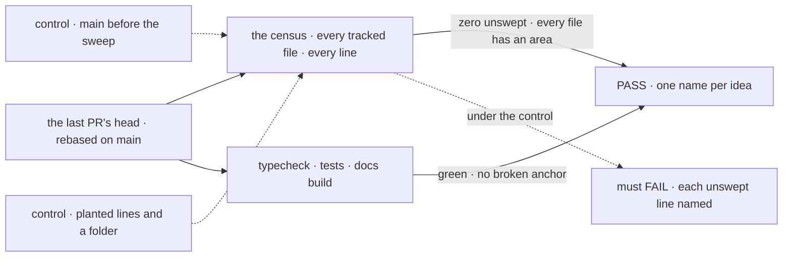
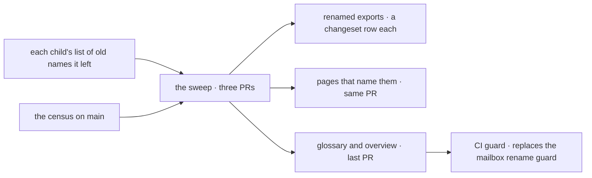

# FIX-1796 · Remove the retired Workforce terms from code and docs

**Spec** · [Decisions](DECISIONS.md) · [Rules](BUSINESS-RULES.md) · [Plan](PLAN.md) · [Docs](DOCS.md) · [Evolution](EVOLUTION.md)

## Five readers, before and after

| Someone who… | Today | After |
|---|---|---|
| **learns Workforce from its docs** | Meets seat, hired seat, hired roster, mailbox, member, room, talk session, kind, flow instance and owner pin, several of them for one idea | Meets user, worker, worker flow, coordinator, delegate, roster, workstream and project coordinator, each one idea, defined once in the glossary |
| **writes a custom worker flow** | Reads `seatTools`, `seatSkills` and `seatId`, and catches `KindRefusedHireError` | Reads `workerTools`, `workerSkills` and `workerId`. A hand-written schema still on the old keys is refused at boot, naming the key it lacks |
| **builds a task board, with or without Workforce** | Declares "seats that hand off", and a hand-off record carries `seat` | Declares assignees, the word the glossary already uses. A hand-off saved before the upgrade still runs ([D1](DECISIONS.md#d1)) |
| **upgrades an app past this release** | n/a | Gets a table of old to new names in each package's changeset and on the upgrading page. No alias to unlearn later ([D3](DECISIONS.md#d3)) |
| **keeps data saved by an earlier release** | Records under `inventory/seats/…` and `workforce/roster/…` | Reads them as before. Nothing moves ([D2](DECISIONS.md#d2)) |

The epic's last sweep ([FIX-1786](../../epics/FIX-1786/SPEC.md), ER-12), once the other children merge.

## The goal, and how we'll know it's met

**Anyone reading Workforce's code, its exports or its published docs meets each idea under one
name, finds that name defined once in the glossary, and meets a retired term only where a
listed exception says why.**

| Is it the right goal? | |
|---|---|
| **The real need** | The PRD on [FIX-1796](https://linear.app/fixpoint-labs/issue/FIX-1796): "One term should mean one thing." The epic's [ER-12](../../epics/FIX-1786/BUSINESS-RULES.md#what-a-team-gets-and-what-it-doesnt) and its *not done if*: "a retired term is left in an export or a published page" |
| **Smaller, and rejected** | "The glossary has the new words": met while about 660 files still teach seat and mailbox. Or "Workforce's exports are renamed": met while the task board says seat for the same idea and the docs say person for the user |
| **Bigger, and not this issue's** | The words in `goals/` and their folder names · the engine's flow instances and owner pins ([FIX-1798](https://linear.app/fixpoint-labs/issue/FIX-1798)) · renaming saved data ([D2](DECISIONS.md#d2)) · channels, a later feature |
| **Not done if** | The guard passes because an exception hides a live use, and its control never ran · it ran on a branch, not the last PR's head on `main` · an export is renamed with no changeset row · a record saved today stops reading · the glossary defines one idea twice · a renamed heading leaves a link that only warns |



The census reads every line of every tracked file, so a term nobody listed still counts. Under
either dashed control it must fail.

| How we verify | |
|---|---|
| **Goal check** | The census ([POC](poc/term-census/README.md)), which the last PR moves to `scripts/check-retired-terms.mjs` and runs in CI · no model · run by the implementer on the last PR's head, rebased on `main` · verdict in that PR, and the closure ([FIX-1797](https://linear.app/fixpoint-labs/issue/FIX-1797)) runs it again |
| **Signal** | Zero unswept matches; zero files without an area; no exception that strips nothing; each shipped vocabulary term has exactly one glossary row; `pnpm typecheck`, `pnpm test` and the docs build green, with no broken-anchor warning on a renamed heading |
| **Input** | Every tracked file on that commit. A new file in any in-scope folder that uses a retired word must fail it |
| **Anti-game** | No exception passes a whole line or file, except a refusal module listed by path (ER-6). No near-spelling, and no swap to another retired word (mailbox to member). The exception list is in the PR diff |
| **Control that must fail** | `main` before the sweep: FAIL on *zero unswept* (on `cad4e2780`, 21,436 lines in 661 files). `--control`: three planted lines and an unscoped folder, each refused |

## What changes


Left, today's names; right, the one each becomes. Below the fence, what keeps its word on purpose.

**What an app writes**, after the sweep (names per [PLAN.md](PLAN.md#pinned-names)):

```diff
- import type { TaskSeatRegistry, HandOffSeat } from "@flow-state-dev/orchestration"
+ import type { TaskAssigneeRegistry, HandOffAssignee } from "@flow-state-dev/orchestration"
- import { KindRefusedHireError } from "@flow-state-dev/workforce"
+ import { WorkerFlowRefusedHireError } from "@flow-state-dev/workforce"
  // in a custom worker flow, the configuration a worker runs with
- const { seatTools, seatSkills } = config
+ const { workerTools, workerSkills } = config
```

## How the sweep runs



Each child names the old exports it leaves; the census finds the rest.

## What stays as it is

- The engine's flow `kind`, its flow instances and owner pins (deprecated until FIX-1798), and
  its dispatch "target" ([ER-20](../../epics/FIX-1786/BUSINESS-RULES.md#what-no-child-may-do)).
- Saved key strings and ids ([D2](DECISIONS.md#d2)).
- History (specs, changelogs, changesets, blog posts, the atlas) and the words in `goals/`.
- A task board's "board worker", in the glossary's words that mean two things.
- Channel paths: none exist on `main` ([settled](DECISIONS.md#settled)), and none is added.

## Sign off

**[The goal](#the-goal-and-how-well-know-its-met), at that size:** every in-scope file, the
task board included, with a guard that keeps it so. If wrong: we rename Workforce and leave a
reader meeting "seat" on the next page.

1. **[D1](DECISIONS.md#d1) · A task board's seat becomes its assignee.** If wrong: an app that
   uses boards without Workforce renames a few types for a word that was never Workforce's.
2. **[D2](DECISIONS.md#d2) · Saved names keep their strings; code and pages change.** If wrong:
   the devtool's storage view keeps showing old words, and a later rename needs a data move.
3. **[D3](DECISIONS.md#d3) · Renamed exports break outright, with a table, no aliases.** If
   wrong: an outside app's build breaks on upgrade until it applies the table.

**Open: none.** D1 is the one to weigh.

Improvement · `contracts`, `core`, `orchestration`, `react`, `devtool`, `workforce`, `shift-manager`, docs, and prose across the rest · large, mechanical (661 files on `cad4e2780`, fewer once the other children merge) · 3 PRs · epic [FIX-1786](../../epics/FIX-1786/SPEC.md)
