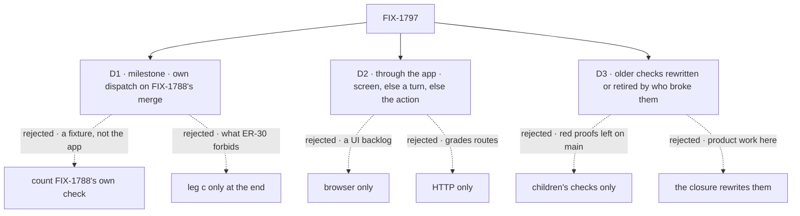

# FIX-1797 · Decisions

[Spec](SPEC.md) · **Decisions** · [Rules](BUSINESS-RULES.md) · [Plan](PLAN.md) · [Docs](DOCS.md)

The [closure rule](../../../docs/contributing/orchestration.md#the-closure-issue-every-epic-ends-in-qa)
fixes what the plan holds and in what order; the epic fixes the legs, their input, the control
and the milestone ([FIX-1786 → How we verify](../../epics/FIX-1786/SPEC.md#the-goal-and-how-well-know-its-met),
[ER-28 to ER-30](../../epics/FIX-1786/BUSINESS-RULES.md#the-closure)). These cards are the calls
left open. D1 to D3 are the sign-off; the rest are decided so nobody decides them on the day.

## The tree

Solid edges are what was chosen. Dashed edges lost, and the label says why.

## D1 · The milestone run is its own dispatch on FIX-1788's merge commit, made by the epic coordinator; its findings hold FIX-1791 and FIX-1795

| | |
|---|---|
| **Instead of** | (a) Counting FIX-1788's own goal check as the milestone. (b) Running leg c only in the final run |
| **Because** | ER-30 asks for leg c's worker steps *in Shift Manager with two users*, on the commit FIX-1788 merges on. FIX-1788's check runs a goal-local tree over HTTP with two hosts: it proves the store refuses, not that the app a person signs into does. (b) is what ER-30 was written to stop: the coordinator, the chain and projects build on the privacy fix, so a hole found at the end is found under three children. Nothing in the epic wake fires on another child's merge, and this issue is blocked by every child, so the run happens only if the coordinator dispatches it |
| **Locks in** | One coordinator action no workflow automates: on the wake that sees FIX-1788's last PR merge, dispatch this issue's worker with a bounded *milestone* assignment naming that merge commit. It opens no PR, so the blocked-by relations don't hold it. It runs [the milestone steps](PLAN.md#the-milestone) and the `org-scoped-workers` control, posts its report on FIX-1797 and on FIX-1788's last PR, and pushes its code to `fix/FIX-1797` for the final run to extend. A failure is a Bug child of FIX-1786 that blocks FIX-1791, FIX-1795 and this issue, and the coordinator offers neither as ready to merge while it is open |

**What would change my mind:** the epic wake gaining a milestone hook, or FIX-1791 merging before
FIX-1788. Then the hook fires it, or the milestone folds into the final run with a line in the
report.

**What being wrong costs:** one extra run of about half a leg, on a commit the final run will
supersede.

It comes down to the app: only a Shift Manager run with two users checks what people sign into.

## D2 · "Through the app" means the screen where Shift Manager draws one, else a coordinator turn, else the app's own action as that user; a missing screen is a finding only when a child promised it

| | |
|---|---|
| **Instead of** | (a) Browser only: every step a screen, every missing screen a finding. (b) HTTP only: every step the app's actions over routes |
| **Because** | The epic's anti-game says the users make each worker, project and delegate *through the app*, with no fixture. The children promise some screens and not others: the roster ([FIX-1788 S12](../FIX-1788/PLAN.md#surfaces)), the delegates panel ([FIX-1791 S10](../FIX-1791/PLAN.md#surfaces)), projects and workstreams ([FIX-1793 S8](../FIX-1793/PLAN.md#surfaces)). Nothing promises a fork button. (a) turns every unpromised screen into a finding, which is UI work the epic never scoped. (b) grades routes, not what a person sees, and the children's own checks already do that. Leg c is the exception by nature: a forged request is not something a screen can send, so Bob's reaches go over HTTP, and the screen is checked for what it doesn't show |
| **Locks in** | Each step in [PLAN.md → Checks](PLAN.md#checks) names its surface, and the report tags each run step with the surface it used. A step done by a coordinator turn is graded on the turn's tool calls and the store. An action over HTTP carries only that user's own verified bearer, never a store write or a block called by the check. A promised screen that is missing or broken is a finding against the child that promised it; an unpromised one is an observation |

**What would change my mind:** the owner wanting forking and coordinator setup as screens in the
MVP. Then each is a finding against FIX-1788 or FIX-1791, and the epic is amended to say so.

**What being wrong costs:** a screen a person would look for, reported as an observation instead
of blocking the wrap.

It comes down to the promise: browser-only grades screens nobody promised.

## D3 · An older check the epic broke must be rewritten or retired, with a line, by the child that broke it; the closure fails on any left red

| | |
|---|---|
| **Instead of** | (a) Re-running only the children's own checks, as the closure rule's item 3 asks. (b) The closure rewriting the broken ones |
| **Because** | Mailboxes, rooms and hires go away. A keyword grep on today's `main` finds about two dozen goal directories that touch them, FIX-1650's closure check among them (it asserts a room). [FIX-1788 S15](../FIX-1788/PLAN.md#surfaces) owns this for its own part; nothing owns it for the set. (a) leaves checks on `main` that prove earlier epics and can't pass, or were deleted with no record. (b) is product work in the closure, which the closure rule forbids |
| **Locks in** | Part 3 also runs [P3.9](PLAN.md#part-3--every-childs-check-and-every-older-check-the-epic-touched): every goal directory, computed on the commit, whose code reaches Workforce, the task board or Shift Manager. Each passes, or was retired by a child: deleted, or its `goal.md` marked retired, in a PR whose body names the rule that replaces it. A check left red, or gone with no line, is a finding against the child whose PR touched what it asserts. The epic's children learn this at their own PRs, not here: the coordinator passes it on |

**What would change my mind:** the owner saying an earlier epic's checks may lapse, with one line
in the wrap. Then P3.9 only lists them.

**What being wrong costs:** a longer run, about thirty goal runs, some with a real model, each time
the plan reruns.

It comes down to who repairs it: nobody under children-only, and the closure may not.

## Decided, not asked

- **One graded turn per model step**, as [FIX-1720's D2](../FIX-1720/DECISIONS.md#d2) set for the
  last closure. A person asks once; a miss is a finding quoting the turn's items. A provider error
  is *blocked* and re-runs that one turn.
- **Alice is the DevTeam owner and Bob its second member.** Alice's second org uses the install's
  own second-org principal if the commit has one (FIX-1793's check needs one); otherwise a scratch
  patch adds one bearer for her, printed.
- **Today's `main` is `cad4e2780`**, the commit before the first refactor child's implementation
  merged (#2827, FIX-1793's P1). It is the FIX-1796 census's own "before" commit too.
- **c7 runs on a store `cad4e2780` wrote**, upgraded by the published operator steps (FIX-1790,
  FIX-1788's upgrade). It is also the only place an operator's upgrade is walked end to end.
- **The app-builder journey is a docs-only writer**, as [FIX-1720's D3](../FIX-1720/DECISIONS.md#d3)
  set: a step no page covers is a failed step, reason *doc silent*.
- **Controls reuse the children's names** where a child defined one, as scratch patches. A
  control part 1 fails stands for that child's control in part 3.
- **A browser check is attempted here first**, and handed to `fsd-qa` over the mailbox only if no
  browser can run.

## Considered and dropped

| Alternative | Why not |
|---|---|
| A third user who is in the org and on no project | ER-7's members-only workstreams are FIX-1793's check, rerun in part 3. The epic's goal needs two users |
| Kitchen-sink or a goal-local app for the legs | The epic pins Shift Manager's standard install |
| Running every goal under `goals/` in P3.9 | Most never touch Workforce; the computed list is the ones the epic could break |
| Fix a small gap inside the closure PR | A gap is a child of the epic, on its own route |

## Open / Settled

**Open: none.** Settled: none. No POC: the plan's names are read off the children's merged specs
at implement time, and D3's "about two dozen" is a keyword grep the run recomputes, not a count
anything rests on.

## How it got here

- **Draft** — the epic's three legs in Shift Manager with two users and a real model, each change
  made through the app; a milestone run of leg c dispatched on FIX-1788's merge; the older checks
  the epic breaks held to rewrite-or-retire by the child that broke them; the app-builder journey
  from the docs alone.
