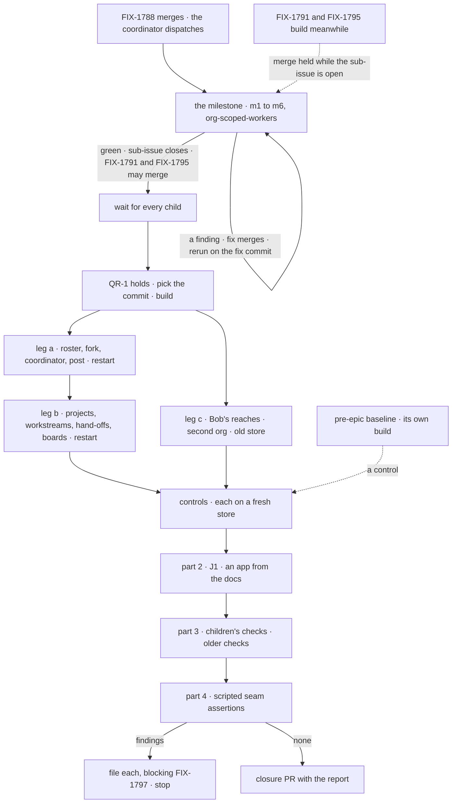

# FIX-1797 · Plan

[Spec](SPEC.md) · [Decisions](DECISIONS.md) · [Rules](BUSINESS-RULES.md) · **Plan** · [Docs](DOCS.md)

Written for the closure worker, which owns the step definitions. It runs twice in shape: the
milestone when FIX-1788 merges (QR-2), and the final run when QR-1 holds. It adds only the goal
check. Names below are directional: read every name off the children's **merged** specs on
`main` and their shipped code. Where a merged spec or the code renames something, that name wins.

## Surfaces

| ID | Where | Change |
|---|---|---|
| S1 | `goals/workforce-privacy/two-users-share-a-project-and-nothing-else/` | `goal.md` from [SPEC.md's goal](SPEC.md#the-goal-and-how-well-know-its-met) in the `goals/README.md` format, with the on-demand posture (QR-5). `run.mts` is a thin orchestrator: build Shift Manager once, run the legs, the controls, J1, the part-3 manifest and the part-4 assertions, write the report. `GOAL_ONLY=milestone` runs [the milestone](#the-milestone) |
| S2 | `goals/lib` | Extend the existing `goals/lib/shift-manager.mts` (and its Playwright and server helpers) rather than adding a harness: a second bearer context, so each user gets a browser context and a route client carrying only their own bearer; a restart over the same run-scoped store; store reads through the install's routes. The template for S1, S3 and S4 is `goals/shift-manager/one-person-runs-a-labs-projects-and-people/run.mts`. Never import across goal directories |
| S3 | `controls/` under S1 | The scratch patches: `org-scoped-workers`, `unpartitioned`, `no-roster-check`, and `second-org` when the commit has no second-org principal. Applied to a copy of the commit, never committed, printed in full in the report |
| S4 | Part 3's manifest, under S1 | Each child's goal path with the controls still owed, and P3.9's list, computed from the pre-epic baseline's tree and the run's commit together (see [Part 3](#part-3--every-childs-check-and-every-older-check-the-epic-touched)). Each runs as its own subprocess |
| S5 | J1's scratch app | A fresh directory the writer builds in; deleted after the run |
| S6 | The closure PR | Only after a final run that files nothing: S1 to S4 with the verdict log, the report as its body. No changeset |

## Sequence

Legs a and b share one store and one server, because leg b uses the roster leg a built. Leg c
runs on its own store and builds what it reaches for through the app first.

## Checks

Every row read on the page is compared by id with what the store returns through the install's
routes, never with Shift Manager's state. Names marked *held-out* are picked at run time. The
surface each step uses follows [D2](DECISIONS.md#d2); the column says which is expected.

| ID | Surface | Passes when |
|---|---|---|
| a1 | screen | **Roster.** Alice's roster lists every standard worker, marked standard with its flow, and nothing of Bob's. Bob's lists the same standard workers and nothing of Alice's |
| a2 | screen, else turn | **Fork.** Alice forks a standard worker under a held-out name. One new worker row at Alice's user scope naming the same flow; the standard worker unchanged; Bob's roster unchanged |
| a3 | turn, then screen | **Coordinator.** Alice gets a coordinator on her roster with `best-fit` routing, and adds her fork and one standard worker as delegates in the delegates panel. Its session's delegates are exactly those two |
| a4 | screen | **Post.** Alice posts a held-out ask that fits her fork. One delivery, to the fork's session; one routing record `by: best-fit`; the fork's answer on screen; every session the post created belongs to Alice and links the worker it names. Alice then opens her fork from the roster: she lands in its plain session, never the delegate session the post created ([FIX-1788 S5a](../FIX-1788/PLAN.md#surfaces)'s key-set match) |
| a5 | — | **Restart.** a1 to a4 read the same on a new process over the same store |
| b1 | turn or screen | **Projects.** Alice creates a shared project P (held-out) with Bob as a member, and a private project Q. Both are on Alice's PROJECTS; P only on Bob's |
| b2 | screen | **Workstreams.** Alice opens a workstream on P led by her fork; Bob opens one led by a worker on his roster. Each workstream session belongs to its owner; the project view, for each of them, counts two workstreams and both owners' objectives |
| b3 | screen | **Hand-offs.** Each asks their own project coordinator for work. It delivers to that owner's own workstream session, never the other's ([FIX-1793](../FIX-1793/SPEC.md#the-goal-and-how-well-know-its-met)), and the lead answers there. Every session the ask created is its owner's; no session of one owner's hand-off is the other's |
| b4 | screen | **Two boards.** Two of Alice's conversations with her coordinator each file one task for a delegate on another flow. Each task runs in a new session of Alice's and completes there; the delegate files nothing. Each conversation runs and lists only its own row, and its drain doesn't wait on the other's |
| b5 | — | **Restart.** b1 to b4 read the same on a new process |
| c1 | HTTP as Bob | **Session.** Bob opens Alice's coordinator conversation and posts to it: refused |
| c2 | HTTP as Bob, then screen | **Worker.** Bob reads Alice's fork: refused, or not found. Bob's roster doesn't list it. Bob forks the same standard worker and asks his fork for a held-out word Alice's fork was given: his answer and his fork's state hold none of it |
| c3 | HTTP as Bob | **Link.** Bob creates a session naming Alice's fork, and one seeding a worker link or delegates in the create's state: each refused |
| c4 | screen and turn as Bob | **Delegate.** Bob names Alice's fork as a delegate on his own coordinator, in the panel and through its tool: refused like a missing worker |
| c5 | HTTP as Bob | **Entry.** Bob writes Alice's workstream entry on P: refused through the app and through a worker's tool. Bob lists, opens or reads Q: refused |
| c6 | screen as Alice | **Second org.** Alice in her second org sees none of her first org's workers, sessions, projects or user data |
| c7 | HTTP | **Old store.** On the store the pre-epic baseline wrote, after the published upgrade steps, Alice's earlier records read in one org at most, and none in her second org |

## The milestone

On FIX-1788's merge commit ([D1](DECISIONS.md#d1)), with its own steps. They use only what exists
at that commit: worker sessions and the app's own actions, each as that user with their own
bearer. No coordinator turn, no delegate, no project and no fork screen exist yet, so no step
needs one. These are not the final run's steps: leg c's are written for the finished set.

| ID | Surface | Passes when |
|---|---|---|
| m1 | action as Alice | **Setup, graded.** Alice forks a standard worker, or hires one if the commit has no fork action, under a held-out name. One worker row at her user scope; any standard worker unchanged. She opens its session through the app's talk action and gives it a held-out word |
| m2 | HTTP as Bob | **Session.** Bob opens Alice's worker session and posts to it: refused |
| m3 | HTTP as Bob | **Worker.** Bob reads Alice's worker: refused, or not found. His roster read doesn't list it. Bob forks or hires the same way and asks his worker for Alice's held-out word: his answer and its state hold none of it |
| m4 | HTTP as Bob | **Link.** Bob creates a session naming Alice's worker, and one seeding a worker link in the create's state: each refused |
| m5 | action as Alice | **Second org.** Alice in her second org sees none of her first org's workers, sessions or user data |
| m6 | HTTP | **Old store.** c7, on this commit |

Then `org-scoped-workers`: m3 FAILS on *Bob reads Alice's worker*, and m5 and m6 stay green. The
report is posted on FIX-1797 and on FIX-1788's last PR; the code is pushed to `fix/FIX-1797` for
the final run to extend. The milestone is tracked as a Linear sub-issue of FIX-1797, *related*
to FIX-1791 and FIX-1795, not blocking them: their builds run in parallel, and the hold is at
merge. Neither gets implementation merge authorization while the sub-issue is open, and it closes
only on a green run. A finding follows QR-15: the milestone runs again on the fix's merge commit,
and only a green rerun closes the sub-issue.

## Controls

Each scratch-patch control runs on a fresh store and must fail its step and leave the rest of
its leg green. One that fails at setup, reddens another step, or can't apply to the commit is a
finding. A step that checks exactly what a control deliberately changes is graded without that
check under that control: `org-scoped-workers` moves the worker row to org scope, so m1 and a2
skip their scope assertion there, and the step the control names is the one meant to fail.

| Control | Changes | Runs | Must fail | Stays green | Named by |
|---|---|---|---|---|---|
| `org-scoped-workers` | The worker collection at org scope | c | c2, *Bob reads Alice's worker* | c6 · c7 | Epic goal; FIX-1788's name |
| `unpartitioned` | One ledger per owner, no partition per conversation | b | b4, *each runs only its own* | b1 · b2 | FIX-1794's name |
| `no-roster-check` | The delegate check skipped | c4 | c4, *Bob's delegate refused* | — | FIX-1791's name |

**The pre-epic baseline** (the commit before the first child's implementation merged, resolved
by the run and recorded in the report head) is a control of another kind, kept because the epic's
goal names it and it is the only control on leg a. It predates the finished set, so it can't
meet the legs' prerequisites, and the stays-green and setup rules above don't apply to it. On
its own checkout, build and fresh store, it must FAIL:

| Leg | Must fail | Because |
|---|---|---|
| a | at a1 or a2, the report naming the step and what the baseline lacks | No standard-worker roster per user, no fork |
| b | at b1 or b2, likewise | No private project, no workstream an owner holds |
| c | at c2, on its merits: Alice hires a worker the baseline's way through the app, and Bob reads it | The org-locked hire every member reaches, the hole the epic closes |

A leg that passes on the baseline, or fails c at setup instead of at c2, is a finding: the leg
proves nothing the baseline lacks.

## Part 2 · the team the legs don't walk

| ID | Team | Passes when |
|---|---|---|
| J1 | **Builds an app on Workforce** | A writer that sees only the pages [DOCS.md](DOCS.md) lists, as published on the commit, builds S5 from nothing: registers a worker flow of its own on the installation's list, declares a standard worker on it and a coordinator that names it as a delegate. A step no page covers is a failed step, reason *doc silent* (QR-18). The app boots with no refusal; then, as two users over HTTP, Alice forks the worker and her coordinator routes a post to her fork, and Bob's c1 to c3 against it are each refused. `packages/shift-manager` is untouched |

The epic's other four teams are legs a, b and c.

## Part 3 · every child's check, and every older check the epic touched

Each child's check runs on its **green path**. A control part 1 already failed on this commit
stands for that child's control and is not run again.

| ID | Check | Controls still run here | Covered by part 1 |
|---|---|---|---|
| P3.1 | FIX-1789 · `goals/worker-contract/runs-workers-only-on-registered-flows/` | its own | — |
| P3.2 | FIX-1790 · `goals/user-scope/keeps-a-users-data-in-the-org-it-was-saved-in/` | `cross-org-key`, `fallback-read` | — |
| P3.3 | FIX-1788 · `goals/workers-as-resources/keeps-each-users-workers-their-own/` | `caller-link` | `org-scoped-workers` (c2) |
| P3.4 | FIX-1791 · `goals/coordinators/hands-each-post-to-its-delegates/` | `no-round-limit`, `no-delegate-read` | `no-roster-check` (c4) |
| P3.5 | FIX-1793 · `goals/projects/a-shared-project-has-one-owner-per-workstream/` | `no-owner-rule`, `all-entries-delegate` | — |
| P3.6 | FIX-1794 · `goals/coordinators/files-tasks-down-the-owners-chain/`, one level of hand-off (its split leg went to FIX-1802, outside this epic) | `no-follow-up` | `unpartitioned` (b4) |
| P3.7 | FIX-1792 · its check, from its merged spec | its own | — |
| P3.8 | FIX-1796 · the retired-terms census, with `--control`. Its list decides what is retired: Workforce's seat goes, the task board's `seat` stays | its control | — |
| P3.9 | **Every other goal directory** whose code reaches `@flow-state-dev/workforce`, the task board or `packages/shift-manager`, computed by import on the pre-epic baseline's tree and on the commit, and taken as the union. This closure's S1 excluded | their own, as each goal names | — |

For P3.9, the union is what keeps a deleted goal in scope: a directory on the baseline and gone
from the commit is still listed, and needs its retirement line like any other. Each directory
passes, or is retired: deleted, or its `goal.md` marked retired, by a child's PR whose body names
the rule that replaces it. The manifest records which PR retired it. Red, or gone with no line:
QR-16. A keyword grep on the pre-epic baseline
(`grep -rlE "MAILBOX\.md|openMailboxes|talkFor|room-lines|registerHiredSeat|brokenSeats|rehire" goals`)
finds about two dozen directories; the import walk is the list, not the grep.

## Part 4 · gap sweep

Only what parts 1 to 3 don't grade. Each *required* row is a scripted assertion in `run.mts`:
a grep, a parse, a boot, or a `git diff` from the pre-epic baseline to the commit.

**Required for PASS** (QR-13):

| Check | The assertion |
|---|---|
| **One copy per flow (ER-1, ER-20)** | Booting the DevTeam install registers each worker flow once; no Workforce code under `packages/` calls a flow-instance register or sets an owner pin |
| **The worker-flow list (Q1)** | `agent` and the coordinator flow are entries on the installation's list; no `defineWorkerFlow` export |
| **No `MAILBOX.md` (ER-6)** | No tracked `MAILBOX.md`. One placed in a scratch copy of the DevTeam tree is refused at load, by its path, with the conversion in the message |
| **Mailbox parts gone** | The mailbox flow, project claims and a project row's mailbox list are not exported and not read by Shift Manager |
| **Server-only session data (D3)** | A session create carrying the worker link or delegates in its state is refused naming the field, for every worker flow on the list |
| **Layer fence (ER-22)** | The diff adds no file under `packages/core` or `packages/engine` naming a worker, coordinator, workstream or project; Layer 1 changes are only epic D3's, as recorded on the commit |
| **Docs published (ER-29)** | Every row of the epic's [ownership table](../../epics/FIX-1786/DOCS.md#ownership) exists on the commit with its section, except FIX-1795's; `mailboxes.md` is gone and `upgrading.md` exists |

**Observations · filed off epic:** only what the run notices outside the epic's goal. Reported,
never gating.

## The report

The closure PR's body, the comment a final run that files findings leaves on FIX-1797, and the
milestone's comment, in the same shape:

1. **Head.** Milestone or final, the run's number, the `main` SHA, each child's merge commit, the
   pre-epic baseline's resolved SHA and the merge it was resolved from, the
   model and its key's provider (never the key), each store file and its steps, Chromium's
   version.
2. **Part 1.** Per step: PASS or FAIL, the surface used, what the page showed, the store read it
   was compared with by id. Per model turn: the words sent, the session id, each tool call and
   result by item id. A screenshot of each leg's last step.
3. **Controls.** Each patch in full, the step it failed at and the line.
4. **J1.** The writer's files, its steps, each *doc silent* step.
5. **Parts 3 and 4.** Each manifest entry's verdict; P3.9's list with each retirement's PR; each
   required row's output; observations.
6. **Findings.** Each with its Linear id, the step it came from, and the run that retested it;
   one the owner closed, with the reason quoted.

## Pinned names

| Where | Name |
|---|---|
| Goal check | `goals/workforce-privacy/two-users-share-a-project-and-nothing-else/` |
| Steps | `a1` to `a5`, `b1` to `b5`, `c1` to `c7`, `m1` to `m6`, `J1`, `P3.1` to `P3.9` |
| Controls | `org-scoped-workers`, `unpartitioned`, `no-roster-check`; scratch patch `second-org` |
| Subset | `GOAL_ONLY=milestone` |

Everything else is yours to name.

## Guardrails

| Rule | Because |
|---|---|
| No product change, and no control switch in Shift Manager or any package | The closure proves what shipped; a switch written for a test is product code |
| Every change through the app (D2); none by a store write or a block the check calls | The epic's anti-game; a fixture proves the fixture |
| Bob's requests carry Bob's bearer only | A refusal under the wrong identity proves nothing about Bob |
| Every row compared by id against the store, never Shift Manager's state | A shell that draws its own rows passes a check that reads the shell |
| One graded turn per model step | A retry grades a coordinator nobody uses |
| Part 4's required rows are executed, not read (BP-003) | A tired reader skips the row a script can't |
| Scratch patches printed in full | A patch that changes more than it says is how a step passes hollow |
| Every final check on the one commit; the pre-epic baseline only as a control | A pass elsewhere proves nothing about the set |
| No step needs a delegate to split a task | FIX-1794 ships one level of hand-off, and a task session's filing is refused; the split is FIX-1802's, outside this epic |
| Findings are filed, never fixed here | The closure rule |

## Docs

No reader-facing change. [DOCS.md](DOCS.md) lists the pages J1 follows.

## At implement time

- Re-read every child's merged spec and amendments. FIX-1792 and FIX-1796 were not merged when
  this was folded; FIX-1794 (one level of hand-off) and the epic's D6 (one board partition per
  conversation) were.
- Take the users' bearers and the store's env name from the DevTeam host as shipped
  (`LAB_USERS` today); Alice's second org per *Decided, not asked*.
- **The milestone needs a sub-issue and a dispatch.** When this spec merges, the coordinator
  creates the milestone sub-issue of FIX-1797, related to FIX-1791 and FIX-1795 (never
  *blocks*, which would stop their builds), and withholds their implementation merge
  authorization while it is open. It dispatches the run on FIX-1788's merge commit, and again on
  each milestone fix's merge (QR-15). The closure worker does not create the sub-issue.
- **Tell the children D3 early.** Report it to the coordinator at the spec gate, so each child
  retires or rewrites the checks it breaks in its own PR rather than at this run.
- `goals/shift-manager/one-person-runs-a-labs-projects-and-people/` (FIX-1650's closure) asserts
  rooms, mailboxes and hires. P3.9 expects FIX-1793 or FIX-1792 to rewrite or retire it.
- Chromium is at `/opt/pw-browsers`; the model is `openai/gpt-5.4-mini`.

## Notes from review

- "Consider mirroring FIX-1720: **checked-in P3.9 manifest** + retirement lines, refresh when a child PR changes imports, optional CI/drift step to prove the manifest matches the walk." — cursor ([thread](https://github.com/fixpoint-labs/flow-state-dev/pull/2835#discussion_r4201106108)). The import walk over the union stays authoritative; a checked-in manifest is welcome only as a drift check against it.
- "**Orchestration:** pass shared `GOAL_PAGES` / one Shift Manager build from S1 into P3 spawns where goals allow (biggest wall-clock win)." — cursor ([review](https://github.com/fixpoint-labs/flow-state-dev/pull/2835#pullrequestreview-5435313385))
- "P3.9's import walk is the right call over the grep. Output the computed list in the report so a reviewer can eyeball it." — architect pass ([comment](https://github.com/fixpoint-labs/flow-state-dev/pull/2835#issuecomment-6026719045))
- "c4 mixes a screen step and a tool step as Bob. Keep them separately graded so `no-roster-check` failing at one surface is visible." — architect pass ([comment](https://github.com/fixpoint-labs/flow-state-dev/pull/2835#issuecomment-6026719045))

These are inputs, not instructions. Adopt, adapt, or discard; you owe no justification for
discarding one.

## Follow-ups

- **A milestone hook in the epic wake.** D1's dispatch is a manual coordinator action; the
  sub-issue tracks the hold, not the trigger. If a second epic needs
  one, it earns a hook; not this issue's.
