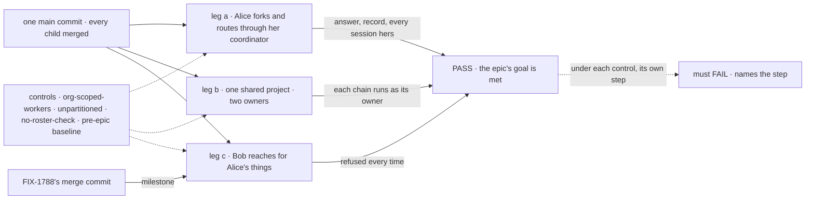

# FIX-1797 · Closure: two users each run a private roster and share a project through workstreams they own

**Spec** · [Decisions](DECISIONS.md) · [Rules](BUSINESS-RULES.md) · [Plan](PLAN.md) · [Docs](DOCS.md)

## Five people, before and after

| Someone who… | Today | After this closes |
|---|---|---|
| **decides whether the epic is done** | Eight children, each green on its own commit and its own fixture | One report on one `main` commit: legs a to c in Shift Manager with two users, each control's FAIL, the app-builder journey, every child's check, every older check the epic touched, the seam sweep, each finding and its retest |
| **runs an org with a second user** | Each child proves its own refusals; nothing proves them together, or before others build on the worker fix | Proven: Bob opening, reading, linking, delegating to or writing anything of Alice's is refused, and Alice in a second org sees none of it, first when FIX-1788 merges and again at the end |
| **wants a worker of their own, handing work between workers** | Nothing proves a fork and a coordinator act as their owner end to end | Proven with a real model: Alice forks a standard worker, puts it under her best-fit coordinator, and the answer, the routing record and every session are hers |
| **runs a project with others** | Nothing proves two owners in one project stay apart | Proven: Alice and Bob each own a workstream; every session in each owner's hand-off, and every task session, is its owner's; Bob can't reach Alice's private project |
| **builds an app on Workforce** | Nothing tells them whether the docs are enough | Proven: a writer who read only the published pages registers a worker flow and a coordinator, and the two-user checks hold on it |

## The goal, and how we'll know it's met

**On one `main` commit with every child of FIX-1786 merged (FIX-1795 excepted), two users of one
Shift Manager install each build a private roster (a standard worker, a fork, a coordinator)
through the app, work one shared project through workstreams they each own with every task
running as its owner, and reach nothing of the other's except what was written to a shared
resource or to org scope. The privacy half holds already on FIX-1788's merge commit. The next app
gets the same from the docs alone, every child's check passes, and every older check the epic
touched passes or was retired on purpose.**

| Is it the right goal? | |
|---|---|
| **The real need** | The [epic's goal](../../epics/FIX-1786/SPEC.md#the-goal-and-how-well-know-its-met) on the assembled set, as [ER-28 to ER-30](../../epics/FIX-1786/BUSINESS-RULES.md#the-closure) and the [closure rule](../../../docs/contributing/orchestration.md#the-closure-issue-every-epic-ends-in-qa) ask: one rule set a person can rely on, in the app they use |
| **Smaller, and rejected** | "Re-run each child's check on one commit." Each child proves its piece on its own setup, several on Shift Manager over HTTP; none walks a fork, a coordinator and a shared project together, in the screens a person uses. Also rejected: running leg c only at the end, which ER-30 was written to stop |
| **Bigger, and not this issue's** | Product work of any kind · the worker library (FIX-1795, after the MVP) · removing flow instances from the engine (FIX-1798) · channels and user-to-user messages · docs polish (the epic's wrap) |
| **Not done if** | Checks ran on different commits · a run used one user, or sent Bob's request under Alice's identity · a worker, project or delegate was seeded by a fixture or a store write · a model step was retried until it passed · the milestone run skipped or ran on another commit · a control never failed, or failed at setup · Bob opens, names or writes anything of Alice's · a task in Alice's chain ran as anyone else · Alice's two boards share a row · leg b made no private project · a record stored before FIX-1790 reads in two orgs · a `MAILBOX.md` loads · Workforce sets an owner pin or registers a flow per worker · a retired term is left in an export or a published page · an older check is red, or gone without a line naming what replaced it · a finding was fixed in the closure PR, or deferred |

Every step reads what the person sees against what the store holds, by id, and each control
breaks one leg at its own step.

| How we verify | |
|---|---|
| **Goal check** | `goals/workforce-privacy/two-users-share-a-project-and-nothing-else/`, on a production build of the one commit: legs a to c, then the controls. The milestone runs its own form of leg c's worker steps, limited to what FIX-1788's merge commit has, and reruns on each fix's commit ([D1](DECISIONS.md#d1)). Committed by the closure PR. On demand, not a CI gate ([QR-5](BUSINESS-RULES.md#when-a-run-may-start)) |
| **Signal** | Per step in [PLAN.md → Checks](PLAN.md#checks). a: a fork on Alice's roster only; one delivery to it, a `best-fit` record, its answer on screen, every new session Alice's. b: two workstreams, one per owner, every session of each owner's hand-off its owner's, two boards each draining only its own, one level of hand-off (no delegate splits); Bob can't list her private project. c: each of Bob's reaches refused; Alice in a second org sees nothing of the first, nor a record stored before FIX-1790 |
| **Model** | Real (`openai/gpt-5.4-mini`): every coordinator turn and every answer. Graded once, never retried |
| **Input** | Shift Manager's DevTeam install as the children leave it; Alice and Bob through their own verified bearers; a fresh store per leg group and per control; for c7, a store the pre-epic baseline wrote (the commit before the first child's implementation merged, resolved by the run). Every name and ask picked at run time |
| **Anti-game** | No assertion on a child's output or on Shift Manager's state. Nothing seeded: every change goes through the app ([D2](DECISIONS.md#d2)). Bob's requests carry Bob's bearer only |
| **Control that must fail** | `org-scoped-workers` (the worker collection at org scope): c2 FAILS, *Bob reads Alice's worker*. `unpartitioned`: b4 FAILS. `no-roster-check`: c4 FAILS. The pre-epic baseline: each leg FAILS where it lacks the epic's work, c2 on its merits ([PLAN → Controls](PLAN.md#controls)) |

Part 2 walks the one team the legs don't: someone building an app on Workforce. Part 3 re-runs
every child's check and every older check the epic touched ([D3](DECISIONS.md#d3)). Part 4
asserts the epic's seams and its Layer 1 fence by script. All on the same commit.

## What changes

![Today: eight children each green on its own commit and fixture, and about two dozen older goal checks that touch mailboxes, rooms or hires. After: a milestone run of leg c on FIX-1788's merge commit, then one main commit carrying four parts: legs a to c in Shift Manager with two users and a real model, the app-builder journey from the docs, every child's check plus every older check the epic touched, and the seam sweep. A finding is filed under FIX-1786, blocks this issue, and sends the stack round again](figures/what-changes.svg)

Read the commit line: the privacy half is checked twice, at FIX-1788's merge and at the end, and
every check on the final commit runs together.

## What stays as it is

- **No product work.** A gap becomes a child of FIX-1786 that blocks this issue, fixed on its own
  route. The closure PR carries the goal check and the report only.
- **No control switch in product code.** Every control and variant is a scratch patch on a copy
  of the commit, printed in full in the report.
- **Every child's acceptance** stands as its spec wrote it; a child's check that fails is a
  finding, never a rewrite.

## Sign off

**[The goal](#the-goal-and-how-well-know-its-met), at that size:** two users in Shift Manager, a
real model, three legs, a milestone at FIX-1788, every check the epic touched, one commit. If
wrong: the epic wraps on checks that never met each other, or waits on a bar nobody asked for.

1. **[D1](DECISIONS.md#d1) · The milestone run is its own dispatch on FIX-1788's merge commit,
   made by the epic coordinator, and tracked as a sub-issue that blocks FIX-1791 and FIX-1795
   until it runs green.** If wrong: the
   coordinator and projects build on a privacy fix nobody checked in the app.
2. **[D2](DECISIONS.md#d2) · "Through the app" means the screen where Shift Manager draws one,
   else a coordinator turn, else the app's own action as that user; a missing screen is a
   finding only when a child promised it.** If wrong: the closure becomes a UI backlog, or grades
   routes nobody sees.
3. **[D3](DECISIONS.md#d3) · An older check the epic broke must be rewritten or retired, with a
   line, by the child that broke it; the closure fails on any left red.** If wrong: `main` keeps
   proofs nobody can run green, or the closure runs checks for nothing.

**Open: none.** D1 is the one to weigh. Reasoning and what lost: [DECISIONS.md](DECISIONS.md).
The cases: [BUSINESS-RULES.md](BUSINESS-RULES.md).

Improvement · closure (QA) · `goals/` only · large, repeats per finding · a milestone run, then 1
PR after a clean run · epic [FIX-1786](../../epics/FIX-1786/SPEC.md), closure · required · runs
after every child except FIX-1795 merges · Linear [FIX-1797](https://linear.app/fixpoint-labs/issue/FIX-1797)
