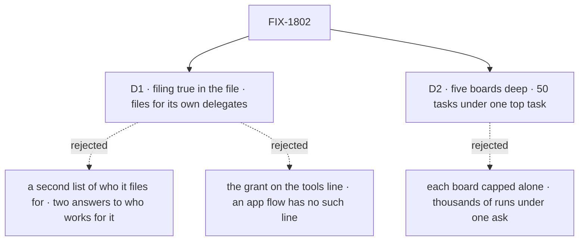

# FIX-1802 · Decisions

[Spec](SPEC.md) · **Decisions** · [Rules](BUSINESS-RULES.md) · [Plan](PLAN.md) · [Docs](DOCS.md) · [Evolution](EVOLUTION.md)

What was considered, what was chosen, and what each choice locks in. Two decisions are the
sign-off surface. The direction itself (filing is a tool any worker can be granted, opt-in per
worker, and the split ships in the MVP) is the product owner's, recorded as the epic's
[D8](../../epics/FIX-1786/DECISIONS.md#d8), and is not reopened here. The split's mechanism is
FIX-1794's, carried as written with its review fixes ([EVOLUTION.md](EVOLUTION.md)).

## The tree

Solid edges are what you're signing. Dashed edges lost, and the label says why.

## D1 · A worker's file grants filing with `filing: true`, and the worker files for its own delegates: FIX-1791's list, now on any worker that files

| | |
|---|---|
| **Instead of** | (a) A second list of the workers this worker may file for, beside a coordinator's delegates · (b) the grant spelled as the filing tools on the worker's `tools:` line |
| **Because** | One answer to "who works for this worker": the delegate list, read the same way for a post and a task, through FIX-1791's one roster check, changed by the same four actions, and listed by `listDelegates`. A second list could disagree with it, and a check would have to run on two. (b) `tools:` is the built-in flows' own setting, and it fences: a worker that writes it gets only what it names. An app flow such as the EM's `em` has no such line, so the grant couldn't reach every flow. A key in the worker contract reaches every flow that composes it |
| **Locks in** | `filing` and `delegates` are keys any worker's file may carry. Every worker that files says so, coordinators included: the chief of staff's file, and each converted board file in FIX-1792, gains `filing: true`. A delegate may be a worker whose flow takes a post or a task, so FIX-1791's check widens to "either", and each use checks its own. The app's filing actions follow the grant too, so a worker without it keeps no board |

![D1: who files, and for whom. A grant in the worker's file, filing for its own delegates, chosen, beside a second list of who it files for. Decides it: one answer to who works for this worker, where two lists can disagree. The price: FIX-1791's check widens to a delegate that takes posts or tasks. A tie: Bob's worker is refused either way. Locks in two keys any worker file may carry, and every filer says so, coordinators included. Flips if a worker must file for workers it should never be handed a post by](figures/d1-grant.svg)

It comes down to one list: two lists of who works for a worker drift apart.

**What would change my mind:** a worker that must file for workers it should never route a post
to. Then the delegate record gains a "tasks only" mark, still one list.

## D2 · A chain stops at five boards deep, and at 50 tasks under one top task; a filing past either is refused, naming the limit

| | |
|---|---|
| **Instead of** | FIX-1794's breadth answer: five boards deep, with each board's existing caps (`maxTotalTasks`, `maxEnqueuedTasks`, per partition) as the only bound on width |
| **Because** | Depth bounds a loop, not a fan-out. With each board capped alone, a worker that splits at every level multiplies: at ten pieces a board, a five-board chain holds 11,110 tasks under one top task, each a session and at least one model turn. That is FIX-1794's review finding, carried here unanswered. A count per chain stops it at 50, which covers a feature split across a team with room to spare. The count is kept by Workforce at the owner's user scope, keyed by the chain's top task, so the task board doesn't change |
| **Locks in** | Two public limits, said in the tool's answer so the worker does the piece itself or tells the person. Raising either later is cheap; lowering breaks chains that use it. Each board's own caps stay as FIX-1794 sets them |

It comes down to a worker that splits at every level: capped per board, it reaches thousands.

**What would change my mind:** a real chain that needs more than 50 pieces. Then the limit rises,
and the docs state the cost per piece.

## Decided, not asked

- **Filing ships as a capability, `createTaskFilingCapability()`** (the coordinator's call,
  2026-10-06). The built-in `agent` and coordinator flows carry it; an app worker flow adds it
  with `uses`, so a converted worker keeps the flow it names (FIX-1792 BR-12, the EM's `flow: em`).
  The capability brings the session's board, the four tools and the notice entry. A worker whose
  file grants filing on a flow that doesn't carry it is refused when the app loads, naming both.
- **The board is the session the worker runs in**: a talk session, a delegate's session (a
  workstream lead's included), or a task session. One board per session, in the partition named
  by that session's incarnation (epic D6). Never another session's board.
- **The grant is read per run, server-side**, from the session's linked worker (FIX-1788), never
  from input. A coordinator files only with it, like any worker (D8).
- **Filing from a delegate's session doesn't hold its answer.** A post is answered, a task is
  worked (FIX-1794). The tasks it filed report to that session; work that must come back up the
  chain is filed, not posted. A workstream lead's results land in its workstream session.
- **The split is FIX-1794's S8, as written.** A task session that filed pieces parks its row on
  the board above, with a server-written parent binding (that row's partition and claim ticket).
  The last piece's ending writes a settle-owed marker, and only the parent's settle clears it, so
  a failed settling turn never strands it (FIX-1794 review round 2). The parent settles
  `completed` with the pieces' outputs, or `errored` naming the pieces that failed for good.
- **Depth and the chain's top are server-written at each task session's birth**: its parent's
  depth plus one, and its parent's top task. A session that isn't a task session starts a chain.
  A post adds no depth; FIX-1791's round limit bounds posts.
- **No Layer 1 change.** The task board, the engine and core are untouched. The parent's settle
  resolves the row above through D6's partitioned ref, with the partition from the binding, and
  writes with the board's existing fenced settle of a parked row. One flow can both file and work
  its own rows ([POC](poc/split-on-one-flow/README.md) O1 to P3).

## Considered and dropped

| Alternative | Why not |
|---|---|
| Keep filing in the coordinator flow, and let only a coordinator's task session split | D8 rejects it. It also moves the EM off `flow: em` |
| Hold a delegate's answer to a post until the work it filed ends | Breaks FIX-1791's one answer per round and its round deadline; work that must come back is filed |
| Settle a split parent mechanically at the last piece's gate, with no turn | FIX-1794 kept the turn so the worker can reassign a failed piece first; the settle-owed marker already covers a failed turn |
| A chain count kept on the top task's row | The row sits in another session's partition, which a task session can't reach. That would be a task-board change |

## Settled

- **One flow can keep a board and work its rows, through a per-task target to itself** —
  **CONFIRMED** ([POC](poc/split-on-one-flow/README.md) O1).
- **A parked row settles in a later request of another session, through a stored claim ticket,
  on today's board** — **CONFIRMED**: `recorded`; a replay after it is declined `lost-claim`;
  a forged ticket is declined while the genuine one records (P2, P3).

## How it got here

- **Draft** — framed as the epic's D8: filing is a grant any worker carries, on any worker flow,
  through a capability; who it files for is FIX-1791's delegate list; the board is the session the
  worker runs in; FIX-1794's split, parent binding and settle-owed marker carried as written; a
  chain bounded at five deep and 50 tasks. No Layer 1 change, on a POC. Three PRs on FIX-1794.

**Open: none.**
